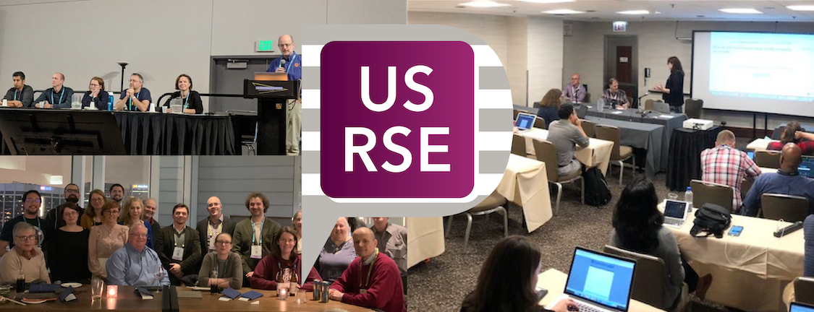

# US Research Software Engineer (US-RSE) Association

**Hero Image:**

 - 

#### Contributed by [Ian Cosden](https://github.com/cosden "Ian Cosden GitHub Profile"), [Chris Hill](https://github.com/christophernhill "Chris Hill GitHub Profile"), [Sandra Gesing](https://github.com/sandragesing "Sandra Gesing GitHub Profile"), and [Charles Ferenbaugh](https://github.com/cferenba "Charles Ferenbaugh GitHub Profile")

#### Publication date: January 15, 2020

### It takes people to write research software

Much has been written about the importance of software best practices and the
need for training and educating research software developers. And we’re
certainly not here to disagree. But what about the *people* working on the
software, who take ownership of the code and all the infrastructure around it?
Surely the *people* must be important contributors to both the scientific
software endowment and the larger research ecosystem. All the training and
education in the World Wide Web won’t help if the *people* writing software
aren’t supported and encouraged to use those resources. But who are we, where do we belong,
and how many thousands (or tens of thousands or more) of us are out there?

The term “Research Software Engineer” (or “RSE” for short), while not
necessarily a household name, has become increasingly common in the scientific
community. Definitions aside (more on that later), the use of a common term has
helped rally the community around this increasingly important role: those
individuals who sit somewhere between a pure researcher and a pure software
developer, who view their software contributions to research software as a
fundamental part of their work.

In the United States and globally, over the past two to three years (except the UK, which seems to be
a few years ahead of the trend), the use of the term RSE has exploded. The RSE
role was formally recognized in 2019 by the European Commission in a  report
“[Recognising the Importance of Software in Research - Research Software Engineers (RSEs), a UK Example](https://op.europa.eu/s/yA6b)”
and by  UNESCO in the report “[Paris Call: Software Source Code as Heritage
for Sustainable
Development](https://en.unesco.org/foss/paris-call-software-source-code)”. As an 
anecdotal example, at a Supercomputing 2018 (SC18) workshop, one of the  organizers acknowledged not having heard the term RSE used before. Fast forward to a similar workshop at SC19. When the ~80 attendees were asked if any of them
had not heard the term RSE, fewer than three people raised their hand. Some acknowledged that
they’d  heard it only days before -- but, still, this is progress.  Moreover, many
events at SC19 focused on RSEs, including how to share best practices,
manage research software development in universities, and foster career
paths.

### Why does a name matter?

Defining RSE is hard, but it would be even harder without a term to rally
around. This is step 0 in developing a supportive community for the *people* who
do this kind of work. Why do we keep putting people in italics? Because we feel
strongly that developing a community of practitioners is essential for the long-term health of the scientific software community.

If RSE were easy to define, the community would have already successfully
done so. A number of definitions have been offered (see [the
UK-RSE](https://society-rse.org/),
[DE-RSE](https://www.de-rse.org/en/), and [NORDIC-RSE](http://nordic-rse.org/)
definitions, for example), and for the most part they are all just small
variations of each other. Some people view themselves more as this or less of
that, and in the end it probably just boils down to an example of the blind man
and the elephant parable. But when it comes to the people in the discussion, as
 Maya Angelou said in her powerful poem "Human Family," 
 “We are more alike, my friends, than we are unalike."

### What is the US-RSE Association?

The US-RSE Association (US-RSE) strives to provide a member-focused community
to those who associate with the role of Research Software Engineer. Connecting
people is a great way to share knowledge, connections, and resources.
This can be especially important for those who don’t have a large
group of local peers. The US-RSE current membership spans academic, government, and
not-for-profit and commercial enterprises. Sharing experiences and insights is
already proving an important theme.

As the community grows,  US-RSE aims to
bring awareness and recognition to RSE practitioners across the nation and
help expand the profession within the research ecosystem. This advocacy role involves many
facets, but it can include helping fledgling RSE groups get started,
defining RSE career paths, and assembling resources that can explain the role and its
importance to non-RSEs (such as HR, senior decision-makers, students, sponsors,
and customers).

### What’s new in US-RSE?

The growth over the past nine months of the US-RSE
 has been considerable. We’ve put together a list of online
resources hosted at [us-rse.org](https://us-rse.org/), have expanded into social
media ([@us_rse](https://twitter.com/us_rse)), and have formulated an official [code of
conduct](https://us-rse.org/code-of-conduct/). We are excited to be able to hold
our first official event in April, a first [US-RSE community building
workshop](http://us-rse.org/2020-april-workshop/), thanks to a generous grant
from the Alfred P. Sloan Foundation. We expect this to generate a substantial
amount of new content for the burgeoning community.

### How can you get involved?

Do you consider yourself an RSE, maybe an RSE but not sure, or a supporter of the
RSE role? Are you interested in becoming an RSE? Or do you just want to get to know the community better? 
For whatever reason, you are welcome to join,
contribute to the conversation, and help build the community. The best way to
get engaged is to join (<https://us-rse.org/join/>), take a look at the
evolving list of ways to contribute (<https://us-rse.org/get-involved/>), and
reach out within the US-RSE Slack workspace.

### Author bios

Ian Cosden is the Manager of HPC Software Engineering and Performance Tuning in
the Research Computing department at Princeton University, where he leads a team
of Research Software Engineers  who collectively complement traditional
academic research groups by offering embedded, long-term software development
expertise. He is the current chair of the US-RSE Association steering committee.

Chris Hill directs research computing at MIT. He has led numerous computational
initiatives to develop physical, virtual, and human resources that facilitate
research computing at MIT, as well as in the broad Massachusetts and Northeast
region. He is active in computational Earth science and is a lead developer and
sustainer of open source ocean modeling tools that are widely used by a diverse
global community on a daily basis.

Sandra Gesing is an Associate Research Professor in Computer Science and
Engineering and a Computational Scientist at the Center for Research Computing
at the University of Notre Dame. Her research focuses on usability,
reproducibility, and sustainability of computational methods regarding science
gateways, computational workflows, and distributed computing. She is a supporter
of open access policies and FAIR principles.

Charles Ferenbaugh is a staff scientist in the Applied Computer Science group at
Los Alamos National Laboratory. Since 2001, he has been a software developer in
LANL’s Advanced Simulation and Computing program and is currently involved in
the Eulerian Applications Project and the Ristra/Next Generation Code project.
He has also contributed to research in advanced architectures and programming
models.

<!---
Publish: yes
RSS update: 2020-01-15
Pinned: no
Topics: Software Engineering, Projects and Organizations, Research Software Engineers
--->
