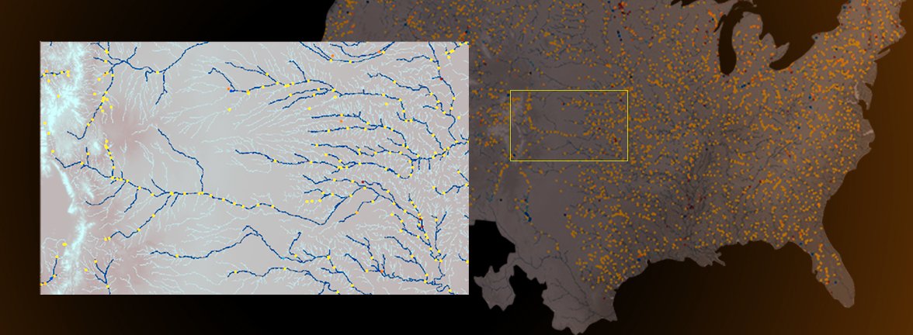
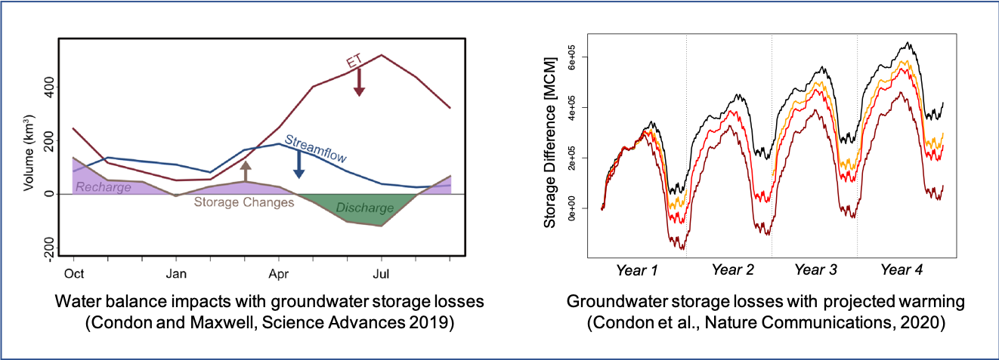
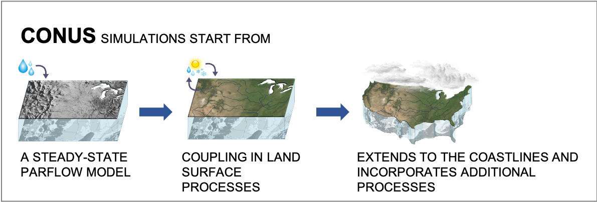
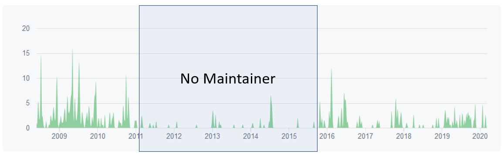

# Maintainers Drive Software Sustainability

**Hero Image:**

  - [A hydrologic model of the contiguous United States (CONUS) overlaid with stream gauge locations. DOI: 10.1016/j.cageo.2019.01.020.]

#### Contributed by [Steven Smith](https://github.com/smithsg84 "Steven Smith GitHub Profile")

#### Publication date: April 14, 2020

A scientific research code often begins with a domain scientist, interested in solving a science question, developing a code and single-handedly serving the roles of user, developer, reviewer, and maintainer — an approach that is manageable when there is only one user (or a few).  Over time, as the code gets shared, used, and trusted, it’s natural to see the community of contributing developers and users grow; and we assume one of the developers will work the dual role of maintainer to ensure that the code remains a trustworthy and user-friendly scientific tool.  This situaton does not always occur, however,  and assuming a developer will be available to fill that dual role could  be detrimental to our scientific results and to the long-term sustainability of the code.       

Any scientific code without at least one maintainer is at risk of being labeled untrustworthy and losing its community of users.  This blog describes, through the code development history of ParFlow, common risk factors faced by scientific applications that can lead to an unsustainable code, warning signs that the code is becoming unsustainable, and the effort required by the maintainer to instill and enforce good software development practices to transform a code into a production code with a sustainable future. 

### What Is a Maintainer?
A maintainer orchestrates the software lifecycle for the project and provides continuity across the community of developers and the software itself.   The work maintainers perform includes reviewing and integrating ongoing development (or delegating to other trusted developers), ensuring that project standards for coding practices and documentation are met, ensuring that testing is being done and bugs are fixed in a timely manner, publishing trusted releases for users, and supporting issue trackers to track bug reports and feature requests from users.

### What Is ParFlow?
**Par**allel **Flow** (ParFlow) is an application for integrated hydrology modeling that simulates spatially distributed surface and subsurface flow, as well as land surface processes including evapotranspiration and snow (see Figure 1).  

[Figure 1: ParFlow has been instrumental in understanding how evapotranspiration depletes groundwater under warming and how large-scale groundwater development has influenced watershed behavior of the contiguous United States. DOIs: 10.1126/sciadv.aav4574, 10.1038/s41467-020-14688-0.]

 

ParFlow simulates the hydrologic cycle from the bedrock to the top of the plant canopy. It integrates three-dimensional groundwater flow with overland flow and plant processes using physically based equations to rigorously simulate fluxes of water and energy in complex real-world systems (see Figure 2). 

[Figure 2: ParFlow is used as the foundation for a contiguous United States (CONUS) integrated hydrologic modeling capability.]

### Risk Factors for Unsustainable Code

ParFlow has been in continuous use for scientific discovery since 1992, and several of the current ParFlow developers have been involved with the project since the first equation was written on a white board.  The ParFlow project has undergone long-term development and has been a fertile ground to gain a deep appreciation of the need for solid software engineering practices to improve scientific productivity. 

**Limited software development practices.** 
The experiences of ParFlow’s development team match an [earlier BSSw blog on continuous technology refreshment](https://bssw.io/blog_posts/continuous-technology-refreshment-an-introduction-using-recent-tech-refresh-experiences-on-visit) (CTR), which highlights a core issue: Applications that expect to continue to work over time cannot be static but must undergo "*periodic upgrade or replacement of infrastructure to deliver continued reliability, improved speed, capacity, and/or new features*" to respond to the developing needs of users and workflows.  The ParFlow team had not adopted formal software engineering practices including CTR because of the lack of funding targeted at software maintenance.

**New capabilities prioritized over good software development.**
In addition to necessary ongoing maintenance, most research codes are never "done."    Even when there wasn't funding targeted for ParFlow development, new capabilities were being created by projects using ParFlow; but the development was done in an ad hoc manner.  Lack of software development processes led to the code base becoming splintered across organizations; no one bothered to run the existing regression tests,  bugs went unfixed, and users found conflicting hacks for building on current operating systems.   

**Intermittent funding for development and maintenance of the software.**
A key lesson that we have learned from observing the development and evolution of ParFlow has been the need to have one or more identified maintainers to keep the software in a running and usable state.   Looking back at the on/off cycle of funding, we have observed several recurring patterns of failure when there are no maintainers.   

### Warning Signs Your Code Is Becoming Unsustainable

**Regression tests begin to fail.**
When the project lacks a maintainer, no one is standing guard watching the tests to halt additional changes when a test fails.  The same pattern was seen on multiple occasions when we lacked a maintainer: A code change was made that caused one or more of the tests to fail,  the failure was ignored, and another change was made that caused additional failures masked by the previous failures.   Fixing situations like this months and sometimes years after the changes are introduced is not a joyful experience.  It is not an exaggeration to say the cost in person-hours can quickly reach 100x what it would cost if the bugs had been fixed when first introduced.

**Configuration/build system begins to fail.**
Operating systems, dependencies, and compilers change over time even if a code base is not changing.   Users find configuration issues and post blogs on work-arounds; but without someone to submit a patch to or someone to respond to bug reports, the work-arounds are never fully fixed.  ParFlow Apple users were subjected to a set of different work-arounds for nearly every release of MacOS.

**Splintering and forking begins to happen.**
A research scientist develops a new capability but has no way to submit a patch or perhaps knowledge to get the capability back into the main-line code. Many capabilities in ParFlow are written in pursuit of generating a specific set of results, and frequently a "hacking" approach is sufficient for the initial result. Adding capabilities into the application for widespread use takes additional work, however, and a broader knowledge of the software architecture. A key role of the ParFlow maintainer has been to help shepherd in external contributions. Having a dozen slightly different versions is confusing and inhibits moving the science forward.  In the last maintainer role restart, over a dozen branches were quickly identified for integration; some of the branches had been in existence for 5+ years. There simply wasn’t anyone at the gate to let externally developed capabilities into the main code.

### Maintainers Drive Better Scientific Software Practices

As part of the [IDEAS-Classic project](https://ideas-productivity.org/activities/ideas-classic/), funding for ParFlow development was re-established with the goal to support ParFlow in the context of a broader watersheds ecosystem, including adequate support for a code maintainer.  Projects like IDEAS are showing a growing awareness of the need for better software practices.   The set of tools and services to support development is better than ever.   

With the restart of ParFlow, under the direction of a maintainer, we addressed several issues.

**Public Repository.**
We moved over to GitHub as the main locus of ParFlow development.  Moving to a standard git pull-request model for change submissions has made code reviews (via GitHub)  easy with distributed collaborators.   On scientific codes the algorithm/mathematical formulation needs to be checked as well as traditional code review criteria.    The skillsets of domain knowledge, math, and computer science frequently do not intersect in a single person so multiple reviewers are invaluable.

**Continuous Integration.**
We are utilizing TravisCI for continuous integration, replacing a set of shell scripts run via cron jobs.   Having test results easily visible by the distributed team is key to keeping the tests running.   The CI tests must pass for a pull request to be approved.  

**Build System.**
We moved from a GNU Autoconf-based configuration system to CMake, making the configuration system easier for more contributors to enhance.   

**Containers.**
For easier deployment, a Docker image for ParFlow is now being provided so desktop users can entirely avoid the configure/build process.

The impact of a maintainer can be seen in the history of commits to the ParFlow repository in Figure 3. During the period from spring  2011 through fall  2015 ParFlow lost support for a maintainer, and the number of commits being made to the main code base dropped dramatically.   When maintainer support was reintroduced, the repository activity picked up significantly.   Development had not stopped, but little effort had been made to integrate changes into the main repository, and the enhancements were not being made available for the broader community.

[Figure 3: History showing number of code commits to ParFlow repository during periods with and without a maintainer]

 

-----

*As a hydrologist without formal training in computer science or dedicated resources for code maintenance, the role of the maintainer is a critical factor in my ability to both use and contribute to ParFlow.  The code maintainer has made it possible for me to follow best practices in my research and to integrate the changes I make into the main branch and share with the community.* 
— Laura E. Condon, Assistant Professor, Hydrology and Atmospheric Sciences, University of Arizona

-----

 

All of these practices and tools have made the role of maintainer easier, more distributed, more automated, and more sustainable with limited budgets. Will ParFlow be around in another 25 years?  We have no idea, but then no-one is more surprised at ParFlow’s longevity than the original developers. You never know where a project might take you when you start.

 

More about ParFlow | Details
:--- | :--- 
Official website | [https://parflow.org](https://parflow.org)
Download Site | [https://github.com/parflow/parflow](https://github.com/parflow/parflow)
Systems | Laptops to supercomputers
License Model | Open Source:  GNU Lesser General Public License
Number of Users | Small but growing international user community
Number of Publications | >100 reported to date: ParFlow has been used on large scale studies covering the continental US and Continental Europe
Timeline | Created in 1992, First publication in 1993   2015 - IDEAS-Classic provides stable funding for a maintainer   2019 - IDEAS-Watersheds takes over support for maintainer

### Author Bio
Steve Smith is a computer scientist supporting the Center for Applied Scientific Computing at LLNL since 1991.   He has contributed to several open source projects, including [ParFlow](https://parflow.org/), [SAMRAI](https://computing.llnl.gov/projects/samrai), and [ns-3](https://www.nsnam.org/).

<!---
Publish: yes
RSS update: 2020-04-15
Topics: Software Engineering, Software Process Improvement, Strategies for More Effective Teams, Software Sustainability
--->
