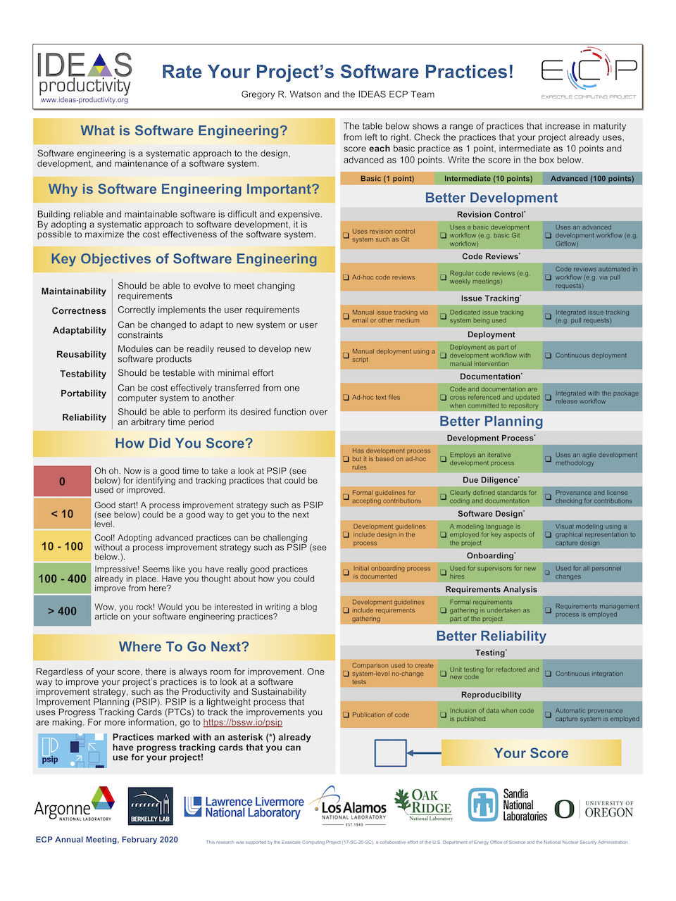

# Rate Your Project: A New Approach to Assessing Project Software Practices (UNPUBLISHED)
<!-- This blog/short-article is incomplete and may have further additions in the future, as per the author. It is kept as a placeholder since it has a lot of content that we want to retain incase we publish an enhanced version in the future -->

<!-- deck text start-->

Are you wondering how to embark and start improving your project's software processes and practices? This articles shares somes experiences which may help you get started.
<!-- deck text end  -->

#### Contributed by [Gregory R. Watson](https://github.com/jarrah42 "Greg Watson GitHub Profile")

#### Publication date: December 05, 2020

### The key is getting started

Knowing where to start can sometimes be as difficult as actually doing the job in the first place. This can be as significant a barrier to undertaking long term software process improvement (SPI) strategies as resource constraints, priorities, or short term deliverables. Much has been written about SPI and there are many examples of how even basic software engineering practices can lead to significant quality improvement. However, overcoming the initial inertia required to begin a process of change can be such a burden that it prevents teams from even getting started.

The [ECP IDEAS team](https://ideas-productivity.org/) has been pondering about this issue for some time. Our existing approach to helping teams start using methodologies like Productivity and Sustainability 
Improvement Planning (PSIP) has been to conducting interviews to assess existing team capabilities 
and then facilitate the development of a strategy for improvement using Progress Tracking Cards (PTCs). 
This approach has been successful, but is very resource and time intensive, something that is always in short supply for the teams (and ourselves). 

### A simple approach

The [Exascale Computing Project Annual General Meeting](https://ecpannualmeeting.com), held in 2020, was a great opportunity to trial an alternative approach to self assessment, one that would hopefully be a lot less resource intensive. We also decided to make the process as fun and interesting as possible in
order to encourage teams to participate. To this end, we created an interactive poster based on three 
"Better" categories derived from the [Better Scientific Software site](https://bssw.io). In each of these
categories, we listed a number of software engineering practices that we considered to be basic, intermediate, and advanced capabilities. Participants were then able to choose the practices that most closely matched those being employed by their projects. Points were awarded for each practice, with more points going to the refined practices. This was used to derive an overall score for the project. The poster was displayed during the official conference poster session, as well as at the IDEAS "Help Desk" that was available throughout 
the conference.

### Making it fun

In addition to simply providing a means of assessing a project's software practices, we also wanted to
make it a good experience, and hopefully encourage further participation in PSIP activities. 
In order to do this, we provided a table of score ranges that projects could compare with, and some light-hearted descriptions of what their score indicated. We explicitly decided not to allow comparison between projects to avoid any issues that this may have caused. 

### Results

Participation in the Rate Your Project poster was good, and it did not take much encouragement
in order to get people to rate their projects (although a few people were not prepared to do so.) 
Most people were eager to see how their project rated, and seemed to be encouraged when they
discovered that it did well. A number of participants initially thought they would rate very low, but were surprised to find that they weren't doing so badly after all. People were also interested in hearing about the more advanced practices and how they could be used by their project.

Without any a priori empirical evidence, the score value does not provide a useful indication of project
maturity. However it was interesting to note that most projects scored between 250 and 450. What 
was more useful was to see the areas that projects were strong in, and where systematic weaknesses
were present. In particular, the "Better Development" categories scored significantly higher than the other categories. Areas of weakness (in greatest to least order) were: Onboarding, Software Design, Reproducibility, Deployment, Requirements Analysis, and Due Diligence.

### Next Steps

Rating a project allows a team to identify which areas are working well, and which areas may benefit
from improvement. This allows scarce resources to be concentrated on areas that will result in the best
return for investment. One approach to improving these practices, and the one recommended by the PSIP team is to create a PTC for the practice area of interest. The PTC can then be used both as a guide and to monitor progress towards improving the practice. The PSIP team has already created template PTCs for most of the practice areas in the poster, and these can be customized to suit the specific needs of a project. PSIP practice guides and the PTC catalog are available from the PSIP web site (http://bssw.io/psip).

### Conclusion

The level of participation was encouraging and seemed to indicate that this approach was a good
way of providing an initial baseline on a project's strengths and weaknesses. Another benefit 
what that the act of simply going through the scoring process helped to start a dialog about practices 
and about how those practices fit in the larger context of modern, tech-industry established software 
processes. We hope to use the  results of this experiment to develop a more automated approach to 
assisting projects improve their software practices using PSIP and progress tracking cards.

### Author bio

Gregory Watson is a Senior Research Scientist in the Research Software Engineering Group at Oak Ridge National Laboratory. His research interests include software engineering practices, development environments, programming tools, and modeling and simulation tools for high performance and scientific computing. He is a senior member of the IEEE and chair of the IEEE Computer Society Schenctady Section in New York.

<!---
Publish: no
Pinned: no
RSS update: 
Categories: Planning, Collaboration
Topics: Software Engineering, Projects and Organizations
--->

