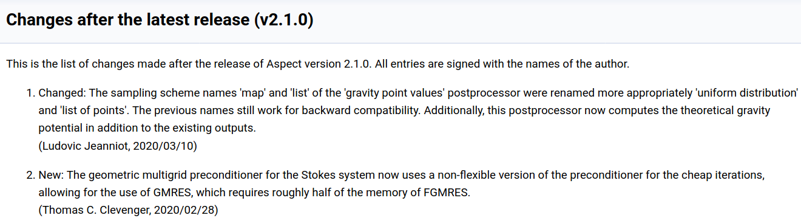

# Scientific Software Projects and Their Communities

Improving the state of scientific software requires focusing on the people behind the software.

#### Contributed by [Rene Gassmoeller](https://github.com/gassmoeller "Rene Gassmoeller GitHub Profile")

#### Publication date: March 23, 2020

(This article also appears on the [URSSI blog](http://urssi.us/blog/).)

In the past several years, we have seen a growing consensus that improving the state of
scientific software requires focusing on the people behind the software. This
is particularly true for the [software engineers and
scientists](https://bssw.io/blog_posts/us-research-software-engineer-us-rse-association)
developing the software and for the [maintainers and leaders](https://bssw.io/blog_posts/leading-a-scientific-software-project-it-s-all-personal)
of projects, but also for whole projects improving their [software development
processes](https://bssw.io/blog_posts/productivity-and-sustainability-improvement-planning-psip).
These people are not just individuals, however; when they work together on a
software project, they form a community. We have learned a lot about
user/developer communities from open-source software projects (see
[opensource.guide](https://opensource.guide/building-community/)), yet we know
relatively little about the challenges that are specific to scientific
software.

### Community engagement as a limit to project growth?

I am a scientist who develops software, and I regularly meet with others in my field (geophysics) to improve their software development
processes. During my work, I have frequently noticed that some software project members have
valuable scientific ideas and follow best practices for software design yet
their software projects
never attract a sufficient user base to establish themselves. 
Other projects
follow only rudimentary policies yet develop into large and thriving
communities. What do these projects do differently, and is there a "correct"
way to develop a scientific software project? Based on my own experience, I
started my [Better Scientific Software fellowship](https://bssw.io/fellowship) under the hypothesis that
successful scientific software projects tend to grow because they organize
their community effectively and successfully, in addition to providing
scientific value and following good development practices.

### Better Scientific Software Communities

To investigate my hypothesis and to collect ideas and best-practice
guides about community coordination practices in different scientific software
projects, I began “Better Scientific Software Communities” (BSSC). Its intent is
to provide developers of scientific software with information about what good
community coordination can do and what pitfalls to avoid. Ideally the
collection of practices from successful projects will spark better policies in
new projects and, I hope, even inspire new practices in established projects.
I collected the content for BSSC based on my personal experiences, combined
with results of published studies and online blogs and in-person interviews
with maintainers of several successful scientific software projects in
geophysics, astrophysics, and applied mathematics. I quickly realized, however, that
this cannot be a exhaustive compendium, only a collection of working examples.
Some preliminary results are posted online at
https://gassmoeller.github.io/BSSC/, and the remaining results of my work will
be uploaded within this month.
In this blog post I want to discuss some of the main findings, to stimulate ideas and spark a conversation about what other practices might improve software communities.

### Community atmosphere

A consistent theme during my interviews was that maintainers attribute some
part of the success of their project to the welcoming atmosphere for new and
returning contributors. Users choose their software because it solves a problem,
but they contribute back because they like interacting with the project community. But
what exactly creates a welcoming community? It would be easy to assume that the
most friendly and least critical responses invite the most contributions.
That is not sufficient, however. Indeed, a [Mozilla
study](https://docs.google.com/presentation/d/1hsJLv1ieSqtXBzd5YZusY-mB8e1VJzaeOmh8Q4VeMio/edit#slide=id.g43d857af8_0177)
found that response time is one of the most important factors in retaining
contributors. Contributors who received feedback within 48 hours “have an
exceptionally high rate of returning,” whereas “Contributors who wait longer than
7 days for code review on their first bug have virtually zero percent
likelihood of returning.” This result was supported by anecdotal evidence in my
interviews. Additionally, while a timely and friendly response is necessary,
many projects emphasized that a detailed and critical, but supportive, response
is just as important. Holding contributors to a high standard improves the
quality of the software and increases the credit and satisfaction of getting
one's feature merged. Of course it is still important to recognize the abilities
of the individual contributor and provide feedback at the appropriate level,
but a friendly link to a set of coding guidelines is much less intimidating
than a harsh or even personally insulting criticism of coding style. For all
aspects of community atmosphere, maintainers need to [lead by
example](https://bssw.io/blog_posts/leading-a-scientific-software-project-it-s-all-personal),
in particular because their responses to one person will usually be watched by
a much larger group of potential future contributors.

### Credit and growth

Another consistent strategy within successful projects is that they have
developed ways to attribute credit to contributors, although their approaches
differ significantly. One of the most straightforward methods is to maintain a
changelog that records contributions from members. This changelog is different
from the version control history in that it is more visible to provide credit
and more focused on significant contributions to make it worthwhile to read.  
The figure below shows
a portion of a [changelog](https://aspect.geodynamics.org/doc/doxygen/changes_current.html) for
the ASPECT project (Advanced Solver for Problems in Earth's Convection) that is
updated automatically, whenever new changes are merged into the code.

[A publicly available changelog disseminates important new features, and attributes credit to community contributors.]

Another strategy I encountered and encourage is official recognition, whether as a
developer/author on the project’s website or inside the repository, or as a
co-author on release publications about the software, or as a contributor acknowledged in a newsletter
(for example, a newsletter version
of the changelog). Upholding agreed-upon policies for giving credit is
especially important, since surprises in distributing credit (for example,
favoritism of institutions or maintainers or confusion about authorship) are
common conflict points in community projects.

### Managing conflicts

One of the unsurprising results of my conversations was that many projects and
maintainers eventually experience various types of conflicts within their
community. These conflicts can usually be categorized in one of three types:
conflicts about personality, about policy, and about technical
strategy. Personality conflicts in open-source projects do occur: after all, user communities are
heterogeneous, somewhat unpredictable, and made up of diverse and sometimes not
very compatible personality types. The topic 
has received considerable public discussion
(see, e.g., this [Medium
post](https://medium.com/@d4nyll/the-open-source-community-have-no-place-for-disrespect-70c85d473332)),
so I will not  discuss it further here. Preventing policy conflicts starts
with implementing appropriate policies, in particular regarding credit for
contributions, selection of license agreements, and expectation of commitments
(e.g., of maintainers). If these policies are internal and not stated explicitly,
they may be a surprise to new members and create potential conflicts. Therefore,
stating them publicly helps mitigate conflicts.  In terms of technical
strategy, software projects always have to balance competing design goals such
as flexibility vs. performance.  If decisions are communicated insufficiently,
 individuals can be left feeling that their requirements are not given enough
consideration.  In summary, preventing, discovering, and resolving conflicts are
important goals of community coordination.  Successful
projects often pursue these goals by having (more or less) regular user meetings (online
or in person) and strive to maintain an open and supportive discussion culture.
Resolving conflicts, in particular, is one of the important tasks
of project leaders and requires a high level of flexibility and social skills.

### Using the tools that work

In addition to being a good software developer, coordinating the software community is a job that requires leadership skills -- for example, empathy, intuition, and
creativity. Honing these skills while growing your project is an important
task; but if you are lucky, you already have members with these skills in your
community, and you need only to find these members and let them solve your
problems for you. A repeated message that I heard during this year was that it is important
 to not bury conflicts within the social structure of a
project and to repeatedly ask which of the available strategies are applicable
for your project.

Many open questions about social structures in scientific software
projects could be explored further, but for now I hope that this post has
sparked some ideas to create more supportive and thriving scientific software communities.

This blog post is a summary of the ideas presented a [webinar](https://bssw.io/events/webinar-discovering-and-addressing-social-challenges-in-the-evolution-of-scientific-software-projects) in the [Best Practices for
HPC Software
Developers](https://bssw.io/items/best-practices-for-hpc-software-developers-webinar-series)
series. A recording, slides, and Q&A document are [available](https://ideas-productivity.org/resources/series/hpc-best-practices-webinars/#webinar033).

#### Resources
- https://opensource.guide/
- https://producingoss.com/

### Author Bio

Rene Gassmoeller is a project scientist at the Computational Infrastructure for
Geodynamics at the University of California, Davis. He is maintainer of the
geodynamic modeling software [ASPECT](https://aspect.geodynamics.org) and
regularly works with other open-source scientific software projects to improve
their development practices and policies. His research focuses on the
interaction between mantle convection and plate tectonic processes, numerical
methods for geodynamic modeling and computational fluid dynamics, and
sustainable software development in the Earth sciences. He earned his Ph.D. in
geophysics from Potsdam University in cooperation with the German Research
Centre for Geosciences and is one of the 2019 [Better Scientific Software
Fellows](https://bssw.io/fellowship). Contact:
rgassmoeller@ucdavis.edu.

<!---
Publish: yes
Track: community
RSS update: 2020-03-23
Categories: Collaboration
Topics: Software Engineering, Projects and Organizations
Tags: bssw-blog-article
Level: 2
Prerequisites: default
Aggregate: none
--->
