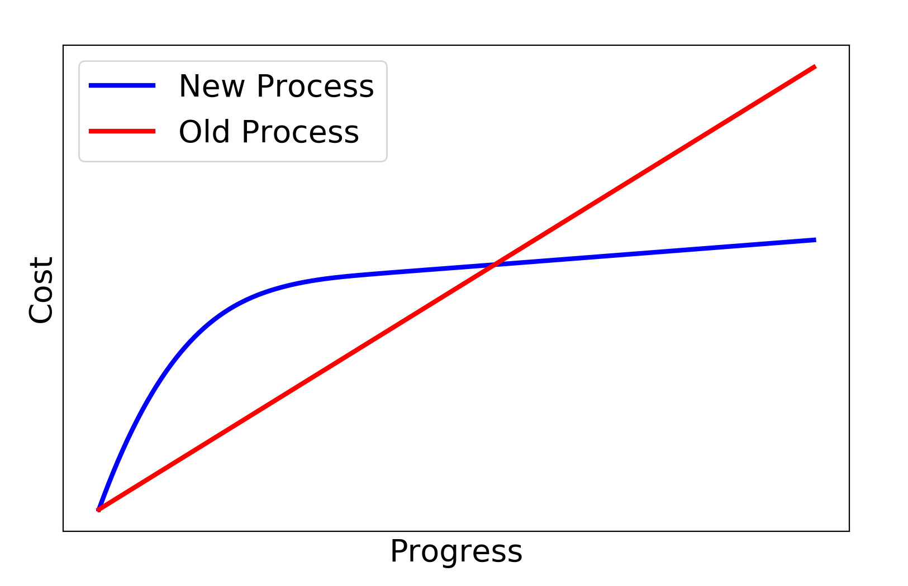
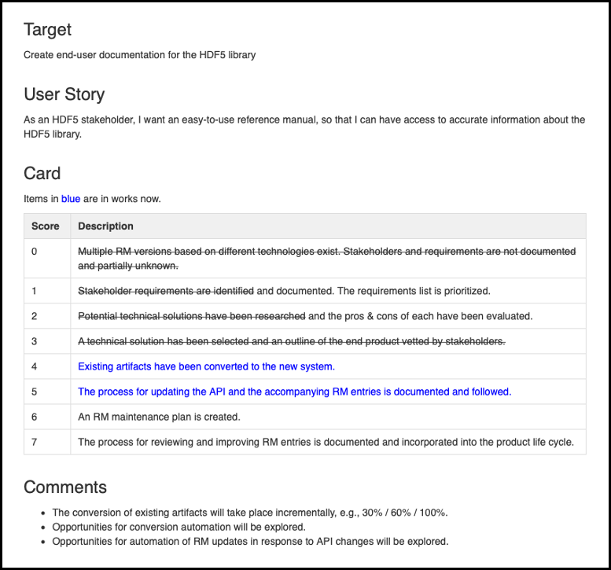

# Recent Successes with PSIP on HDF5

**Hero Image:**

 - [Simulation of black hole merger with data managed by the HDF5 I/O and data modeling library.]
 
#### Contributed by [Mark C. Miller](https://github.com/markcmiller86), [Elena Pourmal](https://github.com/epourmal), and [Elsa Gonsiorowski](https://github.com/gonsie)

#### Publication date: November 16, 2020

In an evaluation comprising less than half a year's time and half an FTE of cumulative effort,
the [Productivity and Sustainability Improvement Planning (PSIP)](https://bssw.io/psip) methodology was gainfully employed to effect key process improvements in the HDF5 project:
the introduction of a docs-like-code workflow for documentation, migration of the HDF5 code base
to GitHub, and the adoption of coding standards with the flexibility to permit automated conversion. Some key takeaways are:
* PSIP is significantly more lightweight than other methodologies.
* PSIP frees developers from learning a lot of methodological verbiage or terminology.
* PSIP is more hands-on and practical than more classical methodologies.
* Productivity boosts realized via PSIP will quickly recapture the initial investment.

<!--
### Summary (Option 2)
In an evaluation comprising less than half a year's time and half an FTE of cumulative effort,
the PSIP methodology was gainfully employed to effect key process improvements in the HDF5 project.
We expect subsequent productivity boosts to quickly recapture the initial investment as well as
any costs due to disruption of existing processes.
-->

### Introduction

PSIP is Agile for software *process* (as opposed to *product*) improvements. Quoting from
a [November 2019 workshop paper](https://link.springer.com/chapter/10.1007/978-3-030-44728-1_6)
describing PSIP, 

> PSIP breaks from classic software process improvement approaches such as CMM(I), SPICE, ISO
> 9000 or Six Sigma, in that it trades comprehensive standards and certification-driven assessment
> for self-defined, internally driven goals. It does, however, carry forward such ideas as having
> staged models of improvement (like CMM(I)) in the form of progress tracking cards. PSIP is more
> aligned with agile methods; it adopts their emphasis on iterative improvement and continuous
> learning.

PSIP helps already overburdened teams define and carry out a series of small, incremental steps of
progression towards process improvement goals without significant (there will be some, but a key goal
of PSIP is to avoid *significant*) disruption to ongoing development activities. A key enabling tool
in PSIP is the use of
[Progress Tracking Cards](https://bssw-psip.github.io/practice-guides/pages/how_to_create_ptc.html) (PTCs) which
define the steps of progression towards a given improvement goal.

  

[Use of PSIP helps teams to improve software practices, with productivity boosts that quickly recapture the initial investment as well as any costs due to disruption of existing processes.]

 

In April of 2020, the
[LLNL WSC](https://wci.llnl.gov/about-us/weapon-simulation-and-computing) Research Coordination Council
established a $150K contract with [The HDF Group](https://www.hdfgroup.org)
(THG), the organization responsible for developing and maintaining
[HDF5](https://portal.hdfgroup.org/display/HDF5/HDF5), to employ PSIP to effect some
software process improvement goals (IGs). Interested readers are welcome to read the
[full report](https://www.osti.gov/biblio/1698291-psip-hdf5pilot-project-final-report).

HDF5 was selected as a use case for evaluating PSIP
because [NNSA](https://www.energy.gov/nnsa/national-nuclear-security-administration) labs are working
to broaden HDF5's adoption as a community code. We also expect any process improvements realized will
benefit many DOE HPC/CSE applications that depend on HDF5. In its 20+ year history, the development team
has practiced various software process improvement methodologies making the team an invaluable resource
in offering a comparative perspective on PSIP.

### The PSIP process that we followed

As shown in the table below, work kicked off with a two-hour training where PSIP facilitators led THG staff, comprised of a mix
of developers, testers, customer support reps, and product managers, through two
exercises. This whole-workforce engagement approach is crucial to enabling a project to identify
overall productivity “pain points.” Guiding principles of PSIP, that the process is non-judgmental,
bottom-up and consensus-driven with input from all stakeholders, are critical to success in gathering
input from all staff regarding productivity issues.

Activity | Lead by... | Completion date
:---|:---|:---
Kickoff training/meeting | PSIP Team | April 22, 2020
Candidate IGs & Down-select|PSIP Team/LLNL/THG| May 6, 2020
Draft & Finalize PTCs |PSIP Team/LLNL/THG| May 15, 2020
Execute on PTCs/progress updates | THG | Bi-weekly through Sept 15, 2020
Retrospective & Report outcomes| THG/LLNL | Sept 30, 2020

In the first exercise, each THG staff member independently did a
[self-survey](https://rateyourproject.org)
of HDF5 software processes. This was followed by a group discussion to compare perceptions and help
the team identify common pain points ripe for process improvement. In the second exercise, the team
practiced creating a progress tracking card (PTC) for a mutually agreed upon example improvement goal,
first individually and then as a group followed by group dialog.

From an initial list of 13 candidate IGs, THG staff brainstormed and selected three to carry forward
and create PTCs:

* **Improvement Goal #1 (IG1)**: Modernize processes for handling documentation ([PTC](https://bssw-psip.github.io/ptc-catalog/catalog/THGReferenceManual.html))
* **Improvement Goal #2 (IG2)**: Move HDF5 from a THG managed Bitbucket instance to GitHub ([PTC](https://bssw-psip.github.io/ptc-catalog/catalog/THGGitHubMigration.html))
* **Improvement Goal #3 (IG3)**: Define and adopt a set of consistent coding standards ([PTC](https://bssw-psip.github.io/ptc-catalog/catalog/THGCodingStandards.html))

THG staff members then self-organized around the IG(s) they were passionate about drafting and refining
PTCs (see images below). Developing quality [PTCs](https://bssw-psip.github.io/practice-guides/pages/how_to_create_ptc.html)
is essential but also nontrivial.
It can require facilitation by an experienced but objective third party. The challenge is in ensuring
that each step has a good definition of "done" and also represents a value-added improvement in
existing processes. This approach ensures that if progression through PTC steps ever stalls, the effort
expended to reach that point is not at risk of being orphaned or lost.

  

[PSIP progress tracking card representing the incremental steps used to address process improvement goals in documentation. See hyperlinks above for PTCs for GitHub migration and coding standards.]

 

For THG staff, shifting from thinking about *product* (e.g., delivering on promised features) to thinking
about *process* was, at first, challenging. Time pressures of development have been such that rarely has
this team had an opportunity to think holistically about process improvement. It took awhile for THG
staff members to put on this new thinking cap. This is likely true of many scientific software development teams.
Treating process improvements as *deliverables* is key to winning a team's commitment to their
completion.

As work progressed, a *champion* for each IG naturally emerged. This is important. An IG *champion*
is passionate about the IG and helps to maintain forward progress. It is also an opportunity for staff
members who may not have previously had any leadership role.

### Outcomes and overall assessment
PSIP with HDF5 has been a phenomenal success! Substantial progress was made on all three IGs. The
progress achieved exceeded expectations. The completion of the majority of steps in IG1 using a combination of
[Doxygen](https://doxygen.nl/) and [MediaWiki](https://www.mediawiki.org/wiki/MediaWiki)
represents a true shift in THG culture to treating [docs like code](https://www.docslikecode.com). The
migration of the [HDF5 library to GitHub](https://github.com/HDFGroup/hdf5) (IG2) was completed in the
first week of October, 2020 and there have already been several community contributed pull requests.
For IG3, the team settled on a two-pronged approach where a coding standard was adopted for *committed*
code on GitHub, and CI tools were created to support automated conversion between minor variations
in styles favored by different developers.

Over the course of five months, three sub-teams of between 7 and 14 THG staff members consumed a
cumulative of only 1/2 FTE of effort to effect these critical process improvements. Subsequent
productivity boosts due to improved processes are likely to recapture this cost in the first year,
if not sooner.

Project leadership and front line developers at THG expect to continuing using PSIP for future process
improvements. THG plans to use PTCs to engage with and manage community contributions impacting
process improvements such as a recently planned effort for incrementally integrating multi-threading
support throughout the library.

### Comparison with other methodologies

PSIP was found to be significantly more light weight than other approaches such as
[CMM(I)](https://cmmiinstitute.com) or [PMBOK](https://en.wikipedia.org/wiki/Project_Management_Body_of_Knowledge).
But that doesn’t necessarily imply that PSIP is only for lightweight tasks. PSIP avoids a lot of
front loaded, preparatory work such as cost estimating,
[WBS](https://en.wikipedia.org/wiki/Work_breakdown_structure), and project planning. In those other
methodologies, a lot of that preparatory work is done by project managers or principal investigators, and the team is just given their
assignments. In PSIP, all stakeholders are engaged from the beginning, so that the whole process of
planning an execution feels more democratized.

PSIP also relieves team members of the baggage of having to learn a lot of special verbiage or
terminology. Top-down process improvement models such as CMM(I) can often
begin with too much abstraction, making them disconnected from the sometimes unique, concrete
software development tasks any specific project demands, and giving some contributors opportunities
to hide behind or become overly distracted by these abstractions. The simplicity of PSIP 
gives people an opportunity to propose and advocate for specific, concrete process improvements.

PSIP is more hands-on and practical and less abstract than these other methodologies. There are
more opportunities to demonstrate the completion of various steps, which help to engender a sense
of continuous progress. Team members were motivated at the opportunity to learn and apply new technologies
or share their knowledge. Better team chemistry and engagement in process improvement were observed
throughout PSIP activities.

### Impact of earmarked funding

Typically scientific code teams are expected to incorporate process improvements into their existing plans
and funding streams. While it is rare to secure funding primarily for process improvement as was
the case here, it would be a mistake to infer that additional funding is the sole reason or even
a majority reason for any progress and successes attributable to PSIP.

For THG staff, being asked to improve their processes as a *deliverable* for a sponsor was not
something with which they had much experience, especially when the specific improvements and how
to go about enacting them were to be determined primarily by the team and not the sponsor.
All stakeholders agree that while additional funding certainly did help, it helped primarily from
the perspective of creating a formal contractual obligation to deliver on something, in this case
process improvements.

For even smallish scientific code teams of 2-4 FTEs, the $150K here likely
represents a small fraction of their whole effort. Furthermore, the effort to implement a PSIP
is likely quickly offset by the gains in productivity resulting from improved processes.

### Acknowledgments
The black-hole image is from [Wikimedia Commons]( https://commons.wikimedia.org/wiki/File:When_Black_Holes_Collide.jpg).
Thanks to PSIP facilitators [Elsa Gonsiorowski](https://github.com/gonsie) and
[Reed Milewicz](https://github.com/rmmilewi) for assisting this effort. Thanks
to [Elena Pourmal](https://github.com/epourmal) for allowing visibility into internal
HDF Group software development activities. Thanks to the LLNL WSC Research Coordination
Council for funding this work.

### Author bios

[Mark C. Miller](https://github.com/markcmiller86) is a computer scientist supporting the
[WSC](https://wci.llnl.gov/about-us/weapon-simulation-and-computing)
program at [Lawrence Livermore National Laboratory](https://www.llnl.gov) since 1995.
He is the lead developer of [Silo](https://wci.llnl.gov/simulation/computer-codes/silo) and
[MACSio](https://computing.llnl.gov/projects/co-design/macsio)
and a contributor to [VisIt](https://wci.llnl.gov/simulation/computer-codes/visit),
[ZFP](https://computing.llnl.gov/projects/floating-point-compression)
and the [IDEAS-ECP](https://ideas-productivity.org/activities/ideas-ecp/) projects.

[Elena Pourmal](https://github.com/epourmal) has over 20 years experience contributing to and leading
projects within the HDF5 eco-system. She is currently the Director of Technical Services and Operations of
[The HDF Group](https://www.hdfgroup.org/).

[Elsa Gonsiorowski](https://www.gonsie.com/) is an HPC I/O Specialist working at Lawrence Livermore National Laboratory. She graduated with her Ph.D. in Computer Science in 2016 from Rensselaer Polytechnic Institute. Elsa works on a number of open source, system software tools to support HPC users as they manage files across an increasingly complex storage hierarchy. She has a passion for useful documentation and CMake. She is also a contributor to the
[IDEAS-ECP](https://ideas-productivity.org/activities/ideas-ecp/) project.

<!--
Publish: yes
Track: deep dive
Categories: planning
Topics: software process improvement
Tags: bssw-blog-article
Level: 2
Prerequisites: default
Aggregate: none
-->
