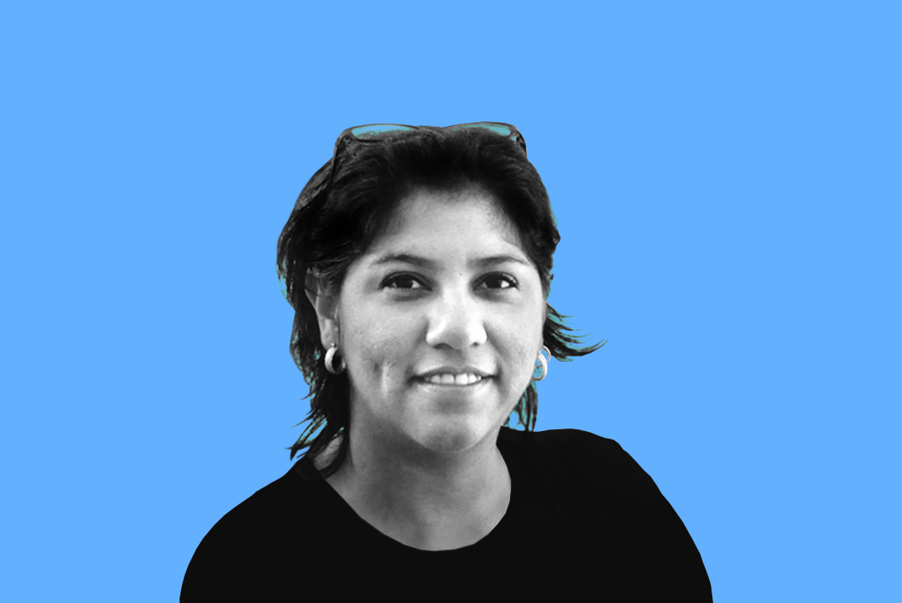
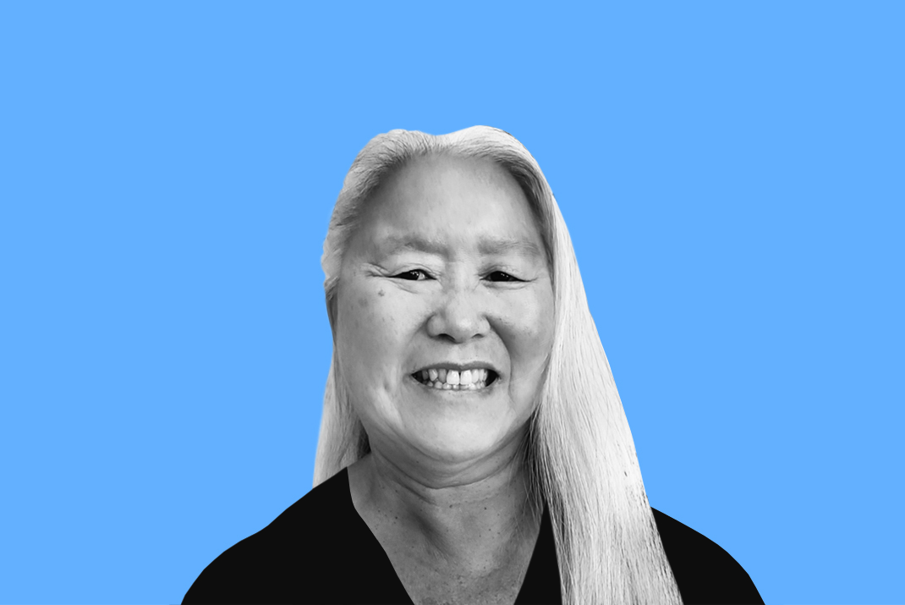
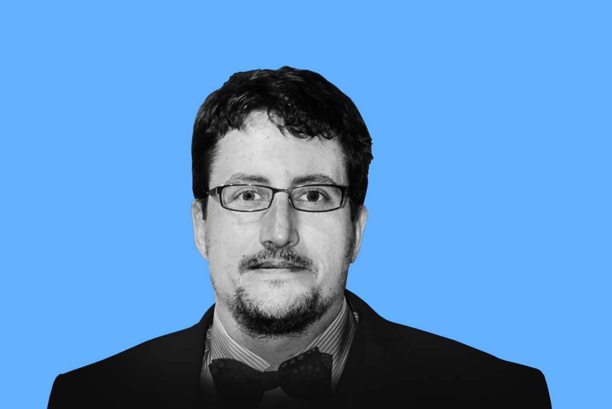
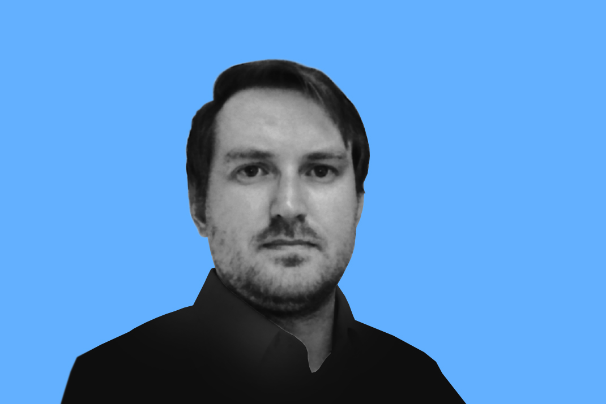
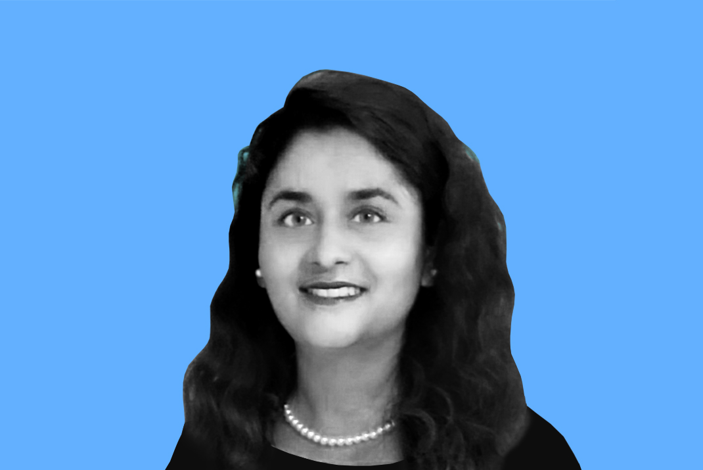

# Introducing the 2021 BSSw Fellows

#### Contributed by [Hai Ah Nam](https://github.com/hnamLANL "Hai Ah Nam GitHub Profile")

#### Publication date: December 16, 2020

We are pleased to announce the 2021 class of Better Scientific Software (BSSw) Fellows: three Fellows and three Honorable Mentions.

The 2021 class of BSSw Fellows will be recognized during the [2021 Exascale Computing Project Virtual Annual Meeting](https://www.ecpannualmeeting.com), April 12-16, 2021.  

We sincerely thank _all_ fellowship applicants. The broad range of creative and interesting proposals made the selection process difficult.

The [BSSw Fellowship Program](https://bssw.io/fellowship) gives recognition and funding to leaders and advocates of high-quality scientific software. Each 2021 Fellow will receive up to $25,000 for an activity that promotes better scientific software, such as organizing a workshop, preparing a tutorial, or creating content to engage the scientific software community.  

## 2021 BSSw Fellows

  

  

  <h3> Marisol García-Reyes, Farallon Institute</h3>
  
Principal Scientist

  
<i>BSSw Focus</i>: Increasing accessibility of data & cloud technologies

  

  

  <h3>Mary Ann Leung, Sustainable Horizons Institute</h3>
  
President

  
<i>BSSw focus</i>: Increasing developer productivity and innovation through diversity 

 

  <h3> Chase Million, Million Concepts</h3>
  
Founder

  
<i>BSSw focus</i>: Project management best practices for research software

 

## 2021 BSSw Honorable Mentions

  <h3>Keith Beattie, Lawrence Berkeley National Laboratory</h3>
  
Computer Systems Engineer, Computational Research Division
 

  

  <h3>Jonathan Madsen, Lawrence Berkeley National Laboratory</h3>
  
Application Performance Specialist, NERSC

  <h3>Addi Thakur Malviya, Oak Ridge National Laboratory</h3>
  
Group Leader, Software Engineering Group

### About the BSSw Fellowship
The main goal of the [BSSw Fellowship Program](https://bssw.io/fellowship) is to foster and promote practices, processes, and tools to improve developer productivity and software sustainability of scientific codes. BSSw Fellows are selected annually based on an application process that includes the proposal of an activity that promotes better scientific software. Subscribe to the [BSSw email digest](https://bssw.io/pages/receive-our-email-digest) for notification about next year’s call for applications, which will be announced in summer 2021.  More information:

- [BSSw Meet Our Fellows](https://bssw.io/pages/meet-our-fellows)
- [FAQ for the BSSw Fellowship Program](https://bssw.io/pages/bssw-fellowship-faq) 

Stay tuned for more from the 2021 BSSw Fellows. 

### Contribute to the BSSw Site
Also, we want and need contributions from the international community for the BSSw site.  If you have expertise that can help other scientific software teams, we encourage you to contribute an article or pointer to good work.  See details on [how to contribute to BSSw](https://bssw.io/pages/what-to-contribute-content-for-better-scientific-software).

### Author bio
Hai Ah Nam is coordinator of the BSSw Fellowship Program, a member of the IDEAS-ECP team, and a computational physicist at Los Alamos National Laboratory.  Her  background includes computational low-energy nuclear physics, large-scale scientific computing, and high-performance computing. She is an advocate for developer productivity and software sustainability and has been one of the organizers of the [Performance, Portability and Productivity in HPC Forum](https://p3hpcforum2020.alcf.anl.gov/) for four years.

<!---
Publish: yes
Track: bssw fellowship
RSS update: 2020-12-16
Topics: projects and organizations
Pinned: no
--->
