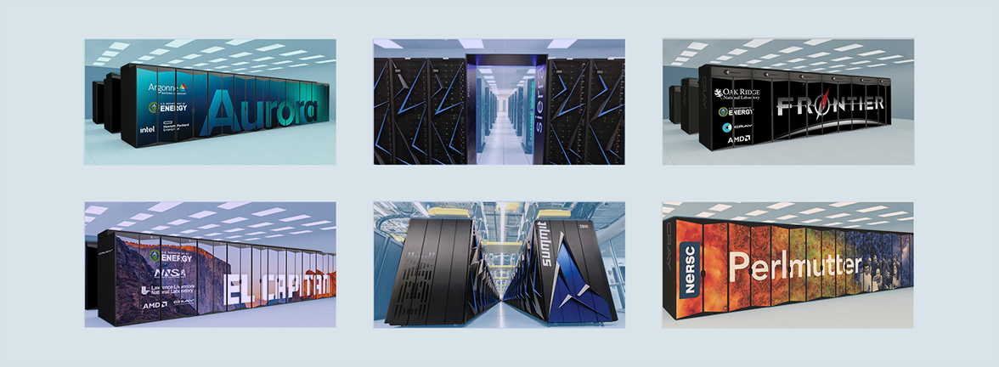

# Performance Portability and the Exascale Computing Project

**Hero Image:**
 
- 

#### Contributed by [Anshu Dubey](https://github.com/adubey64)

#### Publication date: December 7, 2020

A focus on performance portability engendered by heterogeneity in high-performance computing (HPC) platforms has brought the issue of software design to the forefront of computational science with HPC. This article discusses challenges in performance portability and how careful attention to software design is essential to achieving portable performance, especially with an eye to emerging exascale platforms.

## The many faces of performance portability
*Performance portability* is a topic that elicits various responses depending on the 
setting. Domain scientists want performance portability in their codes and would really
like if it could become magically possible without taxing 
their development resources. Computational scientists would also ideally like to be able
to squeeze the last bit of performance from whichever platform they
are using because, obviously, they get their answers faster that
way. For performance engineers, performance portability is somewhat at
cross-purposes with what they like to achieve, and that is to maximize
the performance of the code on the target architecture. For
language/compiler/abstractions researchers, performance portability is both a challenge and
an opportunity. Those concerned with productivity in the realm of
software for science need to understand the trade-offs and help
science projects make informed choices that are best for their
research programs.

## Performance portability panels
The DOE *Exascale Computing Project [(ECP](https://exascaleproject.org))* has become
an active testbed for all things connected to performance
portability. ECP is unique in providing adequate resources to various
science teams to make good choices if they knew what they were. The
trouble is that when ECP began several years ago,  little was known about
what constituted good choices for achieving performance portability, so the majority of teams have been
experimenting. Now with more than three years into the project, some
trends have become visible, and a great deal of wisdom has been
collected. In the summer of 2020 the IDEAS-ECP project organized a series
of panels with the intent to bring out these trends and foster sharing of
collected wisdom. The series began with a webinar by the
science directors of both the leadership-class computing facilities (at Argonne
and Oak Ridge National Laboratories), setting the stage for the
discussion. Next followed four panels organized around common
themes of algorithms and data locality challenges. Panelists were a
mix of applications developers and hardware and software experts, along
with leadership of the ECP. A [presentation about the panel series](https://doi.org/10.6084/m9.figshare.13283714) is available.

One trend that emerged from the panel series is that a form of
"conservation of trouble" is at play. If the application interface
with the abstraction layers is designed to completely hide the
complexity of the platform from the application, the complexity of the
tool implementing the abstraction rises. Furthermore, the use of
abstraction layers without modifying the code base to account for
increased heterogeneity results in subpar outcomes in terms of
performance and complexity. Sometimes even refactoring does not suffice if the
algorithms matching data patterns suitable for different devices are
fundamentally different. Simultaneously, some
researchers have begun to think that a "magic" compiler is an
impossibility and that various aspects of code execution should be
tackled differently and independently, with application interfaces
carrying some of the complexity burden---in other words, co-design
between applications and code translation tools, whether they are
abstraction layers, pragma-based tools, or autotuning tools. Better
solutions can be found where applications and tools are not completely
oblivious of the needs of one another.  

## Performance portability and software design
What this means is that real investment in application architecture
design has become critical for scientific software of modest to high
complexity running on even modestly high-performance
platforms. Business as usual with solving only the next challenge
right in front of one's nose has become an untenable approach that is
also wasteful of resources.  An [analysis of the impact of design
investment in the multiphysics code FLASH](https://doi.org/10.1177/1094342017747692) clearly shows immense
benefits for code robustness, reliability, and sustainability. An added
benefit was expansion of the code to several science communities that
were saved from having to invest their own resources in developing
infrastructure because they could repurpose FLASH for their
domains. The findings of the performance portability panel series reinforce
the findings of FLASH analysis, that there is no substitute for good software
design. While we still do not have conclusive answers to what a good design
is, we know that it ultimately comes down to first knowing and
understanding a code’s data access and movement patterns and then using an
abstraction tool-chain to express those localities appropriately. The
webinar ["Software Design for Longevity with
Performance Portability"](https://ideas-productivity.org/resources/series/hpc-best-practices-webinars/#webinar047) 
elaborates on some design principles that
are definitely necessary, though not sufficient.

## Author bio
Anshu Dubey is a computer scientist in the Mathematics and Computer
Science Division of Argonne National Laboratory and a senior scientist
in the Department of Computer Science at the University of
Chicago. She is the chief software architect for FLASH, 
a multiphysics, multiscale HPC application that is used by multiple
science and engineering domains as their community code. She is
interested in all aspects of HPC scientific software, with special
emphasis on design, productivity, and sustainability issues.

<!--
Publish: yes
Track: experience
Categories: performance, planning
Topics: design, Performance at leadership computing facilities, Performance portability
Tags: site
Level: 2
Prerequisites: default
Aggregate: none
-->
