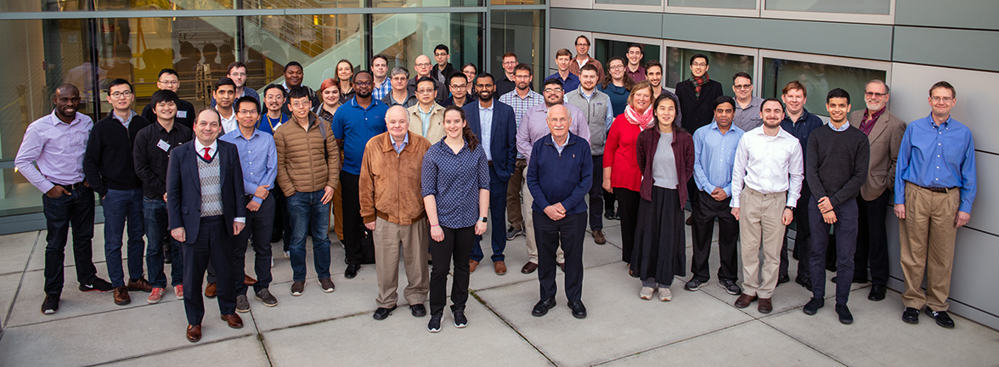

# Useful Practices for Software Engineering on Medium-Sized Distributed Scientific Projects

**Hero Image:**
- 

Photo © 2010-2019 The Regents of the University of California, Lawrence Berkeley National Laboratory.

#### Contributed by [Keith Beattie](https://github.com/ksbeattie "Keith Beattie's GitHub Profile") and [Dan Gunter](https://github.com/dangunter "Dan Gunter's GitHub Profile")

#### Publication date: February 25, 2021

<!-- deck text start --> 
Find out how scientists at Lawrence Berkeley National Laboratory have approached producing reliable scientific software in the modern research context
with contributors from multiple labs, universities and disciplines, spread across multiple timezones.
<!-- deck text end --> 

### Software engineering and distributed teams 

Modern science depends heavily on computing and computer software.  The correctness, the efficiency and,
more generally, the quality of the software are instrumental to scientific advancement.  Software
engineering &mdash; *"the application of a systematic, disciplined, quantifiable approach to the
development, operation, and maintenance of software"* [IEEE Standard Glossary of Software
Engineering Terminology, IEEE std 610.12-1990, 1990] &mdash; is the major tool available to create
and maintain software quality.  Advances in software engineering, such as "agile" processes and the
"devops" revolution, have been important factors in the creation of scientific software.

In our work, we are often in the position of leading, or helping to lead, the software engineering
efforts of medium-sized, distributed, multidisciplinary scientific project teams. By
*medium-sized*, we mean from about 10 to 50 people; by *distributed*, we mean that the team 
comprises people from multiple institutions that are geographically separated and do not have a
common management structure &mdash; typically a few universities and one or more national
laboratories; and by *multidisciplinary*, we mean the team is usually composed of people who come
from scientific or engineering backgrounds other than computer science or software engineering, with
limited experience writing software for use outside their own or their team’s projects. We have often tried
to apply software engineering and project management approaches from industry in this milieu but
always end up frustrated with some of the assumptions about centralized authority, dedicated
software engineering effort and incentive.

### Challenges facing a medium-sized project
A good example of such a project team is the Institute for the Design of Advanced Energy Systems
([IDAES](https://idaes.org)), which was formed in 2016 to develop new advanced process systems
engineering (PSE) capabilities. Funded by the DOE Office of Fossil Energy and led by the National
Energy Technology Laboratory (NETL), the project's mission is to improve the efficiency and
reliability of the existing fleet of coal-fired power plants while accelerating the development of a
broad range of advanced fossil energy systems. The IDAES team spans three national laboratories
(NETL, Sandia National Laboratories, and Lawrence Berkeley National Laboratory)  and three universities (Carnegie Mellon University, West Virginia University,
and Notre Dame University). Most of the team is spread in the two Pennsylvania locations, but half a dozen participants are present in California and New Mexico each, in addition to the professors and several graduate students present in the various universities. From a software engineering perspective, the goal is to build a software package that is capable of
simulating important aspects of power plants and power grids. The eventual target
users are power plant operators and power grid designers, with a current user base primarily of researchers, graduate students and the developers themselves.

### A three-pronged approach

While the IDAES project runs functionally as a unit, there are sub-hierarchies of control in each national laboratory and university that set local priorities within the framework of the project deliverables. And although most of the effort is being spent on new software to perform chemical
process engineering,  significant effort is devoted to  adding related capabilities to an existing
software package, [Pyomo](https://www.pyomo.org/), that predates IDAES and continues to be
developed at Sandia National Laboratories. This size and variation in scope make project
coordination a challenge, but the situation is not unusual in our projects.

Although the specific approaches to increasing overall team productivity through software
engineering vary across projects, three elements of what we are doing for IDAES are, we
believe, generally applicable to projects with this kind of mix of institutions, disciplines and
scale: weekly whole-team developer meetings, incrementally better automation, and
“soapboxing” (including software engineering in official goals & deliverables).

### Not just another meeting
Many styles of meetings have been discussed in recent years with respect to software development
teams, most commonly the daily “standup” meetings combined with some semi-weekly longer
“retrospective” meetings. Neither of these  fits what we believe is a unique set of
constraints of our scientific environment, where we have

* no common authority structure (due to the multi-institutional nature of our collaborations);
* contributors split across timezones, sometimes continents; and
* contributors split across multiple unrelated projects with no inherent interest in
  accommodating one another.

As a result, people generally have  limited slots in their calendar that they can guarantee are
open on a regular basis. However, one weekly hour-long meeting is generally possible and serves
multiple purposes, by

* letting people “context-switch” back to what they promised a mere week ago to have done;
* providing an open forum for cross-cutting issues or questions that don’t get easily addressed in
  subgroup meetings (because, of course, these also exist);
* presenting some opportunity to disseminate practices and educate new team members; and
* building camaraderie through regular (virtual) contact.

For all these purposes, it is essential that this meeting be open to the entire
developer team &mdash; however daunting that must seem at first. You can think of this meeting as a
little bit like going to a weekly religious service or tight-knit social group (church, temple, book
group, bicycling club, etc.) where the enthusiasm for the event may vary week to week but the
overall experience is as much about the customs and connections as the content.

Specifically what occurs during these meetings will probably depend on your development practices
and tools. But in general we have found that  two main activities are critical: an open agenda of
issues that people can edit before the meeting and a standard task that focuses attention on the
active development across the project. For many projects, a modified Kanban “project board” approach
provides an excellent focus because it presents an easily summarized list of things completed,
in progress, and abandoned. Whoever is leading the meeting &mdash; and of course there should be
just one person who leads it, since anything else with 20+ people on the line would be chaos &mdash;
can, in the absence of any other topics, simply walk through all issues and categorize them against
release or other timelines. Almost always, this simple practice will bring up interactions
between the different pieces of ongoing work that would have otherwise been discovered much later,
if at all.

### An incremental approach to automated testing
Between meetings, the best friend of overall team productivity is automated practices, and in
particular automated tests. Although  few people disagree with this idea in principle, the truth is
that getting a large suite of automated tests to work and keeping them working in the face of
constantly changing software, personnel and dependencies is nontrivial. Of course, most of the
tests must be written by people who understand the mathematics and science of the code being tested
(or, in the case of infrastructure code, the computer science principles of the code). However, we
must face the reality that this is a significant request of someone’s time and is competing with
the next publication or result, which the individual may be encouraged to prioritize. Our position is that the
right approach to take to this problem is incremental: (1) help people put in a few tests, but don’t require that they pass; (2) add a requirement that the tests pass before the code is merged, but don’t worry about code coverage or style; (3) start informally checking code coverage and style, but don’t enforce anything; (4) start enforcing low levels of code coverage and  basic style rules; and (5) finally &mdash; well, honestly we’ve never gotten farther than that. But by doing these  in baby steps, and talking about them weekly in the developer meetings, you are building up a
culture of testing that will lead to eventually having a robust software environment that is broadly
supported by the team.

All told, these meetings serve to address the challenges we face developing software with teams
composed of people who are not primarily involved in computing or software engineering and are working together without a common
authority.  The regular meeting "baby steps approach" both educates and builds consensus simultaneously
on the best procedures, practices and tools to adopt. Ideally this approach is driven by
demonstrated effectiveness from those with the most software development experience.

### Soapboxing
The third element that we think is useful is what we call “soapboxing,” not in the negative sense of grandstanding but in the positive sense of putting key elements of software engineering and
development practices where they can gain favorable attention from project management and funders. Probably the least important
place for this is grant proposals, since these are read at most once every few years, whereas the message needs to be repeated frequently. One of the best places to try to insert some
discussion of software practices (and, by extension, developer productivity) is in project meetings.
If your PIs and other project leads need any convincing that software engineering is an important topic, an
excellent way to do so is to show them the team engaging in a spirited discussion in a public or
semi-public forum. Progress reports and general-audience publications about the project are also
opportunities to describe software engineering practices. 

### The goal:  developer productivity

We have spoken largely of social challenges, but of course scientific software also presents numerous technical challenges to developer productivity. We
believe that conquering these technical challenges goes hand in hand with reducing the friction of
the software engineering environment so that developers in medium-sized teams don’t spend all their
time working in silos and unintentionally stepping on each other’s toes and, perhaps most
important, so that they feel  they are working as a single team no matter how different their technical
backgrounds.

### Author bios

**Dan Gunter** leads the Integrated Data Frameworks (IDF) group in the Data Science and Technology
department of the Computational Research Division at Lawrence Berkeley National Laboratory. Dan's interests include data management and data
processing pipelines in heterogeneous environments, software engineering for distributed
multidisciplinary scientific teams and building of usable interfaces to enable scientific exploration.
He has led software efforts in projects across multiple domains, collaborating with many science
divisions at LBNL as well as with scientific and engineering teams across the Unted Statees and
internationally. He also brews a mean cup of coffee.

**Keith Beattie** is a computer systems engineer at LBNL with experience in bringing modern,
open-source software engineering practices to academic and research contexts.  His interests are in
understanding and addressing the unique challenges in leading multi-institutional, geographically
dispersed scientific software development teams while still producing effective and usable software,
particularly teams composed of members from scientific but not necessarily software engineering
backgrounds.  He has worked in industry as a software engineer and release manager and has been at LBNL for  the past 20
years.  He also tortures local music venue attendees playing bass in rock bands.

<!---
Publish: yes
Track: deep dive
Pinned: no
Topics: software engineering, Strategies for more effective teams, testing
RSS update: 2021-02-25
--->
