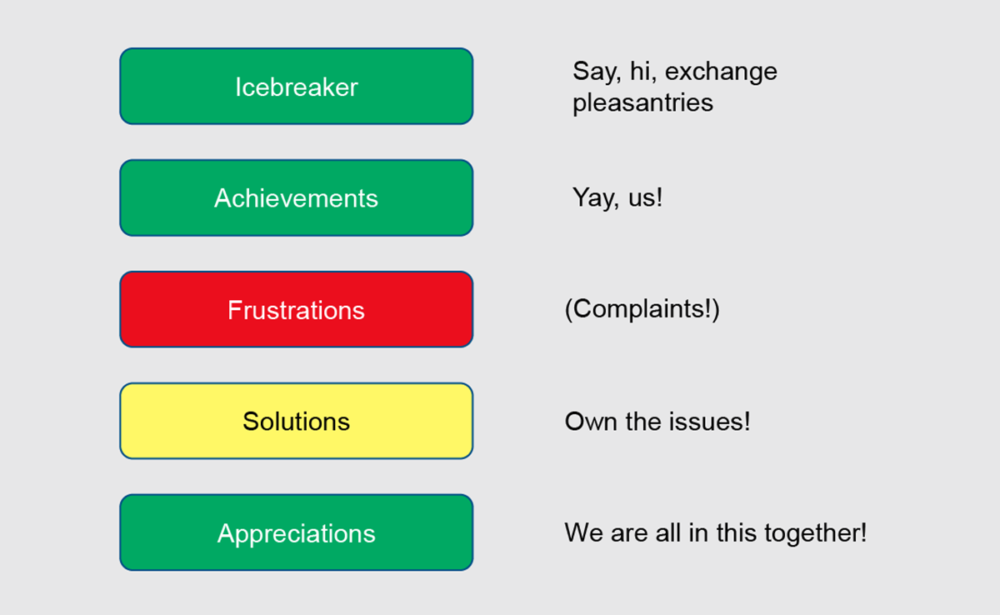

# Encouraging Effective Retrospective Strategies for Team Projects

#### Contributed by [Lina Sorg](https://github.com/linasorg)

#### Publication date: April 26, 2021

<!-- deck text start --> 
Originally published in SIAM News Online, this article by Lina Sorg explores retrospective reflections for team projects, and how to employ them effectively.
<!-- deck text end -->

As the U.S. approaches the one-year mark of remote work, many people are experiencing higher levels of stress than ever before. “Everything is getting harder, even for teams that have been really cohesive up to this point,” Angela Herring of Los Alamos National Laboratory said. It is therefore especially important for scrum masters and team leaders to keep their groups motivated, engaged, and focused. During a minisymposium presentation at the [2021 SIAM Conference on Computational Science and Engineering](https://www.siam.org/conferences/cm/conference/cse21?_ga=2.19507448.1125057374.1618601126-1862009909.1618601126), which took place virtually in March, Herring presented tangible strategies for managers who are seeking to implement effective retrospective sessions within their teams.

An agile retrospective refers to a reflective process that allows team members to assess their work after the latest sprint. During this time, participants can comment on the interactions, procedures, and tools of the sprint; voice concerns or issues; and suggest process changes for future projects. “A retrospective is really useful after you’ve completed some unit of work, or even just on a regular schedule,” Herring said. She refers to this time as a “safety valve” for team frustrations, as it provides members with a safe space to both unwind and celebrate. In this context, the scrum master should facilitate discussion and engage people so that they want to partake and do not feel like they are wasting their time. Herring also suggested establishing a set amount of time and sticking to it. “It’s a balance of being able to vent and solve problems,” she said. “Offering that space is both tricky and extremely rewarding.”

Herring then detailed a sample breakdown for retrospective sessions (see Figure 1). She encouraged scrum masters to begin with a brief introductory period before transitioning to achievements, frustrations, and solutions. Icebreakers can either involve simple, casual conversations with employees or more structured activities. “If you have a team that you’re trying to build relationships on, it’s good to have a formal icebreaker,” Herring said. Suggestions for icebreakers include “two truths and a lie” or conversations about one’s strangest hobby. Herring has found that making her team laugh relaxes participants and gets them thinking about the meeting.

[A simple retrospective can be very effective.]

After introductions, conversation should move to successes in the last sprint. These can be both professional—i.e., “I fixed a bug in the programming!”—or personal — i.e., “My child survived another week of virtual school!” If team members are hesitant to speak, the scrum master can urge everyone to name other people’s achievements. “Once the ball starts rolling, people begin adding to the sluice,” Herring said. “It really builds a good energy in the room.”

When conversation turns to the of the sprint that did not go so well, Herring encourages her team to air their vexations. “I allow them to vent but I don’t allow them to mistreat other teams,” she said. It is important to follow this grievance period with problem-solving efforts, as any frustrations should result in solutions. Walking systematically through the list of vocalized issues is an effective way to do so. For example, if a team member had trouble locating a bug, the team may decide to denote more time for group debugging sessions on future projects. If someone did not have sufficient office space, the group could look into utilizing shared space or conference rooms. Interpersonal issues require careful handling and may necessitate further address outside of the retrospective.

Finally, every retrospective should end with a celebration of team achievements. “This sounds like the cheesiest exercise ever, but it’s really important to reach out to your colleagues,” Herring said. “It’s important to feel connected to your group before you leave.” Affirmations can be simple or significant and might take acknowledge discovered bugs, identified office space, released features, hired students, new team members, or even vacations or awards.

Herring noted that her suggestions are meant for teams that are already in good health, rather than teams in crisis. The latter can experiment with more involved formats—including the creation of individual timelines for the latest sprint to compare everyone’s perspectives—that get individuals discussing their feelings in a psychologically safe way.

As the session concluded, Herring reminded participants to interact with their team members, work to build an engaging environment, and maintain regular check-ins. She advised scrum masters to never skip retrospectives because of busy schedules. “As a leader, you should take time to listen,” Herring said. Doing so provides team members with a safe space for honesty, growth, and success.

### Acknowledgments
This article originally appeared in [SIAM News Online](https://sinews.siam.org/Details-Page/encouraging-effective-retrospective-strategies-for-team-projects). Details about this work are available in the presentation [“Listen, don’t just hear your team with an effective retrospective”](https://doi.org/10.6084/m9.figshare.14130473) by [Angela Herring](https://bssw.io/items?author=herring), part of a minisymposium on Building Sustainable Software Communities and Sustainable Software at the SIAM CSE21 Conference.  More details about this session and others related to scientific software are available in the blog article, [A Look at Software-Focused Topics at SIAM CSE21](https://bssw.io/blog_posts/a-look-at-software-focused-topics-at-siam-cse21).

### Author Bio
Lina Sorg is the managing editor of [SIAM News](https://www.siam.org/publications/siam-news).

<!---
Publish: preview
Pinned: no
Topics: strategies for more effective teams, conferences and workshops
RSS update: 2021-04-26
--->
