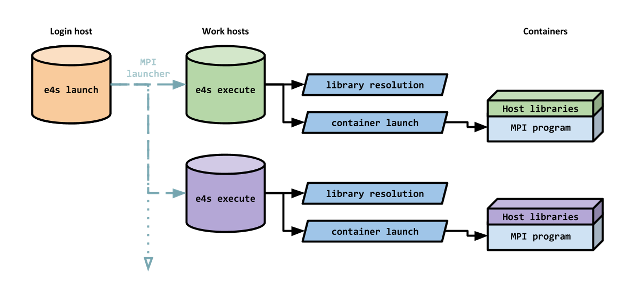
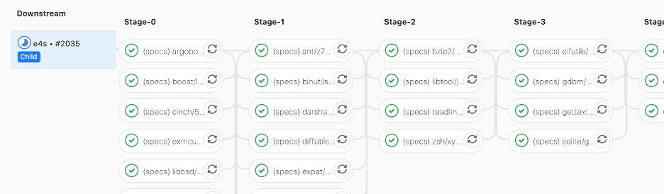
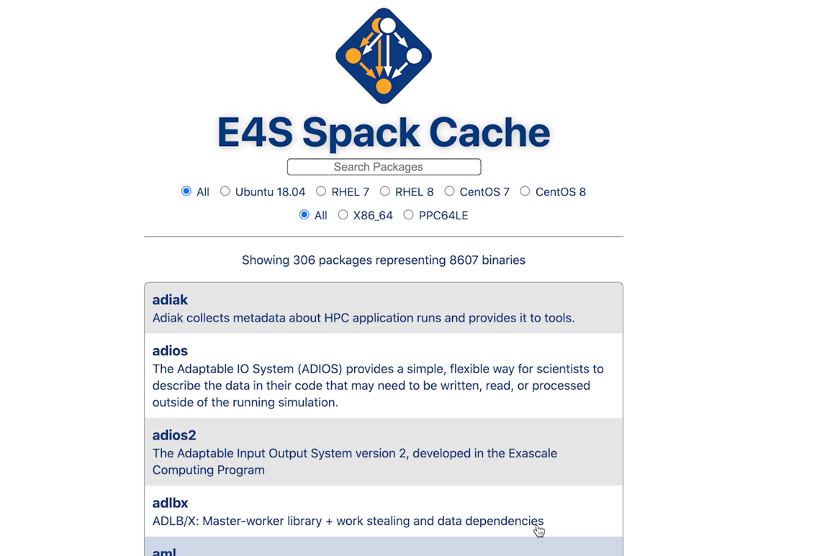
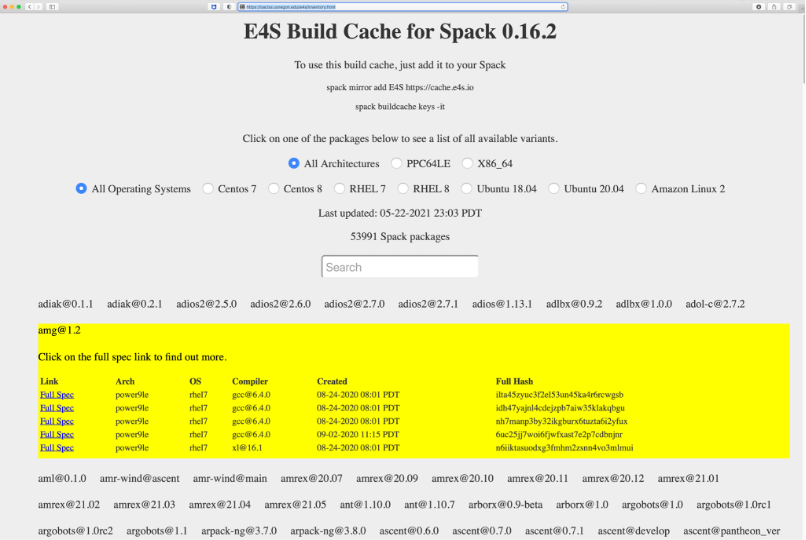
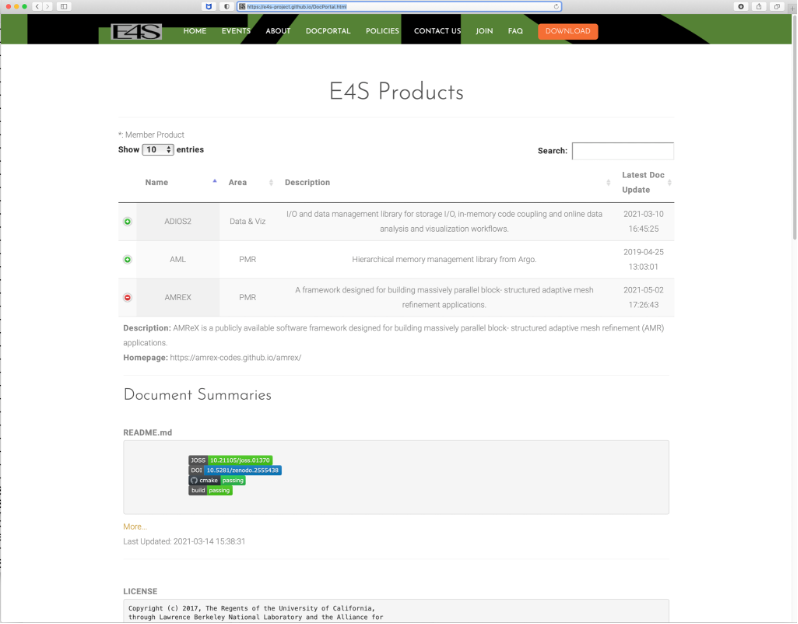
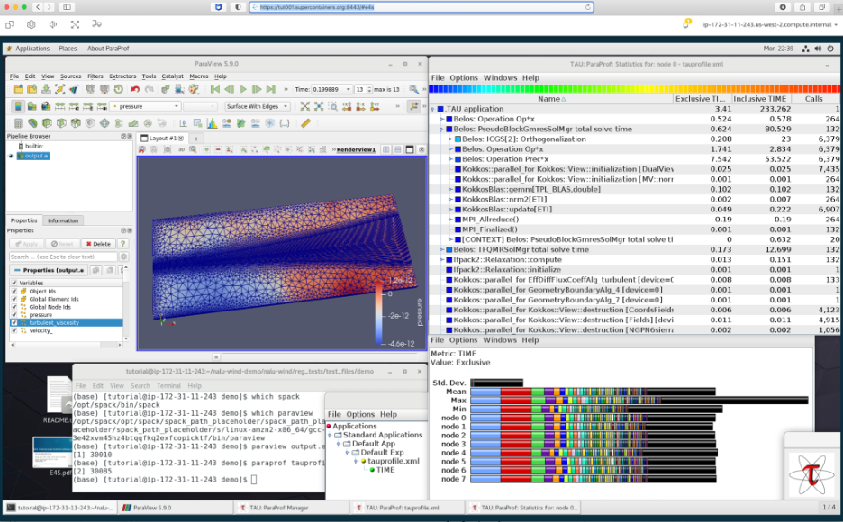

# E4S: Extreme-Scale Scientific Software Stack

**Hero Image:**

 - [Core-edge coupled turbulence simulation by the WDMApp fusion energy application project, which uses a variety of E4S software products.]
 

#### Contributed by: [Sameer Shende](https://github.com/sameershende), [Mike Heroux](https://github.com/maherou) and [James Willenbring](https://github.com/jwillenbring) 
#### Publication Date: June 29, 2021

Building and maintaining a variety of software packages can be a daunting task.  The Extreme-Scale Scientific Software Stack (E4S) project is working to alleviate some of the challenges faced by the users and developers of software technologies. 

### Introduction

Building applications by composing existing libraries and using existing tools can be a tremendous productivity improvement. If existing software is high-quality, accessible and reusable, you would be much better off using it than writing your own.  At the same time, as high-performance computing (HPC) and artificial intelligence/machine learning (AI/ML) software becomes more complex, it is getting harder to maintain, install, and optimize tools and libraries correctly in an integrated and interoperable software stack.  

The [Extreme-Scale Scientific Software Stack](https://e4s.io) (E4S) project aims to tame both the complexity and portability problems by creating an ecosystem of numerical libraries, runtime systems, and tools that lower the barrier for entry for the HPC and AI/ML developer communities. E4S is a community effort to provide open source software packages for developing, deploying, and running scientific applications on HPC platforms. E4S aims to deliver a modular, interoperable, and deployable software stack based on the [Spack](https://spack.io) package manager. E4S provides both source builds for native, bare-metal installations, as well as containers of a broad collection of software packages for secure, reproducible, container-based deployments. E4S exists to accelerate the development, deployment, and use of HPC software, lowering the barriers for HPC developers and users. 

### Motivation

With the growing complexity of hardware and software frameworks, it is getting harder to maintain and install a software stack to satisfy the growing demands of HPC and AI/ML application developers. Applications are being distributed in source form and typically need to be built using a complex set of third-party numerical libraries, runtime systems, and tools. These applications are typically tied down to a given platform and cannot migrate easily to other sites that may be running different versions of the underlying operating system, compilers, and runtime libraries.

A crisis point has been reached where supercomputing centers are employing teams of system professionals just to maintain and upgrade software packages, largely because the software dependencies for such applications typically run deep – down to the specific versions of the kernel, glibc library, and runtime communication library. Significant system resources are now being spent to maintain the dependency tree associated with each application. In many cases, applications use different versions of, or options for, certain components within the software stack, leaving the choice between facilities supporting many versions of some codes, or more often, computational scientists performing custom installations of some of their required software dependencies. As APIs evolve, incompatibilities arise; building and maintaining a consistent software stack is increasingly difficult for computational scientists. As the complexity of our software and hardware grows, it becomes difficult to reproduce many published scientific results, even for the original authors!

### Components of E4S

The E4S project, supported by the U.S. Department of Energy (DOE) through the [Exascale Computing Project](https://www.exascaleproject.org) (ECP), is an effort to build a complete software stack consisting of a broad set of packages that are commonly used by HPC and AI/ML developers. E4S builds upon Software Development Kits (SDKs), which are collections of related software products and packages where coordination across package teams improves usability and practices, while fostering community growth among teams that develop similar and complementary capabilities.

E4S itself is a curated release of ECP Software Technology (ST) products built using Spack. Spack is an open-source package manager geared towards simplified, reproducible builds of the otherwise complicated dependency chains common in HPC software; Spack provides the ability to leverage existing compilers and runtime system libraries for native software installations. E4S currently includes over 50 unique ST products, spanning programming models and runtimes, math libraries, compilers, and tools for performance evaluation, data management, and visualization. E4S supports GPUs from multiple vendors and includes their supporting runtime libraries such as CUDA and ROCm. E4S also provides a validation test suite that helps build, execute, and validate these products.

The workflow of launching applications using containers is simplified in E4S, leveraging performant, high-speed, inter-node networking using the system MPI libraries. To simplify interoperation between containers and host MPI libraries, E4S has developed techniques to substitute MPI libraries in the containerized applications with compatible MPI libraries at runtime during the launch of containers (Figure 1) with the [E4S-cl tool](https://github.com/e4S-Project/e4s-cl). This technique helps reproducibility and makes it practical to develop applications on a local environment (desktop/laptop) and then transfer the binary executable to a supercomputer, deploying it using a secure container runtime (such as Shifter or Singularity) while being able to leverage high-speed interconnects.

 

[Figure 1: E4S Container Launcher (e4s-cl) tool for launching MPI applications.]

 

E4S provides both a VirtualBox image with support for Docker, Singularity, Shifter, and Charliecloud HPC container runtimes, as well as an AWS image to deploy E4S on EC2 instances. E4S also supports performance portability using a binary build-cache of Spack-based packages to simplify the installation of dependencies for native, bare-metal installation of software. 

 

[Figure 2. The downstream E4S pipeline triggered by a Spack pull-request.]

 

Deploying complex software without testing can lead to reduced confidence in the reliability of the software. The E4S validation test suite is used in a sophisticated GitLab-based continuous integration (CI) system, as shown in Figure 2, which builds E4S packages on multiple platforms using container build pipelines. E4S is the first official “distribution” of Spack in which pull requests (PR) are automatically tested against how they affect E4S builds. The Spack project builds on AWS Cloud as part of Spack PR and release testing.  A [CI dashboard](https://cdash.spack.io) is available to monitor the progress. Efforts are underway to stand up E4S CI at DOE computing facilities (such as ALCF, OLCF, and NERSC) using their preferred compilers and runtime libraries.

 

[Figure 3: A searchable web-portal for users to discover pre-built E4S binaries in a Spack build cache.]

 

[Figure 4: E4S build cache hosted at U. Oregon hosts over 50,000 Spack binaries.]

 

Binary caches of E4S software are available to users of Spack and this enables users to quickly use common variants of E4S packages without having to build them locally from the source code. These packages are built as part of the CI process and are stored in publicly accessible build caches hosted on AWS S3 and the University of Oregon’s S3 servers. A web portal, which is modeled after the Homebrew Formulae page, has also been developed; the web portal allows potential users to discover what variants of E4S software exist in the build cache. 

An E4S DocPortal aggregates and summarizes documentation and metadata by raking E4S product repositories. This DocPortal, as shown in Figure 5, provides a single online location for accurate product descriptions of E4S products. 

E4S is available in the AWS cloud platform and provides a ready-to-deploy cloud-based AMI image with a Spack-based software stack with local build caches and HPC container runtimes, E4S-cl container launch tool (shown in Figure 1), and E4S containers. E4S includes the AWS DCV software for a remote desktop environment that simplifies the deployment of GUI tools such as ParaView and TAU, as shown in Figure 6. 

 

[Figure 5: E4S DocPortal is a single online location for accurate product descriptions. ]

 

[Figure 6: E4S AMI deployed in an AWS instance.]

### Summary

E4S is not a monolithic, take-it-or-leave-it software behemoth or a commercial product, or a simple packaging of existing DOE software. E4S is an extensible, open-architecture software ecosystem, accepting contributions from US and international teams; E4S also is a framework for collaborative open-source product integration. E4S provides a full collection of compatible software capabilities and a manifest of a-la-carte selectable software capabilities. It acts as a vehicle for delivering high-quality, reusable software products in collaboration with others and acts as a conduit for future leading-edge HPC software targeting scalable, next-generation computing systems. E4S is a hierarchical software framework to enhance (via SDKs) software interoperability and quality expectations.  ECP and other application teams are starting to leverage E4S to simplify the management of their dependencies, including the WDMApp fusion modeling team, illustrated in the image at the top of this article, and the ExaWind team that models wind energy systems, depicted in Figure 6.

### Author bios

Sameer Shende serves as a Research Associate Professor and the Director of the Performance Research Laboratory at the University of Oregon and the President and Director of ParaTools, Inc. (USA) and ParaTools, SAS (France). He serves as the Technical Lead of the [Extreme-scale Scientific Software Stack](https://e4s.io) (E4S), and the lead developer of the [TAU Performance System](http://tau.uoregon.edu), [Program Database Toolkit](https://www.cs.uoregon.edu/research/pdt/) (PDT), and the [HPC Linux](https://www.hpclinux.org) projects. His research interests include scientific software stacks, performance instrumentation, compiler optimizations, measurement, and analysis tools for HPC. He leads the SDK project for the Exascale Computing Project (ECP), in the Programming Models and Runtime (PMR) area. He received his B.Tech. in Electrical Engineering from IIT Bombay, and his M.S. and Ph.D. in Computer and Information Science from the University of Oregon.

Mike Heroux is a Senior Scientist at Sandia National Laboratories, Director of Software Technology for the US DOE Exascale Computing Project (ECP) and Scientist in Residence at St. John’s University, MN. His research interests include all aspects of scalable scientific and engineering software for new and emerging parallel computing architectures. He is the founder of the Trilinos scientific libraries, Kokkos performance portability, Mantevo miniapps and HPCG Benchmark projects, and is presently leading the Extreme-scale Scientific Software Stack (E4S) project in DOE, a curated collection of HPC software targeting leadership platforms.  He is also a founding member of the IDEAS and BSSw.io projects, with a strong interest in developer productivity and software sustainability. 

James Willenbring is a Senior Member of R&D Technical Staff in the Center for Computing Research at Sandia National Laboratories. He is the Trilinos Framework Product Leader, the PI of the ECP SDK project, and a member of the Interoperable Design of Extreme-scale Application Software (IDEAS) Project. In all of these roles, he is active in the research of software sustainability and the application of software engineering methodologies for high-performance computational science. James received a M.S. in Computer Science from St. Cloud State University and is currently a Ph.D. Candidate in the Software Engineering program at North Dakota State University.

<!---
Publish: yes
Pinned: no
Topics: testing, documentation, configuration and builds, release and deployment, projects and organizations, cloud computing
RSS update: 2021-06-29
--->
