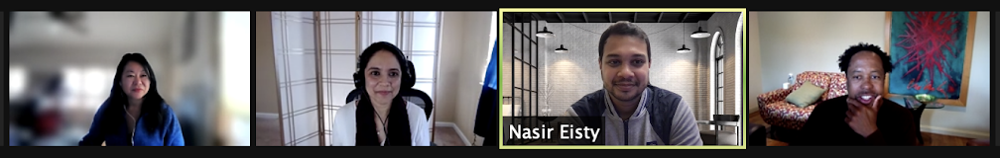
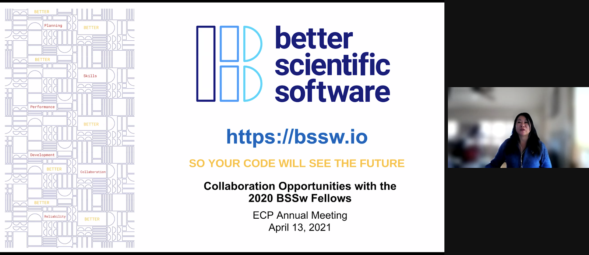

# 2020 BSSw Fellows: Projects and Perspectives

**Hero Image:**

[2020 BSSw Fellows at the 2021 ‘Virtual’ Exascale Computing Project Annual Meeting talking about their fellowship projects to make scientific software better.
]

#### Contributed by: [Hai Ah Nam](https://github.com/hnamLANL "Hai Ah Nam GitHub Profile"), [Damian Rouson](https://github.com/rouson "Damian Rouson GitHub Profile"), [Nasir Eisty](https://github.com/neisty "Nasir Eisty GitHub Profile"), [Cindy Rubio-Gonzalez](https://github.com/crubiog "Cindy Rubio-Gonzalez GitHub Profile")

#### Publication date: July 28, 2021

BSSw Fellowships provide resources and community support to those who foster and promote practices, processes, and tools to improve developer productivity and software sustainability of scientific codes.

The 2020 BSSw Fellows have used their skills to create tutorials, webinars, and tools to guide developers through various stages of the scientific software lifecycle. Here's more about what they have been up to.

### Advance practices for effective software testing, an essential activity to build error-free and trustworthy software.

BSSw Fellow Nasir Eisty developed a hands-on tutorial entitled “Automatic Testing in Scientific Software”. The tutorial contains background information on challenges, barriers, potential solutions, and unsolved problems faced while testing scientific software, along with hands-on exercises. This tutorial brings valuable practices to the scientific software community to help developers produce correct and reliable software.  Learn more at:

* [HPC Best Practices Webinar: Testing and Code Review Practices in Research Software Development](https://ideas-productivity.org/events/hpc-best-practices-webinars/#webinar044)
* [Testing Non-Deterministic Research Software](https://bssw.io/blog_posts/testing-non-deterministic-research-software)
* [Use of Software Metrics in Research Software](https://bssw.io/blog_posts/use-of-software-metrics-in-research-software)
* [Automatic Testing for Scientific Software Development, SIAM CSE21 Minisymposium: Better Scientific Software Fellowship](https://figshare.com/collections/SIAM_CSE21_Minisymposium_Better_Scientific_Software_Fellowship/5321426)

<!-- Photo to go here --> 
[Nasir](https://www.boisestate.edu/coen-cs/people/faculty/) is an Assistant Professor in the Computer Science Department at Boise State University. He was a BSSw Fellow while a graduate student in the Software Engineering research lab in the Department of Computer Science at the University of Alabama under the supervision of Dr. Jeffery Carver. His research focuses on the development of software engineering techniques and tools to improve the quality and maintainability of research software

#### *Perspectives on the BSSw Fellowship Program:*
The BSSw Fellowship program is a U.S. Department of Energy project focused on improving software engineering practices in scientific software. This fellowship provides the opportunities to interact with members of the ECP community in a way that would not be possible otherwise. It even helped me get an opportunity to work at [Los Alamos National Lab](https://bssw.io/blog_posts/testing-non-deterministic-research-software). Being a software engineering researcher for scientific software, I was very excited to receive this award in recognition of incorporating software quality activities into the scientific software development community.  I was in the academic job market in the past couple of years and I had numerous interactions with people asking me about the BSSw fellowship program. People were excited about it. The BSSw fellowship program definitely helped me in my research and collaboration in different ways and gave me recognition. I would like to keep contributing to the community and make positive impacts by bringing valuable software engineering practices to the scientific software development lifecycle.

#### *Advice for new (prospective) BSSw Fellows:*
Try to understand the goal and the bigger picture of the BSSw Fellowship program. Do not wait to interact with the community if you see an opportunity to collaborate and contribute. When you apply, make sure to emphasize the positive impacts you would bring through the activity you are proposing. 

__________________________________________________________________

### Teach approaches for agile scientific software development, with emphasis on outreach to underrepresented groups.

BSSw Fellow Damian Rouson developed and taught agile scientific software development tutorials in settings that reach underrepresented groups. The only prerequisites were familiarity with a Linux shell and a text editor. A related, novel aspect of the tutorials are the integration of a professional development activity using agile practices. Learn more at:

* [Increasing Productivity by Broadening Participation in Scientific Software Communities](https://bssw.io/blog_posts/increasing-productivity-by-broadening-participation-in-scientific-software-communities)
* [Remote Work Panel Series: How Does Remote Work Impact Creativity and Innovation?](https://ideas-productivity.org/events/strategies-for-working-remotely-panels/#panel008)
* [Introducing Agile Software Development to Underrepresented Groups, SIAM CSE21 Minisymposium: Better Scientific Software Fellowship](https://figshare.com/collections/SIAM_CSE21_Minisymposium_Better_Scientific_Software_Fellowship/5321426)

<!-- Photo to go here -->
[Damian](https://crd.lbl.gov/departments/computer-science/class/members/group-lead/damian-rouson/) is the group leader of the Computational Research Division’s (CRD) Computer Languages & Systems Software group at Berkeley Lab.  His fellowship work was conducted when he was a research engineer and member of the Advisory Board of [Sustainable Horizons Institute](https://shinstitute.org/). He has extensive experience in software design and development for multiphysics modeling, including classical, quantum, and magnetohydrodynamic turbulence and multiphase flow. Damian also is the founder and president of the [Sourcery Institute](http://www.sourceryinstitute.org/).

#### *Perspectives on the BSSw Fellowship Program:*
The BSSw Fellowship provided the opportunity for me to expand my thinking about teaching software engineering in a way that reaches a much broader audience.  My teaching activities in the decade prior to the fellowship focused almost exclusively on teaching software engineering in modern Fortran, a language that remains widely used in high-performance computing in fields that embraced computing early. Through the fellowship, I developed strategies for teaching agile software development without the software development: my collaborators Dr. Mary Ann Leung and Brad Richardson substituted Markdown/LaTeX document generation for software development.  This enabled us to attract participants across computational science and engineering disciplines without requiring a background in any specific programming language.  As one aim of the fellowship, we taught courses in settings with a large representation of people from otherwise underrepresented demographics in computational science and engineering.  Coming full circle, the fellowship also benefited my primary audience: Brad and I have now used the materials developed under the fellowship in a course taught for computational scientists and engineers who use modern Fortran.  As a fortunate follow-on to this work, [Mary Ann](https://bssw.io/fellows/mary-ann-leung) has now won a BSSw fellowship for the current year.

#### *Advice for new (prospective) BSSw Fellows:*
I encourage you to see the fellowship as an exciting opportunity to move in a new direction.  Try something that stretches your wings and brings you into new territory that might be difficult to explore under other funding.  Also, look for ways to collaborate with people who are new to your network and engage audiences that might traditionally have less access to the cutting-edge work you’re proposing.

__________________________________________________________________

### Improve the correctness of numerical software and the effective use of mixed floating-point precision for better performance.

BSSw Fellow Cindy Rubio-Gonzalez organized events and developed educational materials on the correctness of numerical software and improving performance through effective use of mixed floating-point precision. Her materials include the use and evaluation of program-analysis techniques to improve the reliability and performance of numerical software.  Learn more at:

* [HPC Best Practices Webinar: Scalable Precision Tuning of Numerical Software](https://ideas-productivity.org/events/hpc-best-practices-webinars/#webinar045) 
* [Improving the Reliability and Performance of Numerical Software, SIAM CSE21 Minisymposium: Better Scientific Software Fellowship](https://figshare.com/collections/SIAM_CSE21_Minisymposium_Better_Scientific_Software_Fellowship/5321426)

<!-- Photo to go here -->
[Cindy](https://web.cs.ucdavis.edu/~rubio/) is an Associate Professor of Computer Science at the University of California, Davis. Her research spans the areas of Programming Languages, Software Engineering and High-Performance Computing, with a focus on program analysis for automated bug finding and program optimization. She is particularly interested in the reliability and performance of systems software and scientific applications. Cindy is a recipient of a DOE Early Career Award 2019 and an NSF CAREER Award 2018.

#### *Perspectives on the BSSw Fellowship Program:*
One of my goals is to develop program-analysis and testing tools to improve the reliability and performance of scientific software. As part of this year’s BSSw Fellowship program, I focused on disseminating techniques for automated mixed-precision tuning and software testing of numerical software. In particular, I focused on developing materials that can be used in the classroom, or as separate educational modules for those interested in learning about existing efforts in the topics of precision tuning and software testing. The project is ongoing, and I hope that as we return to in-person activities, we present these materials to a broader audience and continue to improve them. Being a BSSw Fellow has been an invaluable experience. First, the BSSw program puts emphasis on building a diverse community that encompases all aspects of scientific software. I found this to be a very unique opportunity to connect, share and learn from others for whom my work can make a difference. Second, all BSSw Fellows and mentors are passionate about building better scientific software. I am honored to belong to this group, which has empowered me to continue my work on improving software reliability and performance. Finally, my project’s goal has allowed me, and will continue to let me teach others about tools that can have an impact on writing better scientific software, and also teach me about the real-world requirements such applications pose to analysis tools.

#### *Advice for new (prospective) BSSw Fellows:*
One of the strengths of the BSSw Fellowship Program is providing the opportunity to strengthen your professional network. Unfortunately, because of the pandemic, there were not as many opportunities to meet in person and make visits this past year. However, I strongly recommend future BSSw Fellows to make as many connections and connect in person, if possible!

<!---
Publish: preview
Pinned: no
Topics: Projects and organizations
RSS update: 2021-28-07
--->
