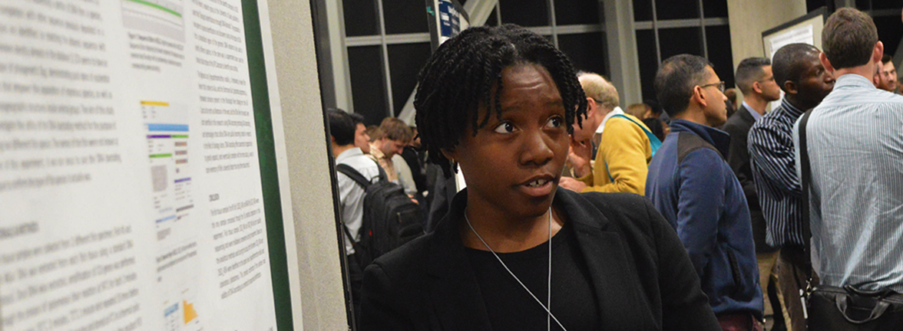

# Effectively Integrating Interns into Research Teams

**Hero Image:**

 - [Kayla Tippins, a student at Jarvis Christian College, presents the results of her research at the SIAM CSE19 Conference as part of the Broader Engagement Program led by Sustainable Horizons Institute.] 

#### Contributed by Jay Lofstead 

#### Publication date: August 4, 2021

It is an oft spoken rule that students are the backbone of research efforts. Much of the work students do is tied to extensive development and testing, which is critical for projects to make effective progress. By using some proven techniques to find and motivate students, then incorporate them into the team, the impacts they bring can become supercharged.

## Managing students
Finding effective ways to attract students and coach them toward productivity requires flexibility. A hands off approach may be appealing for a mentor's time management, but it may backfire. Instead, consider some guidelines about how to best engage with students of different levels. No matter if the student is an undergraduate or a graduate student, a few techniques can make finding and managing students both easier and more effective.

### Recruiting students
Finding students requires carefully crafting a description of the job and its specific responsibilities. The description needs to be intriguing as well as seemingly achievable. Writing these descriptions as a person long past their undergraduate days is a difficult task. Find students at the target level and have them review your posting to see what feedback they give. It may be surprising how many, “What does this mean?” and, “I don't know what to expect with this” sorts of responses you may receive; being clear and concise is key.

### Motivating students
College students, with rare exceptions, are motivated for delayed gratification and have strong skills in effort/reward trade-off evaluation. As part of an internship, particularly if a job after graduation might be possible, the students see the short-term extreme effort as worth the potential long-term position at a job they will love. Revealing to the student what that job will really be like is not always a consideration. Beyond the promise of a job, other motivators for students include the satisfaction of learning new skills, contributing to a collaborative project, and summarizing achievements in a presentation or publication.    
<!--- A mention of at least one "other thing" or examples would be best here. Otherwise, it seems like an incomplete thought. --->

### Empowering students
Few students before late in their PhD studies gain much authority over what decisions are made and control over what is done. One proven terrifying, but exhilarating, approach is to empower the student with full ''control'' over the project direction. As long as the decision is not known to be a poor approach, let the student pursue the direction. It may not be what the mentor would have done, but it may prove to reveal new insights previously not considered.

### Active mentoring
Daily short meetings are crucial to keeping track of what is going on and what problems are occurring. The Scrum idea of a stand-up meeting to keep things short is the right base idea. However, to make this effective, the meeting time may vary from 5 minutes to 5 hours, depending on the need. For example, if the student is heads down hacking code making good progress, do not interrupt the work to see where they are. Few things are bigger productivity killers than taking someone out of ''the zone'' to do some other activity. This also lets a mentor give the student a full day to work through a problem before stepping in to help.

## Incorporating project elements
Finding and implementing effective ways to incorporate a student, particularly using techniques like those described above, are essential to a successful project.

### Reproducibility frameworks
While reproducibility is a growing concern, frameworks such as the [Popper Convention](https://ieeexplore.ieee.org/document/7965226) can be used to accelerate the incorporation of a new student's work, as well as offer reproducibility features necessary for many research paper submissions. If the project is not already incorporating these kinds of features, it is an ideal time for someone to develop the integration. The student can learn how to build and manage the project, leaving the project in better shape once the task is complete.

### Version control for everything
Version control systems long used for source code management have been used for many other artifacts in recent years. The ability to isolate changes and rollback changes to a known “good” point are key features in making these tools generally useful, rather than just source code management systems. If it exists, it should be in version control, and students can always assist with this aspect of the project.

### Assign meaningful tasks
If it is absolutely necessary to assign less meaningful tasks, offer a “when you get this task we REALLY need done, we want you to work on X” carrot. Students will understand the need to get through a tedious task and will work hard to get it done quickly and efficiently in order to get to the more interesting work. Remember that students want to have impact.

### Make students full team members
Regular project meetings happen and students may or may not be requested to attend. It is a great practice to have students attend, if possible, in order to make them feel truly part of the team. Further, as the meeting leader, make a point of soliciting input from the student based on what they have done and seen. It may be minor and they may not be comfortable sharing, but seeing their opinions and knowledge being considered is a big confidence booster. That sort of boost increases motivation and productivity.

## Discussion
The goal of the efforts described in this article is to make interns more productive parts of a team and to increase the value of their participation. All of the recommendations are the product of my years of experience in mentoring student interns in numerous contexts and projects. As team members, students make vital contributions to research projects, and positioning them for success benefits everyone involved. I have found that these strategies can yield happy, productive students with solid, lasting project impacts. As a researcher, every student I have ever supported has managed to develop sufficiently enough to generate a peer reviewed publication at an external venue based on their internship work. They have also left a code base, scripted tools, and full documentation about everything they did, enabling me to build on their work for future projects. This includes four undergraduates students and six graduate student thus far.

## Acknowledgments
This blog post was inspired by the author's participation in an online panel discussion: [*Strategies for Working Remotely: I Finally Have the Internship I Always Wanted, Now What?*](https://www.exascaleproject.org/event/strategies-for-working-remotely-panel-series-june)  The original idea for this article was first presented as a white paper at the [2021 Collegeville Workshop on Scientific Software (CW21)](https://collegeville.github.io/CW21) before being revised for this blog post.
  
The image above was taken at the SIAM CSE19 Conference as part of the [Broader Engagement Program](https://shinstitute.org/siam-cse19-be-program) led by the Sustainable Horizons Institute. 

## Author bio
Jay Lofstead is a Principal Member of Technical Staff in the Scalable System Software department of the Center for Computing Research at Sandia National Laboratories in Albuquerque, NM. His work focuses on infrastructure to support all varieties of simulation, scientific, and engineering workflows with a strong emphasis on IO, middleware, storage, transactions, operating system features to support workflows, containers, software engineering and reproducibility. He is co-founder of the IO-500 storage list. He also works extensively to support various student mentoring and diversity programs at several venues each year, including outreach to both high school and college students. Jay graduated with a BS, MS, and PhD in Computer Science from Georgia Institute of Technology and was a recipient of a 2013 R&D 100 award for his work on the ADIOS IO library.
  
<!--
### Acknowledgment
Sandia National Laboratories is a multimission laboratory managed and operated by National Technology and Engineering Solutions of Sandia, LLC, a wholly owned subsidiary of Honeywell International, Inc., for the U.S. Department of Energy's National Nuclear Security Administration under contract DE-NA0003525.
-->

<!--
Publish: yes
Track: deep dive
Pinned: no
Topics: Strategies for more effective teams
RSS update: 2021-08-04
--->
