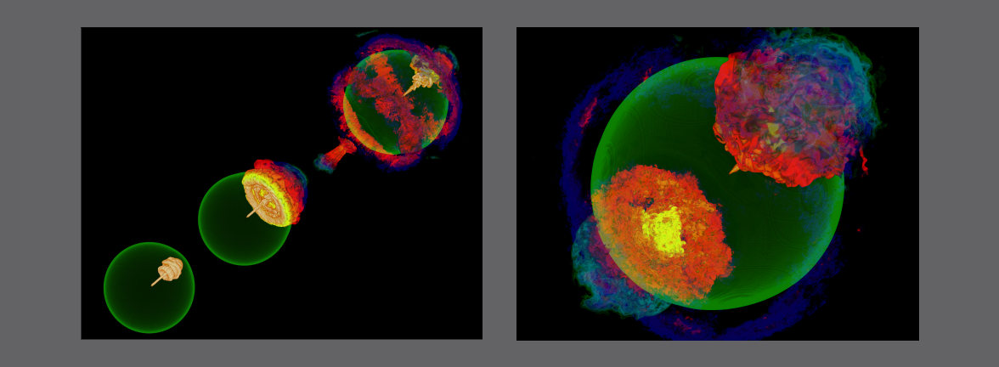

# HPC and the Lab Manager

**Hero Image:**

 - [Flash Center Simulations of Type Ia Detonation.]

#### Contributed by: [Carlo Graziani](https://github.com/CarloGraziani)
#### Publication date: November 17, 2021

### Introduction: What's this about?

Although it seems to us in 2021 as though scientific high-performance computing (HPC) has been around for a while, it's actually a fairly young field. As a matter of fact, it's several young fields&mdash;computational astrophysics, computational chemistry, computational genomics, high-performance machine-learning, uncertainty quantification, and many more. These fields, on close examination, have not really stabilized or optimized their collaborative processes in a manner analogous to that of more mature, "classical" sciences. As a consequence, valuable science is often needlessly lost, or left uncollected. I believe that this situation is likely to change as these fields grow up, and assimilate or adapt management practices characteristic of mature collaborative sciences. In particular, a new key role is likely to be formalized in HPC collaborations, analogous to the lab manager of chemistry labs. In this essay I will refer to this role as the *operations manager*.

I describe below some observations of these matters, harvested from a 15-year personal journey through HPC, and matured through reflections, discussions, and (as some of my long-suffering friends are aware) occasional rants. As I wrote this, I became aware that in some sense I was emulating a model that I admire in Eric Raymond's essay, *[The Cathedral and The Bazaar](http://www.catb.org/~esr/writings/cathedral-bazaar/)*.  The essay brilliantly explained the open source community to itself through a mixture of personal narrative, technical explanation, and meditation. My own chosen scope is certainly narrower than Raymond's, and I have no hope of matching his style, but I do think that I've noticed some unexamined traits of scientific HPC that are overdue for some kind of analysis. A *Cathedral*-style essay is not a bad model for such a project.  The result is probably long enough to trigger the TL;DR reflex of some of this blog's readership, for which I apologize in advance. For the rest of you, I will try to keep things as breezy and readable as I can.  

### Birth pangs of scientific HPC

The late 1990s were the early days of open-science HPC,[1] when application scientists piled into the new field, eager to run their codes on the amazing new machines that were appearing on compute center floors. As a cohort, this was a very computationally-literate group of people. Many of them had trained themselves since graduate school not only in the arcana of nuclear astrophysics or gauge field theory, but also on SIMD programming, MPI, and cache management (and earlier on vectorization, RISC, and other transient fashions of go-fast computing). They brought with them codes that they had been developing since their graduate school days. Many of these codes would be regarded as cringe-worthy by professional computer scientists&mdash;some were flagrantly transliterated Fortran IV; many contained illegible, unmaintainable, uncommunicable algorithms, and there was an obvious self-taught character to much of it. But it worked, gave journal-grade scientific results, and ran fast. Who needed pretty?  

As larger, more complex, more expensive-to-run machines appeared by the early 2000's, it began to become apparent that amateur hour was ending. As time went on, deeper, increasingly specialized technical knowledge of machine architectures, interconnect topologies, memory hierarchies, programming models, and so on were becoming essential to making codes run efficiently. This kind of expertise was now beginning to move beyond what a gifted amateur could pick up in addition to domain-specific training in physics, or chemistry, or what have you. Given the level of national-level investment (in the US, and elsewhere) represented by these machines, it was becoming clear that it would soon be (and probably already was) *irresponsible* to allow hand-rolled code to run on so-called "leadership-class" machines. As part of their peer review process for supercomputer time allocation, open-science HPC programs such as the US Department of Energy's Office of Advanced Scientific Computing Research (DOE/ASCR) *INCITE* program introduced stringent code performance criteria *separate* from the scientific merit criteria by which proposals were weighed.

In this environment, collaborative teams of application scientists and computer scientists, as well as recently hybridized additions to the lab-coated bestiary&mdash;*computational scientists*&mdash;necessarily came together, contributing their specialized expertise to the new enterprise. And this created a new problem: how were these skillsets to be merged? What was the right team model to bring about the goal that all agreed on&mdash;maximum yield of scientific knowledge from the new HPC tools?  

### The Flash Center

I joined the University of Chicago [Flash Center](https://iopscience.iop.org/article/10.1086/317361) in 2007, just as the Center was embarking on a period of remarkable astrophysical discovery. The Flash Center had been created as part of DOE's Accelerated Strategic Computing Initiative's (ASCI's) Academic Strategic Alliance Program (ASAP) in 1997. The main goal was to spin up new types of academic computational science collaborations, which were better suited to address the challenges of science at HPC scales than scientists working in modes organized along traditional academic research group lines.

From my direct observations of the group that had gelled at the Flash Center by the time I got there, the program had succeeded, probably beyond the wildest dreams of the writers (and readers) of the original center proposal. The Center's flagship product was the FLASH code, a finite volume-based hydrodynamic simulation framework that could be put together flexibly to construct many different kinds of compressible gas dynamic simulations. The Center's flagship *output* consisted of scientific research papers and reports, specifically on topics in high-energy astrophysics: initially X-ray bursts (the result of stupendous columns of matter crashing down onto neutron stars); later, Type Ia supernovae (SNIa, white dwarf stars undergoing thermonuclear runaway explosions).  

The very considerable credibility of Center's science studies depended critically on the FLASH code's power, flexibility, correctness, physical realism, maintainability, extensibility, scalability (from laptops to supercomputers), and portability (from one supercomputer to another, and, critically, across upgrades of supercomputer generations). None of these things individually is simple to accomplish. Accomplishing *all* of them was a very considerable feat.[2] Very clearly, something amazing was happening in this unusual place.  

I joined the Center after working in high-energy astrophysics on a NASA space astrophysics mission. I was therefore somewhat accustomed to working in scientific collaborations. But, the nature and pace of the collaboration inside the FLASH center was very different from anything that I had experienced before. The team was composed of physicists, astrophysicists, applied math people, code people, about 20 in all, in separate groups. All team members had their specialties, but all had basic literacy in every part of the project: not only did our astrophysicists understand the nuances of memory management, but our coders knew why it was physically important to get the turbulent nuclear flame speed right, and the applied math folks could install memory in compute clusters without electrocuting themselves. Most important was a shared goal: getting and publishing valid science. Possibly the most important "secret" of the FLASH code's success was that the Flash Center "ate its own dog food"&mdash;we didn't just write a code for others to use, we made sure we could use it ourselves.

### Simulation campaigns

The Center was in the process of running heroic-sized (for the time) 3-dimensional simulations of burning white dwarfs, to validate a clever new model for how SNIa explode. The simulations were running on *Unclassified Purple* (*Up*), a big machine at Lawrence Livermore National Lab (LLNL). Each day, the entire team would get together in a large conference room to review results, discuss the health of running simulations, and whether parameter or code changes might be necessary at the next restart.

It was interesting and exciting, but there was one aspect that was beginning to seem a bit troubling to me. There were a *lot* of parameter changes and code changes that happened during that simulation campaign. There is a lot of physics going on in an SNIa, at a lot of different scales, represented by many different code modules, and many of those modules were getting stress-tested in ways not envisioned when they were originally written. And many of the things we thought we wanted to do at the beginning, we decided were not such a great idea in practice (or at any rate we saw great opportunities for improvement...). All this while *Up* was burning core-hours. Sometimes, it felt like in-flight aircraft repair.  Compared to my previous experience with data management and code pipelines on an astrophysics mission, there seemed to be a lot of ad-hoc arrangements.  It wasn't even clear where, in the maze of giant filesystems, the different types of output data were being warehoused. The person running the simulations knew, but if anything happened to him, locating them would have required an extended filesystem spelunking expedition, and figuring out which file meant what would have taken a major cryptanalytic operation.

In the event, all went well. The campaign was a success, and led to the first of a sequence of peer-reviewed journal articles [3] on a new family of "how to blow up a star for fun and profit"-type models, not worth belaboring here. Pretty soon, I was pressed into service running a simulation campaign on *Seaborg*, a respectable-sized supercomputer at Lawrence Berkeley Lab's NERSC. The nervousness that I had experienced while witnessing the *Up* campaign led me to take a couple of weeks to first construct a set of Bash scripts that allowed me to audit my stuff: to keep track of code versions and local changes that were actually run using the version control system (Subversion), to keep a written record of why a new start and its subsequent chain of restarts had come into being (what was I testing?), to automatically find the right previous checkpoint to restart from, to keep track of logs correctly, to keep track of simulation health plots, to keep track of the stupefying amount of data that had be archived, to keep related things (such as input files, logs, plots, and analyses corresponding to the exploration of a single scientific question) together where I could find them and interpret them quickly and easily.  

I was pretty proud of myself: I had re-invented the lab notebook!  

### Lab notebooks and lab managers (or, how not to get yourself fired from most scientific labs)

Lab notebooks are a pretty ancient and standard practice in science. Individual scientists have been using them forever to record their findings (Leonardo Da Vinci's are a famous example). Laboratory collaborations *insist* on proper lab notebooks, drilling fledgling scientists from their earliest days in graduate school on recording procedures as a key part of their professional preparation.  The standard is pretty exacting: in *Writing the Laboratory Notebook*, Howard Kanare states that the quality criterion for a recorded note in a lab notebook is "...to write with enough detail and clarity that another scientist could pick up the notebook at some time in the future, repeat the work based on the written descriptions, and make the same observations that were originally recorded. If this guideline is followed, even the original author will be able to understand the notes when looking back on them after considerable time has passed!"[4]  

A lab bench worker can literally be fired on the spot for mishandling lab notebook records. Indeed, most labs over a certain size hire a personage by the title of *lab manager*, who enforces lab notebook protocols, among other duties. That is, there is *management structure for enforcement of the protocols*, which signals how seriously the protocols are taken by lab management. There are several reasons for this seriousness, such as the establishment of scientific priority (particularly where patent rights might be at stake) and the prevention (or at least detection) of scientific misconduct. However, the reason that is of paramount concern here is what I like to call the "hit-by-a-bus" problem: If a lab scientist is hit by a bus, is that person's effort lost? Less facetiously, every lab makes very large investments in the time and effort of every lab scientist. It is perfectly reasonable to expect that when a scientist leaves for another job (even sitting comfortably in a bus, rather than under it), there should be left behind a valid record of the output of that investment, so that a successor can pick up where she or he left off.  That's precisely what Kanare's guideline is intended to accomplish.  Moreover, the second part of Kanare's observation ("...even the original author...") is very much on the mark for those of you who, like me, often feel like early-onset Alzheimer's sufferers who cannot remember by Tuesday what you were thinking or doing last Friday.

Even in non-lab-bench sciences, such as astronomy, an analogous management structure is now standard. On the space astrophysics mission that I used to be part of, there was a guy named Geoff. Geoff had several jobs (we all did, it was a bit of a shoestring operation), but one of them was as a sort of operations manager. He would set up disk space, filesystems, software, pipelines, and documentation. He would also tell us how he expected us to write our code, where he expected us to place different kinds of output, where data would show up, various standards and technical expectations, and so on. Geoff was smart and funny, but, not to put too fine a point on it, he could also be a major pain if you started crossing his lines. After a while, though, you started to realize that you didn't *want* to cross his lines, that it was *stupid* to try to do so, because everything in the collaboration was just easier if you did everything the way he told you to, and it was easy to make a mess if you didn't. So we stayed inside his lines, and those lines were an important reason for the success of the mission.  He was our equivalent of a lab manager, even though he wasn't called that.  Large ground-based astronomy operations have comparable roles. I've spoken to colleagues in the *Sloan Digital Sky Survey* and the *Dark Energy Survey*. Both of those had a "Data Czar", a "Thou Shalt" person, who made technical choices for everyone.  Obviously, it is a good idea to choose such a person very carefully.  

### Wheel re-inventors

My *Seaborg* campaign was pretty successful, and led to further scientific exploration of the Center's SNIa explosion model. At the same time I got my scripts included and distributed with the FLASH code as part of the code tools. But when I started talking them up, I made a discovery that should have been entirely unsurprising: my self-auditing system was hardly novel at all. In fact, almost every young-ish computational scientist that I talked to who had ridden herd on a simulation campaign had come up with some kind of analogous system. Features differed, data organization was all *sui generis*, but by-and-large, everybody was solving the same problem. It was part II of Kanare's observation: you want to be able to figure out what you did a few weeks or months later, when you had no hope of retrieving it from wetware memory.  It drove lots of people to improvise computational science lab notebooks.  Mine must have been the dozenth (or more) re-invention of the same wheel by an exasperated simulation swineherd trying to keep tabs on his burgeoning flock. This was more than a little annoying to me.  Why was it that I had had to program my own notebook then? If this wheel keeps getting re-invented in all kinds of shapes, why didn't the best one get rolled out and deployed as a tool, so that we could stop wasting effort on amateur-hour tool design, and just get on with our work?  

After some reflection, I came to realize that I was really looking at the problem from the wrong end. It was not a tool problem at all: it was a management issue. Looking back for inspiration on my space astronomy days, I could see that the issue was that the Flash center didn't have a Geoff-figure to make inspired choices of standards, tools, and expectations, and to brandish a big, menacing paddle at anyone who crossed his lines. It was the *first* part of Kanare's guideline that was missing from the "underground lab notebooks" of computational science: those hand-rolled notebooks were being used to remind scientists of what they did last Friday, but not to inform *other* scientists of what they did at all! These early notebooks were not collaboration tools. They couldn't be, really: lab notebooks don't work as collaboration-enabling tools in the absence of appropriate management relations. *You need a lab manager to enforce lab notebook culture*.  

Now, I thought, *here* was a deep insight, *here* was a contribution that I could make to the efficient running of the Center, and to the advancement of computational science as a collaborative enterprise! We'd overlooked a basic management relation that all large-scale collaborative sciences of any maturity are essentially forced to adopt! I could see that the problem was the newness of computational science as a field, and the consequent fact that it was staffed by a lot of people who were still computing the way they'd been computing when they were beavering away alone at their PhD theses. Unsurprisingly, some old, unhelpful habits of mind were still ingrained. No problem, I thought. As soon as I point out how all these other, older fields do it, we'll just change our ways!  Proudly, and full of a hilarious naivet&eacute;, I went to tell my Center Director that what the Center needed was a Geoff.  

OK, so you probably can guess how that conversation went. Computational science groups are not, if you bother to look around, notably staffed with lab managers, operations directors, data czars, or any comparable role to this day. The Flash Center didn't get one either. I met with real incomprehension. I couldn't seem to communicate what seemed obvious to me&mdash;the Director listened, but told me that to get the sort of common collaborative computing standards that I told him we were missing would require "buy-in" from Center personnel.  I was appalled&mdash;this sounded absurd to me, like saying that chemistry labs need to get "buy-in" from bench scientists to keep proper lab notebooks. Of *course* you don't need buy-in: you have a key management objective&mdash;don't lose science&mdash;so you set *expectations* about appropriate procedure and you *require* that those expectations be met.  

Nonetheless, in the end, all I achieved from that conversation was that the Center began development of yet another lab notebook, designed specifically for collaboration, which took a year to develop, was pretty nice, was used by us for a couple of years, and eventually was abandoned and forgotten. I don't even know where that code is anymore.  It was just another re-designed wheel, and, to my certain knowledge, not the last.  

And, so far as I'm aware, the "lab manager" view of HPC collaboration has not really taken root, so that you'd notice, in any corner of the computational science enterprise.  As a consequence of which, I am morally certain that as a community we still leak and/or lose science on a regular basis, as collections of files lose meaning when postdocs leave for new positions, or records of code modifications attending particular simulations are never made, or records of where a particular set of critical files have taken up residence are as unlocatable as the files themselves, and so on. There is no end to the possible failure modes that one can dream up, if one has that sort of cast of mind.  

Alternatively, one can imagine that things are about to get better.  

### Maturity of scientific HPC: Enter the operations manager

OK, so let me try and draw together a few conclusions that I think I can distill from the above narrative.  

Something new and interesting started happening to all kinds of science when scientists began doing their modeling on computers, and that new thing became almost magically transformative with the advent of the monstrously powerful HPC platforms that became available to academic scientists beginning in the late 1990s.  To academic science, a cost attended this benefit: to accelerate a field of science by hitching it to HPC, it eventually became essential to create large, tightly integrated collaborative teams including domain specialists, applied mathematicians, and computer scientists, working together.  In this environment, the classical small academic research groups were essentially unviable.  This created a management issue: how are such large, heterogeneous teams to be organized, so as to maximize scientific output?   

Well, many mature scientific fields have long experience in large interdisciplinary collaborative enterprises. And a key institution of long-standing in such fields is the imposition of record-keeping discipline through a combination of graduate training, shared culture, and *very* definite expectations set by laboratory management. The visible manifestation of that discipline is the lab notebook. It's a cultural totem that just keeps getting called into being, decade after decade, in scientific field after field.[5] Formats and media may change, but it's recognizably the same thing: an intelligible live communication between scientists in a collaboration.  The key thing to recognize, however, is that the notebook is just the output of a *management process*. It is the process that is essential. That's how all these mature scientific fields learned to succeed: by protecting their precious investments in their scientists' time and effort.  

What might a "mature" computational science center look like? I think the ASCI-created centers, including the Flash Center, clearly got a lot of things right: the crosscutting skill mix, the collegiality, the mutual education and co-literacy in each other's fields, the intensive collaboration. All of these factors were important to the success of the centers, and are common features of organization models to this day. In addition, however, a mature computational science center would feature a new management role. Call that person the "Operations Manager," or OM, because "lab manager" sounds weird for a computational science center, even though the role is recognizably the same as the wet-lab role. They are basically Geoff, updated and adapted from astronomy to computational science.

The Ops Manager's charge is to safeguard the scientific mission of the center by protecting its scientific output from being lost. The OM has budget, staff, and authority as required to carry out any duties required by this charge. The OM sets up collaboration modalities, chooses tools (including any lab notebook equivalents), and writes documentation. The OM also often attends meetings of the various working groups, and is literate in all aspects of the center's activities. The OM talks to everyone, formally and informally, and is alive to potential problems, as well as to opportunities to streamline operations and make collaborations easier. The OM is skilled at choosing solutions that solve problems, rather than hunting for problems that fit favored solutions. The OM sets expectations for how the technical staff deal with computations and analyses, and has authority to enforce those expectations. These expectations are no more burdensome than lab notebook protocols in chemistry labs: a properly-chosen OM performs their duties out in such a way that the staff actually find it *easier* to work according to the OM-chosen rules than not to do so. Obviously, it is well-worth a Center Director's time to choose the OM very carefully, and hang on to a good one at any cost. A good OM is a defining feature of a research center in a mature field of computational science, so much so that proposal budgets for such centers are *required* to specify the OM role as a personnel line item, and to specify funds for OM operations commensurate with the duties of that role.

So I guess the question that I've raised in this essay is: "Is scientific HPC a mature field yet?" Well, scientific HPC is about 25 years old, at least dating from the ASC Alliance program, and that's about enough time to make a grown-up.  Most of the first generation of seniors, together with their <s>bad management</s> imperfect habits should have retired by now, and it's been long enough that I'm guessing plenty of younger people have been noticing how much could be gained by raising our game at the management level. We can't count on Moore's law to make up in new, faster simulations for the mislaid, corrupted, or uninterpretable data from older ones, and that fact should be giving night sweats to quite a few people who write proposals for supercomputer time allocations. So, I actually think I'm going to meet Geoff again quite soon. I still owe him a beer from the time I...um, well, that's a long story, and come to think of it he probably never realized it was me...  

### Author bio

Carlo Graziani is a computational scientist at Argonne National Laboratory. He started out as an astrophysicist and still dabbles in the stuff, as well as in FLASH simulations, but he mostly works on machine learning and uncertainty quantification (defined as "statistics funded by the US Department of Energy"), in applications that range from weather forecasting to plasma physics to COVID-19 modeling.

[1-sfer-ezikiw]: # "The beginnings of open-science HPC as a sustained activity&mdash;as distinct from classified science HPC conducted at US DOE national labs&mdash;can probably be dated to DOE's ASC Alliance program in the late 1990s."
[2-sfer-ezikiw]: # "*Continuing to accomplish them for 25 years*&mdash;the FLASH code is a workhorse of computational fluid dynamics with an enormous user community to this day&mdash;well, that takes us beyond the narrative in this essay, but phrases such as "tour de force" strike me as too weak to suit the case."
[3-sfer-ezikiw]: # "The coin of the realm."
[4-sfer-ezikiw]: # "Howard M. Kanare, *Writing the Laboratory Notebook* (American Chemical Society, Washington, D.C., ISBN-0-8412-0933-2), 1985. <https://files.eric.ed.gov/fulltext/ED344734.pdf>"
[5-sfer-ezikiw]: # "If&mdash;ok, fine, when&mdash;the field of social psychology succeeds in dragging itself out of the [Reproducibility Crisis](https://www.wired.com/story/social-science-reproducibility/), I wouldn't be at all surprised if it turned out that a large part of the credit will be given to the invention, by a few scientists of vision, of their own peculiarly-adapted version of the lab notebook, and of the specialized management processes that produce it."

<!---
Publish: yes
Track: deep dive
Topics: Strategies for more effective teams, Reproducibility
--->
<!-- DO NOT EDIT BELOW HERE. THIS IS ALL AUTO-GENERATED (sfer-ezikiw) -->
[1]: #sfer-ezikiw-1 "The beginnings of open-science HPC as a sustained activity&mdash;as distinct from classified science HPC conducted at US DOE national labs&mdash;can probably be dated to DOE's ASC Alliance program in the late 1990s."
[2]: #sfer-ezikiw-2 "*Continuing to accomplish them for 25 years*&mdash;the FLASH code is a workhorse of computational fluid dynamics with an enormous user community to this day&mdash;well, that takes us beyond the narrative in this essay, but phrases such as "tour de force" strike me as too weak to suit the case."
[3]: #sfer-ezikiw-3 "The coin of the realm."
[4]: #sfer-ezikiw-4 "Howard M. Kanare, *Writing the Laboratory Notebook* (American Chemical Society, Washington, D.C., ISBN-0-8412-0933-2), 1985. <https://files.eric.ed.gov/fulltext/ED344734.pdf>"
[5]: #sfer-ezikiw-5 "If&mdash;ok, fine, when&mdash;the field of social psychology succeeds in dragging itself out of the [Reproducibility Crisis](https://www.wired.com/story/social-science-reproducibility/), I wouldn't be at all surprised if it turned out that a large part of the credit will be given to the invention, by a few scientists of vision, of their own peculiarly-adapted version of the lab notebook, and of the specialized management processes that produce it."
<!-- (sfer-ezikiw begin) -->
### Notes

<!-- (sfer-ezikiw end) -->
* 1The beginnings of open-science HPC as a sustained activity&mdash;as distinct from classified science HPC conducted at US DOE national labs&mdash;can probably be dated to DOE's ASC Alliance program in the late 1990s.
* 2*Continuing to accomplish them for 25 years*&mdash;the FLASH code is a workhorse of computational fluid dynamics with an enormous user community to this day&mdash;well, that takes us beyond the narrative in this essay, but phrases such as "tour de force" strike me as too weak to suit the case.
* 3The coin of the realm.
* 4Howard M. Kanare, *Writing the Laboratory Notebook* (American Chemical Society, Washington, D.C., ISBN-0-8412-0933-2), 1985. <https://files.eric.ed.gov/fulltext/ED344734.pdf>
* 5If&mdash;ok, fine, when&mdash;the field of social psychology succeeds in dragging itself out of the [Reproducibility Crisis](https://www.wired.com/story/social-science-reproducibility/), I wouldn't be at all surprised if it turned out that a large part of the credit will be given to the invention, by a few scientists of vision, of their own peculiarly-adapted version of the lab notebook, and of the specialized management processes that produce it.
