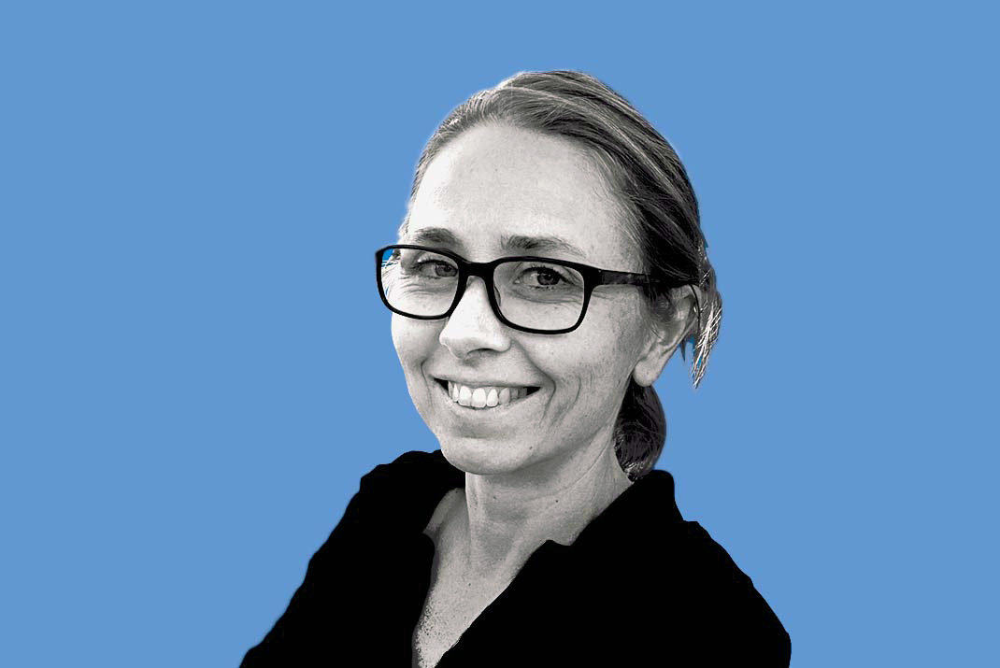
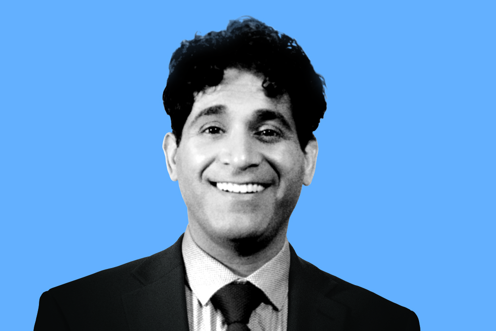
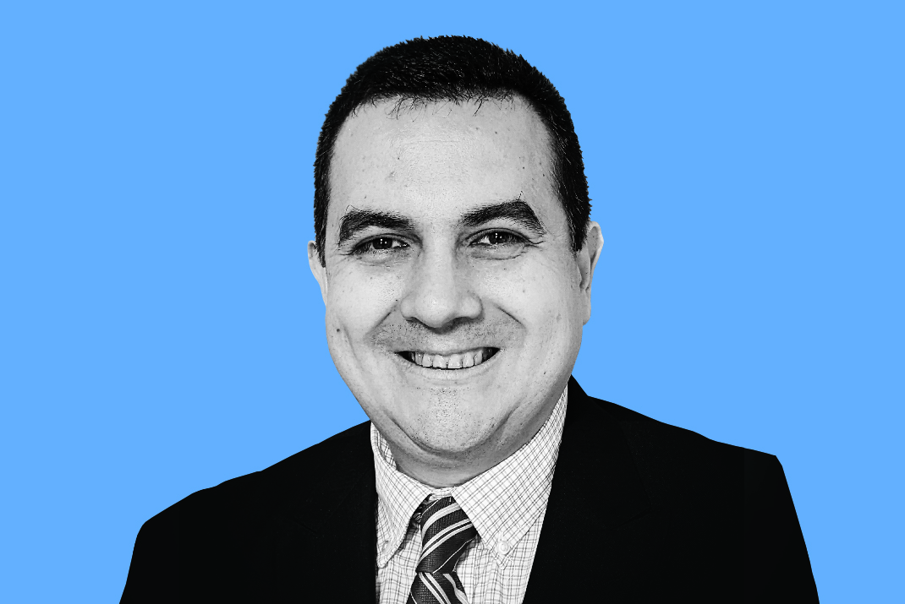
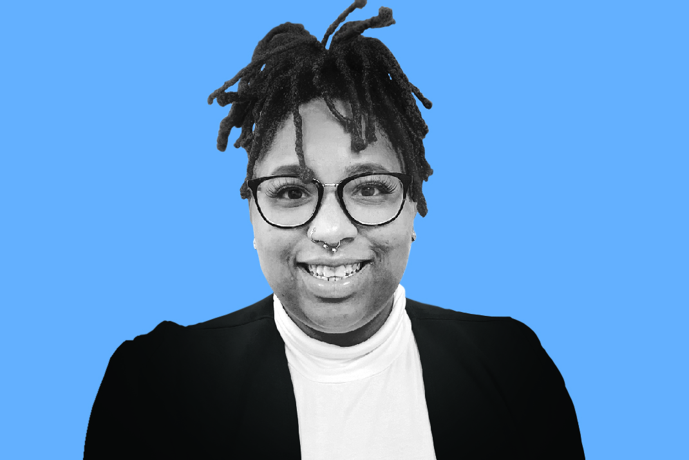

# Introducing the 2022 BSSw Fellows

#### Contributed by [Hai Ah Nam](https://github.com/hnamLANL "Hai Ah Nam GitHub Profile")

#### Publication date: January 14, 2022

We are pleased to announce the 2022 class of Better Scientific Software (BSSw) Fellows: six Fellows and six Honorable Mentions.

The 2022 class of BSSw Fellows will be recognized during the [2022 Exascale Computing Project Annual Meeting](https://www.ecpannualmeeting.com), May 2-5, 2022.  

We sincerely thank _all_ fellowship applicants. The broad range of creative and interesting proposals made the selection process difficult.

The [BSSw Fellowship Program](https://bssw.io/fellowship) gives recognition and funding to leaders and advocates of high-quality scientific software. Each 2022 Fellow will receive up to $25,000 for an activity that promotes better scientific software, such as organizing a workshop, preparing a tutorial, or creating content to engage the scientific software community.  

The BSSw Fellowship Program is supported by the U.S. Department of Energy (DOE) and National Science Foundation (NSF) to enable a more robust approach toward pioneering the future of advanced computing ecosystems and leadership in science and engineering. The program enhances workforce development and pathways to NSF and DOE software communities, through nurturing a network of people who advance software practices as a fundamental aspect of increasing overall scientific productivity.

## 2022 BSSw Fellows

  

  

  <h3> Ritu Arora, University of Texas at San Antonio</h3>
  
Assistant Vice President, Research Computing

  
<i>BSSw Focus</i>: Optimizing I/O for better performance

  

 

  <h3>Rob Latham, Argonne National Laboratory</h3>
  
Software Developer, Math and Computer Science (MCS) Division

  
<i>BSSw focus</i>: I/O sleuthing: a tour of I/O challenges and solutions

 

  <h3>Julia Stewart Lowndes, National Center for Ecological Analysis and Synthesis (NCEAS), UC Santa Barbara</h3>
  
Openscapes Co-Director

  
<i>BSSw focus</i>: Helping researchers engage with existing open source tooling and communities rather than reinventing on their own

 

  <h3>Amiya K. Maji, Purdue University</h3>
  
Senior Computational Scientist, Research Computing

  
<i>BSSw focus</i>: Simplifying scientific Python package installation and environment management

 

  <h3>Nitin Sukhija, Slippery Rock University of Pennsylvania</h3>
  
Associate Professor in Department of Computer Science and Director of Center for Cybersecurity and Advanced Computing (C2AC)

  
<i>BSSw focus</i>: Mitigating the risk of software vulnerabilities with best practices and tools for secure scientific software development

 

  <h3>Karan Vahi, USC Information Sciences Institute</h3>
  
Senior Computer Scientist

  
<i>BSSw focus</i>: Enabling complex scientific computations and efficient use of HPC resources with scientific workflows 

## 2022 BSSw Honorable Mentions

  <h3>Sarah Bratt, Syracuse University</h3>
  
Ph.D. Student, School of Information Studies

 

  <h3>William Godoy, Oak Ridge National Laboratory</h3>
  
Computer Scientist

  <h3>Brittany Johnson-Matthews, George Mason University</h3>
  
Assistant Professor, Computer Science Department

  <h3>Meghan Jones, University of Hawaiʻi at Mānoa</h3>
  
Postdoctoral Researcher, Department of Earth Sciences, School of Ocean & Earth Science & Technology

  <h3>Rafael Mudafort, National Renewable Energy Laboratory</h3>
  
Research Software Engineer, National Wind Technology Center

  <h3>Qiusheng Wu, University of Tennessee, Knoxville</h3>
  
Assistant Professor, Department of Geography

### About the BSSw Fellowship
The main goal of the [BSSw Fellowship Program](https://bssw.io/fellowship) is to foster and promote practices, processes, and tools to improve developer productivity and software sustainability of scientific codes. BSSw Fellows are selected annually based on an application process that includes the proposal of an activity that promotes better scientific software. Subscribe to the [BSSw email digest](https://bssw.io/pages/receive-our-email-digest) for notification about next year’s call for applications, which will be announced in summer 2022.  More information:

- [BSSw Meet Our Fellows](https://bssw.io/pages/meet-our-fellows)
- [FAQ for the BSSw Fellowship Program](https://bssw.io/pages/bssw-fellowship-faq)

Stay tuned for more from the 2022 BSSw Fellows.

### Contribute to the BSSw Site
Also, we want and need contributions from the international community for the BSSw site.  If you have expertise that can help other scientific software teams, we encourage you to contribute an article or pointer to good work.  See details on [how to contribute to BSSw](https://bssw.io/pages/what-to-contribute-content-for-better-scientific-software).

### Author bio
Hai Ah Nam is coordinator of the BSSw Fellowship Program, a member of the [IDEAS-ECP](https://ideas-productivity.org/activities/ideas-ecp) team, and a researcher in the [Advanced Technologies Group at NERSC/LBNL](https://www.nersc.gov/about/nersc-staff/advanced-technologies-group/hai-ah-nam/).  Her scientific career spans four DOE national laboratories (LLNL, ORNL, LANL, LBNL), where she has contributed to work in low-energy nuclear physics, computational physics, high performance computing, and research scientific software development.  Hai Ah’s research interests include emerging technologies for the HPC ecosystem, with a focus on AI/ML capabilities.  She is an advocate for developer productivity and software sustainability and has been one of the organizers of the [DOE Performance, Portability and Productivity Annual Meetings](https://p3hpc.org/) since 2015.

<!---
Publish: yes
Track: community
RSS update: 2022-01-14
Categories: collaboration
Topics: projects and organizations
Tags: bssw-article
--->
