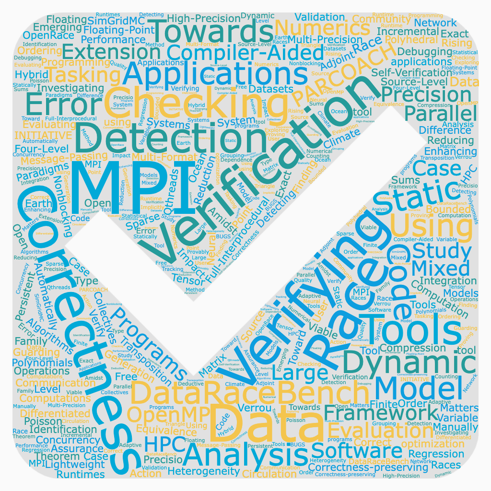

# Celebrating the 5th Anniversary of the Correctness Workshop: Looking Back and Looking Forward

**Hero Image:**

 - 

#### Contributed by: [Ignacio Laguna](https://github.com/ilagunap) and [Cindy Rubio-Gonzalez](https://github.com/crubiog)
#### Publication date: January 26, 2022

In 2021, the International Workshop on Software Correctness for HPC Applications
(Correctness) celebrated its 5th anniversary at the Supercomputing (SC)
conference. To mark this occasion, the co-organizers, Ignacio Laguna (LLNL) and
Cindy Rubio-González (UC Davis), are proud to share this article, reflecting on
its inception and providing their perspective looking forward.

### Workshop History

The Correctness workshop started as an attempt to bring together researchers and
developers to discuss ideas on the problem of correctness in HPC and scientific
software. Over the last decades, the computer science community has seen
significant advances in the areas of debugging, testing, and verification for
non-HPC and non-scientific applications. However, it has been found that
applying existing approaches to test, verify, and debug HPC software is much
more complicated than for non-HPC software.

Some of the reasons that make correctness in HPC difficult are: a growing use of
combined programming models in scientific software, an increasing use of
accelerators in HPC systems, the use of different levels of floating-point
precision, and different compiler optimizations that can change the semantics
and correctness of programs (sometimes producing different results between CPU
and GPU executions). In general, porting code across multiple platforms and
reproducing numerical results (or statistics of such results) is one of the
biggest challenges that scientific computing programmers face today.

While performance is the primary driver of innovation in HPC conferences such as
SC, the co-organizers thought that innovation in software correctness was needed
to address several existing challenges in HPC. The SC conference was the
appropriate venue for the workshop since it gathers a large number of
researchers and practitioners annually. Since its inception in 2017, the
workshop has provided a forum for discussions on software correctness in the HPC
and scientific computing community.

### Topics and Attendance

The workshop is attended annually by dozens of participants from several
countries. Thirty four papers have been presented and published as part of the
Correctness workshop over the past five years. The papers have touched on
several topics of interest in scientific software, including correctness in MPI
and OpenMP programs, floating-point error detection, data race checking,
debugging tools, mixed-precision correctness, correctness in algorithms and
applications, and correctness in emerging programming models.

 

[A word cloud from the titles of the papers published in the first five years of the Correctness workshop]

 

The workshop has had the honor of hosting six keynote speakers who have shared
their work and thoughts on the importance and challenges of software
correctness: Stephen Siegel (University of Delaware), Ganesh Gopalakrishnan
(University of Utah), Jim Demmel (UC Berkeley), Alex Aiken (Stanford
University), Allison Baker (NCAR), and David Bailey (LBNL and UC Davis).

### Community Impact

Before the Correctness workshop, the community did not have a specific venue to
discuss important topics about the correctness of scientific software. Some
discussions occurred during the presentation of technical papers at the SC
conference; however, usually, such discussions emerged in the context of other
paper presentations, which were not necessarily related to correctness. The
workshop has served as a venue to bring together the community and enable such
discussions in a dedicated forum.

With several US-based and international attendees, various collaborations among
researchers have emerged due to presentations and discussions at the workshop.
In addition, an essential role of the workshop has been connecting scientists
and tool developers. This connection is crucial for scientists to express their
needs and tool developers to receive feedback on their tools.

Training and mentoring young researchers have played another critical role in
the workshop. The workshop has opened the opportunity for training junior
researchers by participating in the program committee and for connecting
students with internship and job opportunities.

### Looking Forward

With programming models and HPC systems becoming more complex and heterogeneous,
correctness will continue to be a challenge in scientific software--the workshop
will continue to provide a venue for discussing methods, tools, and techniques
to address such a challenge.

This year, the workshop hosted a panel discussion on a future tool competition
to promote the adoption of correctness tools and make existing tools more robust
and usable. Moving forward, the co-organizers expect that emerging areas in HPC,
such as machine learning, artificial intelligence, and quantum computing, may
pose increasingly more significant correctness challenges, which will require a
larger community to be solved. The co-organizers also would like to encourage
the scientific software community to contribute to the workshop by submitting
papers or suggesting speakers or panel topics.

### Author bios

Ignacio Laguna

Cindy Rubio-Gonzalez

<!---
Publish: yes
Pinned: no
Topics: conferences and workshops, reproducibility, debugging
--->