# Software Deployment Process for Spack E4S stack at NERSC

#### Contributed by [Shahzeb Siddiqui](https://github.com/shahzebsiddiqui)

#### Publication date: Feb XX, 2022

## Introduction

When it comes to open source software, if you build it will they come, or rather use it? 
In an HPC environment, this question is even more complicated and requires a community to 
tackle the issue.  The [Extreme-scale Scientific Software Stack (E4S)](https://e4s.readthedocs.io/en/latest/introduction.html)
is a community effort  supported by the [Exascale Computing Project (ECP)](http://exascaleproject.org)
to provide open source software packages for developing, deploying and running scientific applications
on high-performance computing (HPC) platforms. Even with software seemingly packaged and delivered 
with a bow like E4S, the actual deployment can be fraught with pitfalls and decisions to make 
for site-specific customizations. 

In 2021, [National Energy Research Scientific Computing Center (NERSC)](https://nersc.gov/) 
released their first deployment of E4S/20.10 on Cori using the spack package manager. We wanted to 
leverage E4S to enable ECP and NERSC users to accelerate their scientific research with 
updated versions of software products needed for simulations and to provide feedback to 
ECP [Software Technology](https://www.exascaleproject.org/research/#software) teams with build failures during deployment so they can be fixed 
in future versions. Here, we describe the steps and lessons learned to deploy the 
E4S software stack at NERSC to help you navigate your E4S deployment.  The lessons 
learned can also guide future developers of packaged community software on 
development-to-deployment requirements.

## Background

E4S is a collection of 80+ top-level scientific software packages needed for scientific 
computing in high-performance computing (HPC) environments.  All software in E4S 
must comply with the [community policies](https://e4s-project.github.io/policies.html), 
including a production quality spack-based build and installation procedure. The 
Department of Energy Office of Science (DOE SC) [ASCR Facilities](https://www.energy.gov/science/ascr/advanced-scientific-computing-research) 
(NERSC, OLCF and ALCF) are expected to build and deploy E4S on the pre-exascale system, 
which helps to ensure a consistent programming environment for users across facilities. 

The HPC centers that are interested in deploying E4S on their facility system(s) 
should consider how it aligns with their overall software update strategy. 
To deploy the entire E4S stack, you are looking at 500+ software packages with 
dependencies using a single compiler, but this number will scale linearly as one 
introduces multiple compilers to build the stack. An HPC facility software 
deployment process is typically aligned with planned system upgrades, since both
may require a rebuild of the full software stack. 
 
## The Journey of Deploying Software 

Although E4S is intended to be easily deployed on systems, in practice, deploying 
E4S on a system is a process of determining which components work on your intended system. 
E4S is released quarterly, however facilities may choose to install bi-annually or annually.

In Figure 1, we outline the software deployment process at the ASCR facilities. 
The release begins with E4S providing a reference spack commit/branch along a 
reference [spack.yaml](https://github.com/E4S-Project/e4s/blob/master/environments/21.02/spack.yaml)
that ASCR facilities will acquire when building E4S on their system. 
The reference spack.yaml was built on the University of Oregon HPC system and 
it’s worth noting that simple copy/paste won’t work due to differences in system 
architecture, available compilers, and operating system. 

 

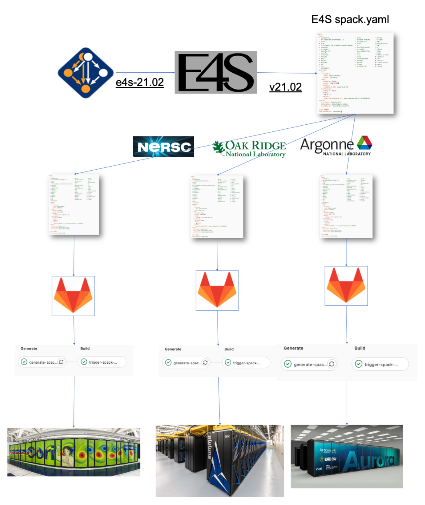[Figure 1. Software Deployment Process.]

 

### Step 0 - Determine which system to deploy your software

The deployment process begins by deciding which system(s) to install E4S and 
understanding the architecture of the systems. At NERSC we have two production 
systems, [Cori](https://docs.nersc.gov/systems/cori/) and [Perlmutter](https://docs.nersc.gov/systems/perlmutter/system_details/) 
which would be our target systems for deploying E4S. For the first half of 2021, 
our focus was deploying E4S on Cori while Perlmutter was getting ready for initial acceptance. 
We have to be cognizant of any upcoming system upgrades which determines when we deploy E4S. 

### Step 1 - Acquire Spack Configuration

We acquire the spack configuration from E4S, such as the [e4s/21.02 spack configuration](https://github.com/E4S-Project/e4s/blob/master/environments/21.02/spack.yaml)
which was released in Feb 2021. This usually means copying the content of spack.yaml 
and storing this in a git repo in our Gitlab server https://software.nersc.gov. 
We use the upstream [spack repo](https://github.com/spack/spack) for building E4S 
because we want to get all of the latest changes from the upstream spack project. 

**Lesson Learned: You can’t win them all - not all packages we planned to install are actually installed each release.**

During the spack builds, we discover build errors for certain software packages. 
First we try to troubleshoot to resolve the issue and if we require further assistance
we contact the spack community via slack or directly reach out to the package maintainer. 
If we need more visibility into the issue we would report this to the 
spack issue tracker: https://github.com/spack/spack/issues.  
 
### Step 2 - Preparing Spack Configuration

In this phase, we prepare our spack configuration suitable for our system which means 
we select our preferred compilers, select packages we want to install and set package 
preference with recommended build variants. 

**Compiler Definition**

On Cori, we select intel and gcc as our preferred compilers, while we support several 
versions we select one version for each compiler generally this is either the 
default version or the most latest version. 

Shown below is our compiler stanza for the e4s/21.02 deployment. The compiler 
specs ``intel@19.1.2.254``  and ``gcc@10.1.0`` are the compilers used to build E4S. 
We use Cray compiler wrappers **cc**, **CC**, **ftn** for C, C++ and Fortran wrappers, respectively. 

  

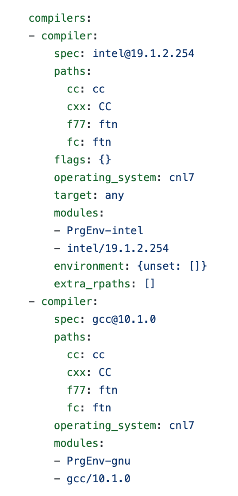[Figure 2. Spack Compiler Definitions.]

  

**Package Selection**

Although E4S has 80+ top-level software packages, not all are relevant to the NERSC user
community.  To avoid software bloat and reduce the amount of work in deployment, 
we need to determine which packages get installed along with the preferred compiler. 

We define a definition name ``e4s_intel`` and ``e4s_gcc`` to map spack packages that will 
be installed with intel and gcc compilers. We skip some packages for various reasons, 
for instance we don’t want **openmpi** installed in the E4S stack. Packages like 
**parallel-netcdf** and python extensions that start with ``py-*`` are generally skipped. 
Some packages are skipped due to build failures.

 

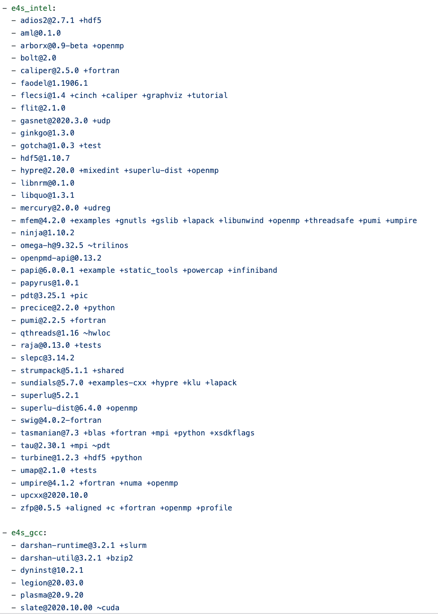[Figure 3. E4S Package List.]

 

**Package Preference**

Most scientific software requires MPI, BLAS, and SCALAPACK as common dependencies 
when installing software, but on Cori we choose not to build these from source since 
they are not optimized for the system. This typically requires one to specify preferences 
to ensure spack doesn’t use the default preference to build from source, and instead uses 
an alternative. In our spack configuration, we leverage system and compiler provided 
**cray-libsci**, **intel-mkl** and **mpich** as preferences for mkl, mpi, blas and scalapack. 
The spack documentation has a detailed summary on build customization which can be 
found at https://spack.readthedocs.io/en/latest/build_settings.html. Shown below is
our package preference for compilers and spack providers.

  

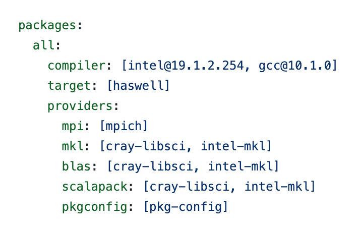[Figure 4. Package Preference.]

  

Certain packages like cray-libsci, intel-mkl, mpich are provided on our system which 
typically requires setting a [spack external](https://spack.readthedocs.io/en/latest/build_settings.html#external-packages) 
to ensure spack will leverage our preferred libraries provided by Cray. In the example 
below we define **cray-libsci** as an external module which maps to modulefile 
``cray-libsci/19.06.1`` which is provided on Cori. 

  

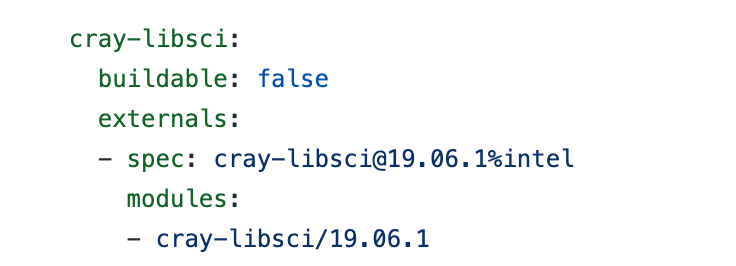[Figure 5. Spack External for cray-libsci.]

 
 
**Step 3 - Module Generation**

Spack provides a mechanism to generate modules in TCL and Lua format based on the 
module system. On Cori we use environment-modules which support TCL based modules. 
During the module generation process, we inform spack on the format of the modulefile.
We avoid hash in modules and prefer having modules in the format ``{name}/{version}-{compiler.name}-{compiler.version}``
which avoids module conflicts when a package like **hdf5@1.10.7**  is installed with both compilers. 
Shown below is the spack configuration for modules along with output of the spack generated modules. It’s worth noting we limit our module generation to root specs and avoid generating modules for dependencies by setting blacklist_implicits: true which avoids explosion of modules and higher likelihood of module conflicts. 

  
 
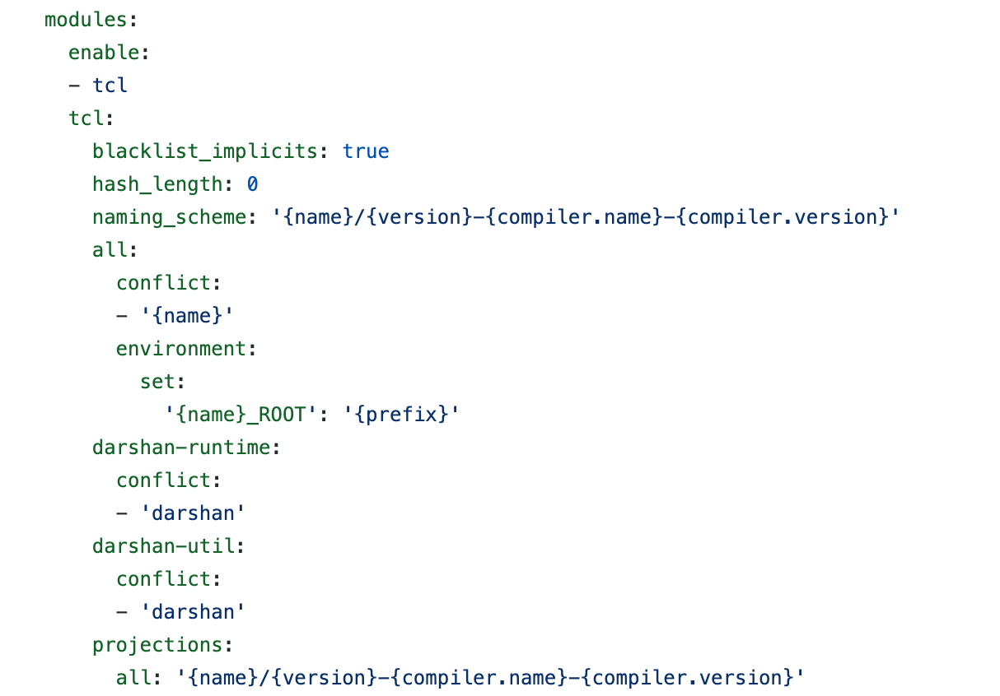[Figure 6. Spack Module Configuration.]

  

Shown below is the spack generated modules for e4s/21.02 stack, note that we have 
no hash in modules and it follows the naming format defined in the projections. 
If we didn’t specify **blacklist_implicits: true** we would have modules for all 
dependencies and this output would be more bigger.

  

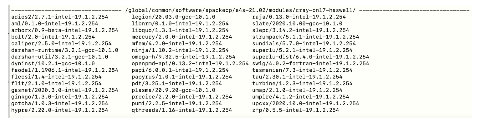[Figure 7. E4S/21.02 modulefiles.]

  

We provide an overarching modulefile to load the specific e4s stack version that 
corresponds to each release of E4S. For instance on Cori we have three versions 
of e4s as shown below. The modulefile will set up a spack instance used for 
deployment and update MODULEPATH with spack generated modules. 

  

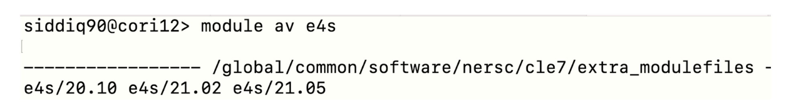[Figure 8. E4S modules.]

  

### Step 4 - Deployment Script

Our deployments are performed through Gitlab, where we define a gitlab job in **.gitlab-ci.yml**
which will install E4S in the production path. Shown below is the **deploy** job which does 
the production deployment. This process will clone spack into the production path 
and install specs from buildcache which we did in advance and generate the modulefiles. 
The deploy job is initiated once the entire stack can be rebuilt from source and 
pushed to buildcache. The gitlab configuration for e4s/21.02 can be found at 
https://github.com/spack/spack-configs/blob/main/NERSC/cori/e4s-21.02/.gitlab-ci.yml

  

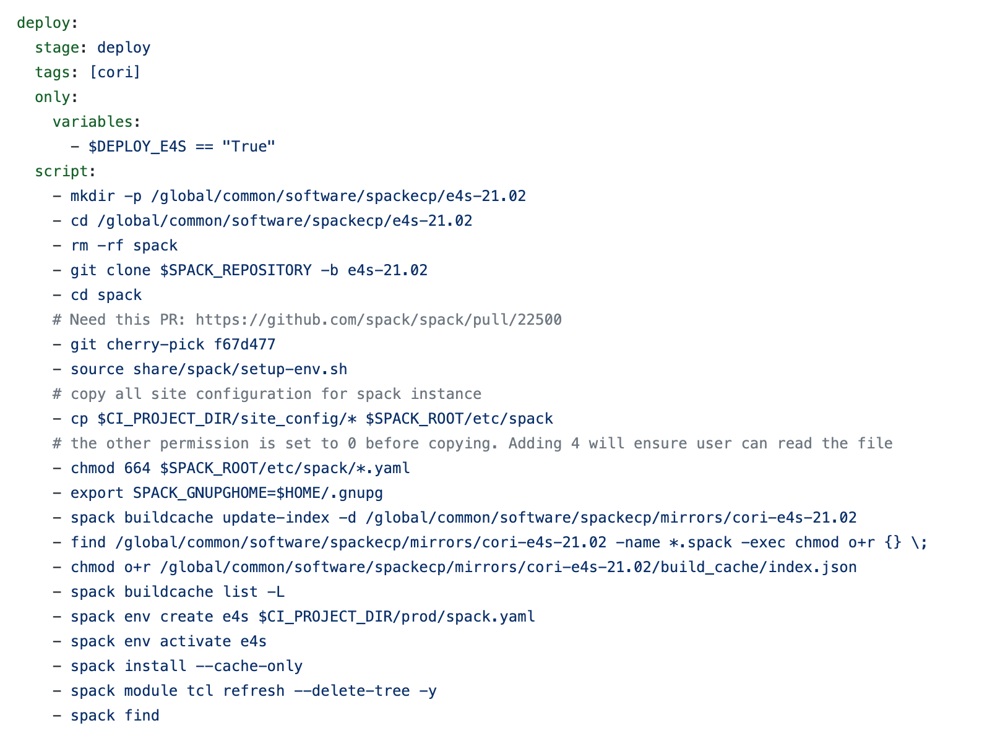[Figure 9. Deployment Script.]

  

### Step 5 - User Documentation

The last step in our deployment process is writing user documentation for our E4S stack. 
Our home page for E4S documentation is https://docs.nersc.gov/applications/e4s/ where we have 
a separate documentation page per E4S release. The user documentation goes through peer review 
and further testing to ensure documentation is accurate. Shown below is a preview of our 
E4S documentation at NERSC, we have a subpage with documentation for each E4S stack.

  

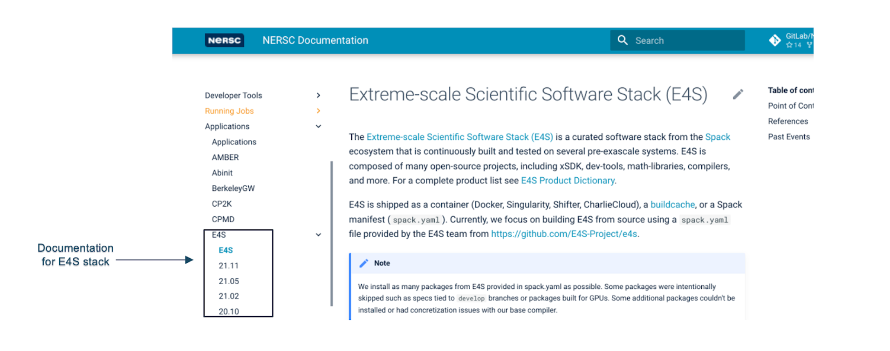[Figure 10. E4S Documentation at NERSC.]

  

### Step 6- Give back to the community

We contribute back our spack configuration to https://github.com/spack/spack-configs in addition 
we update the E4S Facility Dashboard as shown below.

  

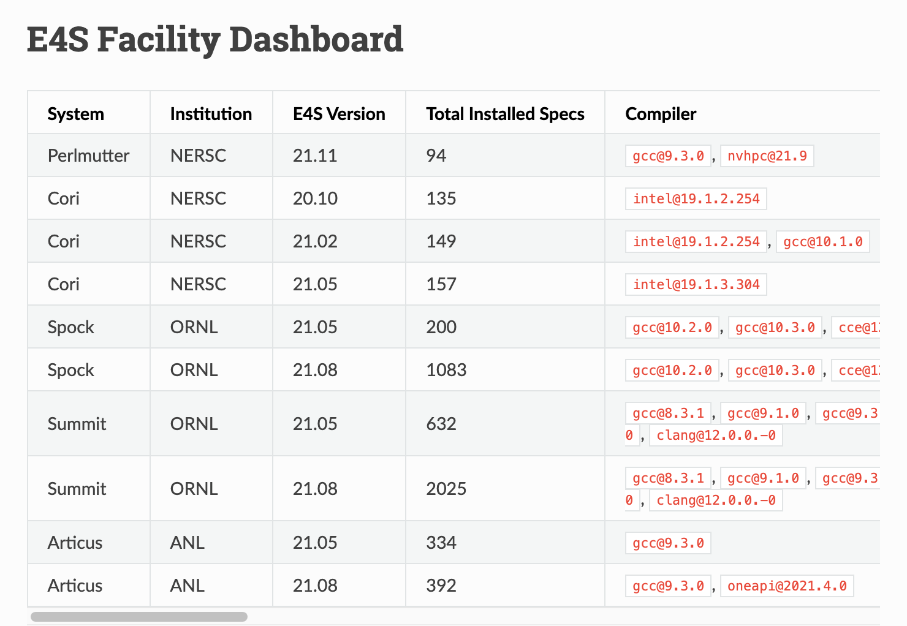[Figure 11. E4S Facility Dashboard.]

 

We will communicate our E4S deployment release with our NERSC and ECP user-base through 
NERSC weekly emails and slack channel. This way we can coordinate efforts across the 
various ASCR facilities and share best practices.

## Conclusion

Software Stack Deployment requires intimate knowledge of the HPC system with 
in-depth knowledge of the software package to ensure each package is built 
optimally for the system. The software stack is presented via modules and as 
part of the Software Deployment process one needs to design the file structure 
where modules will reside. Considering that we are deploying multiple E4S releases 
for the system, we need proper permission such as world-readable (755) in-order 
for users to access the stack. Spack has helped accelerate and streamline the 
software build process to help deploy a software stack in the order of hundreds 
of package, in the past this would not be achievable. 

Software Deployment team should be an integral part of HPC centers, and we should
work towards training our existing staff and/or increase the workforce if we 
plan on supporting E4S at the facilities. An HPC center may have multiple HPC 
systems and if one wants to deploy E4S for every system we should work towards 
a sustainable solution where we can deploy E4S relatively quickly while having 
additional resources so work can be done in parallel. Across the three DOE labs 
(NERSC, OLCF, ALCF) we noticed that the software deployment group is led by 1-2 
individuals who are responsible for building the entire software stack for 
multiple HPC systems. E4S leverages spack as the driver for building E4S stack 
which means one needs spack expertise and a strong sense of how to design software 
stacks and interface through modules. **HPC centers can benefit from each other by 
learning the Software Deployment process, especially for centers that don’t have 
a well-established process or trying to deploy an E4S stack for the first time.**
 
 ### Author bio

[Shahzeb Siddiqui](https://github.com/shahzebsiddiqui) is a HPC Consultant/Software Integration Specialist at [Lawrence Berkeley National Laboratory](https://www.lbl.gov/) at [NERSC](http://nersc.gov/). He is part of [User Engagement Team](https://www.nersc.gov/about/nersc-staff/user-engagement/) that is responsible for engaging with NERSC user community through user support tickets, user outreach, training, documentation. Shahzeb is part of the [Exascale Computing Project (ECP)](https://www.exascaleproject.org/) in [Software Deployment](https://www.exascaleproject.org/research-group/software-deployment-at-the-facilities/) (SD) group where he is responsible for building Spack [Extreme-Scale Scientific Software Stack](https://e4s-project.github.io/) (E4S) at the DOE facilities. Shahzeb Siddiqui started out his career in High Performance Computing (HPC) in 2012 at [King Abdullah University of Science and Technology](https://www.kaust.edu.sa/en) (KAUST) while pursuing his Masters. His focus in HPC includes Parallel Programming, Performance Tuning, Containers (Singularity, Docker), Linux system administration, Scientific Software Installation and testing, Scheduler Optimization, and Job Metrics. Shahzeb has held multiple roles in his HPC career in the following companies: Dassault-Systemes, Pfizer, Penn State, and IBM. Prior to 2012, he was a software engineer holding multiple roles at Global Science & Technology, Northrop Grumman, and Penn State.

  

