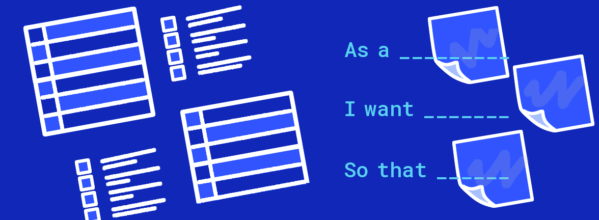
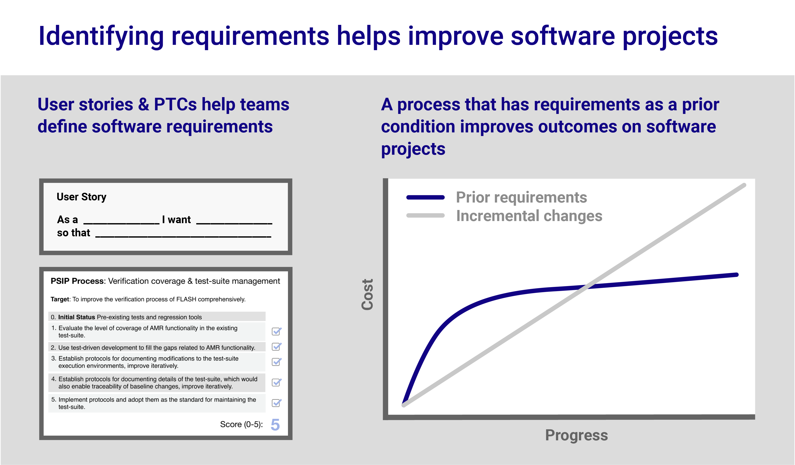

# User Stories in Scientific Software Development

**Hero Image:**

- 

#### Contributed by: [Osni Marques](https://github.com/oamarques) and [Reed Milewicz](https://github.com/rmmilewi)
#### Publication date: April 29, 2022

### Introduction

The practice of scientific software development is changing:

-   Scientific software teams today are more diverse and varied than in
    the past. In recent years, we have seen the emergence of novel
    professional identities such as research software engineers,
    complex scientific challenges necessitating multidisciplinary
    collaboration, and teams becoming more distributed and
    multi-institutional. As a result, there's a greater need for
    **communication and consensus** in scientific software
    development.[1]

-   The forefront of scientific software is increasingly open source,
    open science, and community driven. Most scientific software
    developers are their own users, but today they are more likely to
    have to interface with external users of their software. They need
    to think about both **their own needs *and* the needs of others**.

-   The overall workload for scientific software developers is mounting.
    Not only must scientific software developers evolve their codes to
    keep pace with the science (in an era when scientific output is
    growing exponentially!), they must also contend with disruptive
    changes in hardware and software environments. Teams are finding
    themselves pulled in many different directions, and managing this
    complexity requires **better strategies for planning and
    prioritizing development work** to make the best use of finite
    resources.

At the convergence of all these trends, scientific software development
teams are having to plan and organize their work more explicitly and
intentionally. In other words, they are having to do requirements
engineering. In software engineering parlance, a software
requirement[2]
is a condition or capability of the software needed by a stakeholder to
solve a problem or achieve an objective; and requirements engineering is
the process of formally identifying, documenting, and validating those
software requirements. As Smith et al. have noted, there has long been a
prevailing belief that requirements engineering is impractical and
infeasible for scientific software development.[3]
After all, scientific software is often highly exploratory, and
scientific software developers have long been their own users.
Nevertheless, given the increasingly multidisciplinary,
community-driven, and complex nature of scientific software development,
we argue that the need for requirements engineering is unavoidable at
this point.

In this article we make the case for a lightweight requirements
specification technique that we believe teams could adopt in practice:
*user stories*. User stories are a well-known and popular technique for
representing requirements in Agile software development; they encode
requirements in natural language, often from the perspective of an end
user. The most common template for user stories is "*As a* \<role\>, *I
want* \<requirement\> *so that* \<reason\>"; this is also known as the
Connextra template.[4] Outside of user requirements, user
stories are also employed in software process improvement, that is, for
articulating developers' needs. We'll share here our experiences in
experimenting with user stories and our lessons learned, and we'll
provide guidelines for teams looking to employ user stories in their own
projects.

### Our experiences with user stories

A few years ago the [IDEAS-ECP project](https://ideas-productivity.org/ideas-ecp/) 
began experimenting with user stories as a
tool to engender empathy and deepen understanding of scientific software
development needs. In an exercise involving 15-20 people, the team
created and refined 59 user stories to develop an understanding of what
scientific software developers might need and how IDEAS-ECP could best
support them. For the team's purposes, the stories were binned as
follows: training and documentation, software integration and testing,
software quality, practices and standards, software development, and
operational needs. Most user stories the team created were about process
improvement, that is, finding better ways of thinking about and working
with scientific software. The following are two examples.

-   *As an* application architect *I want* to better understand version
    control capabilities that allow integration of independently
    developed components *so that* we can distribute a coherent software
    stack.

-   *As a* developer of numerical software, *I want* a process to stress
    test the software functionalities under different compilation
    scenarios and with an increasing set of difficult cases, *so that*
    the consideration or adoption of alternative functionalities is
    supported by the same rigorous tests.

 

[Approaches for improving software productivity and sustainability: incremental (gray), requirements as a prerequisite (blue). Progress Tracking Cards and user stories supports the latter.]

### A seamless incorporation of user stories

After that experiment, we realized that user stories could
become a component of [Productivity and Sustainability Improvement
Planning](https://bssw.io/psip) (PSIP), a lightweight workflow for software process improvement
that can be used on its own or alongside frameworks such as Kanban,
or Agile. PSIP provides tools and resources to set, measure, and
realize improvement goals and can be implemented through Progress
Tracking Cards (PTCs) to achieve quality goals. To illustrate, the figure above
portrays two software development
approaches, one (cost prohibitive) based on incremental changes and one (with more long-term efficiencies) that has requirements for
programmer productivity and software sustainability. PTCs can be
gracefully combined with user stories to suit the latter approach and
then used by scientific software teams to help improve software
projects. We give three examples.

-   The improvement consists in promoting user confidence in software
    updates, to ensure that users trust application performance and
    behavior changes made by an update/new release. This improvement
    needs to be aligned with the values and priorities of the team; it
    can be anchored by a story such as the following: "*As a* software engineer *I want* to instill
    user confidence in updating the application *so that* the latest
    application release is adopted."

-   The improvement consists in setting up automated continuous
    integration testing to allow a restructuring of a codebase safely
    and to increase reproducibility. Stakeholders may want the same outcome
    but for different reasons, and the following user stories would be
    possible: (a) "*As a* researcher and a PI, *I want* to ensure that
    however the software evolves over time all the scientific results
    our code generates remain valid *so that* we can be confident that
    our results will stand the test of time." (b) "*As a* developer, *I
    want* to make sure that, if I add a new feature, I have also
    written the appropriate tests for that feature *so that* the code is
    sufficiently trustworthy." (c) "*As a* researcher and developer, *I
    want* to ensure that we can refactor our code without altering the
    results produced by that code *so that* the code is still reliable."

-   The improvement consists in steadily converting a codebase over to
    an agreed-upon standard, for example in the context of the HDF5
    library. In this case, stakeholders may have distinct needs, which
    need to be handled in different ways. The following user stories
    would be possible: (a) "*As a* person responsible for software
    quality and correctness for the HDF5 library, *I want* guidance on
    selecting and implementing coding standards *so that* we can make
    our code easy for everyone to read and understand." (b) "*As a* an
    HDF5 library developer or community contributor, *I want* support
    *so that* I am complying with the standards with minimal additional
    effort or ambiguity."

### How you can get started with user stories

For readers looking to adopt user stories within their own projects,
we highly recommend starting with a storywriting workshop as we did in the
IDEAS-ECP project.

1.  Schedule at least an hour-long meeting to do the workshop. Make
    clear that the goal of the meeting is to collect ideas to gather project
    requirements and express them with stories, and make sure
    participants come prepared with ideas. 

2.  Nominate at least one stakeholder to help lead the session, and make
    sure certain rules are followed: everyone can freely contribute user
    stories without judgment or critique, a high quantity of stories is
    desired, and participants are free to combine and add to others' ideas.

3.  Make sure that every user story is written down and stored in a
    place where everyone has access to them, so that they can be
    collaboratively refined later.

Many resources are available online[5] with
guidelines on how to write effective user stories, and we encourage
teams to peruse those. We do note, however, that none to our knowledge speak
directly to scientific software development. Along those lines, we have
a small set of guidelines of our own to help frame this story-writing
exercise.

**The *you* in user story**: Scientific software developers are often
their own users, and user stories can be a powerful tool for
introspection. We encourage teams to consider user stories as a tool to
express what they themselves value and consider important, not just what
other external stakeholders consider valuable. Likewise, collaboratively
writing user stories presents an opportunity to surface and then resolve
potential differences in priorities among different team members.

**User stories as experiments**: We recommend that teams agree to a
"definition of done" for stories, a common set of criteria needed to
close out a story (e.g., the story has a deliverable that was met; the
work was reviewed by other team members). Closing out a story, however can be
tricky for scientific software teams as their software can be constantly
evolving; user stories might not pan out or could turn out to be more
involved or complicated than originally thought. A useful way to frame a
definition of done for user stories is to view them as an *experiment*.
Think of a requirement as a hypothesis that a unit of work will deliver
value to the project. That hypothesis should be testable; that is,  some criteria for success should be agreed upon in advance.
Moreover, the result of that test should ideally be valuable regardless
of whether the user story is "successful" or not. As an example, a user
story may be the following: "As an application developer, *I want* to show it is
possible to port our application code to the new platform *so that* we
can take advantage of the next-generation hardware." The code, however,
 (a) may not be able to be ported, (b) can be ported with extensive
additional effort, or (c) is relatively easy to port. Gathering the
data needed to make that determination is a value-add on its own,
regardless of the outcome, and could be used to derive future user
stories.

### Takeaways

Given the ever-growing demand for complex simulations and analysis,
developing the right software in the right way becomes essential. We
think that user stories are a valuable tool and technique for
accomplishing those goals, and we offer a potential to render intricate
goals or tasks in scientific software development into smaller and
tangible requirements because (a) they are lightweight and can capture
what we want in a natural language; (b) they are easy to write,
facilitating their adoption; (c) they encourage reflection and
communication, especially with regard to software processes; (d) they
can expose differences in assumptions and priorities;and (e) they can help
with consensus-building and consequently with commitment to action.

### Author bios

Osni A. Marques is a staff scientist in the Applied Mathematics & Computational Research Division at Lawrence Berkeley National Laboratory. He has worked with software libraries that provide solutions to common and important computational problems in engineering and scientific applications. He has studied and implemented algorithms for the solution of numerical linear algebra problems in applications related to the motion of proteins, acoustics problems, structural analyses, inverse problems in geophysics, and electronic properties of materials. Osni is currently involved in the IDEAS Productivity project and training activities of the DOE Exascale Computing Project.

Reed M. Milewicz is a computer scientist and software engineering researcher in the Department of Software Engineering and Research at Sandia National Laboratories. His research focuses on developing better practices, processes, and tools to improve software development in the scientific domain, ranging from technologies such as compilers and formal verification tools to direct engagement with software teams through evidence-based software process improvement. He leads software science research efforts within his department and is a member of the Interoperable Design of Extreme-Scale Application Software (IDEAS) project, where he is part of the Productivity and Sustainability Improvement Planning  team.

[1-sfer-ezikiw]: https://www.osti.gov/biblio/1843575/ "Position Papers for the ASCR Workshop on the Science of Scientific-Software Development and Use {doi:10.2172/1843575 pp. 176-177}"
[2-sfer-ezikiw]: https://bssw.io/items/overview-of-requirements-and-requirements-engineering "Overview of Requirements and Requirements Engineering"
[3-sfer-ezikiw]: https://doi.org/10.1109/SE4Science.2019.00011 "Debunking the Myth That Upfront Requirements Are Infeasible for Scientific Computing Software {doi:10.1109/SE4Science.2019.00011}"
[4-sfer-ezikiw]: https://isbndb.com/book/9780321205681 "User Stories Applied: For Agile Software Development {isbn:978-0321205681}"
[5-sfer-ezikiw]: https://www.atlassian.com/agile/project-management/user-stories "User stories with examples and a template"

<!---
Publish: yes
Pinned: no
Topics: software process improvement, requirements
--->
<!-- DO NOT EDIT BELOW HERE. THIS IS ALL AUTO-GENERATED (sfer-ezikiw) -->
[1]: #sfer-ezikiw-1 "Position Papers for the ASCR Workshop on the Science of Scientific-Software Development and Use"
[2]: #sfer-ezikiw-2 "Overview of Requirements and Requirements Engineering"
[3]: #sfer-ezikiw-3 "Debunking the Myth That Upfront Requirements Are Infeasible for Scientific Computing Software"
[4]: #sfer-ezikiw-4 "User Stories Applied: For Agile Software Development"
[5]: #sfer-ezikiw-5 "User stories with examples and a template"
<!-- (sfer-ezikiw begin) -->
### References
<!-- (sfer-ezikiw end) -->
* 1Position Papers for the ASCR Workshop on the Science of Scientific-Software Development and Use, <a href="https://www.osti.gov/biblio/1843575/">doi:10.2172/1843575</a> pp. 176-177
* 2<a href="https://bssw.io/items/overview-of-requirements-and-requirements-engineering">Overview of Requirements and Requirements Engineering</a>
* 3Debunking the Myth That Upfront Requirements Are Infeasible for Scientific Computing Software, <a href="https://doi.org/10.1109/SE4Science.2019.00011">doi:10.1109/SE4Science.2019.00011</a>
* 4User Stories Applied: For Agile Software Development, <a href="https://isbndb.com/book/9780321205681">isbn:978-0321205681</a>
* 5<a href="https://www.atlassian.com/agile/project-management/user-stories">User stories with examples and a template</a>
