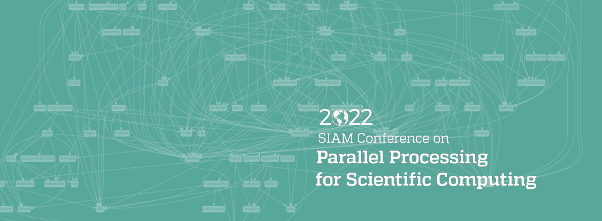
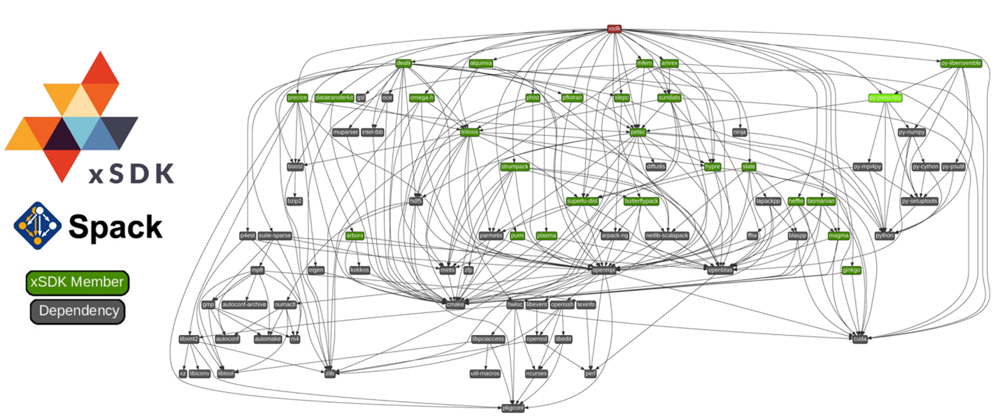

# Build, Integration, and Testing for Sustainable Scientific Computing Software

**Hero Image:**

 - 

<!-- begin deck -->
<!-- end deck -->

#### Contributed by [Keita Teranishi](https://github.com/keitat), [A. Bartlett](https://github.com/bartlettroscoe), Franck Ledoux, [Daniel S. Katz](https://github.com/danielskatz), and [Anshu Dubey](https://github.com/adubey64)

#### Publication date: May 27, 2022

In modern software engineering, approximately 20-40% of the time is spent on the processes for building, integration, and testing.  This staggering number indicates huge challenges in scientific computing software development where many users and developers are not formally trained as software engineers. Today, the scientific computing software stack has  become increasingly complex for deriving the full capability of modern high-performance computing systems along with the increasing variety of system environments. For example, the [Extreme-scale Scientific Software Development Kit](https://xsdk.info) (xSDK) in the U.S. DOE Exascale Computing Project (ECP) depicts a complex set of software dependencies to support the interoperability of 24 scientific library packages.  Although the xSDK is one of the special cases, many ECP applications today are using a subset (several packages) of the xSDK suite with a variety of compiler, runtime, and system software combinations, indicating the difficulty of their deployments. Recently, DevOps has become an essential software engineering discipline in enterprise computing; but the uniqueness of scientific computing, including the common use of legacy packages (that have not been tested properly) and the notion of “numerical correctness,” often specific to applications and algorithms (numerical correctness is not understood well in terms of the modern software engineering practice) has made the deployment even more challenging. 
 
These facts motivated us to hold a panel discussion at the SIAM PP22 conference, inviting speakers who have made major contributions to build, integration, and testing issues in scientific computing to share their experiences and opinions. In this article, panel moderator Keita Teranishi holds a conversation with some of the panelists.

 

[Dependency graph for the member packages of the Extreme-Scale Software Development Kit (xSDK), derived from their Spack recipes.]

 

**Moderator:** Please briefly introduce the projects you discussed at the panel session.

**Roscoe Bartlett:** I have worked on several HPC and CSE projects over the years.  I was a major contributor to the Trilinos collection of numerical support libraries and was the former Trilinos focus lead for Software Integration.  I was the software engineering and infrastructure lead for the Consortium for Advanced Simulation of Light Water Reactors (CASL).  I was the Tools and Development Environment lead for the Sandia National Laboratories Advanced Technology Development and Mitigation (ATDM) project.  And I have been a member of the DOE ECP Interoperable Design for Exascale Application Software (IDEAS) productivity and sustainability project since 2014.  More recently I have been leading build-system and integration modernization for Trilinos and the Tribal Build, Integration, and Test (TriBITS) framework for the ECP Software Development Kit (SDK) effort.

**Franck Ledoux:** I’m in charge of a research and engineering group that develops, delivers, and maintains libraries and software that are used by HPC numerical codes at CEA. One of our software products, Arcane, is middleware that provides technical services to build parallel multiphysics codes. It handles parallelism concepts, mesh data structures, I/O, and so on. A key issue with such middleware is to provide an adequate testing and validating framework. This is done with the Trollnet tool.

**Daniel S. Katz:** I represent [Parsl](http://parsl-project.org), which is a library that lets a user create parallel programs composed of Python functions and external components, and execute Parsl programs on any compute resource from laptops to supercomputers. [funcX](https://funcx.org) is a federated function-as-a-service system that lets a user register functions; execute them across a federated ecosystem of funcX endpoints that includes local, HPC, and cloud systems; and share them with collaborators.

**Anshu Dubey:** I'm the chief software architect for Flash-X, a multiphysics software system made with composable components. Components can have multiple alternative implementations and carry their metadata with them. A configuration tool can parse and interpret this metadata to combine selected code component implementations into a self-consistent application. Flash-X has solvers for PDEs, ODEs, and some algebraic equations and has been used for simulations in astrophysics and computational fluid dynamics. FLASH, a widely used multiphysics code was its predecessor.

**Moderator:** How do you define the success/correctness of the test, build, and integration in your project?

**Roscoe:** This is a loaded question. It depends on the type of software you are creating; but to have full confidence, you need all types of testing at the appropriate level of effort determined by the properties of the code you are developing, the usages of that code, and how long you want that software to persist.

**Anshu:** Various classes of tests are included in the distribution, and the definition of expected results for those tests is described in the documentation. A build is successful if it generates an executable. Some tests self-report pass/fail, while others need baselines for comparison. The test suite is extensive and exercises integration of components where needed.

**Franck:** I agree with Anshu’s definition. I would just underline that the dynamic testing of an executable in an HPC context is also impacted by the launch configuration (number of processes, MPI version, number of threads, etc.). Getting full confidence in your program using dynamic testing is a long-term and likely unreachable task.

**Dan:** If users can use our software on their choice of systems, and get expected results, either (a) we have tested on that system and nothing has changed about the system since then, or (b) we have created and sufficiently well documented our software and have tested it across a similar-enough system. This is success. If a user has to contact us to make our software work, something has failed.

**Moderator:** What is the biggest challenge in software building, testing, and integration today?

**Dan:** When building software that interacts with components of HPC systems that are neither standardized nor reflexive (authentication mechanisms, job submission, scheduling, etc.), building and testing must be done individually and independently on each actual system that will be used, and often it must be done manually. Traditional continuous integration (CI) tries to provide a nice, clean, isolated environment for building software; but we need a way to test on various HPC/cloud systems, with different schedulers, access, environments, and configurations. So we need to see how the system is set up in practice, and not be cleanly isolated from it in our CI.

**Anshu:** An ongoing challenge is access. Security and access for testing can be at cross-purposes with one another. A code that aims to serve a community must be able to run on a multitude of platforms and software stacks. If that code also happens to be highly composable, then the combinatorics of component interoperability applied to a range of different hardware configurations can become daunting.

**Franck:** In practice, the software stack becomes more and more complex for numerical simulation codes, especially with the heterogeneity of cluster architectures we have to deal with. Getting a reproducible, testable, and easy-to-install stack of software is mandatory for the engineers that are responsible for the end applications (numerical simulation codes for my purposes).

**Roscoe:** The challenges are different depending on whether you are focusing on build and installation versus software testing versus software integration. In my view, the biggest challenge for build and installation is the set of heterogeneous and inconsistent build systems used by different software packages in the CSE software ecosystem.  Each of these build systems has different and unique problems when trying to port to a new platform or new compiler and other tools.  And facades constructed around these different build systems only partially address the underlying problems. The biggest challenge for testing and integration is the lack of quality portable robust high-coverage automated tests to give confidence that the software is working correctly to safely perform integrations.  Without such tests, development, porting, and deployment efforts are risky and unproductive.

**Moderator:** What are the major missing elements of today's software engineering practice for scientific computing?

**Roscoe:** The biggest missing elements are fundamental software quality engineering practices. Those include (a) teaching and getting commitments from developers to create and maintain high-quality test suites and (b) teaching and getting developers to effectively incrementally refactor and extend existing software instead of always starting new software from scratch -- often throwing away years of requirements gathering and validated software.

**Franck:** I guess that software engineering, in general, is not the priority of the different actors who are involved in running numerical simulations on HPC facilities. On one side, the developers of numerical simulation codes have mainly a background in mathematics or physics; on the other side, computer scientists who maintain and exploit HPC clusters are concerned with performance, parallelism, and  the like. It is difficult for those two communities of people to understand each other. They don’t have the same concerns and objectives. A common point is that both of them are not educated in software engineering. It is a point that should change in the future. 

**Dan:** Parsl was funded by an NSF award for initial development, but that award is ending soon. How do we maintain what we've built? We need to check/merge PRs, work with users, fix bugs, support new platforms. All these  efforts require funding for the core team. While some projects that depend on Parsl help support us, it's not clear whether we can depend entirely on funding from these projects. They need software that works and that they can rely on, and they don't want to build up expertise in all of these dependencies. Unfortunately,  funding agencies generally focus on novelty when they make decisions about funding; but production software is infrastructure, and it also needs support. The [EOSS](https://chanzuckerberg.com/eoss/) program of the Chan Zuckerberg Initiative is a seemingly lonely example, and it focuses only on software with substantial life science impact. What we would ideally like, in addition to funding agency support for maintenance of the software that their researchers use, is incentives for developers to maintain this software as part of their work, perhaps because this software will be cited when it is used or perhaps because their institution will gain from supporting this software. A project (or even a collection of projects) cannot easily do this alone; we need systemwide changes, such as hiring and promotion policies that take software work into account and incentives that encourage high-quality software and support contributions to existing software.

**Anshu:** Sustained funding, also mentioned by Dan, is the single biggest challenge. The other challenge is the loss of information that is in people’s heads. Scientific software has a transitory contributing population for whom extensive documentation of design ideas and steps is seldom a priority. That extremely important component of sustainability gets lost when people move on.

**Moderator:** What are the most beneficial elements of today's software engineering practices for scientific computing?

**Anshu:** I have seen the landscape change from where people couldn’t be bothered to even use version control to where projects are now embracing git, CI regular testing, and so on. This change contributes to software quality, and through that to the credibility of the science done with that software.

**Franck:** The development of open platforms like GitLab or GitHub has pushed version control and CI as being usual and mandatory. It is a way of democratizing “good” software engineering techniques with CI, testing, code coverage, and so on.

**Roscoe:** We see many positive elements, particularly (a) the growth and competition between GitHub and GitLab in creating great tools for supporting continuous integration and peer review, and (b) the growth and improved usage of modern CMake creating more maintainable, portable, and interoperable software packages.

**Dan:**: Containers seem promising for debugging user problems, because they can lead to the user's environment and problems being packaged in a way that they can be transmitted and examined by software developers, rather than having the software developers be required to get access to the remote system where the user is having the problem.

**Moderator:** Are there any final thoughts you want to share with the community?

**Dan:** When building new products to serve a user community, the newly developed product must move fast to be useful to its users, because requirements are discovered through use. Later, a product must be stable in order to be useful to its users, and moving too fast becomes a problem. The "correct" balance changes over the project's lifetime. This tension between experimental and production systems isn't unique to software. It's also seen in hardware testbeds that initially don't want to support production science but eventually can be "frozen" by it into production systems rather than the testbeds they were initially designed to be.

**Anshu:** I agree with what Dan said about early adoption and evolution through use. Without an active user community, more redundant features may get added while needed features may be overlooked. Also, at the moment our community relies on manual inspection for code quality. More targeted tooling to help in processes such as code review will probably enhance the adoption of those practices because they will become less labor-intensive.

### Panel presentations

* **Roscoe:** [doi:10.6084/m9.figshare.19241715](https://doi.org/10.6084/m9.figshare.19241715)

* **Dan:** [doi:10.5281/zenodo.6210785](https://doi.org/10.5281/zenodo.6210785)

* **Anshu:** [doi:10.6084/m9.figshare.19516561](https://doi.org/10.6084/m9.figshare.19516561)

### Author bios

Keita Teranishi is a principal member of technical staff at Sandia National Laboratories, in California. He has broad experience in high-performance computing including tensor and linear algebra software, automatic performance tuning, fault tolerance, and programming systems.  Currently, he leads the research project on verification/correctness for performance-portable programming frameworks.  He is a co-PI of the xSDK in the Exascale Computing Project.

Roscoe A. Bartlett is a principal member of technical staff in the Software Engineering Research Department at Sandia National Laboratories, in New Mexico.  He has deep experience in parallel numerical algorithms development and in software engineering management methodologies and technical practices as applied to computational science and engineering (CSE) and HPC software projects.  His current focus is on the development of software tools and practices for high-quality, interoperable software CSE packages.

Frank Ledoux is group leader for the Meshing and Visualization activities at the French National Lab CEA DAM and Fellow Researcher for his expertise in HPC numerical simulation, more specifically in CAD, mesh generation, and adaptation. He is also an associate professor in computer science at the University of Paris-Saclay, where he teaches software engineering in the master's degree program. 

Daniel S. Katz is Chief Scientist at the National Center for Supercomputing Applications and research associate professor in Computer Science, Electrical and Computer Engineering, and the School of Information Sciences  at the University of Illinois at Urbana-Champaign. Dan's interest is in the development and use of advanced cyberinfrastructure to solve challenging problems at multiple scales. His technical research interests are in applications, algorithms, fault tolerance, and programming in parallel and distributed computing, including HPC, Grid, and cloud. He is also interested in policy issues, including citation and credit mechanisms and practices associated with software and data, organization and community practices for collaboration, and career paths for computing researchers.

Anshu Dubey is a computational scientist in the Mathematics and Computer Science Division at Argonne National Laboratory. She has experience in the design, architecture, and sustainability of multiphysics scientific software used on high-performance computing platforms.  She has been the chief software architect for FLASH, and now Flash-X,  multiphysics multicomponent software that is used by several science domains including astrophysics, cosmology, solar physics, bio-mechanical systems, computational fluid dynamics, and laser-plasma experiments. She serves on the editorial boards of some of the leading journals in high-performance computing. She has also served as the lead for Earth and Space Science Applications in the Exascale Computing Project. 

<!---
Publish: yes
Pinned: no
Topics: conferences and workshops, configuration and builds, testing, continuous integration testing
--->
