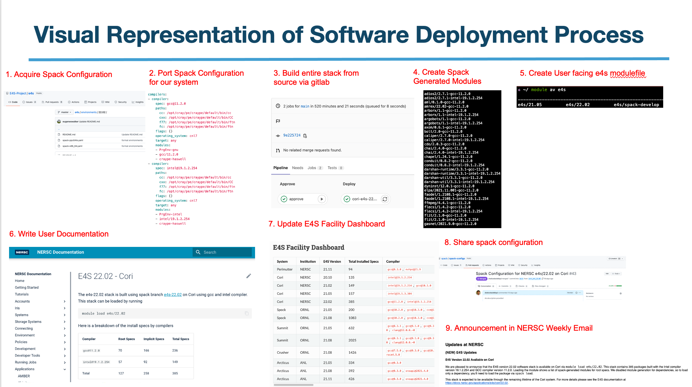

# Software Deployment: Bringing E4S Resources into Effective Action

**Hero Image:**

- [E4S logo superimposed on the tile floor of a computer center, representing a machine room that is ready to receive a new computer system with E4S ready to be deployed.  Both the room and the software are ready for the new machine.]

#### Contributed by [Shahzeb Siddiqui](https://github.com/shahzebsiddiqui) and [Sameer Shende](https://github.com/sameershende)

#### Publication date: June 15, 2022

## Introduction

Software development involves the step-by-step process of inventing, specifying,
coding, recording, testing and fixing bugs.  But, just because you’ve built software 
doesn’t mean it’s ready for prime time. Software deployment is a set of crucial 
activities that takes software and makes it available for use on the target 
system. 

Many of us deploy software for ourselves - build, test, set up paths, etc. But,
as our software grows in capability, so also can the deployment process grow in 
complexity. The software landscape for high-performance computing (HPC) contains a 
wide range of workloads that require third-party software and commercial 
products to be installed on HPC systems.  This complexity requires expertise 
from HPC centers to invest time in deploying a software stack to meet the needs 
of their user community and ensure software runs with optimal performance on the 
target system architecture.

*What is your software deployment strategy at your organization?* *Have you 
thought about how you plan to build, install and deploy a software stack that 
can be sustainable for the lifetime of an HPC system?* 

Every community needs to think about their software deployment strategy, 
including:

- **Users** need to think about how to create a portable and reproducible 
environment, perhaps using containers versus software provided on the system vs 
building their own stack using tools such as Spack, Conda, pip, and EasyBuild.
- **Developers** of software need to think about how to make it easier for users 
to employ their software correctly and handle software dependencies.
- **HPC facilities** need to think about how to support a large community of 
users, opting to install some software packages and using modules for easier
deployment.

When deploying a software stack, you may want to consider the following:
- *What type of workloads do your users run?*
- *How many versions of particular software should you support?*
- *To what extent do you want to support the Python, R, Ruby, Perl, and Anaconda 
software ecosystem or should this be responsibility of the user?*
- *Should the facility install any software requested by the user or have a 
formal process for software request that goes through a review process?* 
- *What software needs to be installed by HPC centers vs which software 
needs to be managed by users or groups?* 

## Software deployment in an HPC environment

In an HPC environment, this complexity requires a community to tackle the issues.  The [Extreme-scale Scientific Software Stack (E4S)](https://e4s.readthedocs.io/en/latest/introduction.html)
is a community effort supported by the [Exascale Computing Project (ECP)](http://exascaleproject.org)
to provide open source software packages for developing, deploying and running 
scientific applications on HPC platforms. Even with 
software seemingly packaged and delivered with a bow like E4S, the actual 
deployment can be fraught with pitfalls and decisions to make for site-specific 
customizations. 

E4S is a collection of 100+ top-level scientific software packages needed
for scientific computing in HPC environments. E4S member packages must demonstrate compatibility with the E4S
[community policies](https://e4s-project.github.io/policies.html), 
including a production quality Spack-based build and installation procedure. 
The Department of Energy Office of Science (DOE SC)
[Advanced Scientific Computing Research](https://www.energy.gov/science/ascr/advanced-scientific-computing-research)
Facilities (NERSC, OLCF and ALCF) are expected to build and deploy E4S on 
pre-exascale systems, thereby helping to ensure a consistent programming environment 
for users across facilities. 
An HPC facility software deployment process is 
typically aligned with planned system upgrades, since both may require a rebuild 
of the full software stack. 

In 2021, the [National Energy Research Scientific Computing Center (NERSC)](https://nersc.gov/)
released their first deployment of E4S/20.10 on Cori using the [Spack](https://spack.io/) 
package manager.  NERSC wanted to leverage E4S to enable ECP and NERSC users to accelerate 
their scientific research with updated versions of software products needed for 
simulations and to provide feedback to ECP 
[Software Technology](https://www.exascaleproject.org/research/#software) 
teams regarding build failures during deployment so they could be fixed in future versions. 
Here, we describe the steps and lessons learned to deploy the E4S software stack at 
NERSC to help others navigate E4S deployment for other computing environments.  The lessons learned can also 
guide future developers of packaged community software on development-to-deployment 
requirements. A full [technical report](https://www.osti.gov/biblio/1868332-software-deployment-process-nersc-deploying-extreme-scale-scientific-software-stack-e4s-using-spack-national-energy-research-scientific-computing-center-nersc)
explains this work in detail. 

## E4S software deployment recipe at NERSC

As illustrated below, the high-level steps used to deploy E4S at NERSC are as follows:
- Acquire a Spack configuration from the E4S project (https://github.com/E4S-Project/e4s)
- Configure your Spack configuration with compilers, package preferences, and list of
packages to install
- Build the entire Spack stack via "spack install" using Gitlab 
- Generate modulefiles for the Spack stack
- Create a user-facing **e4s** modulefile
- Write user documentation for the E4S stack in NERSC user documentation 
- Share Spack configuration in https://github.com/spack/spack-configs and update the
E4S documentation page https://e4s.readthedocs.io/en/latest/facility_e4s.html 
- Add announcement in NERSC weekly email

 

[NERSC software deployment process from inception to deployment.]

## Deployment tools

We can also leverage containers to provide a software stack to end users.  For 
instance, E4S comes with several pre-built containers that can be ready to use 
instantly. If one supports containers, the [Singularity Registry HPC](https://singularity-hpc.readthedocs.io/en/latest/) 
can be handy in converting containers into modules so one can access containers 
using the module command. 

We can leverage other packaging tools like [pip](https://pip.pypa.io/en/stable/)
and [Conda](https://docs.conda.io/en/latest/) to support the Python community, 
[gem](https://rubygems.org/) for Ruby, [cpan](https://www.cpan.org/) for Perl, and 
[cran](https://cran.r-project.org/) for the R community. 

The [NVIDIA GPU Cloud (NGC)](https://www.nvidia.com/en-us/gpu-cloud/) can be used 
to provide pre-built containers optimized for NVIDIA GPUs. 

[Spack](https://spack.io/) and [Easybuild](https://easybuild.io/) provide HPC 
teams support to build a software stack from source. 

The [OpenHPC](https://openhpc.community/) project is a community effort to 
provide tools for deploying HPC clusters, including provision tools, 
a resource manager, development tools and scientific libraries; you can deploy
OpenHPC at your site as a means to provide a software stack at your HPC site.

A team for HPC support should take into account user requirements and any monitoring
data such as module tracking or software library tracking, for example [XALT](https://xalt.readthedocs.io/en/latest/), 
to see usage trends to determine which packages to install in their software stack. 

## Software deployment as an integral part of HPC centers

Software stack deployment requires intimate knowledge of the HPC system as well as 
in-depth knowledge of the target software packages to ensure that each package is built 
optimally for the system. A wide variety of workloads typically run 
on HPC systems (including AI, data analysis, modeling and simulation, remote sensor 
data), and an HPC center needs to support all types of workloads applicable for their
site. 

This complexity requires a software deployment team as an integral part of each 
HPC center.  We need to train existing staff and/or increase the workforce 
to support a comprehensive software stack, such as E4S, at computing facilities. HPC 
centers can also benefit from one another's experiences by sharing information about the software deployment process. 
This information may especially benefit those centers that do not already have a well-established deployment process.

We welcome the community to share their deployment strategies and best 
practices for software stack deployment. Let’s share game plans and learn from one another. 

## Author bios

[Shahzeb Siddiqui](https://github.com/shahzebsiddiqui) is a HPC 
Consultant/Software Integration Specialist at 
[Lawrence Berkeley National Laboratory](https://www.lbl.gov/) at 
[NERSC](http://nersc.gov/). He is part of 
[User Engagement Team](https://www.nersc.gov/about/nersc-staff/user-engagement/) 
that is responsible for engaging with NERSC user community through user support 
tickets, user outreach, training, documentation. Shahzeb is part of the 
[Exascale Computing Project (ECP)](https://www.exascaleproject.org/) in 
[Software Deployment](https://www.exascaleproject.org/research-group/software-deployment-at-the-facilities/) (SD) group 
where he is responsible for building Spack [Extreme-Scale Scientific Software Stack](https://e4s-project.github.io/) (E4S) at the DOE facilities. 
Shahzeb Siddiqui started out his HPC career in 2012 
at [King Abdullah University of Science and Technology](https://www.kaust.edu.sa/en) (KAUST) 
while pursuing his Masters. His HPC focus includes parallel programming, 
performance tuning, containers (Singularity, Docker), Linux system administration,
scientific software installation and testing, scheduler optimization, and 
job metrics. Shahzeb has held multiple roles in the following 
companies: Dassault-Systemes, Pfizer, Penn State, and IBM. Prior to 2012, he was 
a software engineer holding multiple roles at Global Science & Technology, 
Northrop Grumman, and Penn State.

Sameer Shende has helped develop the 
[TAU Performance System](http://www.cs.uoregon.edu/research/tau/home.php), the 
[Program Database Toolkit (PDT)](https://www.cs.uoregon.edu/research/pdt/home.php), 
the [Extreme-scale Scientific Software Stack (E4S)](https://e4s.io) 
and the HPCLinux distro. His research interests include tools and techniques for 
performance instrumentation, measurement, analysis, runtime systems, 
HPC container runtimes, and compiler optimizations. He serves as a 
Research Associate Professor and the Director of the 
[Performance Research Laboratory](https://nic.uoregon.edu/prl/home.php) at the 
[University of Oregon](https://www.uoregon.edu/), 
and as the President and Director of [ParaTools](https://www.paratools.com/),
Inc., ParaTools, and SAS. He leads the SDK project for the 
Exascale Computing Project in the area of Programming Models and Runtime. 
He received a B. Tech. in Electrical Engineering from IIT Bombay, and M.S.
and Ph.D. in Computer and Information Science from the University of Oregon.

<!---
Publish: yes
Track: experience
Pinned: no
Topics: release and deployment, configuration and builds
--->
