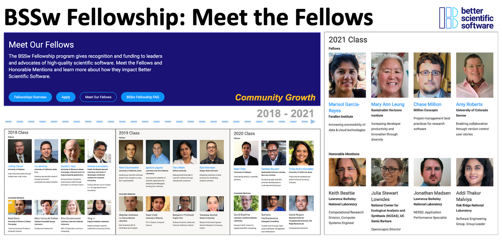
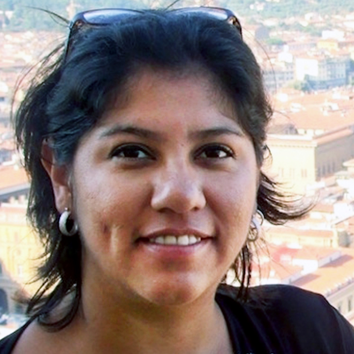
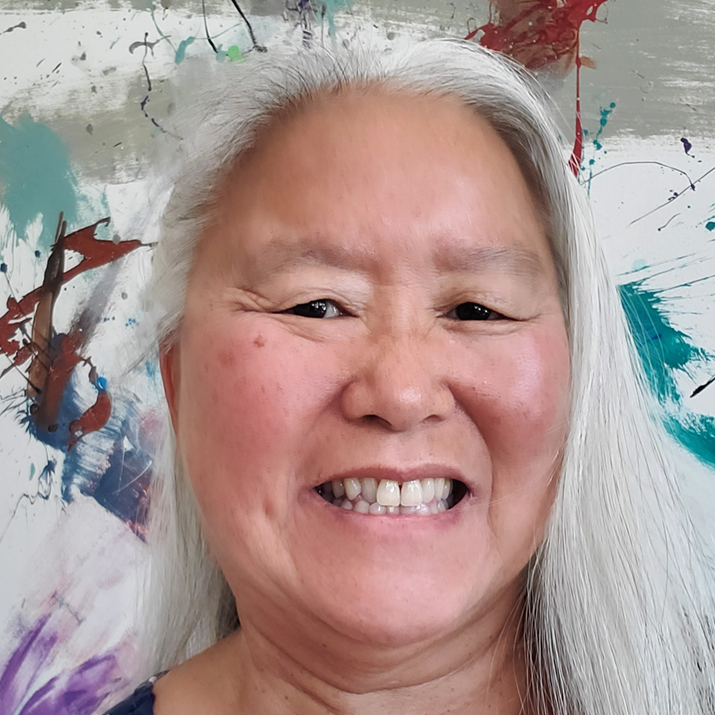
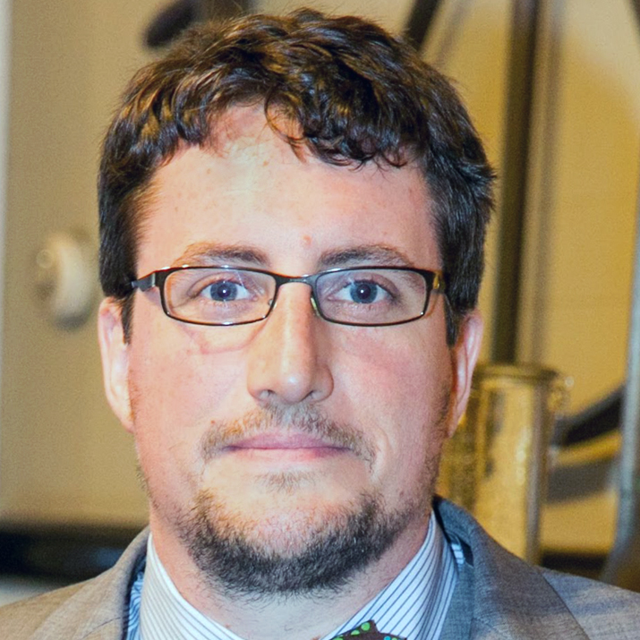
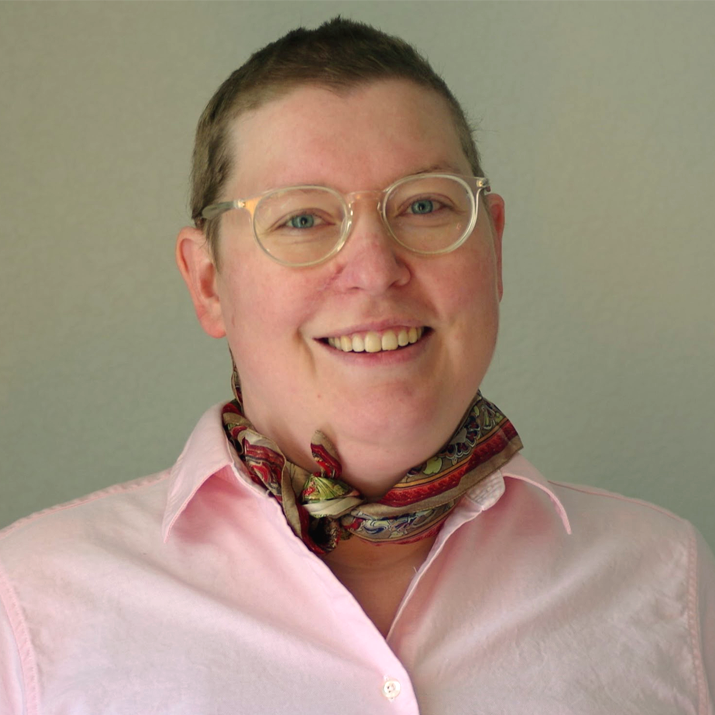

# 2021 BSSw Fellows: Projects and Perspectives

Read about the 2021 BSSw Fellows and their contributions to the BSSw community!

#### Contributed by: [Hai Ah Nam](https://github.com/hnamLANL "Hai Ah Nam GitHub Profile"), [Marisol Garcia-Reyes](https://github.com/marisolgr "Marisol Garcia-Reyes GitHub Profile"), [Mary Ann Leung](https://github.com/maleung "Mary Ann Leung GitHub Profile"), [Chase Million](https://github.com/millionconcepts "Chase Million GitHub Profile"), [Amy Roberts](https://github.com/pibion "Amy Roberts GitHub Profile")

#### Publication date: July 26, 2022

[Better Scientific Software (BSSw) Fellowships](https://bssw.io/fellowship) provide resources and community support to those who foster and promote practices, processes, and tools to improve developer productivity and software sustainability of scientific codes.

The 2021 BSSw Fellows have used their skills to create tutorials, webinars, and tools to guide developers through various stages of the scientific software lifecycle and impact the culture of scientific software development. 

Here's more about what they have been up to and their perspectives on the BSSw Fellowship Program.

### Increasing accessibility of data (e.g. satellite data) & cloud technologies to a broad scientific community through easy-to-follow Python tutorials

BSSw Fellow Marisol Garcia-Reyes developed an online tutorial with comprehensive examples, that teaches how to easily access data increasingly available in the cloud (e.g. earth sciences satellite data) and analyze and visualize the data using cloud computing resources. The tutorial provides foundations in Python programming and reproducible research using Jupyter Notebooks, Git, software citations, and cloud computing. This tutorial aims to lower the barrier to entry and broaden the community of scientists and students that have access to and can use satellite data and cloud computing resources. The tutorial is designed for those whose expertise is not satellite imagery or those that lack the necessary programming proficiency to use these data.  Learn more at:

<a href="https://github.com/marisolgr/python_sat_tutorials" class="link-row"> Tutorial: Timeseries of Satellite Data using Python</a>
<a href="https://ideas-productivity.org/events/hpc-best-practices-webinars/#webinar063" class="link-row">HPC Best Practices Webinar: Acquisition and Analysis of Times Series of Satellite Data in the Cloud – Lessons from the Field</a>
<a href="https://bssw.io/blog_posts/navigating-the-transition-of-climate-science-to-the-cloud" class="link-row">Navigating the transition of (climate) science to the cloud</a>

  

  

 
 

<a href="http://www.faralloninstitute.org/marisol">Marisol</a> is a Principal Scientist at the Farallon Institute, a nonprofit scientific organization dedicated to the understanding and preservation of healthy marine ecosystems. Marisol is committed to increasing equity and diversity in science and education by improving access to computational technology and increasing broadening participation. She is interested in providing and improving code that scientists in other fields (and other users) with limited coding skills, experience, or even time, can use to access and analyze satellite data, like climate and ocean data, to improve their research or knowledge.

  

_Perspectives on the BSSw Fellowship Program:_ I wanted to become a BSSw fellow for the opportunity to work on a project I feel passionate about, to be able to develop a learning tool to bring cloud computer and satellite data to new and non-expert users. But beyond the funding to do so, the fellowship also provided support and ideas, accountability and sometimes necessary encouragement to help me reach my goal. Thanks to that, the tutorial developed has and will have a positive impact on my professional life, as it helped me to acquire and greatly improve my skills. Now, I hope it helps others to navigate new waters, and find new ways to do science.

_Advice for new (prospective) BSSw Fellows:_ For new fellows, my advice is keep in touch and take advantage of the advice and support. Everybody wants you to succeed!

- - -

### Increasing developer productivity and innovation through diversity and the normalization of inclusion

According to a DOE Advanced Scientific Advisory Committee Workforce Subcommittee Letter in 2014, DOE labs are facing workforce challenges and need to develop more effective techniques to attract and sustain a full spectrum of talent. The letter also calls for new approaches to recruiting and retaining computing sciences staff, especially those from underrepresented backgrounds such as women and minorities. To address the challenge to develop, retain, and diversify the workforce, BSSw Fellow MaryAnn Leung developed and curated lessons learned exemplar programs, and activities, that the scientific software development community can adopt, adapt, and put into practice. She (1) facilitated community discussion to scope the needs and collect best practices and (2) disseminated the lessons learned in both written and presentation formats. These activities increase awareness and knowledge of key issues and approaches to diversity and inclusion. Learn more at:

<a href="https://doi.org/10.6084/m9.figshare.17192492" class="link-row">DOE RFI response on Software Stewardship: “A multipronged approach to building a diverse workforce and cultivating an inclusive professional environment for DOE high-performance computing” </a>
<a href="https://bit.ly/ECP-Broader-Engagement-Initiative-2022-03" class="link-row">ASCAC presentation on “ECP Broader Engagement Initiative” </a>
<a href="https://ideas-productivity.org/events/hpc-best-practices-webinars/#webinar064" class="link-row">HPC-Best Practices Webinar: Normalizing Inclusion by Embracing Difference</a>
<a href="https://meetings.siam.org/sess/dsp_programsess.cfm?SESSIONCODE=71877" class="link-row">Panel Discussion on Diversity and Inclusion for Careers in CSE: Challenges and Best Practices</a>
<a href="https://meetings.siam.org/sess/dsp_programsess.cfm?SESSIONCODE=73827" class="link-row">Current and Future Trends Impacting Inclusivity in High-Performance Scientific Computing</a>
<a href="https://www.lorentzcenter.nl/vive-la-difference-research-software-engineers.html" class="link-row"> Increasing developer productivity and innovation through diversity and the normalization of inclusion</a>

 

    
  

<a href="https://shinstitute.org/category/our-team2/">Mary Ann</a> is a nationally acclaimed leader in the design and implementation of innovative programs aimed at developing the next generation of science, technology, engineering, and mathematics (STEM) leaders. To advance her passion for increasing diversity and promoting inclusion in the workforce, Dr. Leung founded the Sustainable Horizons Institute, utilizing her combined experience in scientific computing and education to lead programs and catalyze change.

  

_Perspectives on the BSSw Fellowship Program:_ The BSSw fellowship is a great opportunity to connect with an esteemed group of scientists throughout the DOE community and beyond.  Through BSSw, I met a variety of people with similar interests, shared stimulating conversations, and started collaborations; I was invited to join the US Research Software Engineers Diversity, Equity, and Inclusion Working Group and also was invited to give a keynote address at the <a href="https://www.lorentzcenter.nl/vive-la-difference-research-software-engineers.html"> Vive la differénce - research software engineers</a> Lorentz workshop.

It has been a rewarding experience to share my work more broadly and to help spread the word about how diversity, equity, and inclusion can help stimulate more innovation and catalyze inclusive scientific computing ecosystems.  It has been a very enriching experience.

_Advice for new (prospective) BSSw Fellows:_ I encourage new fellows to take advantage of the many opportunities to meet other fellows and members of the scientific computing community.  There is a vast set of resources and opportunities to help expand your work and stimulate new ideas and approaches.  One of the guiding principles in our work relies on an openness to expanding one’s network in order to learn new approaches and ways of thinking and to catalyze more innovation.  While there are strong forces aimed at keeping things the same and supporting an affinity for likeness, the rewards of diversity are vast and essential as we move forward into the changing landscape of of scientific computing.  The future lies in embracing difference and learning how to exploit it to stimulate more innovation.
  
- - -

### Translating best practices in traditional software project management to research software development

Both software development and scientific research are notorious for taking more time than naively expected. Research scientists typically have little training in project management, and many project management practices were developed in business or engineering contexts and include assumptions that do not work well in research. One result is that software development is often under-supported in research proposal work plans, and the quality of the output suffers. BSSw Fellow Chase Million is providing tools and techniques for generating realistic and useful software project estimates that account for the unique circumstances of scientific research. Learn more at:

<a href="https://www.youtube.com/watch?v=Ks0zOa4Z5bM" class="link-row">Open Planetary Lunch Talk: Strategies for Research Software Estimation (video)</a>
<a href="https://github.com/MillionConcepts/software_project_management" class="link-row"> Software Project Management Best Practices Document: “A practical guide to research software project estimation”</a>
<a href="https://ideas-productivity.org/events/hpc-best-practices-webinars/#webinar066" class="link-row">HPC-Best Practices Webinar: Effective strategies for writing proposal work plans for research software</a>
 

 
  

<a href="https://millionconcepts.com/about.html">Chase</a> is an astronomer, programmer, and entrepreneur. He is the Founder and CEO of Million Concepts, a company that provides research software engineering services. He is also a founding board member of OpenPlanetary, an international non-profit that promotes the use of open research workflows in planetary science.

  

_Perspectives on the BSSw Fellowship Program:_ My fellowship project is primarily about conveying a method for research software scoping and estimation that I've found to be efficient and effective, but it contains a little bit more than that. The fellowship made it possible for me to take time to think carefully about—and document some of—my hardest-won lessons about research software engineering. Magicians might call it "the real work;" these are not just the secrets that make the magic trick work, but the secrets that make the magic trick good. That is to say, information about how to set up the conditions so that research software can be developed at all. How to determine what needs to be made, that it is worth making, that it is possible to make. How to convince yourself and others that success is within reach, and to then achieve it. Not much of this is taught in classrooms, as far as I can tell; most of it is contained in books, but you need to read a lot of them! If you are quite lucky, you have a good mentor who can convey it to you one-on-one. But now I've been able to write some of it down, and it can hopefully be useful to more people. Without the support of the BSSw fellowship, I might not have had the time to write it down until after retirement, and that would be too late for many. I'm honored to be able to take the time to work on this at this point in my career.

_Advice for new (prospective) BSSw Fellows:_ If you're thinking of applying for a BSSw fellowship, you already understand that good research software is a scientific force multiplier. Good software enables more, faster, and better discovery than would have otherwise been possible. But it's a rather recent development that software is generally—across domains—recognized and treated as critical infrastructure to the research enterprise and a first-class research product in its own right. It has only been within the last few years that there is even a specific job title for this type of work: research software engineer. What this job means, the expectations for training, the standards for work output… all of that is still being defined. And this is a task BSSw exists to help with.

It is a very exciting time for us! As research software engineers, we already have the capability to accelerate scientific discovery. But by virtue of our good luck to be alive right now, we also have the opportunity to create the conditions—with training, cultures, institutions, opportunities, advocacy, etc.---to increase the rate at which excellent research software is generated. We can accelerate the accelerant. There's so much impactful work to be done, and probably something that you can uniquely contribute, and I think that you should.

- - -
### Enabling collaborative work on scientific software through accessible, user-focused version control tutorials

Version control is an essential tool for collaborative work on software, but domain scientists lack the knowledge they need to contribute to these efforts. There are often only a handful of developers who have the skills needed to work collaboratively on software and this limits the sustainability of software efforts that are increasingly crucial to their communities. Existing version control training materials focus either on the underlying theory or a comprehensive overview of version control. Such material can be inaccessible to new developers if they cannot identify what information is applicable to their specific problem. BSSw Fellow Amy Roberts developed accessible, user-focused tutorials on version control that give scientists the information they need to contribute to shared software. The version control tutorials center around common user stories and directly address how a scientist should interact with version control to work collaboratively in common science scenarios. Art that illustrates broader ideas will be commissioned and tested along with the tutorials to help new users translate everyday concepts into the equivalent version control terminology. Learn more at:

<a href="https://gitlab.com/git-stories" class="link-row">User stories development space</a>
<a href="https://docs.google.com/presentation/d/14XSZrlmfGcXpLKbULDUoObdKX6xqG78ELC2PuShPkcc/edit#slide=id.gcf84fecc34_0_18" class="link-row">Poster and Breakout Presentation at 2022 ECP Annual Meeting</a>
<a href="https://git-stories.slack.com" class="link-row">Get help with git and join the discussion Slack workspace for the community</a>

 

 
  

<a href="https://clas.ucdenver.edu/physics/amy-roberts-phd">Amy</a> is an assistant professor of physics at the University of Colorado Denver where she leads a research group focused on dark matter detection. She searches for dark matter signals and works to build accessible computing ecosystems. Amy also serves as an editor for the Journal of Open Source Software and believes that complete, usable software infrastructure — together with accessible training and documentation — are necessary for a successful and equitable scientific community.

  

_Perspectives on the BSSw Fellowship Program:_ 
I’ve been delighted to find out that if there’s something in scientific computing that I’m working on, there are other people who are also thinking about it and often working on it.  Being a BSSw fellow has helped find other scientists whose efforts I can now connect with and learn about existing projects and resources that I can use instead of invent.  If you’re working on topics that benefit from connecting to existing community efforts, BSSw can be a fantastic resource. 

_Advice for new (prospective) BSSw Fellows:_ 
 I would encourage BSSw fellows to always default to reaching out to the BSSw staff and network - everyone will be glad to hear from you and help out!
 
- - -

### Learn more about the BSSw Fellowship Program
  
BSSw Fellows are selected annually based on an application process that includes the proposal of a funded activity that promotes better scientific software. See more about the [BSSw Fellowship Program](https://bssw.io/fellowship). We will begin accepting applications for 2023 BSSw Fellowships during mid-August 2022. Register for the [BSSw mailing list](https://bssw.io/pages/receive-our-email-digest) to receive information.
  
### Author bio
  
Hai Ah Nam is coordinator of the BSSw Fellowship Program, a member of the [IDEAS-ECP](https://ideas-productivity.org/ideas-ecp) team, and a researcher in the [Advanced Technologies Group at NERSC/LBNL](https://www.nersc.gov/about/nersc-staff/advanced-technologies-group/hai-ah-nam/).  Her scientific career spans four DOE national laboratories (LLNL, ORNL, LANL, LBNL), where she has contributed to work in low-energy nuclear physics, computational physics, high performance computing, and research scientific software development.  Hai Ah’s current research interests include emerging technologies for the HPC ecosystem, with a focus on AI/ML capabilities.  
  
<!---
Publish: no
Pinned: no
Topics: Projects and organizations
RSS update: 2021-07-26
--->
