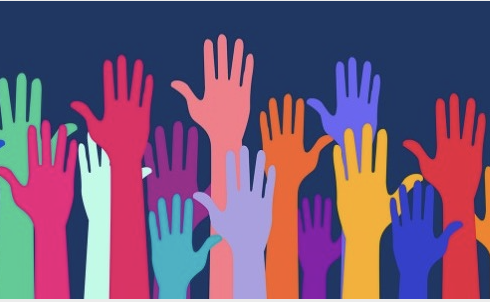

# Vive la Différence - Research Software Engineers: A Hybrid DEI-Focused Workshop 

The Research Software Alliance brings research software communities together to collaborate on the advancement of the research software ecosystem.  This article introduces outcomes of a recent workshop that explored issues in diversity, equity, and inclusion in the research software engineering community.

#### Contributed by [Kim Hartley](https://github.com/kim-hartley "Kim Hartley GitHub Profile") and [Michelle Barker](https://github.com/mdbarker "Michelle Barker GitHub Profile")  

#### Publication date: July 12, 2022

  

 

  <h3> [DOI:10.5281/zenodo.6807755](https://doi.org/https://doi.org/10.5281/zenodo.6807755)</h3>
  
*Cross-posted by the [Research Software Alliance (ReSA)](https://www.researchsoft.org/blog/) and BSSw.io.*

How can we reframe research software engineering (RSE) to place diversity, equity, and inclusion (DEI) as a central organising principle in the community? This compelling question was the impetus for the *[Vive la différence - research software engineers workshop](https://www.researchsoft.org/events/2022-04/)*, a hybrid event that took place both in person at the [Lorentz Center](https://www.lorentzcenter.nl/about-us.html) in Leiden, the Netherlands, from 19-22 April 2022; and online from March to April 2022. The workshop brought together 40 participants from across the globe, including representatives from international RSE communities and others interested in DEI. 

The workshop offered a unique opportunity for a broad range of stakeholders – who had not previously collaborated – to analyse best practices and available data, identify research opportunities, and share experiences in solving their own local challenges. The workshop aimed to address two key questions: *(1) What approaches to repositioning DEI as central to the RSE community will prove most promising?* and *(2) Which combinations of social processes and supporting technology show effectiveness in advancing the community of RSE workers to direct research toward a future centred on DEI?* 

Early discussions focused on deconstructing the assumptions that DEI and RSE are understood in the same way across all cultures, and equally relevant to all. Participants noted the importance of exploring how software engineering can benefit research in all cultures; however, it is not yet clear if RSE is an universally applicable framing. The workshop included inputs from social science perspectives that helped connect efforts on improving DEI in RSE with some similar efforts in the open source software community, as these communities overlap. Participants expressed interest on how to leverage research studies that identify problematic practices, and more inclusive practices that are now being developed, to enable change in their own contexts.

### Inclusive design 

From the workshop’s inception, the organisers used principles for inclusive design and created varied opportunities for engagement to maximise sharing of best practices and building of networks. The event was hybrid to ensure that all those that wanted to participate could, without having to be in a certain place and/or at certain times. Participants included stakeholders from 12 countries, and 12.5% represented Global South nations: Colombia, India, Kenya, and Namibia. Eighty-two percent of participants identified as from an under-represented minority, including 56% who identified as from an underrepresented minority other than women (e.g., ethnic minority, LGBTQ+, and/or person with a disability). 

Providing an online, accessible program was a key part of integrating DEI principles in the workshop; and 50% of attendees chose to participate online. Approximately half of the participants provided formal 5-10 minute talks to seed discussion, and the majority of other participants facilitated sessions, thereby breaking down any perceived divide between formal speakers and other attendees. 

### Workshop success 

The hybrid workshop was a success, contributing to the creation of an informal network of champions of DEI in the research software community. Overall, participants’ feedback was very positive: 60% of participants completed the event feedback form, and 58% of participants rated the workshop as excellent, 34% as good, and 8% as satisfactory. The event generated many ideas, which will help move this agenda forward. Notably, national RSE associations have developed [DiveRSE](https://diverse-rse.github.io/) – a series of online discussions to provide a public forum to complement the Lorentz workshop, with an aim to broaden engagement in this discussion. 

ReSA is grateful to the Alfred P. Sloan Foundation, the Chan Zuckerberg Initiative, and the Ford Foundation, for travel-related funding and organising costs; and to Leiden University and the Dutch Research Council (NWO) for the support provided via the Lorentz Center for workshop facilities. 

### Next steps

A [full report](https://doi.org/10.5281/zenodo.6816192) written and edited collectively by workshop participants has been published. Speakers’ videos are available via ReSA’s Lorentz Center workshop YouTube [playlist](https://www.youtube.com/playlist?list=PL9LY1bVcxGJd8QhKQYgWd7jtArqrxw7oO). [Slides](https://drive.google.com/drive/u/0/folders/1zDauVIR5OSfU7Gt2pSNtb7AhZFdrpifN) are also publicly available.

If you’re interested in exploring this topic and sharing information with others in the global research software community, please join ReSA’s monthly [Community Forum](https://www.researchsoft.org/events/2022-06/). The first call will take place on **19 July 11-12 UTC** ([convert to your timezone](https://www.timeanddate.com/worldclock/fixedtime.html?msg=Research+Software+Community+Forum&iso=20220719T11&p1=1440&ah=1)). Dr. Michelle Barker, ReSA Director, will give a short talk on the outcomes of the Vive la différence - research software engineers workshop. To receive calendar invites and agendas for ReSA’s monthly Community Forum meetings, please sign up [here](https://landing.mailerlite.com/webforms/landing/o1n4v3).

#### To join the July meeting: 
[Zoom Link](https://us02web.zoom.us/j/2187873236?pwd=cXpmZXQzalhMcGlUN0J1bWUzdVM3QT09#success), (passcode: 446688). 
 [Download a calendar invite](https://drive.google.com/file/d/1b0Bd2OdKH5xRYf4HjclUot7lqKV4veU1/view). 
  
### Author bios
  
Dr. Michelle Barker is the Director of the Research Software Alliance. She has extensive expertise in open science, research software, digital workforce capability and digital research infrastructure. As a sociologist, Michelle is passionate about building collaborative partnerships to achieve system change. She is a former Director of the [Australian Research Data Commons](https://ardc.edu.au), has co-chaired the Research Data Alliance Organisational Advisory Board, chaired the OECD Expert Group on [digital skills for the research sector](https://www.oecd-ilibrary.org/science-and-technology/building-digital-workforce-capacity-and-skills-for-data-intensive-science_e08aa3bb-en); she also co-edited the European Open Science Cloud (EOSC) report, [Digital Skills for FAIR and Open Science](https://www.eoscsecretariat.eu/news-opinion/digital-skills-fair-open-science-report-eosc-skills-training-working-group).

Kim Hartley is a community manager at the Research Software Alliance and part of the international relations team at the [Digital Research Alliance of Canada](https://alliancecan.ca/en). Kim supports the [Research Software Funders Forum](https://www.researchsoft.org/funders-forum/), a formal mechanism for international funding organisations to collaborate. A social anthropologist by training, Kim brings a passion for understanding the ways in which people live in different social and cultural settings globally to her work managing communities. She has extensive experience in academic research administration, including managing research ethics boards, advising diverse stakeholders, and building partnerships.

<!---
Publish: yes
Track: community
Pinned: no
Topics: projects and organizations, inclusivity, Research Software Engineers
--->
