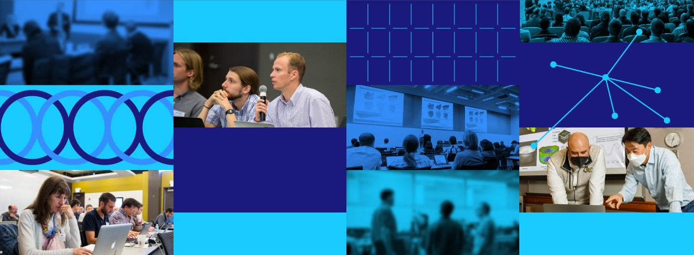
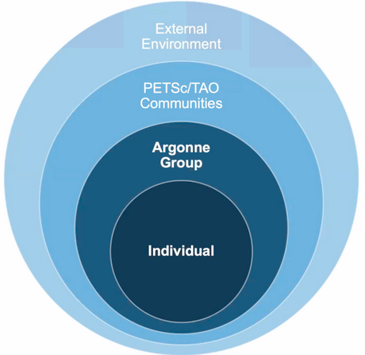
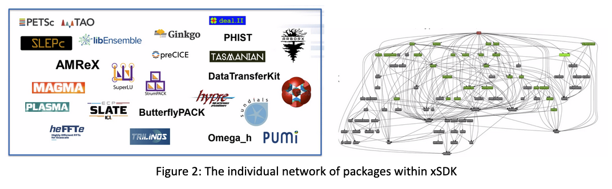

# Distributed, Interconnected Teams through the Lens of Team of Teams Principles

**Hero Image:**

- 

#### Contributed by [Miranda Mundt](https://github.com/mrmundt), [David M. Rogers](https://github.com/frobnitzem), [Reed Milewicz](https://github.com/rmmilewi), [Todd Munson](https://github.com/tmunson), [Elaine M. Raybourn](https://github.com/elaineraybourn), [Benjamin Sims](https://github.com/bhsims), [Jim Willenbring](https://github.com/jwillenbring), and [Ulrike Yang](https://github.com/ulrikeyang)

#### Publication date: October 14, 2022

### Introduction

The Exascale Computing Project (ECP) core mission is to develop a capable exascale computing ecosystem that
accelerates scientific discovery and supports addressing critical challenges
in energy, Earth systems, materials, data, and national security. The
nature of this mission has drawn a wide range of talented and successful
scientists with diverse backgrounds to work together in new ways toward this
goal. As we work together, we want to accelerate and leverage the agility that
occurs in small teams — and scale it out to the HPC community.

On August 25, Elaine Raybourn of Sandia National Laboratories hosted the next
in the [Strategies for Working Remotely Panel Series](https://www.exascaleproject.org/remote-panel-archive/)
titled
“[What Can Be Learned from Applying Team of Teams Principles to the ECP Projects PETSc, Trilinos, xSDK, and E4S?](https://www.exascaleproject.org/event/team-of-teams1/)”
Panelists Todd Munson (Argonne National Laboratory), Ulrike Yang
(Lawrence Livermore National Laboratory), and Jim Willenbring
(Sandia National Laboratories) explored lessons learned from their
experiences with these projects as viewed
from the lens of a “Team of Teams.” Intermixed with these panelists were
commentators Reed Milewicz (Sandia National Laboratories) and Benjamin Sims (Los Alamos National Laboratory), who injected valuable commentary on themes as
they appeared throughout the discussion.

“Team of Teams,” as defined by Stanley McChrystal,[1] has the following key aspects:

- Shared consciousness — as shown by an aligning narrative that answers basic
  questions: What is the mission? What is our role in this larger organization?
- Empowered execution — as shown by autonomous decision-making ability
- Leading like a gardener — as shown by leaders that favor guiding,
  facilitating, nurturing, and empowering the growth of the ecosystem rather
  than directing as in game of chess
- Liaisons — as demonstrated by participants who are part of different teams at
  once, enabling them to build networks and break down silos.

The panelists talked about ways that these aspects are manifest in practice.
From the discussion, several common themes emerged:

### Individual Team Autonomy

What makes a team a team? A team is characterized by its trust, common purpose,
shared consciousness, and general autonomy. This is true of each team within a
Team of Teams – as well as being empowered by leadership to autonomously execute.

Todd Munson described this in his discussion of [PETSc](https://petsc.org/) in which he explained
how their ecosystem of teams is layered (Figure 1):

> A lot of things inside of PETSc are focused on the individual contributors.
> They are responsible for choosing where and what they do in PETSc. We have a
> process with merge requests, but ultimately we have a set of individuals who
> form into smaller teams (2-5 people) who work on key features/aspects.
> They are the ones who are choosing the activities they pursue.

 

[Figure 1: The PETSc Team of Teams ecosystem]

 

PETSc is not alone in relying on small developer groups to own individual
packages. Ulrike Yang detailed a different picture to much of the same effect
on behalf of the Extreme-scale Scientific Software Development Kit ([xSDK](https://xsdk.info/))
(Figure 2).

 

[Figure 2: The individual network of packages within xSDK]

 

As of the 0.7.0 release (November 2021), xSDK, an infrastructure for and
interoperability of a collection of related and complementary software elements,
contained 24 diverse packages. Each of these packages is maintained and
developed by individual teams, all fitting within the larger Team of Teams
structure. As Ulrike observed:

> For the xSDK product, the vision was to provide infrastructure and
> interoperability for independently developed math libraries made by
> different teams with different strategies.

If every team is doing work to advance their own goals, however, how do they
fit into the larger ecosystem? This is where the next theme comes into play.

### Leading Like a Gardener

Each panelist noted the need for a leadership group to keep the shared goals
and holistic vision on each individual team's radar. Jim Willenbring had this
to say on the topic with respect to the Extreme-scale Scientific Software
Stack ([E4S](https://e4s-project.github.io/)):

> Defining and communicating the value of something like the E4S requires a
> leader to champion the reasons motivating the work and benefits of working
> collaboratively.  Those reasons shift over time, so the community as a whole
> needs to maintain an awareness of those shared goals, stepping up and
> guiding them when needed.

What this looks like varies between the different represented communities.
For PETSc, the overarching leadership organizes open forum calls for the
development community and utilizes tools such as Slack, email lists, and GitHub’s
issue tracker. For xSDK, the leadership group assists with enforcing
community policies to ensure interoperability and minimum quality standards.

Some teams have gained decades of experience with this exact aspect.
Jim Willenbring on behalf of [Trilinos](https://trilinos.org) had this to say:

> A lot of responsibilities fall on boundaries between teams —
> like the packages without dedicated maintainers or certain porting efforts.
> Tools and technologies are also being used in different cases. There
> have been improvements in these areas. Our leadership structure evolved to
> support development, including identifying roles on the boundaries between
> teams. Along with this, planning and transparency have improved,
> establishing expectations for other teams and involving more
> stakeholders. Communication is also more frequent and detailed.

Here Jim touched on the final theme.

### Communication Is Key

Communication is where all the themes of this panel come together. Without
effective and intentional communication, whether remotely or in person, there
can be no synergistic ties between teams, and therefore, no Teams of Teams.

Every individual team will have its own communication style and workflow. They
may use GitHub Issues, email, Slack, etc., to communicate about their
individual activities. When it comes to the larger ecosystem of a Team of Teams,
however, this communication must become more intentional and targeted. The
conscious usage and commitment to communication styles can make or break a
Team of Teams. Each single team has their own responsibilities and goals they
wish to achieve, and this can lead to redundancy and lack of efficiency if not
carefully addressed and avoided.

Panelist Jim Willenbring in his exploration of E4S noted:

> If you can make different teams that are near to other teams’ efforts aware
> of their issue trackers and overall workflows, and you can manage to inject
> topics or concerns directly into their workflow, that really helps
> [break down silos]. If you just send an email or mention your concerns at a meeting,
> they may or may not gain traction.

Additionally, the “Liaison” role noted by McChrystal applies directly here.
Every panelist mentioned two essential requirements that enabled their Team of
Teams identities:

1. Core team members with strong responsibilities for maintaining the
   community — thus acting as a liaison in some part of their role.
1. Policies that define and promote shared goals, which effectively require
   work scope that falls between projects to implement.

As a final observation on the topic of communication, panelists noted that
Teams of Teams are often geographically dispersed, generally as a side effect
of the scale of the overarching ecosystem. Because of this, they often make use
of remote or hybrid work models, and did so even before the COVID pandemic.
Commentator Benjamin Sims noted that remote collaboration tools are more
accepted and accessible than ever because of the pandemic, thus opening the
door to new and more effective models of virtual collaboration and
communication. As Todd Munson reflected in relation to PETSc,

> During the pandemic, [we wanted to] make targeted goals transparent. We use
> Slack, Zoom calls, email lists, as well as GitHub issue tracker. We like
> using those products and they work well for us to keep everyone informed.

Widely distributed Teams of Teams can also be highly diverse. As Ulrike Yang
explained, this impacts communications on the xSDK development team, which
spans at least six distinct time zones:

> Differences in language, communication, and personality are
> [prominent cultural] issues. It is harder to resolve these virtually — so
> we try to take advantage of big conferences to meet up, have dinners, etc.,
> which was difficult during the pandemic. Milestones can help drive
> collaboration, which can bridge communication issues and bond. ... We are
> highly diverse — age, gender, race, nationality, technical life experience,
> etc. The large pool of connections provides access to other experts and
> helps drive innovation. The different personalities can also be helpful to
> get past blocks — for example, a positive person can move a stuck project along.

As this comment indicates, even in a world of increasing remote work, some
communication issues are best resolved by meeting and getting to know one
another in person.

### Final Thoughts

We are seeing a shift in the way teams form and interact.[2] In the concluding
discussion in which panelists, moderators, and the audience explored what
defines a Team of Teams, commentator Reed Milewicz compared how panelists’
projects were organized to the concept of the “Core-Periphery Structure”
model of open-source software development,[3] which is a common form of
top-down governance structure for open-source software projects:

> [In a conventional core-periphery style of organization,] outside community
> members who become involved in the project over time may steadily migrate
> into the core, but the decision power still rests in the core. In science,
> engineering, and mathematics, many teams are increasingly multi-disciplinary
> and multi-institutional. How PETSc members describe themselves involves many
> different teams and communities in a bottom-up approach. By increasing the
> transparency and engagement, they are moving away from having a "core" team.
> This doesn’t come for free, of course — all of these teams may have their
> own goals. But they have to be able to come together and resolve these.
> Once they do, they are able to be more productive than if they were in
> their own silos.

When collaboratively developing scientific software at scale, each actor
brings different needs and perspectives. The governance structure has to evolve
to reflect this. Many teams coming together, each with their own goals,
have to find common ground and common objectives in order to effectively
collaborate. Organizations that incorporate Team of Teams aspects are unique
in being able to incorporate objectives defined by inter-team interactions.
Panelists Todd Munson, Ulrike Yang, and Jim Willenbring explored the Team of
Teams ecosystems on behalf of PETSc, Trilinos, xSDK, and E4S and detailed the
necessity for individuality and empowered autonomy among teams, leadership
to steer and guide the big-vision and holistic goals, and intentional
communication to keep everyone aligned, especially when teams are distributed.
To watch and/or listen to the panel and others in the series visit
<https://www.exascaleproject.org/remote-panel-archive/>.

### Biographies

Reed Milewicz is a Computer Scientist and Software Engineering Researcher
in the Department of Software Engineering and Research at Sandia National
Laboratories. His research focuses on developing better practices, processes,
and tools to improve software development in the scientific domain. He leads
software science research efforts within his department and is a member of the
Interoperable Design of Extreme-Scale Application Software (IDEAS) project,
where he is part of the Productivity and Sustainability Improvement Planning
(PSIP) team.

Miranda Mundt is a Research Software Engineer within the Department of
Software Engineering and Research at
Sandia National Laboratories with an interdisciplinary background in applied
mathematics and economics. As a practitioner, researcher, and consultant,
she works closely with scientific software teams across diverse domains to
advance software engineering in scientific computing. Within the ECP, she is a member of the [IDEAS](https://ideas-productivity.org/ideas-ecp/)
project and part of the 
[PSIP](https://bssw.io/psip) team. Miranda is also an active member of the
[US-RSE Association](https://us-rse.org), where she helps lead outreach and
diversity, equity, and inclusion efforts, and is a member of the
[Inclusivity Committee for Supercomputing'22](https://sc22.supercomputing.org/attend/inclusivity/).

Todd Munson is a Senior Computational Scientist in the Mathematics and
Computer Science Division at Argonne National Laboratory. He is the Director
of the PETSc/TAO ECP project, where his technical interest is in scalable numerical
optimization methods for the high performance computers.  He has a Ph.D. in
Computer Science from the University of Wisconsin at Madison and received a
Presidential Early Career Award for Scientists and Engineers in 2006.

Elaine M. Raybourn is a Social Scientist in the Applied Information Sciences
Center at Sandia National Laboratories. Her research focuses on virtual teams,
methods for software productivity, immersive virtual environments,
scientific visualization, and transmedia learning. She was the SC21
Scientific Visualization & Data Analytics Showcase Chair. Elaine has worked
remotely for a combined total of 15 years while at Sandia National
Laboratories: from the UK as a guest researcher at British Telecom;
Germany (Fraunhofer FIT) and France (INRIA) as a Fellow of the European
Research Consortium in Informatics and Mathematics (ERCIM), and most recently
as Sandia’s Institutional PI for the IDEAS productivity
project. Elaine leads [PSIP](https://bssw.io/psip/) and the ECP panel series
[Strategies for Working Remotely](https://www.exascaleproject.org/strategies-for-working-remotely/).

David M. Rogers is a Computational Scientist in the National Center for
Computational Sciences Division at Oak Ridge National Laboratory, where he
works collaboratively to develop and apply new methods and theories for
multiscale modeling using HPC. His research interests include mathematical
and computational theory and methods for multiscale modeling. Especially
interesting open problems include applications to small nonequilibrium systems,
dielectric friction, dispersion, hydration, and its role in nanoscale devices.
David's focus at ORNL is developing more powerful and general tools,
libraries and interfaces for modeling these systems at scale.

Benjamin Sims is a scientist at Los Alamos National Laboratory. He is a
sociologist with research interests in scientific collaboration, software
development, social networks, organizational knowledge, and repair and
maintenance of infrastructures.

Jim Willenbring is a Senior Member of R&D Technical Staff in the
Center for Computing Research at Sandia National Laboratories. He is the
PI of the ECP SDK project, a member of the Trilinos Leadership Team, and a
member of the IDEAS project. In all of these roles, he is active in the research of
software sustainability and the application of software engineering
methodologies for high-performance computational science. James received a
M.S. in Computer Science from St. Cloud State University, and is currently a
Software Engineering Ph.D. Candidate at North Dakota State University.

Ulrike Yang is the Mathematical Algorithms and Computing group lead in the
Center for Applied Scientific Computing at LLNL. She leads the xSDK
project in the ECP and the Linear and Nonlinear Solvers topic area in
the SciDAC-5 FASTMath Institute. She is also a software developer for the
high-performance solvers library hypre, which received an R&D 100 award in 2007. Her
research interests are numerical algorithms, particularly iterative linear
system solvers and algebraic multigrid methods, high-performance computing,
parallel algorithms, performance evaluation and scientific software design.
She has a Ph.D. in Computer Science from the University of Illinois at
Urbana-Champaign and a Diplom in Mathematics from Bochum University in Germany.

<!---
Publish: yes
Topics: strategies for more effective teams
--->

[1-sfer-ezikiw]: https://isbndb.com/book/9781591847489 "{McChrystal, G. S., Collins, T., Silverman, D., & Fussell, C. (2015). Team of teams: New rules of engagement for a complex world. Penguin. isbn:9781591847489}"

[2-sfer-ezikiw]: https://ascr-discovery.org/2022/06/work-shift/ "{Cannon, B. (2022, June 1). Work shift: A Sandia researcher looks at how COVID-19 has reshaped the computational science community and remote work – in lasting ways. ASCR Discovery. Retrieved August 31, 2022.}"

[3-sfer-ezikiw]: https://doi.org/10.1057/jit.2010.7 "{Amrit, C., & Van Hillegersberg, J. (2010). Exploring the impact of socio-technical core-periphery structures in open source software development. Journal of Information Technology, 25(2), 216-229. doi:10.1057/jit.2010.7}"
<!-- DO NOT EDIT BELOW HERE. THIS IS ALL AUTO-GENERATED (sfer-ezikiw) -->
[1]: #sfer-ezikiw-1 
[2]: #sfer-ezikiw-2 
[3]: #sfer-ezikiw-3 
<!-- (sfer-ezikiw begin) -->
### References
<!-- (sfer-ezikiw end) -->
* 1[McChrystal, G. S., Collins, T., Silverman, D., & Fussell, C. (2015). Team of teams: New rules of engagement for a complex world. Penguin. isbn:9781591847489](https://isbndb.com/book/9781591847489)
* 2[Cannon, B. (2022, June 1). Work shift: A Sandia researcher looks at how COVID-19 has reshaped the computational science community and remote work – in lasting ways. ASCR Discovery. Retrieved August 31, 2022.](https://ascr-discovery.org/2022/06/work-shift/)
* 3[Amrit, C., & Van Hillegersberg, J. (2010). Exploring the impact of socio-technical core-periphery structures in open source software development. Journal of Information Technology, 25(2), 216-229. doi:10.1057/jit.2010.7](https://doi.org/10.1057/jit.2010.7)
