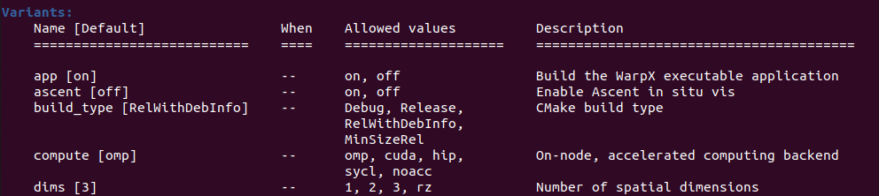

# Rethinking Software Variants

 **Hero Image:**

  - [WarpX: longitudinal electric field in a laser-plasma accelerator, rendered with Ascent and VTK-m.]

#### Contributed by: [Axel Huebl](https://github.com/ax3l)

#### Publication date: September 27, 2022

### Introduction

Scientific software is often complex, providing many options to control features, supported hardware, and performance.
In this blog post, we will take a closer look at configuration options and their influence on developer and user productivity.

Configuration options of a software package are selected in the installation phase of software: to be precise, the configuration and compilation phase.
As a result, they cannot be changed without reinstalling the software.

These days, nearly all high-performance computing (HPC) software uses configuration options; and most of the time, these are implemented via preprocessor logic, that is, using #ifdef's in C/C++/Fortran code.
It is extremely common that these switches are implemented exclusively, creating incompatible variants and binaries.
Here we argue that this approach can have severe productivity implications for users and developers alike, including documentation and installation burdens, issues with usability, testing overhead, and limited composability; and we show potential solutions for a better binary variant design for HPC.

### HPC examples

The most common pattern of variations for HPC software is options for parallelism.
In the simplest case, this is a flag that enables or disables MPI support in the software.
With the rise of GPU computing over the past decade, a similar option is often added for GPU acceleration.

Library and application developers in HPC might then add more domain-specific compilation options, such as additional numerical solvers supported by external math libraries (e.g., BLAS, LAPACK, or FFT) and choices of geometry of a model.

### The catch

Generally, such configuration options can be implemented at build time in two ways: binary switches and multivariant options.
Binary switches are simply turning a functionality on or off, for example, MPI support.
Multivariant options might be more involved, for example, accelerating code for a specific GPU programming environment (CUDA, HIP, SYCL, OpenMP, or OpenACC offloading).

The catch with such options lies in sharing software with other people who want to reuse it in their own libraries and applications, develop against it, and deploy their own product to other developers and users.
Our experience is that problems for developers of "downstream" HPC software arise mainly from the implementation of these options.

For instance, runtime options that change with the chosen binary option need to be carefully documented for users or downstream developers — and they complicate the user experience in already tricky installations.
Workflows have to be established when switching functionality downstream: Do you change configuration of the upstream dependency and rebuild or reinstall? Do you find and use the new variant of the dependency that is packaged separately?
Testing also gets more complicated. If you cannot create a single environment that enables and tests all functionality, you might need to recompile significant portions of the software stack to enable different tests.
Even with sufficient automation, this process increases continuous integration time and can strain deployment resources.

A few specific examples will help illustrate the challenges.

**Breaking public APIs**

Without due care,  scattered #ifdef switches can easily end up changing public APIs that downstream applications may depend on: extra parameters in functions, different class signatures and constructors, varying members, and so on.
In the most common case in HPC, the change of the upstream option has to be mirrored 1:1 downstream with `#ifdef`s at call locations, because existing signatures are *changed*.

Such API changes also always lead to incompatible application binary interfaces (ABIs) when building library interfaces.
In the best case, the linker will catch an incompatible binary variant of the same software version via missing symbol errors.

In the worst case, a more subtle ABI break will only manifest at runtime.
For example, the addition, removal, or change of member variables of public classes via #ifdef's can create undefined behavior when copying or accessing the class, even if these members are private.
The website [ABI Laboratory](https://abi-laboratory.pro) summarizes more details on this topic.
For examples that track potentially breaking ABI changes over time, see, for instance, [MPICH](https://abi-laboratory.pro/index.php?view=timeline&l=mpich), [Open MPI](https://abi-laboratory.pro/index.php?view=timeline&l=openmpi) and [c-blosc](https://abi-laboratory.pro/index.php?view=timeline&l=c-blosc).

**The transitive MPI include**

Adding transitive #include's to third-party software in public APIs is one of the most common mistakes in HPC binary variant design.
The problem can be exemplified as follows.
A developer writes a serial program using an HPC-capable third-party software package, for example, to support desktop users or non-MPI based multinode parallelism.
The third-party software can be built with MPI enabled and now introduces a compile-time dependency on MPI signatures even though the specific downstream translation unit never uses it.

The results include breaking builds, the need to communicate additional, potentially inaccurate (unused) dependencies, and breakage in most desktop package managers.
A typical example is Debian and HDF5: one cannot install an MPI-parallel HDF5 package for development and the popular, serial HDFView package at the same time.

**The unconditional MPI initialize (or expectation thereof)**

This is a variation of the previous problem, which occurs at runtime as a result of an MPI binary variant.
If the MPI-enabled variant of the software *expects* that an MPI context will always be provided (or can be established), this breaks serial — and non-MPI parallelized — software applications.

One can make the same case for any other runtime that needs to be initialized or finalized, such as initialization of GPU devices or GPU streams.

**On-node acceleration**

Going into more detail on the previous point, a cardinal pattern in HPC software is to define mutually exclusive binary patterns for the "acceleration backend" of software.
Many single-source performance-portability implementations currently compile to exactly one on-node acceleration backend at a time.

For example, one might compile a numerical package to run with a CUDA backend or compile it again with an OpenMP backend or with a HIP/ROCm backend.

Delegating this decision to compile time takes away the choice to deploy binary packages or pre-build unified containers that could run on various GPU vendor hardware or be run on a CPU or GPU as a runtime option, depending on user need.
It also hinders dependent developments from utilizing the CPU and GPU at the same time, for example, in simulations with dynamic load balancing.

So-called fat binary artifacts can address this problem in part, by compiling multiple backends into the same executable and delegating the code path to choose at runtime.
Unfortunately, few established conventions and tooling currently exist for such an approach, especially across different vendors, so this particular case can be hard to deal with.

### Possible solutions and development policies

The solution to these challenges starts with everyone thinking of themselves as "upstream" developers and thinking about how downstream users might reuse their software.
This even includes application developers: someone might come up with a clever way to integrate an application — like a library — into a larger context, for example, for optimizing ensemble use cases or AI/ML workflows.

We propose the following guidelines or development policies when introducing binary variants into software.

1. Observe  strict extension-only: using compilation variants only for adding *additional* functionality  that *enhances* a package 
    - *Rationale*: toggles dependencies on and off for simplified development and deployment

2. Avoid exclusive compilation options: 
     - Avoid variants that enable functionality at the cost of disabling another, e.g., #ifdef FOUND_MPI ... #else ....
     - Treat *multioptions* as lists of functionality (e.g., compile multiple variants of CPU and GPU backends that can be selected at runtime). 
     This approach can still make use of single-source programming patterns and just needs an additional runtime dispatch at a high-level in the program workflow, where latency is usually not an issue. Similar solutions also exist  for runtime-dispatched vectorization control.
    - *Rationale*: avoids incompatibilities, supports feature-complete deployments, and enhances clarity in documentation

3. Avoid modifying the "base" behavior of the software if additional functionality is activated - existing functionality and dependencies, at compile and runtime, stays unchanged.
    - *Rationale*: supports feature-complete deployments and enhances clarity in documentation

4. Add explicit configuration and runtime control to use such opt-in functionality and enhancements.
    - *Rationale*: avoids implicit assumptions that do not necessarily hold true when combined in a combined software ecosystem

### Package managers and deployment

But hey, don't we have package managers to solve this problem for us by keeping track of the right variant?
Well, in part.
Of course, modern package managers such as [Spack](https://spack.io) enable developers to define various development environments with exactly chosen and combined variants of software.
This approach is helpful for correct results.
Yet, if one needs to use multiple (compile-time) features of a software, this results in a combinatorial explosion of artifacts for development environments and deployments.

On top of that, many popular package managers in use by developers and users are not as powerful as Spack.
Most do not support binary variants at all — and are adding them as afterthoughts via package naming extensions, again resulting in combinatorial installs and requiring complex conflict resolutions.

Indeed, independent of whether a package manager supports binary variants well, it is tremendously helpful if a package manager with great dependency resolution can just switch *ON* all options that are *potentially* useful for a system at the same time.
With that capability, there are fewer modules to build, no environment switching is needed for development, and binary caches can be smaller.

[Some of the WarpX compile-time options exposed in the Spack package manager.]

### Hands-on examples

**C/C++**

The following design patterns can be used for C/C++ code.

**Header:** Selected opt-in variants should add *extra* header files that expose additional classes and API calls and expose functionality such as MPI-enabled signatures.
This means at least one public "facade" header is needed per configuration option, to avoid "polluting" base functionality with third-party includes.
  - Examples:
    - [pybind11/numpy.h](https://pybind11.readthedocs.io/en/stable/advanced/pycpp/numpy.html#arrays)
    - an additional public API header with separate classes and functions for MPI-related functionality

**Configuration:** An extra configuration header file should be used that provides defines for enabled and disabled opt-in functionality.
Likewise, a mirrored runtime API should be available to query these options.
This approach avoids propagating options solely through build systems, making downstream consumers agnostic of them, and avoids the need to clutter command lines with defines.
  - Examples:
    - [AMReX_Config.H](https://github.com/AMReX-Codes/amrex/blob/22.09/Tools/CMake/AMReX_Config.H.in)
    - [openPMD/config.hpp](https://github.com/openPMD/openPMD-api/blob/0.14.5/include/openPMD/config.hpp.in)
  - Note: Avoid changing variables in these files, [e.g. Git hashes or build time](https://github.com/AMReX-Codes/amrex/pull/2653), to avoid interference with productivity tools such as [CCache](https://ccache.dev).

**CMake:** For multiple variants, one should allow lists instead of [either-or](https://www.kitware.com/constraining-values-with-comboboxes-in-cmake-cmake-gui/) selections.
  - Don't:
    ```cmake
    set(App_Backend "OpenMP" CACHE STRING
        "On-node, accelerated computing backend")

    set(App_Backend_Values "omp;cuda;hip;sycl;none" CACHE INTERNAL
        "List of possible values for the Language cache variable")

    set_property(CACHE App_Backend PROPERTY STRINGS ${App_Backend_Values})
    ```
  - Do:
    ```cmake
    set(App_Backend "OpenMP;CUDA" CACHE STRING
        "On-node, accelerated computing backend")

    foreach(backend IN LISTS App_Backend)
        # ...
    endforeach()
    ```

**Python and Fortran**

The following design patterns can be used for Python and Fortran code.

**Modules:** Providing extra (sub)modules that expose functionality that expects or creates a certain runtime context, e.g., MPI-parallelism

**Properties:** Adding properties to the base module to allow querying which opt-in functions are available at runtime

**Modifications of ECP WarpX**

Over the past two years, we redesigned most binary options of the Exascale Computing Project application [WarpX](https://ecp-warpx.github.io) based on these experiences and insights.
We changed binary options that control additional field-solvers that require FFTs and linear algebra to provide additional runtime options when enabled, and without changing application behavior if compiled and not used.

More complicated are changes in simulation geometry.
Ideally, WarpX developers would like to offer users a single deployment that provides 1D, 2D, 3D and quasi-cylindrical (RZ) geometry at the same time.
In AMReX, this is a compile-time option.

We are addressing this by progressively compiling all geometries "as 3D" and adding additional 1D and 2D calls to parallel kernel primitives in AMReX 3D interfaces.
Until then, we have increased usability by mirroring the compile time option as runtime user input, which allows us to throw clean error messages, and by compiling multiple runtime libraries per geometry for our Python bindings, which moves the task of a one-time dispatch to the Python level after reading the inputs file.

### Summary

Configuration variants are a common pattern in software design and in HPC software in particular.
They are often expressed via #ifdef's and seen as an efficient way to reuse and extend already written code.
But this approach leads to incompatible software variants for downstream developers and users.

Although modern package managers assist with the control of variants and modern build systems allow  propagation of options at configuration time, the problem of a combinatorial explosion continues to exist and complicates user-friendly deployments.

Designing binary variants as strict *functionality extensions*, without breaking API and runtime behavior once selected, is a way to address this problem.
As a result, deployment is simpler, development against multiple variants is faster, testing time can be reduced, and documentations can be simplified.

### Author Bio

[Axel Huebl](https://orcid.org/0000-0003-1943-7141) is a computational physicist working at the Accelerator Technology & Applied Physics Division at Berkeley Lab.
He works on exascale modeling of particle accelerators, especially plasma-based accelerator concepts, self-describing I/O via the [openPMD](https://www.openPMD.org) meta-data standard, data reduction and in situ algorithms, and developer productivity.

<!---
Publish: yes
Pinned: no
Topics: design, performance portability, high-performance computing (HPC), testing, software engineering
--->
