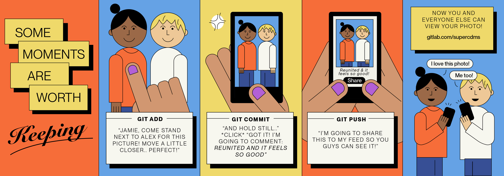

# A Different Way of Looking at Git

#### Contributed by: [Amy Roberts](https://github.com/pibion)

#### Publication date: November 9, 2022

<!-- deck start -->
Opening up software development to a broader community means we need to offer more diverse approaches to learning the tools. BSSw Fellow Amy Roberts is developing illustrated stories to explain essential operations in the git version control tool.
<!-- deck end -->

Contributing to shared software projects often requires fluency with *version control* (sometimes called *revision control*) — but many scientists don’t have the skills they need to comfortably work with version control. And while there is a wealth of technical training material available for those who want to learn version control, there’s less aimed at convincing people that this skill is worth their time. My BSSw fellowship focused on creating version control training materials that illustrate stories about core version control competencies, with the goal of persuading scientists that version control could be something that benefits their work.

### Why user stories and illustrations?

I learned about version control in grad school, by finally complaining to the right person that there must be a better way to deal with my software changes than my ad-hoc naming schemes. For me — always anxious that I would break my code and be unable to finish my next plot — version control made me feel free to try out every interesting idea that crossed my mind. After more experience, I realized that use of version control could save everyone in the lab time by giving us a way to share useful code modifications to our sometimes-cumbersome data acquisition system. Today even more than then, version control is required for collaborative work on software. Often only a handful of developers have the skills needed to work collaboratively on software, thus limiting the sustainability of software efforts that are increasingly crucial to their communities. I want eye-catching posters that provide an on-ramp to the wide world of version control.

 

[Credit: Art by Zelda Galewsky. CC-BY.]

### Git stories

As we develop git stories, we’re collecting them in a Gitlab repository, <https://gitlab.com/git-stories>. Each “story” focuses on a single idea, and my hope is that the number of stories will grow over time so that people writing contribution instructions and mentoring first-time contributors can point to appropriate concepts and trust that their colleagues will find them useful.

The stories we currently have are:

- Use git, not email!
- What to do every time you commit
- Commit early and often
- Every commit requires a message

Kitty Harris created all the “Use git, not email!” material — she is a scientist familiar with version control who also draws. This combination is relatively rare, and art-by-commission isn’t her primary job. Zelda Galewsky is the artist behind the additional stories, and she is not also a programmer. We worked together to transition from the version-control concept to a story that captures the idea and provides clear analogies. In each case we focused on developing a story in a context that we were both familiar with, like videogames and sharing pictures with friends. This is one way these resources offer another approach to technical skill training — they get to have a personality. This approach makes the stories more specific than clear, technical writing. A goal is that for a person who shares the background of the storyteller, the message of the stories might be clearer.

My hope is to develop more stories, told from more perspectives — and to develop a community that contributes and uses the stories that we all need to support contributors to scientific software. All the art is licensed for re-use, and most of it is available in vector graphic form, to allow easy editing for people who want to customize the text for their project.

### Join us!

Come join us at <https://gitlab.com/git-stories>! Everyone is welcome to use the stories, and contributions are welcome. Right now I’m collecting feedback to check if the art does, in fact, help increase interest in version control and improve understanding of version control concepts. Instructions for contributing feedback are included for each version control story, and ideas to improve the validity testing are welcome. Do you have new story suggestions? Do you want to suggest edits to the existing work? Or collaborate in any way? Stop on by and open an issue, we’d be glad to see you!

### Author bio

Amy Roberts is an assistant professor of physics at the University of Colorado Denver, where she leads a research group focused on dark matter detection. She searches for dark matter signals and works to build accessible computing ecosystems. Amy also serves as an editor for the Journal of Open Source Software and believes that complete, usable software infrastructure — together with accessible training and documentation — are necessary for a successful and equitable scientific community.
<!---
Publish: yes
Pinned: no
Topics: online learning, revision control
--->
