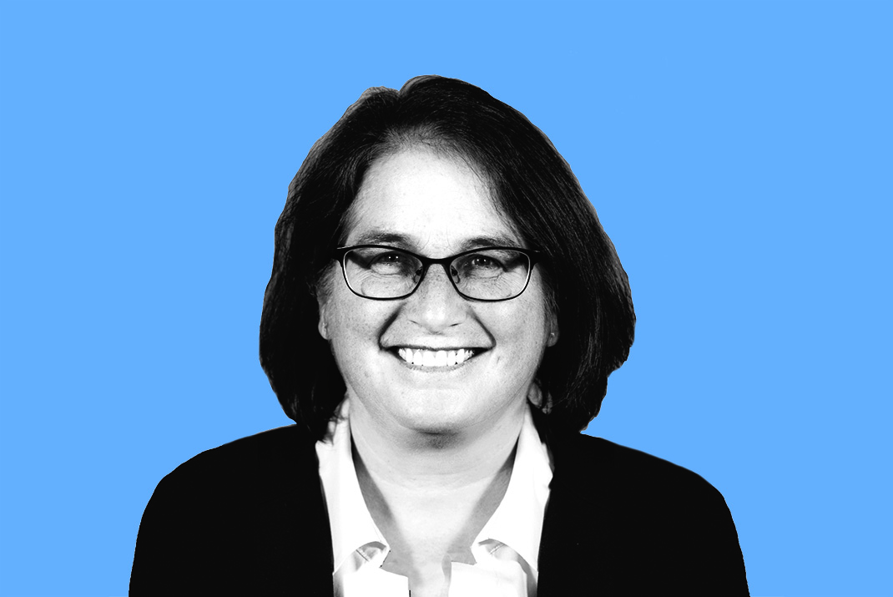
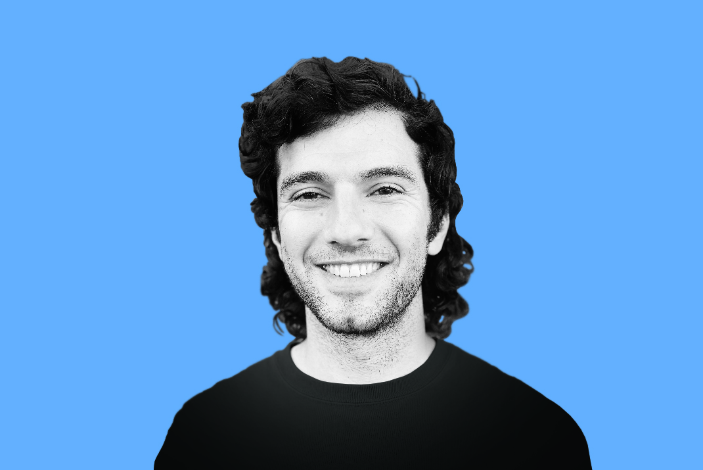
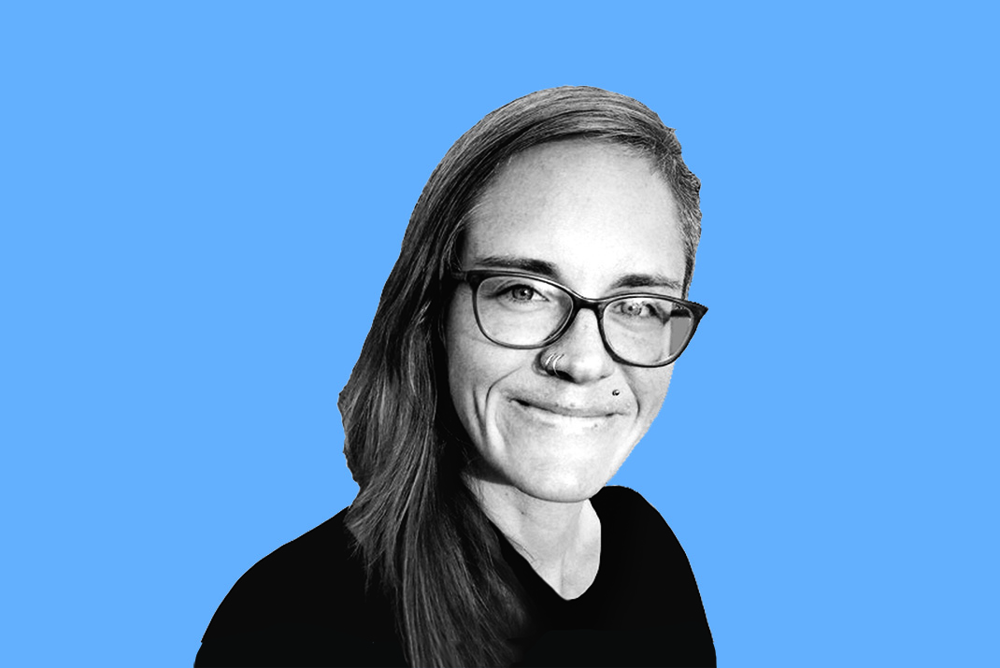

# Introducing the 2023 BSSw Fellows

#### Contributed by [Hai Ah Nam](https://github.com/hnamLANL "Hai Ah Nam GitHub Profile")

#### Publication date: December 19, 2022

We are pleased to announce the 2023 class of Better Scientific Software (BSSw) Fellows: six Fellows and six Honorable Mentions.

The 2023 class of BSSw Fellows will be recognized during the [2023 Exascale Computing Project Annual Meeting](https://www.ecpannualmeeting.com), January 17-20, 2023.  

We sincerely thank _all_ fellowship applicants. The broad range of creative and interesting proposals made the selection process difficult.

The [BSSw Fellowship Program](https://bssw.io/fellowship) gives recognition and funding to leaders and advocates of high-quality scientific software. Each 2023 Fellow will receive up to $25,000 for an activity that promotes better scientific software, such as organizing a workshop, preparing a tutorial, or creating content to engage the scientific software community.  

The BSSw Fellowship Program is supported by the U.S. Department of Energy (DOE) and National Science Foundation (NSF) to enable a more robust approach toward pioneering the future of advanced computing ecosystems and leadership in science and engineering. The program enhances workforce development and pathways to NSF and DOE software communities, through nurturing a network of people who advance software practices as a fundamental aspect of increasing overall scientific productivity.

## 2023 BSSw Fellows

 

  <h3>Nicole Brewer, Arizona State University</h3>
  
Graduate Research Assistant, Center for Biology and Society

  
<i>BSSw focus</i>: Improving accessibility of research data and software with scientific web applications

 

  <h3>Myra B. Cohen, Iowa State University</h3>
  
Professor and Lahn and Oahn Chair in Software Engineering, Computer Science

  
<i>BSSw focus</i>: Improving the quality of scientific software through rigorous software testing

 

  <h3>Johannes Doerfert, Lawrence Livermore National Laboratory</h3>
  
Computer Scientist, CASC

  
<i>BSSw focus</i>: Improving developer productivity by demystifying the compiler black box

  

  

  <h3> William Hart, Sandia National Laboratories</h3>
  
Member of Technical Staff, Discrete Math and Optimization Department

  
<i>BSSw Focus</i>: Sustainable strategies for managing supply chain security in research software

  

 

  <h3>Helen Kershaw, National Center for Atmospheric Research</h3>
  
Software Engineer, Data Assimilation Research Section

  
<i>BSSw focus</i>: Increasing the confidence of first-time open-source contributors and humanizing the process of code review

 

  <h3>Rafael Mudafort, National Renewable Energy Lab</h3>
  
Researcher IV, National Wind Technology Center

  
<i>BSSw focus</i>: Increasing developer impact through effective communication of software design

## 2023 BSSw Honorable Mentions

  <h3>Jean Luca Bez, Lawrence Berkeley National Laboratory</h3>
  
Postdoctoral Researcher, Scientific Data Division

 

  <h3>Jose Monsalve Diaz, Argonne National Laboratory</h3>
  
Postdoctoral Researcher, Mathematics and Computer Science Division

  <h3>Xu Liu, North Carolina State University</h3>
  
Associate Professor, Computer Science Department

  <h3>Alisa Neeman, Muskingum University</h3>
  
Assistant Professor, Mathematics and Computer Science

  <h3>Kristina Riemer, University of Arizona</h3>
  
Scientific Programmer, Data Science Institute

  <h3>Brigitta Sip&#337;cz, California Institute of Technology</h3>
  
Applications Developer

### About the BSSw Fellowship
The main goal of the [BSSw Fellowship Program](https://bssw.io/fellowship) is to foster and promote practices, processes, and tools to improve developer productivity and software sustainability of scientific codes. BSSw Fellows are selected annually based on an application process that includes the proposal of an activity that promotes better scientific software. Subscribe to the [BSSw email digest](https://bssw.io/pages/receive-our-email-digest) for notification about next year’s call for applications, which will be announced in summer 2022.  More information:

- [BSSw Meet Our Fellows](https://bssw.io/pages/meet-our-fellows)
- [FAQ for the BSSw Fellowship Program](https://bssw.io/pages/bssw-fellowship-faq)

Stay tuned for more from the 2023 BSSw Fellows.

### Contribute to the BSSw Site
Also, we want and need contributions from the international community for the BSSw site.  If you have expertise that can help other scientific software teams, we encourage you to contribute an article or pointer to good work.  See details on [how to contribute to BSSw](https://bssw.io/pages/what-to-contribute-content-for-better-scientific-software).

### Author bio
Hai Ah Nam is coordinator of the BSSw Fellowship Program, a member of the [IDEAS-ECP](https://ideas-productivity.org/activities/ideas-ecp) team, and a researcher in the [Advanced Technologies Group at NERSC/LBNL](https://www.nersc.gov/about/nersc-staff/advanced-technologies-group/hai-ah-nam/).  Her scientific career spans four DOE national laboratories (LLNL, ORNL, LANL, LBNL), where she has contributed to work in low-energy nuclear physics, computational physics, high performance computing, and research scientific software development.  Hai Ah’s research interests include emerging technologies for the HPC ecosystem, with a focus on AI/ML capabilities.  She is an advocate for developer productivity and software sustainability and has been one of the organizers of the [DOE Performance, Portability and Productivity Annual Meetings](https://p3hpc.org/) since 2015.

<!---
Publish: yes
RSS update: 2023-12-21
Categories: collaboration
Topics: projects and organizations
Tags: bssw-article
--->
