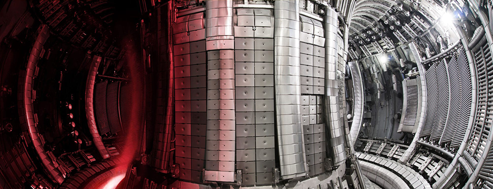
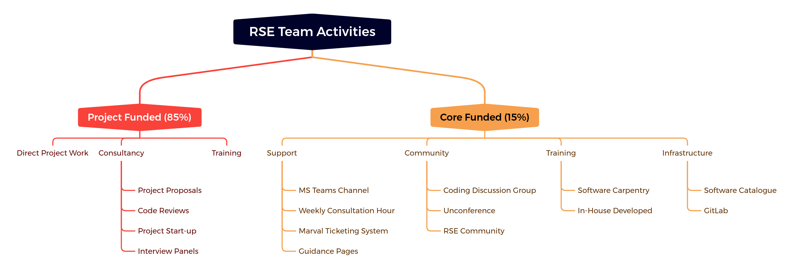

# The Anatomy of a Central RSE Team

 **Hero Image:**

  -  

#### Contributed by [Matthew Bluteau](https://github.com/bielsnohr)

#### Publication date: February 23, 2023

Interior of the JET tokamak with the ITER-like wall. Credit: EUROfusion.

Within the nascent domain of research software engineering (RSE), improving the
sustainability[1] of research software is a main objective. A
great boon in this pursuit has been the emergence of RSE teams as *central*
resources at organisations, independent of any research group. Of course, these
types of teams have existed for quite some time, such as at high-performance computing  facilities, but what I am referring to is the explosion of new
central RSE teams across all forms of research institutions that has happened
primarily in the past ten years since the RSE term was coined.

This is not to diminish the impact that teams and individual RSEs embedded
in research groups have on research software sustainability. However, there is a
point at which the obstacles faced within a group must be tackled at an
institutional level. I would like to address the strategies and
operational model that my particular central RSE team at UKAEA (UK Atomic Energy
Authority) uses to improve the development of research software.

### Central team model

First, some context for my team is necessary. Fusion science is a broad domain
in terms of both scientific disciplines and spatial and temporal time scales,
leading to what I describe as a "heterogenous computing environment." For
instance, creating a high-fidelity "digital twin" of a fusion reactor would
require approximately 10 TB and 5 million CPUs, putting it firmly in the
exascale of computing. It requires simulations based on plasma physics,
materials science, mechanical engineering, computational fluid dynamics, and many other areas.

In addition, we face the practical problems of

1. legacy code,
2. lack of awareness and buy-in to good software engineering practice, and
3. absence of a unified software development policy

These are not unique to our institution, but it is worth sharing our strategy
and activities for tackling them, which is summarized in the image below.

 

[DOI: 10.6084/m9.figshare.20473515.v1]

I suspect that, like most central RSE teams, our time is predominantly spent on work
funded by the projects of other research groups. It is our bread and butter, and
it is truly important work to do. One of the best ways of spreading software
sustainability is by practicing what you preach. There is an important subtopic
of this work that I call "consultancy," which deserves mention because it is one
way that we can directly influence the structure and planning of research
projects so that they consider software sustainability from the beginning rather
than as an afterthought, at which point it is much more difficult to correct
course. We have given advice on project funding proposals and sat on
interview panels, both of which plant seeds for future software sustainability.
We have also done one-off code reviews, usually on large portions of
existing code bases to get them fit for release. While we
aim to encourage regular code review as part of merge requests in all
substantial software projects, this doesn't always happen; and it is still
important to support the projects that haven't adopted this practice yet. This
is a subject close to my heart because it was one of the first "side" projects I
got assigned when I started as an RSE and because I have been an
active participant in the [Research Code Review
Community](https://dev-review.readthedocs.io/en/latest/).

Although project-funded work takes up the bulk of our time, I place equal
importance on the smaller portion of our work that is enabled by some core
funding (the right side of the figure above). Why? Because not being tied to any
particular research project means that we can do work that we believe benefits
*all* research groups on site. This allows us to start building a research software
infrastructure and baseline that will make our project work easier
over time. The activities under this core funding umbrella are quite varied, and
I have been lucky enough to participate in most of them. For example, under the
"Community" heading our team runs something called the Coding Discussion Group,
which is a monthly meeting dedicated to research software topics. At the moment,
this takes the format of a short presentation to inspire subsequent discussion,
but in the future I am hoping to make it more interactive with actual coding
activities to facilitate learning through practice, similar to a "coding club"
or "coding dojo."[2],[3],[4] Fostering this software community is a
foundational part of good software development because it enables knowledge and
skill exchange.

I would be remiss not to also mention the "Training" subtopic. For over five
years our team has been delivering the regular Python-based Software Carpentry
Workshop along with some of our own material on automated testing and best
practices. Early this year, I led a successful pilot of the new Carpentries
course "[Intermediate Research Software Development in Python](https://bielsnohr.github.io/2022/04/25/review-intermediate-course.html)"
as the main thrust of my Software Sustainability Institute fellowship, and it has now become part of our
regular course offerings.

### Personal experience

Observing the macroscopic characteristics of a central RSE team, as done above, is
important to build awareness of how the types of teams are structured and
operate. However, it is also important to consider microscopic characteristics,
like the experience of being an individual in one of these teams. These accounts
will vary widely, but identifying common themes is possible and valuable.

For myself, being part of a central RSE team has been a welcome change from my
previous research experiences. The variety of projects that a central RSE team
can offer has enabled me to travel far outside my domain expertise yet still
contribute meaningfully. Consequently, I have acquired a broader picture of the
activities at my laboratory to which I feel personally connected, whereas during
my Ph.D. I felt  detached and isolated,  focusing only on my own work.

A side-effect of varied project work is the potential to time-bound these
commitments. As a researcher, I found the lack of clear milestones and
acceptance criteria frustrating: projects never seemed to really end. Of course,
I still work in research and am therefore beholden to its vicissitudes, but the
coupling is less strong---to borrow a phrase from my days as a physicist. Time
allocation on a project is typically agreed upon up front, and the chunks of work are
defined as much as possible. This doesn't completely guard against scope creep
and overrun milestones, but it helps.

Not everything is rosier on the other side. Working in what is
effectively a research support role means that I never truly "own" a project.
I have reduced autonomy in deciding what I work on because it is dependent on
what a research group needs. Personally, I have mitigated this by getting involved
in the "core-funded" activities mentioned above. For instance I am now the lead
for RSE training at UKAEA, a role that gives me the opportunity to steer and project
manage.

### Conclusion

I hope that this brief summary of my group's activities will be helpful
to other central RSE groups in their effort to promote software sustainability.
And I hope that by sharing my personal experiences I can provide some
information to those who might be considering whether to join a central RSE
team.

### Acknowledgment

This post builds on a [personal blog
post](https://bielsnohr.github.io/2022/10/14/pasc22-minisymposium-summary.html#from-the-trenches-of-a-central-rse-team) that summarised [a talk](https://pasc22.pasc-conference.org/program/schedule/index.html%3Fpost_type=page&p=10&id=msa233&sess=sess125.html) I gave at the [PASC22](https://pasc22.pasc-conference.org/) conference.

[1-sfer-ezikiw]: https://software.ac.uk/resources/approaches-software-sustainability "This is a run-down on the many definitions of software sustainability from the people who have 'Software Sustainability' in their name"
[2-sfer-ezikiw]: https://doi.org/10.6084/m9.figshare.14330822.v2 "I gave a quick lightning talk about Coding Dojos"
[3-sfer-ezikiw]: https://leanpub.com/codingdojohandbook "The definitive source is a book by Emily Bache"
[4-sfer-ezikiw]: https://www.software.ac.uk/blog/2021-07-12-coding-clubs-research-software-communities-questions-consider-part-one "A broader overview of what a coding club can be"

### Author bio

Matthew Bluteau is a research software engineer (RSE) at the UK Atomic Energy Authority (UKAEA), a world-leading laboratory in fusion energy research. There he supports the development of research software primarily used for simulation and modeling of fusion plasmas and tokamaks. He is a Software Sustainability Institute (SSI) Fellow 2021, and his fellowship work has  focussed primarily on delivering new training courses at the intermediate level of software development skills. His background is in physics; he obtained a Ph.D. in atomic and plasma physics from the University of Strathclyde, with external work at the Culham Centre for Fusion Energy.

<!---
Publish: yes
Pinned: no
Topics: strategies for more effective teams
--->
<!-- DO NOT EDIT BELOW HERE. THIS IS ALL AUTO-GENERATED (sfer-ezikiw) -->
[1]: #sfer-ezikiw-1 "This is a run-down on the many definitions of software sustainability from the people who have 'Software Sustainability' in their name"
[2]: #sfer-ezikiw-2 "I gave a quick lightning talk about Coding Dojos"
[3]: #sfer-ezikiw-3 "The definitive source is a book by Emily Bache"
[4]: #sfer-ezikiw-4 "A broader overview of what a coding club can be"
<!-- (sfer-ezikiw begin) -->
### References
<!-- (sfer-ezikiw end) -->
* 1[This is a run-down on the many definitions of software sustainability from the people who have 'Software Sustainability' in their name](https://software.ac.uk/resources/approaches-software-sustainability)
* 2[I gave a quick lightning talk about Coding Dojos](https://doi.org/10.6084/m9.figshare.14330822.v2)
* 3[The definitive source is a book by Emily Bache](https://leanpub.com/codingdojohandbook)
* 4[A broader overview of what a coding club can be](https://www.software.ac.uk/blog/2021-07-12-coding-clubs-research-software-communities-questions-consider-part-one)
