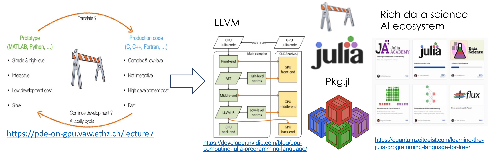
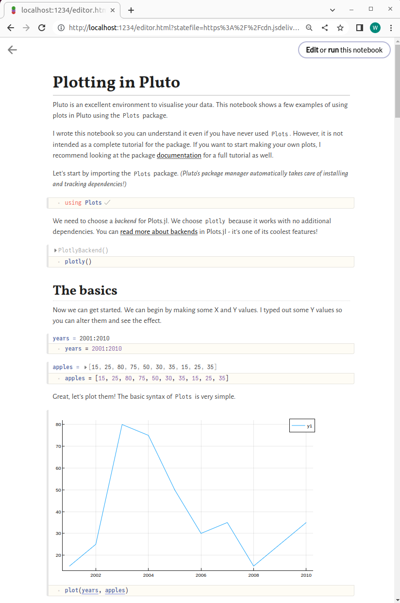

# Julia's Value Proposition for Better Scientific Software

#### Contributed by: [William F Godoy](https://github.com/williamfgc)

#### Publication date: April 14, 2023

<!-- start of deck text -->
Julia provides a mathematical front end to LLVM to provide easy and performant CPU and GPU access and lightweight interoperability with existing C, Fortran, R, and Python codes, coupled with a rich unified ecosystem for packaging, data science, and interactive computing. Hence, Julia fills a gap at the intersection of high performance and high productivity for scientific software.
<!-- end of deck text -->

### Introduction

Current requirements for scientific software have expanded beyond number crunching, with reproducibility, AI workflows, data analysis and visualization, continuous integration and continuous deployment (CI/CD) pipelines, packaging, and interactive computing taking central roles in the scientific discovery process.
The current status quo is to use a compiled language (Fortran, C, C++) for performance-critical code, while a higher-level language (e.g., Python) is preferred for portions of the code that are not performance sensitive, with the promise of higher productivity. 
Nevertheless, we typically interact with third-party components within the ecosystem, such as: build systems, packaging, and programming models to access heterogeneous hardware, e.g., graphical processing units (GPUs).
In this model, we must deal with a many-body ecosystem, with code bases usually composed of a `base language` + `X`, in which `X` may comprise a long list of components, e.g., Python, C, C++, Fortran, CMake, Make, Catch, doctest, pytest, pybind11, conda, pip, Jupyter, apt, yum, etc., with no guarantees of interoperability among them. Thus, overall, economics and productivity suffer in a way that may scale with the number and variety of components required, as well as with project size and performance portability requirements.

### Why Julia?

**Why do we keep creating new languages and ecosystems?** 

We are in a constant search for new approaches that empower practitioners by lowering existing technical, economical, and social barriers. Fortran allowed access to a "formula translator" model of programming in the 1950s, while C has enabled "portable assembly" for systems programming since the 1970s, and Python has succeeded in the twenty-first century as a friendly interface that enhances productivity.  Now, Julia enables an evolutionary approach to today's scientific software development that is highly exploratory and constantly adapting to new, often unexpected, science requirements, for example, COVID-19.

As shown in Figure 1, Julia's high-productivity plus high-performance layer builds upon LLVM for both CPU and GPU access, along with a unified open-source packaging and data science ecosystem hosted on GitHub. Julia also provides lightweight interoperability with existing C and Fortran codes. Hence, the value proposition is not to replace a particular language, but rather to reduce current costs in the scientific software development process (e.g., from prototyping to publication with Python + X).

<br>

[Figure 1. Julia's value proposition to the construction process in scientific software.]

<br>

**The ecosystem is NOT an afterthought**

In Julia, the project description and dependencies are the starting point when [creating a new package](https://pkgdocs.julialang.org/v1/creating-packages/) via [toml files](https://pkgdocs.julialang.org/v1/toml-files/). Just inspect any [Julia package](https://juliapackages.com/) source code on GitHub and see the `Project.toml` files for a list of dependencies and version compatibility information. In addition, Julia provides [unit testing](https://docs.julialang.org/en/v1/stdlib/Test/), interactive computing via the read–eval–print loop (REPL), a [standard library](https://juliafs.readthedocs.io/en/stable/stdlib/index.html) with mathematical and data abstractions, and a unified package manager with access to a rich ecosystem for scientific computing, [data science](https://www.juliafordatascience.com/), [visualization](https://juliapackages.com/c/graphics), and [AI](https://fluxml.ai/Flux.jl/stable/ecosystem/).

So how does this circumstance differ from Python's ecosystem? Recently GitHub Actions bumped its Python version to 3.11 on some of its runners, causing problems for many Python packages.  As of March 2023, 59.4% of the most popular Python packages do not indicate support for that version of Python yet on [PyPI](https://pyreadiness.org/3.11/)). Thus, the cost of this coordination is passed to the end user until package developers can react. That last word is key: Julia promotes a more "predictive" rather than "reactive" maintenance approach in which packages in Julia's [general registry](https://github.com/JuliaRegistries/General) must meet certain requirements. We don't live in a perfect world, thus the value of this coordination is not only on "not breaking the API" or "fixing bugs", but also in enriching user-developer communications using an open-source process for package updates prior to deployment.

This model of "batteries included" is not new for more targeted languages, such as R or MATLAB, but the model new for more general languages that put performance (Julia) and safety (Rust) at the forefront. I find myself writing more tests and verifying my ideas on the REPL when using Julia, rather than writing boilerplate code as would be done in a general-purpose language or dealing with mismatched package versions.

**Making heterogeneous hardware more accessible**

[JuliaGPU](https://juliagpu.org/) and [JuliaParallel](https://github.com/JuliaParallel) provide information on the packages that provide access to several vendor GPUs, e.g., NVIDIA ([CUDA.jl](https://github.com/JuliaGPU/CUDA.jl)), AMD ([AMDGPU.jl](https://github.com/JuliaGPU/AMDGPU.jl)), Intel ([oneAPI.jl](https://github.com/JuliaGPU/oneAPI.jl)). These high-level interfaces provide an excellent mathematical playground for exploring fine-granularity parallelization on GPUs. The [CUDA.jl docs](https://cuda.juliagpu.org/dev/) are a great starting point for those familiar with NVIDIA's CUDA or who want to learn about GPU custom kernel programming. Julia uses an integrated [GPUCompiler.jl](https://github.com/JuliaGPU/GPUCompiler.jl) layer, whereas Python's pyCUDA and cuPy require programmers to pass custom kernels as strings.

**Compose to prevent inheritance bloat**

Julia does not support object-oriented as C++ or Python. Julia projects are organized by modules, and proper data locality and composition using "data container" structs and type hierarchy trees in which abstract types have no members (see related [discussions](https://github.com/JuliaLang/julia/issues/4935)). Think of composition as Derived "has-a" Base, instead of Derived "is-a" Base. This weak coupling prevents deep hierarchies of classes that can quickly get out of hand, while encouraging software developers to think of structs as data containers to which operations are applied, as one would do in languages like pre-2003 Fortran, R, or C.

**Interoperate with existing software**

Julia enables lightweight reusability of existing Fortran and C infrastructure via the [`@ccall` macro](https://docs.julialang.org/en/v1/manual/calling-c-and-fortran-code/). Similarly, Python and R interoperability is possible with [PyCall.jl](https://github.com/JuliaPy/PyCall.jl) and [RCall.jl](https://github.com/JuliaInterop/RCall.jl), respectively. Thus, Julia promotes reuse over reinvention, which is both important and useful given the volume of mature scientific software.

**Jupyter and Pluto.jl notebooks**

Computational notebooks, Jupyter in particular, have been widely adopted in science and do not need an introduction. Jupyter is powered by Anaconda, with Python kernels requiring setting a conda environment for managing the required dependencies before launching the server and web client interface. Notebooks are stored using a `*.ipynb` file format based on JSON.
Jupyter also supports interactive Julia notebooks via the IJulia kernel package, which can understand information readily available in `Project.toml` files.  This approach is really neat when using services like [mybinder.org](https://mybinder.org/) for distributing and sharing notebook projects "as-is" with a broader audience.

[Pluto.jl](https://plutojl.org/) is the Julia-exclusive alternative that favors "reactive" notebooks for interactivity, essentially leveraging the fact that packaging is part of the language. There is no need for setting an environment, just launch Pluto from the REPL (illustrated below), start importing package dependencies directly into a notebook, and save them as a Julia file (.jl) in which text (in Markdown) and code cells are identified simply by annotations. The first time Pluto is launched, it provides several sample notebooks of what can be done; the introduction to [Plots.jl](https://docs.juliaplots.org/stable/) is shown in Figure 2. I enjoy the plug-and-play approach in which the mathematical syntax, software ecosystem, and packaging simplify my work.

Launching a Pluto Notebook from the REPL.

```julia
$ julia
> using Pluto
> Pluto.run()
[ Info: Loading...
[ Info: Listening on: 127.0.0.1:1234, thread id: 1
┌ Info: 
└ Opening http://localhost:1234/?secret=AZ8Ynd82 in your default browser... ~ have fun!
┌ Info: 
│ Press Ctrl+C in this terminal to stop Pluto
└
```

<br>

[Figure 2. Intro to Plots.jl Pluto notebook from default examples.]

<br>

**The community**

The Julia community is where the real value of Julia lies. The Julia community is very enthusiastic about helping others and engages using modern tools, such as the [Julia slack](https://julialang.org/slack/) and [discord](https://discourse.julialang.org/t/julialang-official-discord-server/45499) channels, and each package's GitHub issues tracker. [JuliaCon](https://juliacon.org/2023/) is the annual community gathering; a variety of interesting talks and tutorials from there can be found on YouTube. Many contributions and support come from [JuliaHub](https://juliahub.com/) (formerly Julia Computing) as part of its mission. 

Last summer we organized a full-day workshop, entitled Julia for Oak Ridge National Laboratory Science, [JuFOS](https://ornl.github.io/events/jufos2022/), which, to our surprise attracted 101 registrations from a range of different scientific domains. Roughly 90% of the participants responded that they wanted to learn more about Julia, while roughly 50% indicated an interest in alternatives to the current status quo for building scientific workflows in the high-level + high-productivity space.  

For people focused on high-performance computing (HPC), it is worth noting that the community is invested in performance from day one. Several members of the community recently put our thoughts about HPC and Julia in a [recent paper](https://arxiv.org/abs/2211.02740). Meanwhile, building the community has kept many of us very busy in the last few years. Many [venues](https://juliaparallel.org/resources/) have been organized in recent years, including a tutorial and BoFs organized by the U.S. Department of Energy [Exascale Computing Project](https://www.exascaleproject.org/), a Supercomputing [BoF](https://sc22.supercomputing.org/presentation/?id=bof136&sess=sess309), a JuliaCon [minisymposium](https://live.juliacon.org/talk/LUWYRJ), and a monthly [JuliaHPC call](https://julialang.org/community/#events) to provide exposure and highlight the work done by community members.

It's also worth mentioning that unifying and coordinated initiatives coming out of the Exascale Computing Project (ECP) like [Spack](https://spack.io/) and [E4S](https://e4s-project.github.io/) can be an invaluable source of HPC packages which can be leveraged within the Julia ecosystem. 

### Where to start

For a more technical introduction to the Julia ecosystem, you might want to start with a blog article that I recently updated: [First Project using the Julia Language](https://williamfgc.github.io/programming/scientific-computing/2023/03/03/first-project-julia-language.html).  It includes links to numerous other resources that can provide further help getting started. I'd recommend to anyone trying the language for the first time to use [Visual](https://code.visualstudio.com/)[ Studio Code](https://code.visualstudio.com/)](https://code.visualstudio.com/), which offers excellent Julia support through its extensions marketplace, and the upcoming [Julia v1.9 version](https://julialang.org/downloads/#upcoming_release) for a better experience.
I also encourage you to seek out colleagues who may be using Julia and build a local community, including sharing experiences, tips, and examples.
Ultimately, scientific software, in Julia or other languages, benefits from communities.
*Bonus: I've found that using GitHub Copilot with the simple Julia APIs can be a welcome boost to the productivity of writing and porting code to Julia. Its autocompletion-like capabilities save on typing (but not thinking).*

### Final thoughts

Julia is part of the natural evolution of programming languages. Powered by LLVM and a carefully thought-out ecosystem, Julia's design decisions and value proposition target the high-performance plus high-productivity space. Mastering a new programming language can be a steep initial investment, and eventual adoption is a result of both technical and non-technical factors. I think it's good that the scientific computing community is exposed to the value proposition of newer alternatives like Julia, and that is the goal of this article. The actual value is ultimately determined by each user and project, and their particular scientific software needs. 

### Acknowledgment

I want to thank the many people in the community for enabling our efforts, in particular the IDEAS and PROTEAS-TUNE sub-projects within ECP, the [Sustainable Research Pathways](https://shinstitute.org/sustainable-research-pathways-2022) program, and the Bluestone project.

### Author bio

[William F. Godoy](https://orcid.org/0000-0002-2590-5178) is a Senior Computer Scientist in the Computer Science and Mathematics Division at Oak Ridge National Laboratory (ORNL). His interests are in the areas of HPC, scientific software, programming models, data, and parallel I/O.
At ORNL, he has contributed to scientific software projects funded by the Exascale Computing Project and ORNL's neutron science facilities. Godoy received a PhD in Mechanical Engineering from the University at Buffalo, The State University of New York. He is a 2022 [BSSw Fellowship](https://bssw.io/fellowship) honorable mention, a member of the [United States Research Software Engineer Association](https://us-rse.org/) and ACM, and an IEEE senior member serving in several technical venues.

<!---
Publish: yes
Pinned: no
Topics: programming languages and models, packaging, performance portability and productivity, high-performance computing (HPC), testing, software engineering
--->
