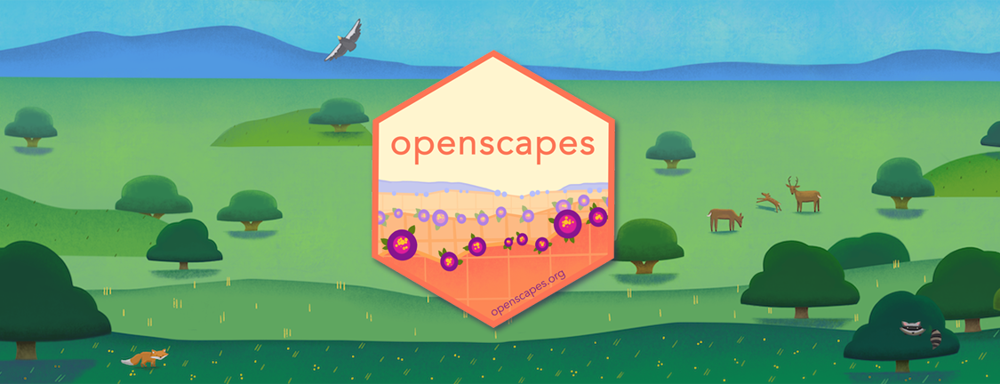
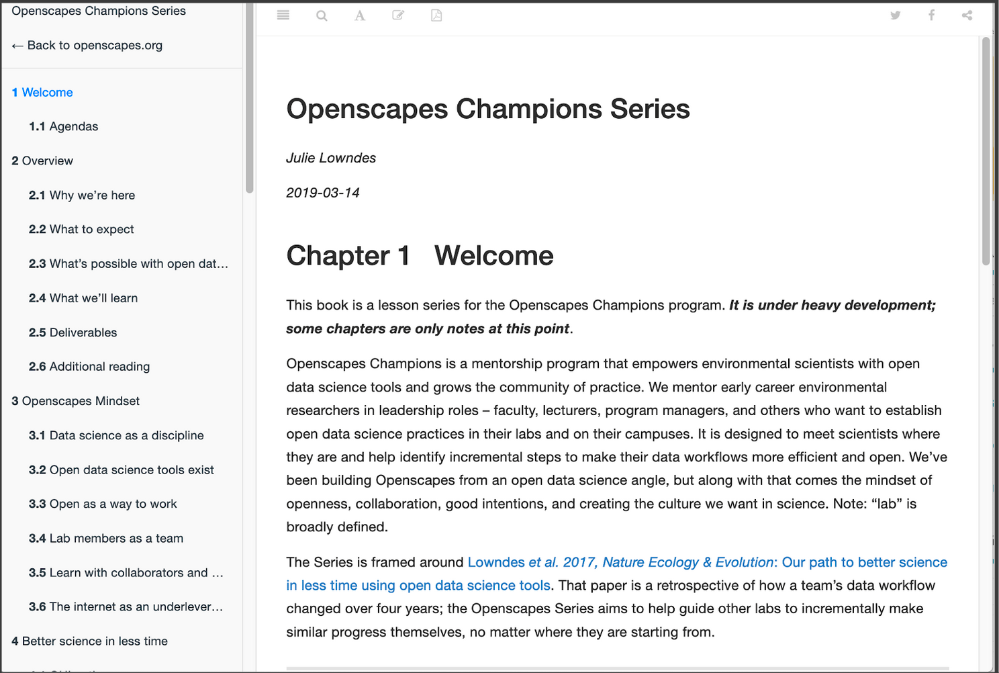
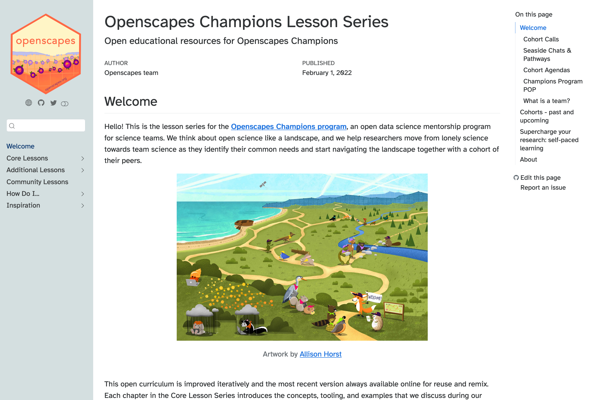

# How Open Source Tooling Is Changing the Way Professional Researchers Learn to Code

**Hero Image:**

  -  

#### Contributed by [Julia Stewart Lowndes](https://github.com/jules32)

#### Publication date: April 26, 2023

<!-- start deck -->
The same open source tooling that is changing how we do science — R, Python, Git, GitHub — is changing the way we teach professional researchers how to code. 
<!-- end deck -->

Tooling like Jupyter Notebooks, RMarkdown, and now Quarto enables researchers to combine narrative, code, and outputs like figures in the same document, enabling transparent and reproducible workflows that can be shared openly on GitHub. This same setup can be used to teach professional researchers to code so that the teaching narrative unfolds interspersed with code the learner can run. Because the resources are openly available, and learners can work and learn with the same tools used to create those resources, there is consistency between what they see in the materials they learn from, what they see on their end, and the expected outcomes. But what is truly remarkable is the culture shift enabled by this setup; learners have in front of them these documents that reinforce what the teacher screen shares live, and which continue to be there for reference and self-paced learning when the teacher isn't there at all. This approach builds trust and resilience with learners, and role-models a new way of working openly — all of this is a paradigm shift for how professional researchers learn new skills, work, and then teach others in turn. 

I am a marine scientist who can say from experience that this mode of teaching is game-changing; in fact I am making it my career to amplify this to empower more researchers. For my BSSw Fellowship project, I modernized Openscapes' open educational resources that I first built with RMarkdown by refactoring them in Quarto, and I have since used these updated resources to teach 6 cohorts (50 teams) of professional environmental and Earth scientists at NASA, NOAA, and the EPA.

### A new learning paradigm of trust and empowerment

It was through Jenny Bryan that I first felt this trust and empowerment as a new coder and learner. Jenny Bryan, then a statistics professor at the University of British Columbia and now a software engineer at Posit (formerly RStudio), shared her [Stat 545 Course](https://stat545.com/) materials as an open source book (made originally with RMarkdown and now Quarto) that was a delight and light-hearted to read, as the course walks the learner through highly technical material for data wrangling, exploration, and analysis with R. Jenny went on to create additional books that are still my go-to resources and recommendations: [Happy Git With R](https://happygitwithr.com/) (which is, in my opinion, the best place to learn Git/GitHub, regardless of whether you are an R user), and [What They Forgot to Teach You About R](https://rstats.wtf/) (designed for an audience that "has a moderate amount of R and RStudio experience; is largely self-taught; suspects they have drifted into some idiosyncratic habits that may slow them down or make their work products more brittle; is interested in (re)designing their R lifestyle, to be more effective and more self-sufficient").

When she teaches, Jenny provides these resources openly to her students, breaking the paradigm of the teacher being the sole source of information; she is teaching live what I can also reference from a tab in my browser. As a learner, having the book open in my browser helps me because looking between my own console and the teacher's screen means I can miss syntax; now I don't fall behind or have to interrupt the class to say, "Could you scroll up?" Further, since these books are also Jenny's teaching narrative, everything she needs is in one place. Because she is open with her script and shares it with us in advance, we feel trusted and empowered as peers. Side note: Jenny live-codes as she teaches, role-modeling that coders make typos and get errors and look things up, and further building confidence in ourselves as learners.

This mode is already shifting the paradigm in a powerful way — because we can fork this idea. When learners see this style of scientific coding and teaching, they repeat it as they work and share, and they become teachers too. That's what I did, first when I built [open data science educational resources](http://ohi-science.org/data-science-training/) to teach marine scientists, and then dialed it up when I founded [Openscapes](https://openscapes.org).

### Forking this paradigm for different learning modalities 

Openscapes' vision draws from what I experienced with open source tooling from the R and Mozilla communities. We build and share everything openly using open source tooling, and we teach researchers in a different modality than hands-on coding: Openscapes cohorts teach a "Future Us" mindset via discussion-based lessons for teams, in part through our flagship program: [Openscapes Champions](https://openscapes.org/champions).

For my BSSw Fellowship, I updated the [Champions Lesson Series](https://openscapes.github.io/series/) book architecture. Originally I built it with RMarkdown's [Bookdown](https://bookdown.org/) (top image below). Now it is built with [Quarto](https://quarto.org) (bottom image). This upgrade streamlines much future work, including enabling the series to have more subchapters in the left navbar and a right navbar for each page. Also added to this architecture are Community Lessons and How Tos, which have helped the 50 teams of professional environmental and Earth scientists we've taught since this revision (see [impact blogs](https://www.openscapes.org/tags/impact/)). Modernizing the Lesson Series helped me practice using Quarto, which we've also used with the NASA Openscapes Mentors to develop the [NASA Earthdata Cloud Cookbook](https://nasa-openscapes.github.io/earthdata-cloud-cookbook) with Jupyter Notebooks as the first Quarto external users. Side note: through this collaboration, I keynoted the global launch of Quarto atRStudio::conf (Cetinkaya-Rundel & Lowndes, 2022: [slides](https://mine.quarto.pub/hello-quarto), [video](https://www.youtube.com/watch?v=p7Hxu4coDl8), [blog](https://www.openscapes.org/blog/2022/08/10/quarto-keynote/)).

The example below is available at https://openscapes.org/series.

 

 

[Comparison of Openscapes Champions Lesson Series created originally in RMarkdown's Bookdown (top) and updated in Quarto (bottom).]

 

This culture shift is growing as we're seeing researchers and the broader community fork this mode of working and teaching for their own needs. Gavin Fay created the [FayLab Manual](https://thefaylab.github.io/lab-manual/) onboarding resources for his lab — a beautifully radical idea in science, which itself has now been forked at least 45 times, including by NOAA Fisheries' [OpenSci Resource Book](https://nmfs-opensci.github.io/ResourceBook/). We're also seeing this approach being used for community building at the [California Water Boards](https://cawaterboarddatacenter.github.io/swrcb-openscapes/) and other NASA programs like [VEDA](https://nasa-impact.github.io/veda-docs/).

### Join us

The best way to join this movement is to reuse and amplify existing community resources, and then fork them to fit your needs and fill the gaps. All of our work is available from [openscapes.org](https://openscapes.org), which is also where you can sign up for our infrequent newsletter with upcoming events. You can also follow us on Twitter and Mastodon @openscapes.

### Author bio

Julia Stewart Lowndes, PhD is a marine ecologist working at the intersection of actionable environmental science, data science, and open science. Julia's main focus is mentoring teams to develop technical and leadership mindsets and skills for data-intensive research, grounded in climate solutions, inclusion, and kindness. She founded Openscapes in 2018 as a Mozilla Fellow and is a Senior Fellow at the National Center for Ecological Analysis and Synthesis (NCEAS), having earned her PhD from Stanford University in 2012 studying drivers and impacts of Humboldt squid in a changing climate.  She is also a 2022 [Better Scientific Software Fellow](https://bssw.io/pages/bssw-fellowship-program).

<!---
Publish: yes
Track: community
Pinned: no
Topics: online learning
Track: Community
--->
