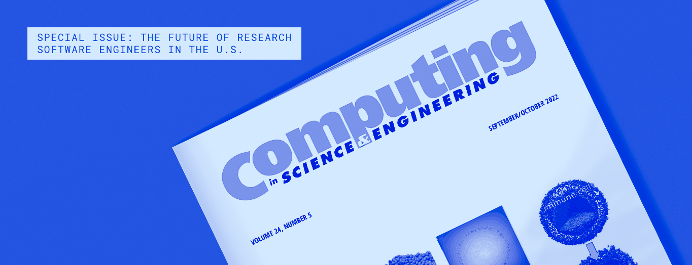

# The Future of Research Software Engineers in the United States: Special Issue in CiSE

**Hero Image:**

  -  

#### Contributed by [Jeffrey C. Carver](https://github.com/JeffCarver), [Nasir Eisty](https://github.com/neisty), [Hai Ah Nam](https://github.com/hnamLANL), and [Irina Tezaur](https://github.com/ikalash)

#### Publication date: May 25, 2023

*Computing in Science & Engineering* has published a two-part special issue on research software engineers (RSEs) in the United States.  The term is used increasingly to describe members of the research software ecosystem who bring knowledge, expertise, and interest in developing high-quality software to this community's efforts to advance the frontiers of research. Although the people in this role do not always carry the title of RSE, they have long been critical both to the success of the research software and to the research project of which it is a part.  Given the increasing complexity of the research landscape, which involves not only high-performance computing (HPC), but also data science, machine learning, and complex workflows on leading-edge computer systems, RSEs are essential to developing a sustainable research software ecosystem.

RSEs develop, maintain, and contribute to research software across a broad range of scientific domains.  They are employed in academia, national laboratories, and industry, and they may carry a wide variety of titles besides "RSE": postdoc, software developer, research staff, computational scientist, etc.  Since the term "research software engineer" was coined, about ten years ago in the United Kingdom, many individuals and institutions have come to see it as a term that can help unify the many people and many different job descriptions used for the RSE role.  In the last five years, since the [US-RSE](https://us-rse.org/) joined the growing number of professional associations around the world for RSEs, the RSE movement has been growing in the United States, seeking to define, recognize, and grow communities around the formalized role of the RSE.  

The movement has been fueled by the overwhelming need for RSEs to support increasingly complex computationally-based research.  But even with the current success and the increased need and visibility for the RSE role, significant obstacles remain in attracting, developing, and retaining the next generations of RSEs.  The challenges are social and cultural, as well as technical.  The first half of this special issue shares experiences from a wide variety of people.  The second half focuses on identifying the challenges of attracting, supporting, and retaining RSEs and provides thoughts on how to build for the future.

**Computing in Science & Engineering Volume: 24, Issue: 5, Sept.-Oct. 2022**

- W. F. Godoy et al., “Giving research software engineers a larger stage through the Better Scientific Software Fellowship,” doi: [10.1109/MCSE.2023.3253847](https://doi.org/10.1109/MCSE.2023.3253847) shares the experiences of 13 recipients of recognition by the [Better Scientific Software Fellowship](https://bssw.io/pages/bssw-fellowship-program) and how they have used the recognition to advance scientific software.

- A. Malviya-Thakur et al., “Research software engineering at Oak Ridge National Laboratory,” doi: [10.1109/MCSE.2023.3260211](https://doi.org/10.1109/MCSE.2023.3260211) describes the mission, culture, and practices of RSE teams at Oak Ridge National Laboratory (ORNL).  The authors share case studies and lessons learned as ORNL's RSE community has been established, grown, and matured.

- I. A. Cosden, “The Princeton University Research Software Engineering Group model: Operational and organizational approaches,” doi: [10.1109/MCSE.2023.3264113](https://doi.org/10.1109/MCSE.2023.3264113) describes a centralized RSE group at Princeton University that partners with academic research units across the university.  The author shares organizational and operational best practices that have proven effective.

**To appear in the next issue of Computing in Science & Engineering**

*The following are preprints, and are not in final published form.*

- M. R. Mundt et al., "For the public good: Connecting, retaining, and recognizing current and future RSEs at national organizations," doi: [10.1109/MCSE.2023.3256759](https://doi.org/10.1109/MCSE.2023.3256759) identifies three key areas of improvement to better support RSEs in national research laboratories: community building, hiring and retention, and recognition of their contributions.

- I. A. Cosden et al., "Research Software Engineers: Career entry points and training gaps," doi: [10.1109/MCSE.2023.3258630](https://doi.org/10.1109/MCSE.2023.3258630) explores career paths for RSEs.  The article identifies several entry paths into the profession and suggests training, education, and other activities to build and retain RSEs.

- M. A. Heroux, "Research Software Science: Expanding the impact of research software engineering," doi: [10.1109/MCSE.2023.3260475](https://doi.org/10.1109/MCSE.2023.3260475) presents the idea of research software science, in which traditional scientific research methodologies are used to explore and establish broadly applicable knowledge about research software.

### Author bios

Jeffrey C. Carver is a professor in the Department of Computer Science, University of Alabama. His research interests include empirical software engineering, software engineering for research software, and human factors in software engineering. Carver received his Ph.D. degree in computer science from the University of Maryland. He is a Senior Member of IEEE and the Association for Computing Machinery (ACM).

Nasir Eisty is an assistant professor in the Department of Computer Science, Boise State University. His research interests include software engineering, software quality assurance, research software engineering, and software security. Eisty received his Ph.D. degree in computer science from the University of Alabama. He is a member of IEEE and ACM.

Hai Ah Nam is a senior staff member at the National Energy Research Scientific Computing Center, Lawrence Berkeley National Laboratory. Her research interests include emerging technologies for the high-performance computing (HPC) workflow-driven ecosystem, large-scale scientific computing, and machine learning performance. Nam received her Ph.D. degree in computational science from Claremont Graduate University and San Diego State University. She is a member of ACM and the American Physical Society.

Irina Tezaur is a distinguished member of technical staff in the Quantitative Modeling Department of Sandia National Laboratories. Her research interests include numerical methods for partial differential equations, reduced order modeling, multiscale coupling methods, scientific computing/HPC, and climate modeling. Tezaur received her Ph.D. degree in computational and mathematical engineering from Stanford University. She is a member of the IEEE Computer Society, Society for Industrial and Applied Mathematics, Society of Women Engineers, American Geophysical Union, and U.S. Association for Computational Mechanics as well as a full member of the Sigma Xi Scientific Research Society.

<!---
Publish: yes
Topics: "research software engineers"
--->
