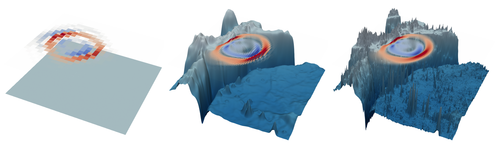
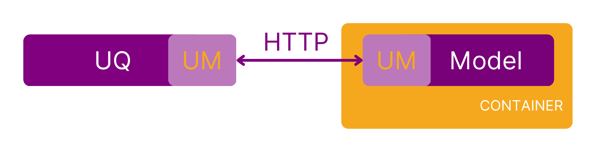

# Enabling complex scientific applications

**Hero Image:**

 - [Multiple levels of resolution for a tsunami model implemented in ExaHyPE.]

#### Contributed by [Anne Reinarz](https://github.com/annereinarz) and [Linus Seelinger](https://github.com/linusseelinger/)

#### Publication date: June 27, 2023

### Introduction

Scientific applications are ever-growing in complexity: Interdisciplinary workflows in particular combine numerous methods and software components from different communities. This might be motivated by software engineering concerns (e.g. embedding a simulation software in CI/CD or performance analysis tools) or algorithmic concerns (e.g. performing optimization or uncertainty quantification on complex numerical models).

Each community has - for good reasons - preferred languages and tools, which are often incompatible. Further, many scientific software frameworks were designed as monoliths with no expectation of being embedded in higher-level applications. In order to facilitate complex scientific applications, we, therefore, need to map abstract theoretical interfaces into equally universal software interfaces, enabling greater flexibility, reusability, and separation of concerns.

### Case study: Simulating tsunamis

We wanted to perform Bayesian inference with uncertainty quantification (UQ) on a tsunami model, determining the tsunami source from buoy data. [ExaHyPE](https://doi.org/10.1016/j.cpc.2020.107251) served as the numerical model, while [MUQ](https://mituq.bitbucket.io/source/_site/index.html) provided the UQ method.

Linking the two is - on a theoretical level - straightforward: MUQ's multilevel Markov chain Monte Carlo method only needs to iteratively pass parameter vectors to the tsunami model and receive some quantity of interest in return. Existing MPI support on both sides should allow for good scalability.

  

[Monolithic application linking UQ algorithm and numerical model.]

 

In practice, it turned out to be a challenge: In order to optimize algorithms and software, we often have to intentionally restrict the set of supported use cases.

In case of ExaHyPE, this meant focusing on a one-shot workflow where the user specifies the problem, and hardware-optimized, problem-specific code is generated and compiled. In addition, ExaHyPE builds on a fairly large number of dependencies and employs a somewhat unusual hybrid parallelization approach combining MPI with Intel's oneAPI [Threading Building Blocks](https://en.wikipedia.org/wiki/Threading_Building_Blocks) (TBB).

Taken together, these properties meant that it took us months to implement a scalable application linking MUQ and ExaHyPE. We had to dig deep into the parallelization of ExaHyPE for it to accept MPI sub-communicators from MUQ, modify its main routines to call it as a library, and rewrite parts of its custom build system. Along the way, we encountered a myriad of unexpected issues.

### Microservices in scientific software

Linking MUQ and ExaHyPE was a painful experience, contrary to the theoretically simple link of the algorithms.

We, therefore, decided to try a completely different approach, taking inspiration from microservice architectures. Enter UM-Bridge, the UQ and Modeling Bridge: Instead of building one monolithic application encompassing UQ, numerical model, and HPC capabilities, we now separate each aspect into its own component. The UQ application requests evaluations through the UM-Bridge network protocol, while the model application is now a server, launching simulation runs upon request. The model may run on a cluster, where a load balancer takes care of many parallelization aspects.

  

[The software now mirrors the abstract theoretical interface between UQ algorithm and model.]

 

Right away, UM-Bridge offers a number of benefits:

* We can easily link tools that are written in different programming languages or are otherwise incompatible; all we need now is a small extension to support UM-Bridge on either side, which is easy to achieve using one of the language-specific or even framework-specific integrations we provide.

* UM-Bridge models can readily be containerized since the natural path to accessing a containerized application is via a network. Containerized models can be shared among collaborators, improving the separation of concerns between UQ and model experts. Containers also provide a high degree of reproducibility, which we used to build the first library of ready-to-run UQ benchmark problems.

* Simple thread-parallel UQ codes are now enough to offload parallel model runs to a cluster since distributing work across many model instances on the cluster is now up to UM-Bridge (specifically the Kubernetes setup we provide).

### Rapid UQ application development: tsunamis revisited

We set out to revisit the tsunami problem using UM-Bridge. As before, we went with the ExaHyPE tsunami model. This time, we chose multilevel delayed acceptance (MLDA) as our UQ method. To spice things up, we wanted to build a Gaussian Process (GP) surrogate as the coarsest level in MLDA, replacing our less accurate hand-crafted coarse approximation. We used Google Cloud Platform (GCP) to provide the computational horsepower.

We had a clear separation of roles: Anne is the ExaHyPE expert, Mikkel is the developer of MLDA, and Linus has the most experience in cloud computing. UM-Bridge facilitated development at all stages:

* Only Anne had to perform the complex setup of the tsunami model and its dependencies, publishing the result as a container.
* Mikkel could immediately train a GP surrogate without deeper knowledge of the model, simply calling Anne's container through UM-Bridge.
* Meanwhile, Linus did performance testing on GCP, discovering an issue. Anne could fix the issue on her system, and updating the container was enough for everyone to receive the fixes.
* Linus spun up a large number of model container instances on a 2800-core cluster. Mikkel only needed to point his MLDA code to that cluster to offload costly simulation runs. The UM-Bridge kubernetes setup transparently took care of distributing work across all available resources on GCP, leaving the MLDA code completely oblivious of actually controlling many distributed model instances.

The new setup is arguably more complex than our previous attempt; still, we could complete this application in a matter of days instead of months!

### Lessons learned and final thoughts

We believe UM-Bridge could be similarly beneficial when linking numerical models to optimization, machine learning, etc. The microservice-inspired approach certainly has limits, for example, when the numerical model is so fast to evaluate that network latency becomes dominant. In the many cases that it works, however, it has fundamentally changed how we develop UQ applications and collaborate with domain experts.

More broadly, scientific software is increasingly being used as a part of larger workflows but is not always being designed with that in mind. We believe that we have to move away from building large monolithic applications and, where possible, instead build smaller and more flexible components with language-independent interfaces.

### Where to start

You can read more on UM-Bridge here:

- [UM-Bridge release paper](https://raw.githubusercontent.com/openjournals/joss-papers/joss.04748/joss.04748/10.21105.joss.04748.pdf)
- [Preprint on large-scale applications with UM-Bridge](https://arxiv.org/abs/2304.14087)
- [UM-Bridge documentation and UQ benchmark library](https://um-bridge-benchmarks.readthedocs.io/en/docs/)

We are actively expanding the UM-Bridge community, so send us an email if you are interested or need support!

### Author Bios

[Anne Reinarz](https://annereinarz.github.io) is an assistant professor of Computer Science at Durham University in the Scientific Computing Group. She is incoming Director of the Durham MSc in Scientific Computing and Data Analysis. She is enthusiastic about open-source, sustainable software. She was scientific coordinator of the ExaHyPE project and is one of the main contributors to the UM-Bridge project.

[Linus Seelinger](https://linusseelinger.de) is a postdoctoral researcher at the Institute of Mathematics, Heidelberg University. His research is focused on uncertainty quantification with strong links to high-performance computing and numerical solvers of partial differential equations. He has contributed to the DUNE numerical framework, is a core developer of the MIT uncertainty quantification library, and, most recently, started the UM-Bridge project.

<!---
Publish: yes
Topics: design, software interoperability
--->
