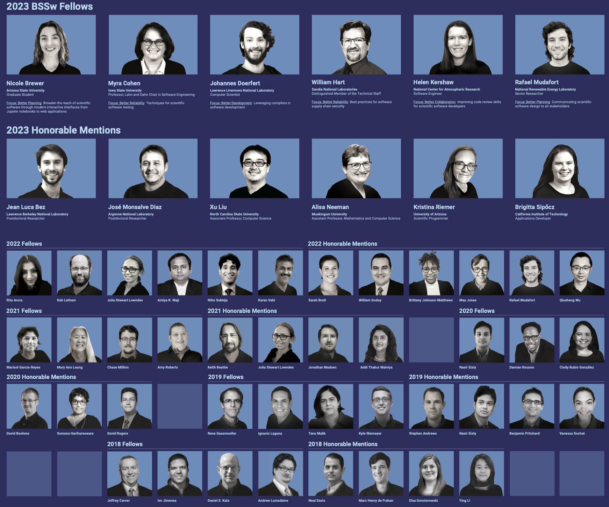
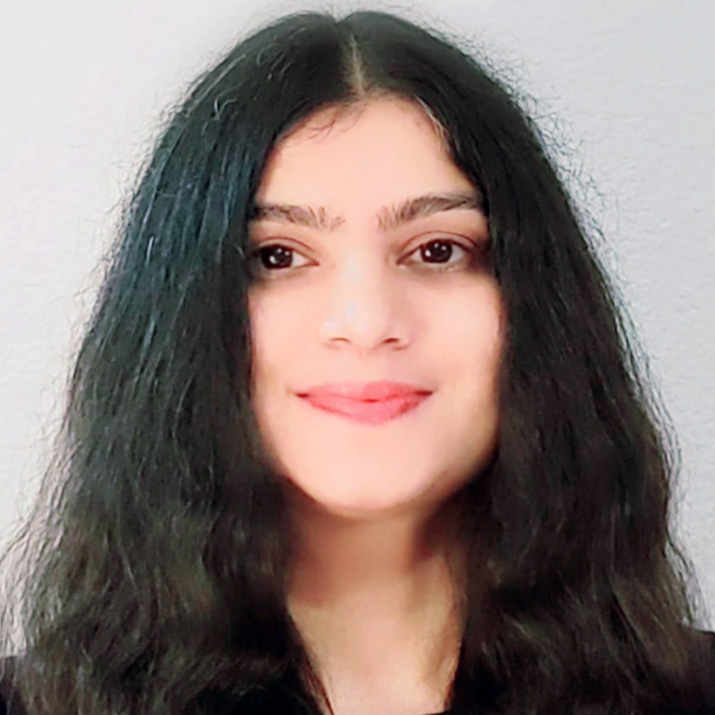
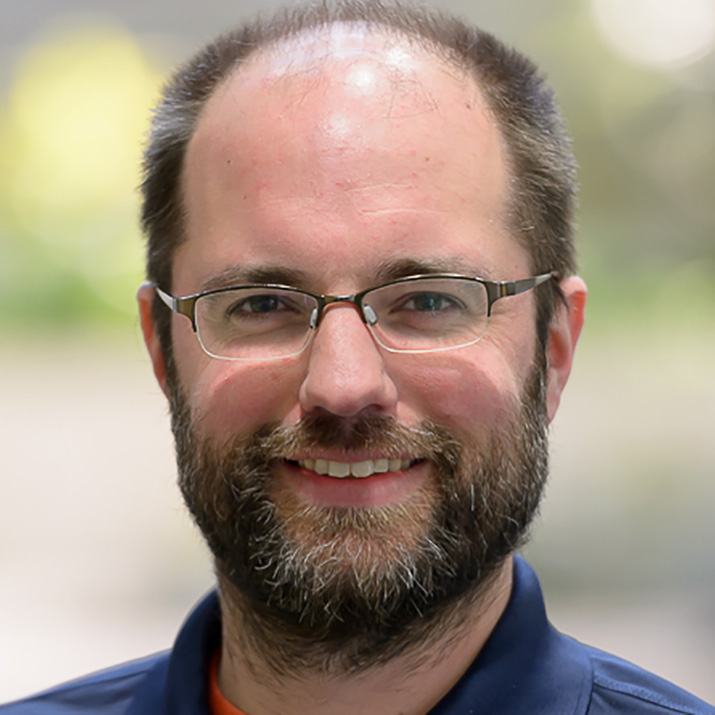
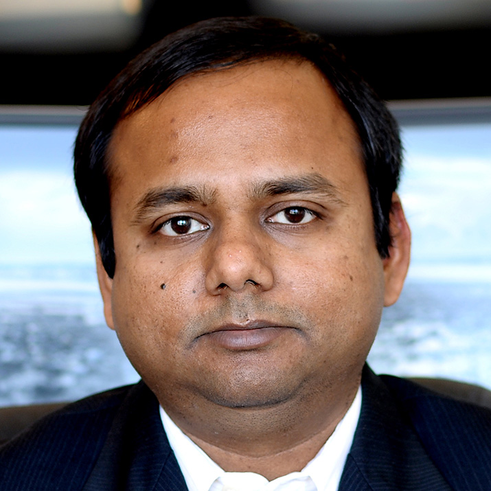
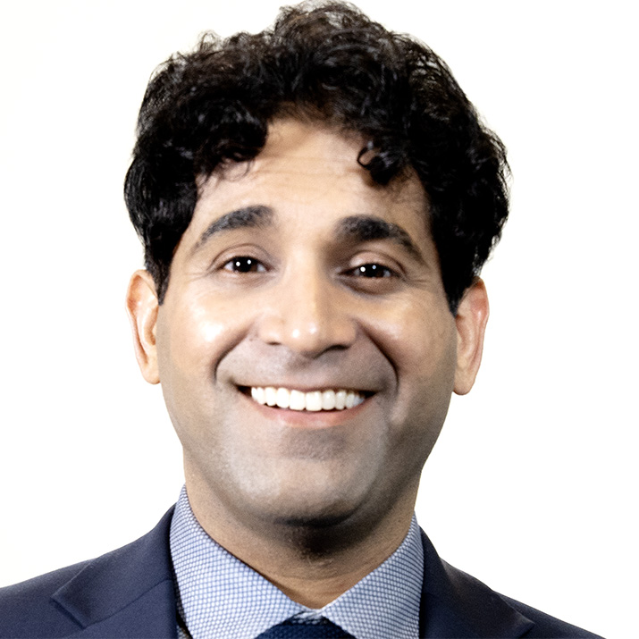
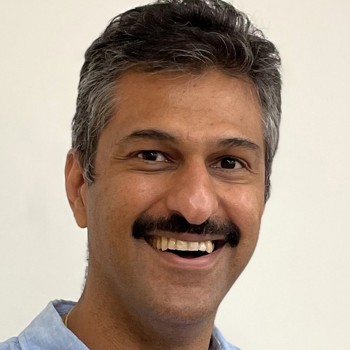

# 2022 BSSw Fellows: Projects and Perspectives

Read about the 2022 BSSw Fellows and their contributions to the BSSw community!

#### Contributed by: [Elsa Gonsiorowski](https://github.com/gonsie "Elsa Gonsiorowski's GitHub Profile"), [Ritu Arora](https://github.com/ritua2 "Ritu Arora's GitHub Profile"), [Rob Latham](https://github.com/roblatham00 "Rob Latham's GitHub Profile"), [Julia Lowndes](https://github.com/jules32 "Julia Lowndes's GitHub Profile"), [Amiya Maji](https://github.com/amaji "Amiya Maji's GitHub Profile"), [Nitin Sukhija](https://github.com/ "Nitin Sukhija's GitHub Profile"), [Karan Vahi](https://github.com/vahi "Karan Vahi's GitHub Profile")

#### Publication date: July 26, 2023

[Better Scientific Software (BSSw) Fellowships](https://bssw.io/fellowship) provide resources and community support to those who foster and promote practices, processes, and tools to improve developer productivity and software sustainability of scientific codes.

The 2022 BSSw Fellows have used their skills to create tutorials, webinars, and tools to guide developers through various stages of the scientific software lifecycle and impact the culture of scientific software development.

Here's more about what they have been up to and their perspectives on the BSSw Fellowship Program.

### Optimizing I/O of scientific applications can be critical to simulation performance but is usually an afterthought in application development.

BSSw Fellow Ritu Arora has created videos, articles/blogs, and examples/exercises to demonstrate how to optimize I/O in scientific applications, including applications from the area of AI/machine learning. The project included a 3-part tutorial. Specifically, topics covered include:

1. Optimizing I/O in serial and parallel applications
2. Optimally writing and reading checkpoints in serial and parallel applications
3. Optimizing I/O and checkpointing AI/machine learning models/applications
4. Techniques for leveraging the features in the underlying hardware and filesystems (e.g., Lustre) for optimizing applications' I/O while being aware of portability issues.

<a href="https://github.com/ritua2/bsswfellowship" class="link-row">Optimizing I/O for Better Performance tutorial materials</a>
<a href="https://bssw.io/blog_posts/improving-application-performance-by-optimizing-i-o" class="link-row">Improving Application Performance by Optimizing I/O blog article</a>

 

  

<a href="https://www.linkedin.com/in/ritu-a-59b58ab/">Ritu</a> is a faculty member in the Computer Science department at Wayne State University. She is also the founder of <a href="https://www.venratech.com/home">Venra Tech Inc.</a>, a company that provides solutions for advanced computing, data management, visualization, AI, and IT infrastructure development. Prior to joining Wayne State University, Ritu led the Research Computing portfolio at the University of Texas at San Antonio (UTSA). She specializes in designing high-productivity and scalable infrastructure for powering discoveries and has led the development of the software infrastructure for integrating and efficiently utilizing supercomputing, cloud computing, and volunteer computing resources. Her areas of expertise and interest include high-performance Computing (HPC), data-intensive computing, cloud computing, advanced software engineering, and health informatics. Prior to joining UTSA, Ritu worked at the University of Texas (UT) at Austin, where she was appointed as a Research Scientist at the Texas Advanced Computing Center (TACC), and as Associated Faculty in the Department of Statistics and Data Sciences. Ritu received her Ph.D. in Computer and Information Science from the University of Alabama at Birmingham in 2010. She passionately promotes the use of technology for creating social impact and actively engages in the causes for creating inclusive policies and communities.

*Perspectives on the BSSw Fellowship Program:* I am very grateful to the BSSw Fellowship Program team for selecting me and giving me an opportunity to highlight the cause of optimizing I/O in scientific applications. Through this fellowship, I was able to expand my professional network and the target audience for my tutorial on "Optimizing I/O in Scientific Applications". Due to the fellowship, I was able to take time and focus on expanding and updating my previous content on optimizing I/O. I also got a chance to attend the ECP meeting in January 2023 and learn about the great work that colleagues at the DOE laboratories are doing. It feels great to be a part of a very supportive community!

*Advice for new (prospective) BSSw Fellows:* I would suggest proposing a topic that you are very passionate about and deciding on the scope of the proposed work to be undertaken well in advance.

- - -

### I/O sleuthing to track down errors in performance or correctness - at scale!

We often see computational science codes focusing on I/O only when something has gone wrong: A job took longer than expected, data was incorrect, or obscure failure messages come back from the storage system. Diagnosing and debugging I/O problems share many similarities to debugging any parallel application, but do have their own peculiarities and tools. In a one-day course, BSSw Fellow Rob Latham covers the kinds of I/O problems one is likely to encounter in HPC, how to investigate those problems, and how to fix them.

<a href="https://github.com/radix-io/io-sleuthing" class="link-row">I/O Sleuthing workshop materials</a>
<a href="https://www.youtube.com/playlist?list=PLGj2a3KTwhRZSKVy-ZrjarFuW-coqS7F9" class="link-row">I/O Sleuthing workshop video recordings</a>

 

  

<a href="https://www.mcs.anl.gov/~robl/">Rob</a> strives to make scientific applications use I/O more efficiently. After earning his BS (1999) and MS (2000) in Computer Engineering at Lehigh University (Bethlehem, PA), he eventually ended up at Argonne National Laboratory (ANL). His research focus has been on high-performance I/O for scientific applications and I/O metrics. He has worked on the ROMIO MPI-IO implementation, the parallel file systems PVFS (v1 and v2), Parallel NetCDF, and Mochi I/O services.

*Perspectives on the BSSw Fellowship Program:*
I have enjoyed seeing the concept of the Research Software Developer emerge
over the course of my career.  The BSSw Fellowship supports scientific software and elevates
the work developers like me carry out.  This program has connected me to lots
of bright folks and given me a peek at some of the good work going on across
the laboratory complex.

I've been giving I/O tutorials for quite a few years at this point in my
career.  With BSSw Fellowship support, I reframed my typical I/O tutorial into
more of an ongoing collaboration.  I leaned on GitHub discussions for audience
engagement and structured my materials to accommodate contributions from users
running on other HPC platforms.

*Advice for new (prospective) BSSw Fellows:*
For new and future BSSw Fellows, recognize there's a tension between taking
risks and completing the task in the time allotted.  We aren't given endless
time and money -- but who is? As in many fields, operating under gentle
constraints can bring out creativity.  I appreciated the charge to produce
something that could live on once the fellowship is over.

- - -

### Increasing the value of open scientific software through helping researchers engage with existing open source tooling and communities rather than reinventing on their own

BSSw Fellow Julia Stewart Lowndes empowers researchers with technical, team, and leadership skills for data-intensive open science through Openscapes, which she founded and co-directs. Openscapes helps researchers do "better science for future us" -- data-intensive science that is reproducible and transparent; enabled by open-source software; and underscored by sustainability, inclusion, and kindness. Julia's work focuses on the Openscapes Champions Program, a remote cohort series that is not a typical training workshop -- it is an interactive co-learning experience where learners bring their own research projects and are able to make tangible progress together with their teams and with a cohort of peers. During the BSSw Fellowship, Julia has improved the publicly accessible open educational resources, namely the Openscapes Champions Lesson Series that are available for Champions program participants as well as self-paced learning for everyone.

<a href="https://openscapes.github.io/series/" class="link-row">Openscapes Champions Lesson Series</a>
<a href="https://openscapes.github.io/2022-noaa-sefsc-summer/" class="link-row">2022 NOAA SEFSC Openscapes Champions Cohort</a>
<a href="https://ideas-productivity.org/events/hpc-best-practices-webinars/#webinar071" class="link-row">HPC Best Practices Webinar - Openscapes: supporting better science for future us</a>

 

  

<a href="https://jules32.github.io/">Julia</a> is the Founder and Co-Director of Openscapes, championing kinder, better science for future us through open science and teamwork. As a marine data scientist, Mozilla Fellow ‘19, and Senior Fellow at NCEAS, she has nearly ten years of experience designing and leading programs to empower science teams with skill sets and mindsets for reproducible research, empowering researchers with existing open tools and communities. She has been building communities of practice in this space since 2013 with the Ocean Health Index after earning her Ph.D. at Stanford University studying drivers and impacts of Humboldt squid in a changing climate. She is a Carpentries instructor and a co-founder of Eco-Data-Science and R-Ladies Santa Barbara. Follow her on Twitter <a href="https://twitter.com/juliesquid">@juliesquid</a>.

*Perspectives on the BSSw Fellowship Program:*
**NEEDS INPUT**

*Advice for new (prospective) BSSw Fellows:*
**NEEDS INPUT**
- - -

### Simplifying scientific Python package installation and environment management

BSSw Fellow Amiya Maji works to simplify scientific Python package installation by streamlining environment management, dependency tracking, and runtime customizations through easy-to-use tools. With the growing popularity of Python, installation and management of Python packages on HPC clusters is emerging as a critical problem for researchers and is complicated by the need to provide consistency across traditional batch workloads and interactive notebooks. Amiya has collaborated with various HPC centers to document and present their best practices for managing Python applications and implement these practices in the development of the conda-env-mod tool to simplify these processes. Conda-env-mod helps users manage their Python environments more efficiently and load runtime configurations through the familiar abstraction of environment modules. HPC centers can further customize the module file templates to incorporate additional software dependencies and provide descriptive help messages. This work will significantly improve scientific productivity, reduce user errors, and enable sharing of Python package installations among users.

<a href="https://hpc-python-solutions.readthedocs.io" class="link-row">Simplifying scientific Python package installation and environment management – challenges and solutions</a>
<a href="https://github.com/amaji/conda-env-mod" class="link-row">conda-env-mod: A tool for automating HPC Python package installation</a>

 

  

<a href="https://www.rcac.purdue.edu/about/staff/amaji">Amiya</a> is a Lead Computational Scientist at Purdue Research Computing where he collaborates with faculty and researchers from various scientific domains to optimize their computational and data analysis workflows. Being an avid advocate for software reliability and security, Amiya has developed several algorithms and tools for software testing both during his graduate studies at Purdue ECE and then at Research Computing. He co-invented the "Testpilot" regression testing framework at Purdue (<a href="https://doi.org/10.1145/3152493.3152555">HUST17</a>) and also developed the "conda-env-mod" tool for easy deployment of scientific Python applications (<a href="https://doi.org/10.1109/HUSTProtools51951.2020.00011">HUST20</a>). Amiya currently leads the software build automation project for Purdue's community clusters. Amiya's contributions to the Community Cluster program were recognized by the Bravo Award (2020) given to Purdue employees for outstanding achievement. Amiya also serves as a fellow of <a href="https://www.trustedci.org/">Trusted CI</a> (2021) where he promotes best practices for secure computing.

*Perspectives on the BSSw Fellowship Program:*
I have always been passionate about writing robust software and spent countless hours finding
and fixing bugs (and creating a few myself!). In the BSSw Fellowship Program, I found
a community of like-minded individuals who are all passionate about raising the quality of
scientific software through collaboration and dissemination of best practices. I am thankful to
the BSSw Fellowship committee for providing me the opportunity to explore the best practices for
installing and managing scientific Python packages. During my work at Purdue University, I had the
first-hand experience of seeing researchers struggle with the installation of Python packages on HPC
clusters. To alleviate many of the common issues, we wrote a tool called [conda-env-mod](https://github.com/amaji/conda-env-mod) which
simplified the process of Python environment creation, dependency tracking, and usage. The BSSw
Fellowship helped me expand the project and shape it into a more useful tool. I am hopeful that it will
help HPC developers manage their Python environments more efficiently.

The BSSw Fellowship has helped me connect with the larger RSE community and learn about the
experiences of other scientists. I am also thankful for all the feedback that I have received
about best practices for managing HPC Python packages. It was oddly encouraging to see that I was
not alone in my struggles with Python package installation! I will continue to cherish the collective
knowledge, support, and encouragement of the BSSw community.

*Advice for new (prospective) BSSw Fellows:*
For new and future Fellows, I'll echo the advice of the previous Fellows. Once you start working on
your project, it may quickly expand into a larger research problem. Identify the scope of your project and start early.
Take advantage of the great networking opportunities provided by the BSSw Fellowship and don't hesitate to reach out.

- - -

### Mitigate the risk of software vulnerabilities with best practices and tools for secure scientific software development

The sharp increase in computational power of computing ecosystems is likely to continue as we move toward exascale and beyond. In turn, we are seeing new convergent computing platforms along with a paradigm shift in scientific software applications leveraging these platforms. Unfortunately, this also leads to an unexpected growth in security risks pertaining to cybercriminals, as well as malicious insiders in the computing ecosystems. To address these issues, it is of paramount importance to integrate security within the scientific software development lifecycle. The need for best practices for secure software development has been highlighted in the President's Executive Order on Improving the Nation's Cybersecurity issued in May 2021.

BSSw Fellow Nitin Sukhija has created a one-day workshop on securing scientific software development. The workshop components include evaluating design practices for creating secure software, software processes for managing secure software, threat modeling, and quality assurance testing using both static and dynamic analysis tools. Additionally, the workshop includes hands-on exercises with penetration testing tools and how to mitigate threats such as losing sensitive information due to a variety of potential vulnerabilities. The workshop is intended to aid members from diverse research domains in the development of trustworthy and secure scientific software.

<!-- <a href="URL" class="link-row">Link Text</a> -->

 

  

<a href="https://www.sru.edu/c2ac">Nitin</a> is an associate professor in the department of computer science and director of Center for Cybersecurity and Advanced Computing (C2AC) at Slippery Rock University of Pennsylvania. His areas of expertise are scientific computing focusing on performance modeling, robustness and resilience analysis, and cybersecurity.

*Perspectives on the BSSw Fellowship Program:*
The goal of my work is to aid in finding techniques/methodologies to support secure software development. The BSSw Fellowship Program has enabled me with a platform to reach a broader audience and to network with other researchers in the community with similar goals. With the help of the program, I was able to conduct a tutorial on "Best Practices and Tools For Secure Scientific Software Development" at the SIAM MDS2022 conference, which included components for evaluating design practices for creating secure software, appropriate software processes for managing secure software, threat modeling, and quality assurance testing using both static and dynamic analysis tools. This tutorial provided an opportunity to connect with stakeholders from both academia and industry.

*Advice for new (prospective) BSSw Fellows:*
I want to say that the BSSw Fellowship Program coordinators are very helpful in providing support while working on delivering the milestones set for the program. I advise that you seek input from the coordinators while setting and narrowing the scope of the milestones. Moreover, participating in annual meetings and other events is highly recommended.

- - -

### Enabling complex scientific computations and efficient use of HPC resources with scientific workflows

BSSw Fellow Karan Vahi brings the use of workflows to the wider scientific community by developing easy-to-understand training materials that examine the workflow lifecycle and challenges associated with various steps such as creation, execution, monitoring, and debugging. Workflows are needed to capture the complex interdependencies between processing steps in data analysis and simulation pipelines as well as the mechanisms to execute those steps reliably and efficiently. Karan's training walks users through how to model existing simulation pipelines into workflows, how to package application code in containers, and how to execute the workflow on HPC resources and distributed computing infrastructure such as Open Science Grid. The training materials also build on existing interactive Jupyter notebooks that guide users on how to develop workflows using [Pegasus](http://pegasus.isi.edu). The training materials are self-guided and well-suited for in-classroom and virtual teaching.

<a href="https://github.com/pegasus-isi/pegasus-usc-tutorial" class="link-row">Pegasus tutorial materials</a>
<a href="https://www.escience-conference.org/2022/tutorials/pegasus_50_workflows/" class="link-row">Pegasus tutorial</a>
<a href="https://github.com/vahi/pegasus-annex" class="link-row">Containerize setup for Pegasus and HTCondor</a>

 

  

<a href="https://www.isi.edu/people/vahi/about">Karan</a> is a Senior Computer Scientist in the Science Automation Technologies group at the USC Information Sciences Institute (ISI). He has been working in the field of scientific workflows since 2002 and has been closely involved in the development of the Pegasus Workflow Management System. He is currently the architect/lead developer for Pegasus and is in charge of the core development of Pegasus. His work on implementing integrity checking in Pegasus for scientific workflows won the best paper and the Phil Andrews Most Transformative Research Award at PEARC19.

*Perspectives on the BSSw Fellowship Program:*
I think the BSSw Fellowship Program is very well structured, especially with the program staff guidance during the application process about the various milestones that are spaced out during the period of performance. The milestones were extremely helpful to me in pacing my work for the fellowship alongside all my other work commitments. My work focuses on scientific workflows and I have always been interested in reaching out to domain scientists about the benefits of a workflow management system such as Pegasus. As part of my fellowship proposal, I created new training materials (e.g., Jupyter notebooks) for Pegasus that focus on how scientists can use application containers such as Docker to package their software dependencies and then use them in a workflow.

Subsequent to that I had committed to conducting user training workshops at USC and NERSC with the updated materials. Interestingly, setting up the training on the two institutions led me to do additional work that I had not planned for. USC in the past year had installed Open OnDemand on their HPC cluster and recommended that I do the training using that setup. Along with my colleagues at ISI, we came up with [a setup](https://github.com/pegasus-isi/pegasus-usc-tutorial), whereby users can log in to Open OnDemand with their university credentials and launch JupyterLab server on a workflow partition node that is configured to submit Pegasus Workflows. Once the JupyterLab starts, users can then access the training notebooks and do their training. The NERSC training presented a different set of challenges, where because of site policies, the recommended way for users to submit workflows is for the user to start up a container in the Spin cluster at NERSC. This led me to develop a [containerized setup](https://github.com/vahi/pegasus-annex) of Pegasus and HTCondor that can be deployed in the Spin cluster and can be used by users to submit workflows to Perlmutter at NERSC.

*Advice for new (prospective) BSSw Fellows:*
Choose your milestones carefully and don't wait until the last moment to complete the milestones. I got to do a lot of interesting work that I had not planned for in order to meet my milestones. The ECP Annual meeting is a great avenue for networking and meeting your peers. Unfortunately, I was unable to attend this year's meeting because of personal considerations.  The program staff are very approachable and helped me reach out to the right people at NERSC.

- - -

### Learn more about the BSSw Fellowship Program

BSSw Fellows are selected annually based on an application process that includes the proposal of a funded activity that promotes better scientific software. See more about the [BSSw Fellowship Program](https://bssw.io/fellowship), including ongoing work of the 2023 BSSw Fellows. We will begin accepting applications for 2024 BSSw Fellowships during mid-August 2023. Register for the [BSSw mailing list](https://bssw.io/pages/receive-our-email-digest) to receive information.

### Author bio

Elsa Gonsiorowski is deputy coordinator of the BSSw Fellowship Program, a member of the [IDEAS-ECP](https://ideas-productivity.org/ideas-ecp) team, and HPC I/O support specialist at [Livermore Computing, LLNL](https://hpc.llnl.gov/about-us).

<!---
Publish: yes
Topics: Projects and organizations
--->
