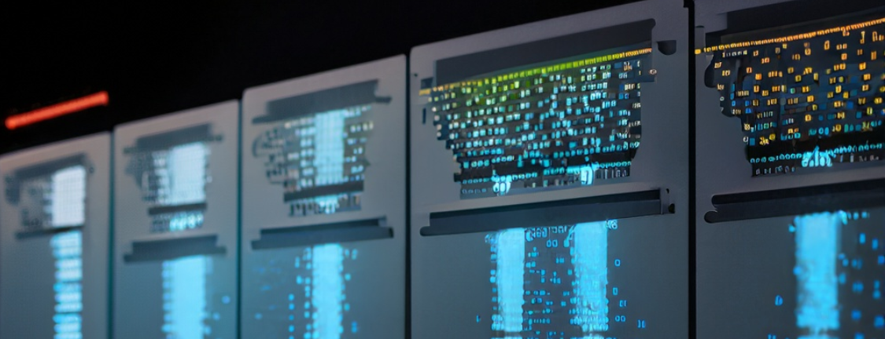

# Improving Application Performance by Optimizing I/O

**Hero Image:**

 - [Running Code on an HPC platform]
   
#### Contributed by [Ritu Arora](https://www.linkedin.com/in/ritu-a-59b58ab/)

#### Publication date: July 14, 2023

### Overview
This blog highlights the need for adopting strategies for optimizing I/O in scientific applications.

### Introduction
Every useful scientific application does some type of Input/Output (I/O). For example, such applications could be reading initial conditions/data for processing or could be writing checkpoints every so often to be used in the event of any hardware failure.

There are two main reasons due to which we should consider optimizing I/O: 

(1)	The first reason is to reduce the overall execution time of our applications, and in doing so, reduce the associated computation costs.

1. The total execution time of a serial (or sequential) application can be broken down into two components (1) computation time and (2) the I/O time.
2. The total execution time of a parallel application can be broken down into three components: (1) time taken for communication between the processes engaged in the parallel computation, (2) time taken for the computation themselves and, (3) time taken in I/O.
3. Hence, in both serial and parallel applications it is important that we optimize I/O to reduce the overall execution time of the applications and enhance 
      their performance. 

(2)	The second reason is to reduce the burden on the shared High Performance Computing (HPC) systems on which our jobs may be running.

1. The large-scale, HPC systems funded by the National Science Foundation (NSF) and other agencies are shared computing systems.
2. When working on such shared computing systems, it is important to know that certain patterns of I/O from the compute jobs can stress out the filesystems. Due to the stressful I/O activities, depending upon the type of the filesystem and its failover mechanism, the filesystem can become unavailable for the entire user community.
3. Hence, it is important that we are aware of how we are doing the I/O from our applications and do it optimally for not only enhancing the applications’ performance but also for maintaining good citizenship on the shared computing systems.

### Some of the strategies to consider for optimizing I/O
You may want to start with code profiling and identifying any hotspots for optimizing I/O. In case any I/O bottlenecks are identified, you can start by exploring the various optimization options that may be available at the software layer (e.g., frameworks and middleware), network layer, and the hardware layer. You might want to leverage the feature of buffering that may be available at the software and hardware layers. If you are working with AI/machine learning frameworks like Tensorflow, PyTorch, and Keras, then you might want to consider prefetching, parallelizing data extraction, asynchronous data loading, and buffer checkpointing. For distributed parallel applications using the Message Passing Interface (MPI), you might want to consider asynchronous collective I/O. You might want to leverage the underlying parallel filesystem on an HPC platform efficiently by chunking your files and storing them on multiple storage targets for supporting parallel I/O.

### Resources for learning further about this topic
The presentation slides from a tutorial on “Optimizing I/O”, video-recordings, online articles, and the complete working code samples complementing the tutorials and articles are available in the following GitHub repository under the LGPL-2.1 license: https://github.com/ritua2/bsswfellowship . The README files in each of the sub-directories in this repository include instructions on running and testing the code.

### Conclusion
Optimizing I/O in applications is often an afterthought. However, with the convergence of AI, HPC, and Big Data, it is becoming increasingly important to devote attention to analyzing how the applications are doing I/O and adopt techniques and strategies to optimize I/O. Some strategies for optimizing I/O are discussed in the material shared through the GitHub repository at the following link: https://github.com/ritua2/bsswfellowship . As the underlying hardware architectures, middleware, frameworks, and libraries continue to evolve, the strategies for optimizing I/O should be revisited and tested for their merits.

### Acknowledgement
This work was supported by the Better Scientific Software Fellowship Program, funded by the Exascale Computing Project (17-SC-20-SC), a collaborative effort of the U.S. Department of Energy (DOE) Office of Science and the National Nuclear Security Administration; and by the National Science Foundation (NSF) under Grant No. 2154495.

### Author Bio
[Ritu Arora](https://www.linkedin.com/in/ritu-a-59b58ab/) is a 2022 BSSw Fellow and a faculty member in the Computer Science departments at Wayne State University. She is also the founder of [Venra Tech Inc.](https://www.venratech.com/), a company that provides solutions for advanced computing, data management, visualization, AI, and IT infrastructure development. Prior to joining Wayne State University, Ritu worked at the University of Texas at San Antonio (UTSA) as the Assistant Vice President of Research Computing, and before that, she served as a Research Scientist at the Texas Advanced Computing Center (TACC) at UT Austin. Ritu obtained her Ph.D. in Computer and Information Science from the University of Alabama at Birmingham in 2010. She is passionate about promoting the use of technology for creating societal impact and actively engages in causes aimed at creating inclusive policies and communities.
