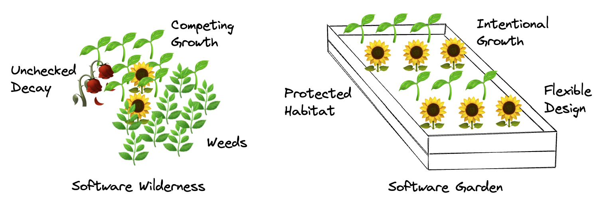

# Long-Term Software Gardening Strategies for Cultivating Scientific Development Ecosystems

#### Contributed by: [Dave Bunten](https://github.com/d33bs) and [Gregory P. Way](https://github.com/gwaybio)

#### Publication date: August 17, 2023

<!-- start of deck text -->
Software development is often described as a craft, such as carpentry.  This article follows a different path, exploring gardening as an analogy for the development and stewardship of research software.
<!-- end of deck text -->

Research software education organizations such as [The Carpentries](https://carpentries.org) compare software development to carpentry practices,[1] which has had broad, positive impacts on scientific research software. However, software carpentry's focus on static output is fundamentally limited. Namely, carpentry does not address techniques and strategies for dynamically evolving or unpredictable aspects of the software craft, such as [software rot prevention](https://en.wikipedia.org/wiki/Software_rot), community-driven apprenticeship, and emergent design strategies. The concept of "software development as gardening" complements the carpentries to illuminate these realities of software development.[2] The conceptual framework of software gardening emphasizes the value of continuously adaptable stewardship throughout the lifespan of a project, addressing risks of long-term software carpentry and community fragility. Therefore, coupling the day-to-day software carpentry mindset with a long-term focus on software gardening further advances the quality and sustainability of scientific software. In this article, we build on existing knowledge of scientific software carpentry and outline effective software gardening practices for encouraging long-term, sustainable scientific software code and communities (<a href="#table-1">Table 1</a>).

### Ecosystems of code and software gardeners

Code is fragile by default; as the software ecosystem around code changes, there are increased chances for errors or unintended functionality. Software gardening[3],[4],[5] is the practice of creating and stewarding flexible software, where stewardship helps to overcome the difficulty of code becoming brittle or incomplete as time passes. The analogy of a software "garden bed" may be mentally constructed to facilitate software gardening practices. To elaborate, software carpentry focuses on the "bricks" of code and how they are composed together properly. Implicit in successful carpentry, these bricks must reside on top of a healthy software garden bed, which requires a different understanding and strategy to maintain. With the empathy of a gardener, healthy ecosystems of code avoid premature ends, and they cultivate carpentry materials as they decay over time (<a href="#fig-1">Figure 1</a>).

[Figure 1. Software growth and decay as an illustrated progression over time. Without software gardening, time can decay software. With software gardening, software can stand the test of time.]

Software and those who create it are sometimes treated like unchanging machines. The perspective of inorganic and emotionless products ignores the full experience of software development.[6] Namely, code and those who maintain it change over time.[7] Exploring code as ecosystems of evolving art[8] nourished by **software gardeners** creates a multidimensional understanding of software development, strengthening development practices.

[Figure 2. An example software wilderness and software garden illustrated with labeled aspects. The software wilderness grows with unchecked decay, weeds, and unintentional growth competition. Software gardens enable intentional growth using flexible design within a protected habitat.]

Healthy ecosystems in the natural world enable organisms to thrive through continual maintenance and rebalancing over time. Software gardening seeks to solve the challenges of how code and those who maintain it change over time, making intentional yet flexible choices about growth and stewarding nurturing habitats (<a href="#fig-2">Figure 2</a>). The following outline covers the areas we'll focus on:

1. [People: Software Gardener lattices (practices regarding the effects of time on Software Gardeners)](#people-software-gardener-lattices)
2. [Code: Software gardening senescence (practices regarding the effects of time on Software)](#code-software-gardening-senescence)
3. [Season: Software archeology, nowness, and proactivity (practices regarding software past, present, and future)](#season-software-archeology-nowness-and-proactivity)

### People: Software gardener lattices

[Figure 3. Software Gardeners are the lattices in which a software garden expands upwards.]

Early roots from Ada Lovelace's work on an analytical engine algorithm in 1842 provide a glimpse of the natural world's influence on software development: "...the Analytical Engine weaves algebraical patterns just as the Jacquard-loom weaves flowers and leaves."[9],[10] Many years later, software development remains an effort of intertwining beauty and function to enhance well-being through a growing system, or lattice, of interconnected parts built upon decades of software advances. Software gardeners build this lattice and are the primary way software comes into and stays in existence (<a href="#fig-3">Figure 3</a>).

How do software gardeners come to be and how may they be prepared for successful software gardening? We propose that cultivating software gardeners is best achieved by recognizing this software lattice as a framework for growing software alongside software practitioners, which organically grows effective software practices and communities. This latticework is crucial; without it, individuals may never reach their full potential or face anti-patterns such as the [tragedy of the commons](https://en.wikipedia.org/wiki/Tragedy_of_the_commons) (where shared resources dwindle without considering needs in common together). Working together toward common goals through the lattice provides an opportunity to understand and take responsibility for healthy software ecosystems, builds community cohesion, and beautifies collective action.[11]

Software gardeners benefit from a balance of curiosity, education (both formal and informal), and courageous vulnerability. Therefore, learning and encouraging patterns from existing software gardeners and the systems they operate within become an important part of the general support lattice for efficient and sustainable growth. We have identified three different competencies for software gardeners, which include:

- **Lattice mapping: Scientific software gardening methods.**
Software gardeners generate hypotheses, do experiments, and collect measurements to understand and protect their gardens. The scientific method provides an avenue for cultivating software gardens in structured ways, allowing software gardeners to explore existing phenomena, raise hypotheses, perform experiments, share results, and iterate improvements. Techniques here can range from formalized scientific methods of isolated hypothesis testing to less formal strategies such as those identified through meeting pre-defined objectives and key results (OKRs).
- **Growing together: Cognitive apprenticeship.**
Software gardeners work closely with one another through cognitive apprenticeship[12] methods. Here, both the apprentice(s) and teacher(s) learn collaboratively with one another and work jointly toward common goals. Collaboration may be proximal, involving sometimes real-time or localized interactions, or distal, involving less frequent or external collaboration (such as through open-source contributions). Every code review or discussion is a chance for parallel growth. Collective engagement through software in this way enhances our mutual ability to grow on the lattice and particularly supports the apprentice in forming a productive and sustainable mindset.
- **Ascendant fortitude: Courage, vulnerability, and resilience.**
Solving software challenges requires courage! Facing existing or new issues also requires vulnerability to share imperfect yet practical approaches. The software gardening lattice must support this through failure acceptance, which is critical to discovery, innovation, and personal growth.[13] A software gardner will develop resilience through these expectations and daily practices.

### Code: Software gardening senescence

[Figure 4. Software gardeners develop systems to address code senescence.]

As in any garden, senescence is a guaranteed part of the software craft. As code ages, it experiences elements of rot, decay, or collapse,[14] eventually leading to complete disintegration where unchecked. As software gardeners, we develop code toward specific goals, managing senescence as part of the process in the same way a gardener may handle compost in a physical garden (<a href="#fig-4">Figure 4</a>). Accepting the full software timeline means planning for times when entire gardens die. These moments provide an opportunity to reflect and document our learning as software gardens transition into deprecation, archival, and sometimes, renewed growth.

Software development is oftentimes shrouded in the darkness of abstraction, where we risk misunderstanding how time has affected code, or we quickly become absorbed by a single focused goal. Software gardeners consider "garden lantern" thinking (in contrast to a software carpenters' "task spotlight") to effectively account for multidimensional code aging processes.[15] The lantern enables a broader view of the wider software landscape and how it interconnects while leveraging specific efforts for maintaining software senescence. To this effect, we highlight below several ways to ensure code is well protected against the direct and indirect effects of senescence:

- **Living fences: Environmental boundaries and replicability.**
A software gardener decides "where" the garden exists and what lives inside it. This environment is code itself; "living walls" of software instruction for how software gardeners and computers will implement elements of code within. Software gardeners place special care on the software environment - without it code is dramatically unprotected from senescence (more quickly disintegrating from other software and people). Software gardeners also add multiple layers of living walls to protect their software gardens. For example, immediate computational environments may enable certain programming language packages to run, while further environmental layers may orchestrate how the programming language itself runs or where it runs in context to other languages or dependencies. Maintaining environments themselves also requires effective software gardening.
- **Adventitious code: Software velocity, symbiosis, and linting.**
Software, especially open-source software, is written by chance, often by "volunteers", which results in fast but adventitious content. These contributions may include common anti-patterns, inconsistent style, or sometimes unsecure implementations. The contributions may also result in disconnected code, or "dead code", increasing the possibility for decay and slowing growth within the garden. These elements are crucial to software formation but sap away understandability and consistent function, which hinder software garden goals. Software gardeners do not address this content by hand; instead, they use linters to automatically discover and remove these elements. Leveraging linters increases future code contribution velocity and symbiosis (connected code), but also provides an auxiliary benefit in that an apprentice software gardener learns through the wisdom of others to maintain their garden better in the future.
- **Multi-generational adaptation: Surviving through fluidity.**
Given enough time, code within the garden will adapt to change, showing elements of evolution. While this process can occur naturally, it can also be facilitated with evolutionary architecture concepts.[16] Software gardeners develop their code with flexibility, using effective layers of abstraction where possible, testing their software "fitness" for purpose, and refactoring when necessary. Refactoring can sometimes be painful, through letting go of unfit code that has metaphorically "died" or become disconnected from the garden. Despite this challenge, "less is more"; removing code that has not adapted to the garden will reduce strain on the healthier components.

### Season: Software archeology, nowness, and proactivity

[Figure 5. Time is an important factor in the software garden.]

Individual pieces of software are part of a larger ecology. A software gardener understands this and asks three questions when developing code: 1) how have things changed, 2) what's important right now, and 3) what might be ahead of us in the future. Software gardeners orient themselves this way to observe, act, and predict what may occur within our software gardens and how to best maintain them over the long term (<a href="#fig-5">Figure 5</a>).

This section focuses especially on wider dimensions of time in the context of our software garden. As a result, these techniques become more conceptual and less precise, though no less useful. The software gardener must have flexible thought, decoupling current work from biases found in the past and preparing them for both ideal and worst-case outcomes. Psychologically, software gardeners implement techniques from [positive psychology](https://en.wikipedia.org/wiki/Positive_psychology) to embed conceptual and realized growth to minimize rumination (e.g., paralysis by analysis) or losing hope during the messy work of software gardening.

Below we provide a few methods to optimize software garden seasons.

- **Software archeology: Wisdom of the ancients.**
Understanding the past provides context for action in the present. Software gardens often show repeated patterns that are important to leverage toward effective software gardening. It is critical to acknowledge the things that didn't work or that have been abandoned. For example, software gardeners avoid using archived projects that are no longer "alive" as they will catalyze code decay. Similarly, software gardeners leverage current libraries and maximize existing objects' potential (making sure, for example, there are no unused but opportune parameters or methods) to enhance their work and avoid reinvention. When approaching new problems, software gardeners consider: "what are the chances someone else has run into this before?". Referencing existing work through literature reviews before diving into new implementations will limit repeating history.
- **Nowness rooting: Code maintenance kairos.**
Residing in software gardens is messy; software gardeners observe more things that need assistance than can possibly get attention today. Software gardens benefit from a reverence of what happened _yesterday_, an understanding of what's important _today_, and acceptance for change _tomorrow_. With "nowness" we root ourselves more in *[kairos](https://en.wikipedia.org/wiki/Kairos)*, the "... opportune time to take action". For example, if a metaphorical software "rabbit" is eating away at our code now, our time as software gardeners is better spent addressing the rabbit today rather than worrying about the past or thinking about what we'll do in the future.
- **Garden proactivity: Anticipating and preparatory growth.**
Moving through software gardens with a sense of kairos, software gardeners can understand the "seasons" of our projects. Extending this metaphor, software gardeners assume fluctuations in seasonal climate, adjacent software gardens, and other dynamics which may be challenging to address if unprepared. The software gardener often anticipates challenges and provides sustainable solutions by expecting surprise. Techniques in this space involve the common aphorism of "hoping for the best while planning for the worst". Hoping for the best should involve strategic thought processes such as backcasting, where one sets a milestone in the distant future and works their way backward, outlining specific steps leading there. Planning for "the worst" can be done using a SWOT (strengths, weaknesses, opportunities, threats) analysis, taking special note of "weaknesses" and "strengths" in terms of how realistic or likely they may be.[17]

### A software gardening toolshed

[Figure 6. There are many tools available to assist the software gardener with their work.]

Expanding upon the concepts above, we provide a software gardening toolshed that seeks to outline the tools necessary for addressing challenges and opportunities in your software gardens.

<!-- Box 1. A software gardening toolshed of tools and techniques -->

<!--
Concept Name | Summary | Example Tools or Techniques
:---|:---|:---
**People: Software Gardener Lattices** | &nbsp; | &nbsp;
Kickoff training/meeting | Use the scientific method to understand and build software gardens. | 
Scientific Method, Objective and Key Results, Agile Methodology Sprint Goal-setting
Growing together: Cognitive apprenticeship | Work with others in the context of learning opportunities, leveraging cognitive apprenticeship techniques and similar. | Cognitive Apprenticeship techniques, Pull Request Reviews, Pair Programming
Ascendant fortitude: Courage, vulnerability, and resilience | Embody bravery and vulnerability to overcome uncertainty and grow within software gardens. | Psychological Safety, Open communication, Mistake accountability and growth
**Code: Software Gardening Senescence** | &nbsp; | &nbsp;
Living fences: Environmental boundaries and replicability | Use environment managers by default to build protected, replicable contexts for your software garden. | Conda, Poetry, Renv
Adventitious code: Software development velocity and linting |	Add and require software linting tools in order to weed inconsistent, obsolete, or dangerous code "volunteers" which may naturally appear. | Pre-commit, Pylint, Stylr, Ruff
Multi-generational adaptation: Surviving through fluidity |	Use abstraction and fitness testing to keep and ensure code flexibility by design and goal alignment. Remove code which becomes disintegrated or overly complex. | Object-oriented design, Fitness functions, Decoupling strategies
**Season: Software Archeology, Nowness, and Proactivity** | &nbsp; | &nbsp;
Software archeology: Wisdom of the ancients |	Hark past development by using existing software to full potential, reference existing implementations, and remove archived or otherwise "dead" code. | Documentation, GitHub Search, GitStats
Nowness rooting: Code maintenance kairos | Orient work towards what needs to happen today, respecting that our conception of the present consistently shifts. | Mindfulness, Kanban task status, Time blocking techniques
Garden proactivity: Anticipating and preparatory growth |	Hope for the best and plan for the worst, setting aspirational but measurable goals and avoiding known risks, weaknesses, or threats by observing them in your software garden planning. | Backcasting, SWOT Analysis, Risk Matrices
-->

Table 1. A software gardening toolshed of tools and techniques.

<table>

  <tr>
   <td><strong>Concept Name</strong>
   </td>
   <td><strong>Summary</strong>
   </td>
   <td><strong>Example Tools or Techniques</strong>
   </td>
  </tr>
  <tr>
   <td colspan="3" ><strong>People: Software gardener lattices</strong>
   </td>
  </tr>
  <tr>
   <td>Lattice mapping: Scientific software gardening methods
   </td>
   <td>Use the scientific method to understand and build software gardens.
   </td>
   <td>
<ul>

<li>Scientific method

<li>Objectives and key results

<li>Agile methodology sprint goal-setting
</li>
</ul>
   </td>
  </tr>
  <tr>
   <td>Growing together: Cognitive apprenticeship
   </td>
   <td>Work with others in the context of learning opportunities, leveraging cognitive apprenticeship techniques and similar.
   </td>
   <td>
<ul>

<li>Cognitive apprenticeship techniques

<li>Pull request reviews

<li>Pair programming
</li>
</ul>
   </td>
  </tr>
  <tr>
   <td>Ascendant fortitude: Courage, vulnerability, and resilience
   </td>
   <td>Embody bravery and vulnerability to overcome uncertainty and grow within software gardens.
   </td>
   <td>
<ul>

<li>Psychological safety

<li>Open communication

<li>Mistake accountability and growth
</li>
</ul>
   </td>
  </tr>
  <tr>
   <td colspan="3" ><strong>Code: software gardening senescence</strong>
   </td>
  </tr>
  <tr>
   <td>Living fences: Environmental boundaries and replicability
   </td>
   <td>Use environment managers by default to build protected, replicable contexts for your software garden.
   </td>
   <td>
<ul>

<li>Conda

<li>Poetry

<li>Renv
</li>
</ul>
   </td>
  </tr>
  <tr>
   <td>Adventitious code: Software development velocity and linting
   </td>
   <td>Add and require software linting tools to weed out inconsistent, obsolete, or dangerous code "volunteers" which may naturally appear.
   </td>
   <td>
<ul>

<li>Pre-commit

<li>Pylint

<li>Stylr

<li>Ruff
</li>
</ul>
   </td>
  </tr>
  <tr>
   <td>Multi-generational adaptation: Surviving through fluidity
   </td>
   <td>Use abstraction and fitness testing to keep and ensure code flexibility by design and goal alignment. Remove code that becomes disintegrated or overly complex.
   </td>
   <td>
<ul>

<li>Object-oriented design

<li>Fitness functions

<li>Decoupling strategies
</li>
</ul>
   </td>
  </tr>
  <tr>
   <td colspan="3" ><strong>Season: Software archeology, nowness, and proactivity</strong>
   </td>
  </tr>
  <tr>
   <td>Software archeology: Wisdom of the ancients
   </td>
   <td>Hark past development by using existing software to full potential, reference existing implementations, and remove archived or otherwise "dead" code.
   </td>
   <td>
<ul>

<li>Documentation

<li>GitHub search

<li>GitStats
</li>
</ul>
   </td>
  </tr>
  <tr>
   <td>Nowness rooting: Code maintenance kairos
   </td>
   <td>Orient work towards what needs to happen today, respecting that our conception of the present consistently shifts.
   </td>
   <td>
<ul>

<li>Mindfulness

<li>Kanban task status

<li>Time blocking techniques
</li>
</ul>
   </td>
  </tr>
  <tr>
   <td>Garden proactivity: Anticipating and preparatory growth
   </td>
   <td>Hope for the best and plan for the worst, setting aspirational but measurable goals and avoiding known risks, weaknesses, or threats by observing them in your software garden planning.
   </td>
   <td>
<ul>

<li>Backcasting

<li>SWOT Analysis

<li>Risk Matrices
</li>
</ul>
   </td>
  </tr>
</table>

### Sundown

Part of software gardening is also knowing when to rest at the end of the day. Software gardening is itself a dynamic practice that requires attention paid to personal health in the same ways each of the highlighted areas requires effort toward software projects. We ask readers to consider cultivating their own software gardens and how this dynamic craft may  evolve over time. Happy gardening!

### Figure credits

- [Figure 3](#fig-3): Cropped version of Fragonard, J.-H., Trellis. [Retrieved from Wikimedia Commons](https://commons.wikimedia.org/wiki/File:Trellis_MET_DT255077.jpg).
- [Figure 4](#fig-4): Chardin, J.-B.-S., The Gardener. [Retrieved from Wikimedia Commons](https://commons.wikimedia.org/wiki/File:The_Gardener_MET_DT1499.jpg).
- [Figure 5](#fig-5): Cropped version of Daumier, H., Caricatures of paintings by Daubigny and others in Le Salon Pour Rire. [Retrieved from Wikimedia Commons](https://commons.wikimedia.org/wiki/File:Caricatures_of_paintings_by_Daubigny_and_others_in_Le_Salon_Pour_Rire_MET_DP824536.jpg).
- [Figure 6](#fig-6): Witsen, W., Schuurtje aan het water, RP-T-1890-A-2252. [Retrieved from Wikimedia Commons](https://commons.wikimedia.org/wiki/File:Schuurtje_aan_het_water,_RP-T-1890-A-2252.jpg).

### Author bios

Dave Bunten is a Software Developer with the [Department of Biomedical Informatics at the University of Colorado Anschutz](https://medschool.cuanschutz.edu/dbmi). He has over a decade of experience in the field of software development through various roles in his career. His keen interest in software design, collaboration, and innovation has driven him to explore various areas of the field. He is particularly passionate about research data engineering, in-memory data flow, and scientific software.

Gregory P. Way is an Assistant Professor in the [Department of Biomedical Informatics at the University of Colorado Anschutz](https://medschool.cuanschutz.edu/dbmi). His lab develops methods and software for analyzing large biomedical datasets, most often in the context of drug screens for rare diseases. He believes that high-performance software facilitates science and that we could not make the next discoveries in treating human diseases without software engineers. The sustainability of software is essential to maintaining scientific progress and reducing human suffering.

<!---
Publish: yes
Topics: software process improvement, software engineering, software sustainability, development tools, refactoring
--->

[1-sfer-ezikiw]: https://doi.org/10.1371/journal.pcbi.1005510 "Good enough practices in scientific computing {Wilson G, Bryan J, Cranston K, Kitzes J, Nederbragt L, et al. (2017). Good enough practices in scientific computing. PLOS Computational Biology 13(6): e1005510. doi:10.1371/journal.pcbi.1005510}"

[2-sfer-ezikiw]: https://learning.oreilly.com/library/view/the-pragmatic-programmer/9780135956977/ "The Pragmatic Programmer {Hunt, A., & Thomas, D. The Pragmatic Programmer: From Journeyman to Master. Addison-Wesley.}"

[3-sfer-ezikiw]: https://blog.codinghorror.com/tending-your-software-garden/ "Tending Your Software Garden {Atwood, Jeff. 'Tending Your Software Garden.' Coding Horror, 2 Dec. 2008.}"

[4-sfer-ezikiw]: https://www.linkedin.com/pulse/software-gardening-manifesto-patroklos-papapetrou "Software Gardening Manifesto {Papapetrou, P. (2019, February 19). Software Gardening Manifesto.}"

[5-sfer-ezikiw]: https://www.artima.com/articles/programming-is-gardening-not-engineering "Programming is gardening, not engineering {Hunt, A., & Thomas, D. (2000, May 17). Programming is gardening, not engineering. Retrieved May 16, 2023.}"

[6-sfer-ezikiw]: https://doi.org/10.1109/ICSE.2015.334 "Stuck and Frustrated or in Flow and Happy {S. C. Müller and T. Fritz, 'Stuck and Frustrated or in Flow and Happy: Sensing Developers' Emotions and Progress,' 2015 IEEE/ACM 37th IEEE International Conference on Software Engineering, Florence, Italy, 2015, pp. 688-699, doi: 10.1109/ICSE.2015.334.}"

[7-sfer-ezikiw]: https://www.oreilly.com/library/view/software-engineering-at/9781492082781/ "Time and Change {Titus Winters, Tom Manshreck, & Hyrum Wright. (2020). Time and Change. In Software Engineering at Google: Lessons Learned from Programming Over Time (Chap. 1). O'Reilly Media.}"

[8-sfer-ezikiw]: https://doi.org/10.1145/1076211.1076215 "10.1145/1076211.1076215 {Gregory W. Bond. 2005. Software as art. Commun. ACM 48, 8 (August 2005), 118-124. doi:10.1145/1076211.1076215.}"

[9-sfer-ezikiw]: https://doi.org/10.1109/MAHC.2003.1253887 "Lovelace & Babbage and the creation of the 1843 notes {J. Fuegi and J. Francis, 'Lovelace & Babbage and the creation of the 1843 notes,' in IEEE Annals of the History of Computing, vol. 25, no. 4, pp. 16-26, Oct.-Dec. 2003, doi: 10.1109/MAHC.2003.1253887.}"

[10-sfer-ezikiw]: https:// " Notes by AAL {Lovelace, A. A. (1843). Notes by AAL [Augusta Ada Lovelace]. Taylor's Scientific Memoirs 3: 666-731.}"

[11-sfer-ezikiw]: https://doi.org/10.1016/j.scs.2016.03.013 "The development of a model of community garden benefits to wellbeing {Russell, S. C., Wilkinson, C. M., & Maddison, S. E. (2016). The development of a model of community garden benefits to wellbeing. Sustainable Cities and Society, 34(Part B), 1033-1042. doi:10.1016/j.scs.2016.03.013.}"

[12-sfer-ezikiw]: https://doi.org/10.5840/thinking19888129 "Cognitive apprenticeship {Collins, A., Brown, J. S., & Newman, S. E. (1988). Cognitive apprenticeship: Teaching the craft of reading, writing and mathematics. Thinking: The journal of philosophy for children, 8(1), 2-10. doi:10.5840/thinking19888129.}"

[13-sfer-ezikiw]: https://www.nytimes.com/2023/01/12/science/thomas-zurbuchen-nasa-science.html "At NASA, Dr. Z Was OK With Some Missions Failing {Chang, K. (2023, January 12). At NASA, Dr. Z Was OK With Some Missions Failing. The New York Times.}"

[14-sfer-ezikiw]: https://doi.org/10.1109/MCSE.2019.2900945 "Dealing With Software Collapse {Hinsen, K. (2019). Dealing With Software Collapse. Computing in Science & Engineering, vol. 21, no. 3, pp. 104-108. doi: 10.1109/MCSE.2019.2900945.}"

[15-sfer-ezikiw]: https://us.macmillan.com/books/9780312429843/the-philosophical-baby "The philosophical baby {Gopnik, A. (2009). The philosophical baby: What children's minds tell us about truth, love, and the meaning of life. Farrar, Straus and Giroux.}"

[16-sfer-ezikiw]: https://learning.oreilly.com/library/view/building-evolutionary-architectures/9781491986356/ "Building evolutionary architectures {Fisher, M. T., & Connor, M. J. (2023). Building evolutionary architectures: A practical guide to designing and evolving software systems. O'Reilly Media.}"

[17-sfer-ezikiw]: https://www.oreilly.com/library/view/technology-strategy-patterns/9781492040866 "Technology Strategy Patterns {Hewitt, E. (2018). Technology Strategy Patterns. O'Reilly Media.}"
<!-- DO NOT EDIT BELOW HERE. THIS IS ALL AUTO-GENERATED (sfer-ezikiw) -->
[1]: #sfer-ezikiw-1 "Good enough practices in scientific computing"
[2]: #sfer-ezikiw-2 "The Pragmatic Programmer"
[3]: #sfer-ezikiw-3 "Tending Your Software Garden"
[4]: #sfer-ezikiw-4 "Software Gardening Manifesto"
[5]: #sfer-ezikiw-5 "Programming is gardening, not engineering"
[6]: #sfer-ezikiw-6 "Stuck and Frustrated or in Flow and Happy"
[7]: #sfer-ezikiw-7 "Time and Change"
[8]: #sfer-ezikiw-8 "10.1145/1076211.1076215"
[9]: #sfer-ezikiw-9 "Lovelace & Babbage and the creation of the 1843 notes"
[10]: #sfer-ezikiw-10 "Notes by AAL"
[11]: #sfer-ezikiw-11 "The development of a model of community garden benefits to wellbeing"
[12]: #sfer-ezikiw-12 "Cognitive apprenticeship"
[13]: #sfer-ezikiw-13 "At NASA, Dr. Z Was OK With Some Missions Failing"
[14]: #sfer-ezikiw-14 "Dealing With Software Collapse"
[15]: #sfer-ezikiw-15 "The philosophical baby"
[16]: #sfer-ezikiw-16 "Building evolutionary architectures"
[17]: #sfer-ezikiw-17 "Technology Strategy Patterns"
<!-- (sfer-ezikiw begin) -->
### References
<!-- (sfer-ezikiw end) -->
* 1[Wilson G, Bryan J, Cranston K, Kitzes J, Nederbragt L, et al. (2017). Good enough practices in scientific computing. PLOS Computational Biology 13(6): e1005510. doi:10.1371/journal.pcbi.1005510](https://doi.org/10.1371/journal.pcbi.1005510)
* 2[Hunt, A., & Thomas, D. The Pragmatic Programmer: From Journeyman to Master. Addison-Wesley.](https://learning.oreilly.com/library/view/the-pragmatic-programmer/9780135956977/)
* 3[Atwood, Jeff. 'Tending Your Software Garden.' Coding Horror, 2 Dec. 2008.](https://blog.codinghorror.com/tending-your-software-garden/)
* 4[Papapetrou, P. (2019, February 19). Software Gardening Manifesto.](https://www.linkedin.com/pulse/software-gardening-manifesto-patroklos-papapetrou)
* 5[Hunt, A., & Thomas, D. (2000, May 17). Programming is gardening, not engineering. Retrieved May 16, 2023.](https://www.artima.com/articles/programming-is-gardening-not-engineering)
* 6[S. C. Müller and T. Fritz, 'Stuck and Frustrated or in Flow and Happy: Sensing Developers' Emotions and Progress,' 2015 IEEE/ACM 37th IEEE International Conference on Software Engineering, Florence, Italy, 2015, pp. 688-699, doi: 10.1109/ICSE.2015.334.](https://doi.org/10.1109/ICSE.2015.334)
* 7[Titus Winters, Tom Manshreck, & Hyrum Wright. (2020). Time and Change. In Software Engineering at Google: Lessons Learned from Programming Over Time (Chap. 1). O'Reilly Media.](https://www.oreilly.com/library/view/software-engineering-at/9781492082781/)
* 8[Gregory W. Bond. 2005. Software as art. Commun. ACM 48, 8 (August 2005), 118-124. doi:10.1145/1076211.1076215.](https://doi.org/10.1145/1076211.1076215)
* 9[J. Fuegi and J. Francis, 'Lovelace & Babbage and the creation of the 1843 notes,' in IEEE Annals of the History of Computing, vol. 25, no. 4, pp. 16-26, Oct.-Dec. 2003, doi: 10.1109/MAHC.2003.1253887.](https://doi.org/10.1109/MAHC.2003.1253887)
* 10[Lovelace, A. A. (1843). Notes by AAL [Augusta Ada Lovelace]. Taylor's Scientific Memoirs 3: 666-731.](https://)
* 11[Russell, S. C., Wilkinson, C. M., & Maddison, S. E. (2016). The development of a model of community garden benefits to wellbeing. Sustainable Cities and Society, 34(Part B), 1033-1042. doi:10.1016/j.scs.2016.03.013.](https://doi.org/10.1016/j.scs.2016.03.013)
* 12[Collins, A., Brown, J. S., & Newman, S. E. (1988). Cognitive apprenticeship: Teaching the craft of reading, writing and mathematics. Thinking: The journal of philosophy for children, 8(1), 2-10. doi:10.5840/thinking19888129.](https://doi.org/10.5840/thinking19888129)
* 13[Chang, K. (2023, January 12). At NASA, Dr. Z Was OK With Some Missions Failing. The New York Times.](https://www.nytimes.com/2023/01/12/science/thomas-zurbuchen-nasa-science.html)
* 14[Hinsen, K. (2019). Dealing With Software Collapse. Computing in Science & Engineering, vol. 21, no. 3, pp. 104-108. doi: 10.1109/MCSE.2019.2900945.](https://doi.org/10.1109/MCSE.2019.2900945)
* 15[Gopnik, A. (2009). The philosophical baby: What children's minds tell us about truth, love, and the meaning of life. Farrar, Straus and Giroux.](https://us.macmillan.com/books/9780312429843/the-philosophical-baby)
* 16[Fisher, M. T., & Connor, M. J. (2023). Building evolutionary architectures: A practical guide to designing and evolving software systems. O'Reilly Media.](https://learning.oreilly.com/library/view/building-evolutionary-architectures/9781491986356/)
* 17[Hewitt, E. (2018). Technology Strategy Patterns. O'Reilly Media.](https://www.oreilly.com/library/view/technology-strategy-patterns/9781492040866)
