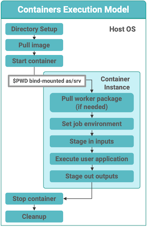

# Containers for Deploying Workflow Systems and Application Codes
<!--- 
**Hero Image:**

 - 
 
The hero image must be this dimension ((1125 x 432 pixels); we can crop an image to the required size.  Put it in the `images/` directory of the bssw.io repo.
---> 
#### Contributed by [Karan Vahi](https://github.com/vahi "Karan Vahi GitHub Profile")

#### Publication date: August 29, 2023

<!--
Use of containers to deploy workflow systems with a HPC center DMZ, and also use for job execution.
-->

Scientific workflows are a key enabler for complex scientific computations. They capture the interdependencies between processing steps in data analysis and simulation pipelines as well as the mechanisms to execute those steps reliably and efficiently. Workflows can capture complex processes, promote sharing and reuse, and also provide provenance information necessary for the verification of scientific results and scientific reproducibility. Workflows bring the promise of lowering the barrier to using large HPC resources for the end scientist.

## Pegasus

The Pegasus (https://pegasus.isi.edu) workflow management system (WMS) is used in a number of scientific domains doing production-grade science. Pegasus allows users to describe their pipelines in a high-level resource-agnostic manner, and then execute these on a variety of execution environments ranging from local campus clusters and computational clouds to large national cyberinfrastructure such as [Open Science Grid](https://osg-htc.org/) (OSG), the National Science Foundation's [ACCESS](https://access-ci.org/) program, and various DOE supercomputing resources. A key benefit of using Pegasus is its data management capabilities, whereby it ensures that the data required for the workflow is transferred to the compute nodes automatically, stages out generated output to a location of the user's choosing, cleans up data that is no longer required, and also ensures scientific integrity of the data during workflow execution.

## Use of containers in a workflow to manage application dependencies

In the context of scientific workflows, container technologies are especially interesting for two reasons:

1. they provide an important tool to the end user to enable reproducibility of their scientific work, by  providing a fully defined and reproducible environment; and
2. they decrease the reliance on the system administrators of centrally managed compute clusters to deploy scientific codes and their dependencies. System administrators often have a conflicting goal of providing a stable, slow-moving, multi-user environment and may not be willing to install libraries or packages that a scientist's application code requires.

Pegasus provides support for users to easily describe the container that a job in the workflow depends on. Pegasus supports all major container technologies such as Docker, Singularity, and Shifter. Once described, Pegasus ensures that the underlying container is deployed automatically at runtime on the node, where a job runs along with its input data. Figure 1 below gives an overview of how a job in a Pegasus workflow, executes on a node and pulls in the container and input data, and stages out generated outputs.

[Figure 1. Containerized Job Setup on a Compute Node by Pegasus]

New training material in the form of Jupyter notebooks has recently been integrated into the main [Pegasus tutorial](https://pegasus.isi.edu/documentation/user-guide/tutorial.html). It covers the basics of how to package your code into a Docker container, push it to an image repository such as DockerHUB, and then describe how to associate the container with specific jobs in the workflow and run the workflow using Pegasus. The notebook can be found in the [Pegasus Github repository](https://github.com/pegasus-isi/pegasus/tree/master/tutorial/docker/notebooks).

## Use of containers for deploying a workflow submit node

Another emerging use case for containers in workflows is to use a container to deploy the workflow system itself within the "science DMZ" of an HPC center. Several large DOE supercomputing facilities, such as the [Oak Ridge Leadership Computing Facility](https://www.olcf.ornl.gov/) (OLCF) and the [National Energy Research Scientific Computing Center](https://www.nersc.gov/) (NERSC), provide users access to a Kubernetes environment within their DMZ, that enables users to spin up containers from where they can submit jobs to the centers' HPC clusters.

For Pegasus WMS there is now a [containerized setup](https://github.com/vahi/pegasus-annex/tree/main) for a "workflow submit host" with Pegasus and HTCondor installed. This container allows you to set up pilot jobs for your workflows using `htcondor annex` with supported HPC clusters. The workflow submit host does not run any compute jobs itself, but rather submits jobs to a remote cluster. The container is meant be to deployed on a host to which the compute nodes of the cluster to which you are submiting jobs to can connect back. The host can be within the science DMZ of the HPC facility or any system with a public IP address that allows the necessary inbound connections. An example of the former case would be deploying the container on the Spin Cluster at NERSC to submit jobs to Perlmutter. Instructions on how to do this can be found [here](https://github.com/vahi/pegasus-annex/blob/main/nersc/README.md).

### Author bio

Karan Vahi is a Senior Computer Scientist in the Science Automation Technologies group at the USC Information Sciences Institute. He has been working in the field of scientific workflows since 2002 and has been closely involved in the development of the Pegasus Workflow Management System. He is currently the architect/lead developer for Pegasus and is in charge of the core development of Pegasus. His work on implementing integrity checking in Pegasus for scientific workflows won the best paper and the Phil Andrews Most Transformative Research Award at PEARC19. He is also a 2022 [Better Scientific Software Fellow](https://bssw.io/pages/bssw-fellowship-program).

<!---
Publish: yes
Topics: high-performance computing (hpc), release and deployment
--->
