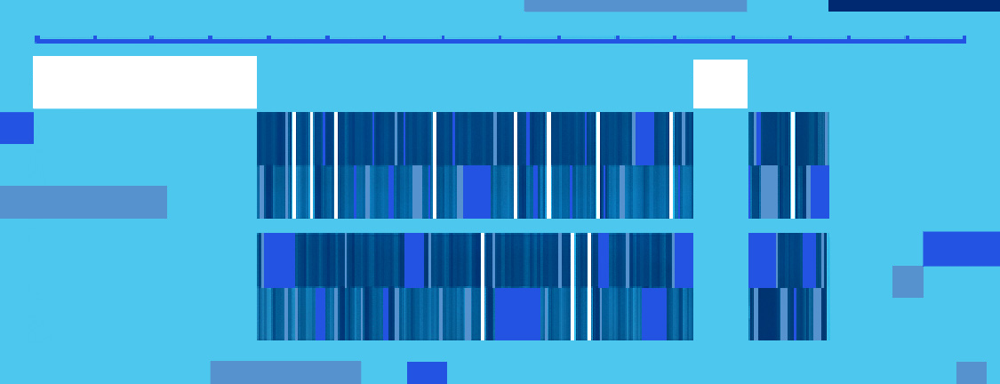

# I/O Sleuthing: Digging into Storage Performance

**Hero Image:**

- 

#### Contributed by [Rob Latham](https://github.com/roblatham00 "Rob Latham's GitHub Profile")

#### Publication date: September 12, 2023

This article introduces new tutorial materials on [I/O sleuthing](https://github.com/radix-io/io-sleuthing) for high performance.

### Introduction

When we run into slow I/O problems -- and we will -- we need to
understand the I/O software stack, the tuning available at each level,
and the tools available to help us make sense of everything.

We have tremendous amounts of computation power available to us but it's
not a single CPU providing those calculations.  We harness multiple
cores in a chip, then multiple chips in a node, multiple nodes in a
rack, and multiple racks in a machine room.  In the same way that
parallelism gives us more (aggregate) computation power, parallel
storage gives us higher I/O rates.  In the same way, that computational
parallelism comes with a complexity cost, so too does parallel storage.

In computer science we find abstraction layers covering up complexity.
Abstraction layers are great for getting work done, but sometimes we
have to peek under the hood and understand what happens at these
abstraction layers to understand performance.

Through benchmarking and characterization tools, we can get a pretty
good handle on why MPI-based parallel applications are seeing the I/O
performance they do.  As we look more broadly at task-oriented and AI
workloads, we need to adapt these tools -- the landscape has changed but the
tools can still provide insights.

### Building blocks of high-performance storage

When we run an application on a supercomputer and read or write some
data, that operation might go through several layers.  Each of those
layers plays a role in both optimizing storage performance and
improving programmer productivity.

Thousands of storage devices make up the parallel file system.  It would
be unreasonable to try to use those devices directly.  Instead, the
parallel file system collects all the storage devices into a single
namespace.  These file systems have ideal transfer sizes and ideal
levels of parallelism -- important details but details that should be
hidden from the application.

At the MPI layer, the I/O routines (often called `MPI-IO) introduce the structure of the data and the notion of multiple processes
working in concert.  This layer is also a great place to hide file-system-specific details.

HDF5 or other high-level I/O libraries add arrays and data structures that fit well
with what applications want.  Instead of operating on bytes and files,
these libraries operate on the kinds of data applications are using.

### Making sense of all these components

When we investigate I/O problems we have two main tools at our disposal:  I/O
benchmarks for exploring storage in isolation, and characterization tools that
work with the full application.

The 'IOR' benchmark has helped us measure and understand storage for decades.
By adjusting block size, transfer size, and segment counts IOR can mimic a wide
array of access patterns.  Additionally, we use IOR to understand the effect of
MPI-IO and file system tuning parameters.   We used IOR to study the ways
stripe counts (e.g., how many Lustre servers a file is stored across) affected
performance.  We also used IOR to gain familiarity with MPI-IO's non-contiguous
I/O optimizations.

The real measure of I/O performance however is not bytes per second but how
quickly an application can generate scientific results.  We use the Darshan
characterization tool to observe an application's I/O in its "natural state" so
to speak.  Here we use Darshan to show what is happening at the file and MPI
layers when HDF5 and PnetCDF optimizations kick in.

### Looking beyond MPI-based applications

We developed these tools and benchmarks in an environment where MPI was the
dominant programming model.  AI, task-oriented workflows, and non-MPI
applications are all more important workloads today. We are working to update
Darshan and tools like it.  For example, Darshan has a "non-MPI" mode for
characterizing applications that do not call MPI.

### Your turn

I hope you check out https://github.com/radix-io/io-sleuthing, try out the
examples on your own file systems, and share what you find out.

### Author bio

Rob Latham, as a Research Software Developer at Argonne
National Laboratory, strives to make scientific applications use I/O more
efficiently. After earning his BS (1999) and MS (2000) in Computer Engineering
at Lehigh University (Bethlehem, PA), he worked at Paralogic, Inc., a Linux
cluster start-up.  His work with cluster software including MPI implementations
and parallel file systems soon led him to Argonne.  His research focus has been on high-performance IO for scientific applications and IO metrics.  He has
worked on the ROMIO MPI-IO implementation, the parallel file systems PVFS (v1
and v2), Parallel NetCDF, and Mochi I/O services.  Rob is a 2022 BSSw Fellow.

<!---
Publish: Yes
Topics: "high-performance computing (hpc)", "performance at leadership computing facilities", "online learning"
--->
