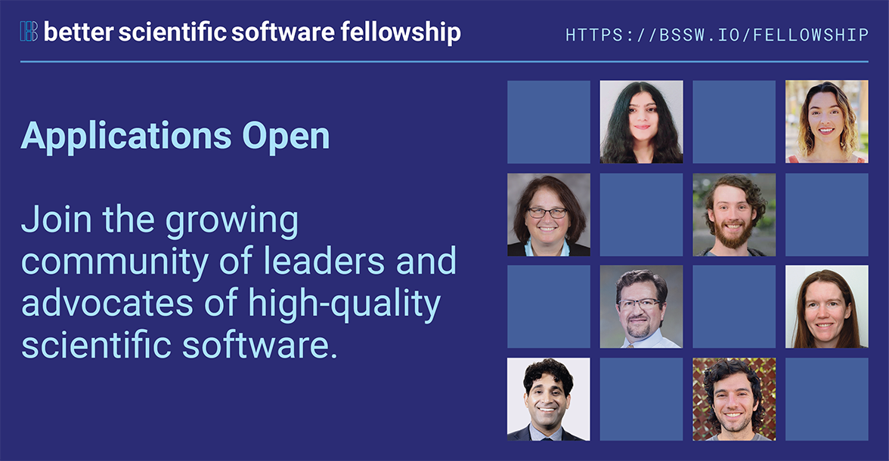

# Highlighted Topics from BSSw Fellowship Q & A Session

#### Contributed by: [Elsa Gonsiorowski](https://github.com/gonsie "Elsa Gonsiorowski's GitHub Profile")

#### Publication date: September 25, 2023

The 2024 Better Scientific Software Fellowship is accepting applications through September 29, 2023.  This article highlights some of the takeaways from the recent Q & A session.

The Q & A session, held on Sept 12 ([slides (pdf) and recording available](https://bssw.io/pages/bssw-fellowship-faq)), presented a detailed overview of the program, application process, and [past fellows](https://bssw.io/pages/meet-our-fellows).  We'd like to highlight some of the key points that came out of that session.

### Encouraging diversity

The BSSw Fellowship is open to applicants of all career stages, from students to senior professionals.
We explicitly encourage applications from those in underrepresented groups, including people who are Black or African American, Hispanic/Latinx, American Indian, Alaska Native, Native Hawaiian, Pacific Islanders, women, persons with disabilities, and first generation scholars.
In addition to technically focused projects, we invite proposals for activities that broaden participation or promote diversity, equity, and inclusion.

### Focus on artifacts

While many fellowship proposals focus on activities, successful project proposals are more than one-time undertakings.
We aim for reusable, sustainable deliverables that can live beyond the fellowship.
These artifacts can come in the form of videos (including [HPC Best Practices webinars](https://ideas-productivity.org/resources/series/hpc-best-practices-webinars/)), written content, interactive websites, and more.
Past fellows have leveraged the BSSw.io blog as well.

### Technical vs. social perspectives

During the Q & A session, the following question was asked:
*Are the projects mostly social or technical in nature?*

Because the Department of Energy (DOE), National Science Foundation (NSF), and computational science and engineering (CSE) communities are deeply technical, a relevant topic related to scientific software is expected.
That said, technical information must be presented with social awareness.
Successful projects understand how to communicate technical information such that it is useful to the larger community and can be used for something more.
The goal is to increase engagement and understanding of the chosen topic.

### Submit today!

So, do you have a great idea on how to make scientific software BETTER and want to share it with the community?
Are you willing to lead and advocate for practices, processes, and tools to improve developer productivity and software sustainability for scientific codes?
The BSSw Fellowship may be right for you!

We require applicants to be affiliated with a U.S.-based institution that is able to receive Federal funding.
For more information, see the [FAQ page](https://bssw.io/pages/bssw-fellowship-faq) and [apply today](https://bssw.io/pages/apply-for-the-bssw-fellowship-program)!

### Author bio

Elsa Gonsiorowski is coordinator of the BSSw Fellowship Program, a member of the [IDEAS-ECP](https://ideas-productivity.org/activities/ideas-ecp) team, and HPC I/O support specialist at [Livermore Computing, LLNL](https://hpc.llnl.gov/about-us).

 

  

**The BSSw Fellowship is sponsored by the U.S. Department of Energy and National Science Foundation.**

  

  

<!---
Publish: yes
Track: bssw fellowship
Pinned: no
Topics: Funding sources and programs, projects and organizations
OpenGraph image: Blog_2308_Fellows.png
--->
