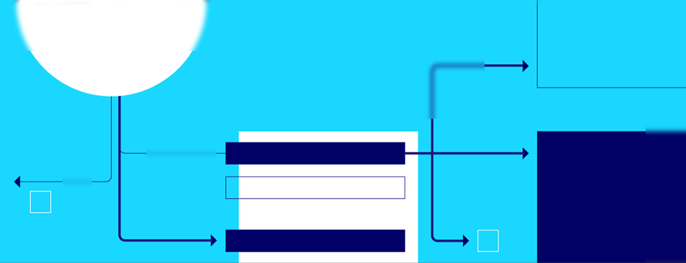

# Fear of Large Code Bases

**Hero Image:**

 - 

#### Contributed by [Francesco Rizzi](https://github.com/fnrizzi)

#### Publication date: September 26, 2023

TENTATIVE TITLES:

- The solution to "the fear large codes" might start from considering software development as first-class part of research. Or maybe will come from AI?
- Far too often we hear "fear of large codes" and "software is not a first-class entity" in research
- path to better production software starts at graduate programs
- We could have better production software if we recognized that software is part of doing research
- Two key factors preventing grad problems to form better computational scientists
- How to eliminate "fear of large codes" in graduate students? The answer might lie in the way we write software
- The "fear of large codes" most likely is due to how we write software

CONTENT:

Recently, while scrolling the notifications on LinkedIn, I came across a news articles from UT Austin.
I bit, and the link took me to an award announcement received by one graduate student in their
prestigious CSEM (Computational Science, Engineering, and Mathematics) program.
While reading the article, the following two statements from his advisor really caught my attention:
"...he is not afraid to get his hands dirty with large-scale codes and data sets, ..." and
"...recognizes that software is a part of his research product...".
To a general reader, these words might not sound anything special. To me, instead, they highlight
two critical aspects shared by a lot of graduate students, resonating with something I talked about at SC22.
And, more broadly, I would argue they still affect the community involved in scientific research as a whole.
Why? Let me elaborate on them.

"Fearing large codes":
----------------------
In general, a graduate research course is aimed at exploring a very specific scientific problem or question.
What distinguishes it from a lower-level degree is the level of detail expected
when exploring this topic, as a Ph.D. program is supposedly intended to form "experts".
In the STEM area, one frequently used approach to attack the problem is by means of a
"proof-of-concept" (POC): this involves a simplified problem that has the advantage of
being easily tractable, while still maintaining "features" of the full problem.
Note that this is not always possible, as simplifications are not always warranted,
and some problems must thus be addressed head-on.
In the field of computational science, a POC is typically tackled with
a small, self-contained code written from scratch, using a language
such as, e.g., Python, Matlab, or C++, usually chosen because it is already known by the graduate student.
By doing so, the student has full control of the code, can work autonomously,
and retains ample freedom to change the implementation as needed. The feeling of being in
this kind of situation is one to remember: you feel in control, knowing all the details,
the various shortcuts taken in this short program, and any modification is relatively
inexpensive to do since the code is small enough that writing and rewriting is a feasible effort.
As one of my colleagues used to say: "I love when I can prototype ideas and explore
them with a Python script of a couple hundred lines!".

However, such a "sandbox reality" has an inevitable end date. At some point, in fact,
this POC is not sufficient to make the "deep" progress expected, and problems of larger complexity
need to be studied. This is typically the turning point when
larger-scale software come into the picture, and also marks the time when
many graduate students face the "fear of large codes".
This reality is diametrically opposed to the former: a student has, now, only partial control;
has to work in a team comprising multiple people; has to systematically deal with version control,
where small changes are not as easily affordable; other developers might change the code
"under your feet" requiring the student to constantly update; or developers who wrote parts of
the code have left and nobody knows the inner workings of some functions; and, finally,
the student has to dig deep into the code to understand it because of the lack of documentation.
With all these factors and unknowns playing a role, the fear of facing such a seemingly hard task grows,
and with it, the pressure to deliver.

It is natural to ask at this point: why is this fear of large codes so common?
After all, not all students are like the one mentioned at the beginning of this article,
praised for his "lack of fear" of getting his hands dirty with large codes.
What if there was a way for *most* students to work on large codes without necessarily
needing years of development experience and, most importantly, without being afraid of them?
If you, reader, think that such a case is an utopia, I would argue that such a reality *could* exist.
Imagine a code (started as a small project, but on its way to becoming a large one) developed from
the beginning with *accessibility* and *sustainability* in mind: the design is modular and flexible
(e.g., the open-closed principle is meticulously met), documentation is complete, and the test suite is well-developed.
If this were the case, any person with even a minimum set of skills would be able to contribute.
The barrier may thus be cleared, and this code, large or not, is not to be "feared", but must rather
be liked by users in order to aid their learning and research.
However, there is a caveat, in that more often than not, the time scale of developing a "pristine"
code conflicts with funding and research timelines... which brings me to the following point.

"Software development should be more valued when doing research":
------------------------------------------------------------------
Despite its fundamental role in computational science, some research efforts are still carried out
by considering and using software just as a means to an end. This is
even more true for projects at graduate programs.
For example, it is common to see codes developed only for a paper, and then the codes are forgotten,
or full research proposals being written without explicitly mentioning software development as a critical deliverable.
I would argue that this approach should change for software to be sustainable, accessible, and maintainable.
Software development should be a first-class entity in a research effort focusing on computational sciences.
Obviously, reconciling this with the actual research questions to address and balancing it all out
budget-wise is hard. But, for the sake of the argument, what could happen if this were the case?
In other words, what could happen if a non-trivial part of a research budget was dedicated to the software development?
For graduate students, this would have a key benefit: it would allow students to learn many skills along the way,
e.g. team development, testing, software quality, that would later prove critical for the job market.
After all, many graduate students and junior researcher are the computational scientists of the future.
More broadly, for a research proposal or idea, two critical benefits can be identified: (a) a solid, robust software
would decrease the chances of doing something incorrectly and, therefore, increase the trustworthiness
of the results and benefit scientific reproducibility; (d) any research code developed from the ground up
with good practices would less likely be forgotten and more easily become the starting point for a production one.

What if AI models take over?
----------------------------
Some people believe the rise of AI and large language models (LLMs) will change the way we write and understand software.
In fact, some experts in the field of programming believe that humans writing software, the corresponding documentation
and the whole idea of software maintainability will eventually become obsolete. Why? Because, assuming a powerful
enough AI/LLM system were available, this AI system will write the software, and then its documentation
in a matter of minutes. Furthermore, there will not be any need to maintain this software since the cost
of constantly re-writing it from scratch and replacing it will be small and negligible
compared to the cost of humans developing software.
At this point you might wonder: if all of this is coming in the (near) future, does it mean everything said above
fail to hold? Will the fear of large codes instantaneously go away since AI systems can help us understand code,
no matter how complex it is, and contribute to it without need to have deep software skills?
Will it still be necessary to form good software engineers and pick up these skills early on?

References:
- UT Austin artile: https://oden.utexas.edu/news-and-events/news/Shane-McQuarrie-wins-BGCE-Prize/
- ACM talk on LLM and AI: https://on.acm.org/t/large-language-models-and-the-end-of-programming/2750
- SC22 slides: https://github.com/fnrizzi/sc22_bof_slides

### Author bio

Francesco Rizzi is CTO and principal scientist at NexGen Analytics. Broadly speaking, he works in the field of scientific computing---which he is really passionate about.
He is currently engaged in multiple projects, from performance portability and linear algebra, to generic programming, model reduction of large-scale applications, and uncertainty quantification.
Prior to NexGen, he was senior technical staff in the Scalable Modeling & Analysis Systems at Sandia National Labs.
He holds a M.Sc. in Computational Physics from the University of Udine (Italy), and a M.Sc./Ph.D. in Mechanical Engineering from The Johns Hopkins University.

<!---
Publish: yes
Topics: high-performance computing (hpc), release and deployment
--->
