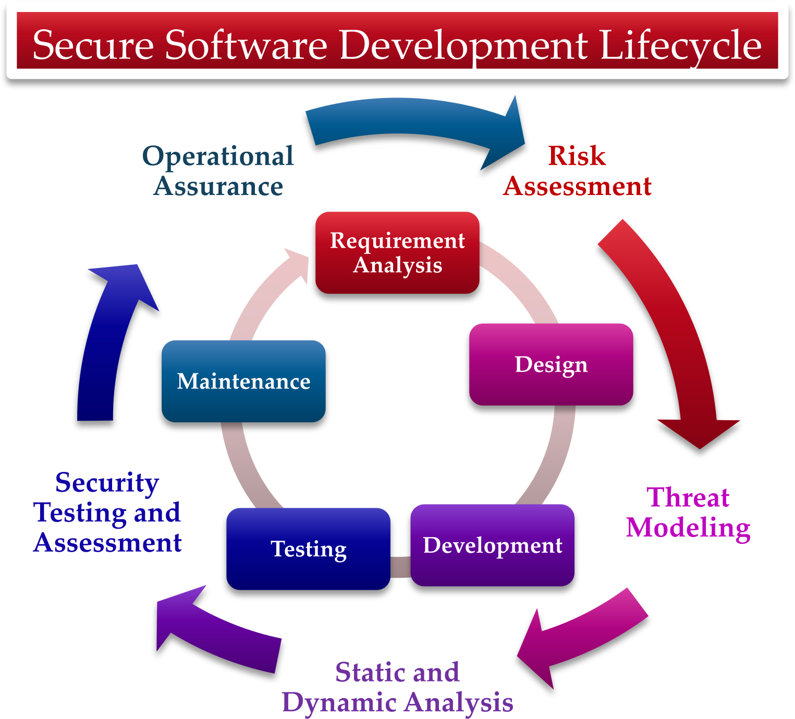

# Secure Software Programming Practices and Development

**Hero Image:**

 - 

#### Contributed by [Nitin Sukhija](https://github.com/SukhijaNitin)

#### Publication date: December 8, 2023

<!--
The Best Practices and Tools for Secure Scientific Software Development include components for evaluating design practices to create secure software, descriptions of appropriate software processes for managing secure software, threat modeling, and quality assurance testing using both static and dynamic analysis tools.
-->

Often for scientific software development, design priorities such as cost, speed, convenience, open architecture, backward compatibility, and others trump security requirements. Moreover, this problem is compounded by our increased dependence on the integration of a myriad of software packages and technologies along with an increased need for long-term sustainable software. Thus, incorporating secure software knowledge and practices into scientific software development is becoming increasingly critical to mitigate and defend against malware attacks that can cause extreme damage to any piece of software while compromising integrity, authentication, and availability. Our work aims to address this issue by providing a comprehensive overview of the software development process and a thorough introduction to threat modeling.

Our recommended best practices and tools for secure scientific software development include components for evaluating design practices to create secure software, descriptions of appropriate software processes for managing secure software, threat modeling, and quality assurance testing using both static and dynamic analysis tools. The goal of secure scientific software development is to enable researchers to analyze the security of scientific software using threat models such as [DREAD](https://en.wikipedia.org/wiki/DREAD_(risk_assessment_model)) and [STRIDE](https://en.wikipedia.org/wiki/STRIDE_(security)), which aid in identifying risks that can cost an organization thousands of dollars when patching vulnerabilities stemming from unsecured code. Developers should also gain hands-on experience with techniques for penetration testing tools to mitigate threats such as loss of business and sensitive information that arise from potential vulnerabilities in various domains. The information shared in the following sections will provide a process for community members to develop secure and trustworthy scientific software (shown in Figure 1).

[Figure 1. Secure Software Development Lifecycle.]

### Secure scientific software development

There exist many lifecycle models encompassing different phases of the development of secure software. In comparison with the traditional [software development lifecycle](https://en.wikipedia.org/wiki/Systems_development_life_cycle), security is implemented in each phase of the secure software development lifecycle. In the planning and requirement analysis phase, potential security and safety issues are identified and security is embedded. At this stage, various risk assessment techniques are employed to evaluate potential threats and vulnerabilities, and security requirements from the customers themselves are incorporated and outlined. During the design phase, threat modeling strategies are utilized to define system components, identify entry points, recognize and categorize potential threats, and implement countermeasures. One of the threat modeling strategies developed by Microsoft and used to document all threats, risks, and mitigation strategies is the [STRIDE](https://learn.microsoft.com/en-us/azure/security/develop/threat-modeling-tool-threats) model, which structures  the approach to security by categorizing different types of threats into the following types:

1. **S**poofing Threat: Illegally using another user’s username and password for an authentication mechanism can lead to potential damages related to stolen data and damaged reputation. This can be mitigated using techniques such as two-factor authentication, encryption, and education.
2. **T**ampering Threat: Unauthorized modification of the data can lead to potential damages related to unauthorized access, false information, and lack of data integrity. This can be mitigated using techniques such as checks for data integrity, secure transmission protocols, and restrictions on access.
3. **R**epudiation Threat: Denying the action performed by a user can lead to potential damages related to business disputes, auditing problems, and inability to enforce accountability. This can be mitigated using techniques such as digital signatures, authentication protocols, and monitoring.
4. **I**nformation Disclosure Threat: Unauthorized access to sensitive information can lead to potential damages related to damaged reputation, regulatory penalties, financial loss, and a loss of trust. This can be mitigated using techniques such as access controls, encryption, data masking, and education.
5. **D**enial of Service Threat (DoS): Making a system unavailable to legit users can lead to potential damages related to financial damage and loss of trust. This can be mitigated using techniques such as firewalls, capacity planning, and traffic filtering.
6. **E**levation of Privilege Threat: A user gaining higher access privileges than intended can lead to potential damages related to system manipulation, system damage, and unauthorized access to sensitive data. This can be mitigated using techniques such as access controls, patch management, regular auditing, and the principle of least privilege.

In the development phase, developers use secure coding practices such as input validation and output encoding for protecting data from unauthorized access and ensuring there is no data loss or tampering. Additionally, static application security testing (SAST) tools, such as [Veracode](https://www.veracode.com/), [Reshift](https://docs.reshiftsecurity.com/), [IDA Pro](https://hex-rays.com/ida-pro/) , [PE Explorer](http://www.pe-explorer.com/), and others, are used to scan application, byte, and binary code to uncover vulnerabilities without executing to address any risks earlier in the development process. In the testing and maintenance phase, the goal is to identify any other leftover security risks to ensure that more secure and robust software is implemented. Thus, dynamic application security testing (DAST) tools such as [Procmon](https://learn.microsoft.com/en-us/sysinternals/downloads/procmon), [OllyDbg](https://www.ollydbg.de/), [WinDbg](https://learn.microsoft.com/en-us/windows-hardware/drivers/debugger/), [penetration testing](https://en.wikipedia.org/wiki/Penetration_test), and others are used to identify further security threats by evaluating the live applications/software environments for vulnerabilities. Moreover, dynamic testing and simulating real-world attacks establish a proactive defense where the organization’s response capabilities can be tested and the incident management and response procedures can be adjusted, thus increasing the effectiveness in today’s dynamic and unpredictable technological environments.

### Further information

Additional information about software development models, threat modeling methodologies, real-world applications of threat modeling methodologies, differences between static (SAST) and dynamic (DAST) application security, penetration testing, and malware analysis tools can be found in our presentations on [Best Practices and Tools for Secure Scientific Software Development](https://zenodo.org/communities/secure-scientific-software-development/).

### Author bio

Nitin Sukhija is an associate professor in the department of Computer Science and director of the Center for Cybersecurity and Advanced Computing (C2AC) at Slippery Rock University of Pennsylvania. He has been involved in the research and management of various projects pertaining to the security and software challenges in industry and academia for over a decade. His research aims to address the threats to confidentiality, integrity, and availability in high-performance computing (HPC) environments and to discover solutions that utilize the power of the HPC environments to study and understand the multifaceted complexities and anomalous characteristics, and also includes the modeling and simulation of complex technical, organizational, and human systems instrumental in providing security and trust.

<!---
Publish: yes
Topics: software engineering, software process improvement
--->
