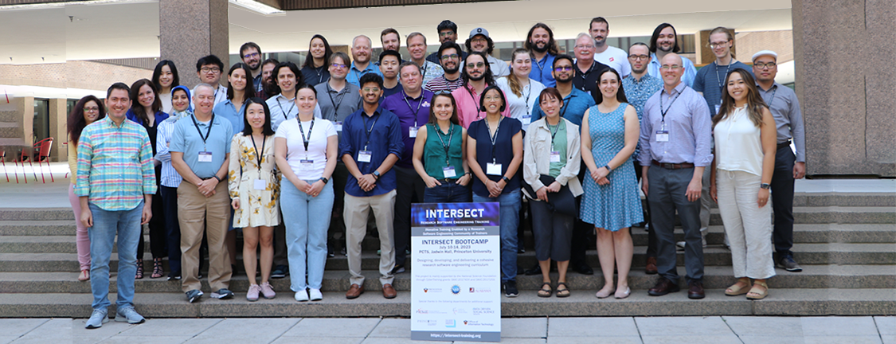

# INTERSECT

**Hero Image:**

- 

#### Contributed by [Jeffrey C. Carver](https://github.com/JeffCarver) and [Ian Cosden](https://github.com/cosden)

#### Publication date: October 13, 2023

Born from the belief that there was an overwhelming lack of appropriate and focused training for research software engineering, the NSF-sponsored [INTERSECT](https://intersect-training.org/) project aims to fill that gap by designing and delivering software engineering training targeting research software developers. In this blog post, we’ll give a quick overview of the project, discuss two recent events - a workshop and bootcamp, and finally give some lessons learned. 

### INTERSECT

The “INnovative Training Enabled by a Research Software Engineering Community of Trainers (INTERSECT)” project delivers software development and engineering training to intermediate and advanced developers of research software. INTERSECT has three main goals:

1. Develop an open-source modular training framework conducive to community contribution;
2. Deliver RSE-led research software engineering training targeting research software developers; and
3. Grow and deepen the connections within the national community of Research Software Engineers.

The majority of INTERSECT’s funded focus is on activities surrounding the development and delivery of higher-level specialized research software engineering training. The target audience of INTERSECT’s training is focused on Research Software Developers, or RSDs, a subset of Cyber Infrastructure Contributors.

### Workshop and Preparation

In August 2022 we hosted 15 experts in RSE training for a 1.5-day Workshop at Princeton University ([https://intersect-training.org/workshop22/](https://intersect-training.org/workshop22/)). The goal of this workshop was to collaboratively plan, develop, and package a series of training modules for the first INTERSECT Research Software Engineering Bootcamp. 

Prior to the workshop, we developed learner profiles for the eventual bootcamp to help guide development and later help potential applicants in determining if they’d fit in our target demographics. Broadly speaking, the target learner audience was specified as domain researchers with some experience with programming and developing research code. They’d be experienced with some of the basics, but likely self-taught and had self-identified the need for more. These could be graduate students, postdocs, or early career professionals in research domains with backgrounds that specifically were not formally in computer science. They likely would have taught themselves, piecemeal, and ad hoc some software development and identified the need for more. In other words, we weren’t targeting training aimed at true beginners. Some may be Research Software Engineers (RSEs) or want to be RSEs but that wasn’t an important criterion for targeted learners, rather we prioritized those who self-expressed desire to do learn and apply Research Software Engineering to their work were 

We began the workshop with an overview of the INTERSECT project. Then we brainstormed about how the training would look and which topics were most important to address during the workshop. Using these topics, we divided into groups to begin planning and development of training material for five prioritized modules (Design, Testing, Packaging, Working Collaboratively, and DevOps/Continuous Integration). By the end of the workshop, the participants had a good start on the development of these modules and agreed to continue developing them in preparation for the first Bootcamp.

### Bootcamp

In July 2023, we held our first INTERSECT-sponsored Research Software Engineering Bootcamp ([https://intersect-training.org/bootcamp23/](https://intersect-training.org/bootcamp23/)) at Princeton University. The bootcamp included 35 participants from a broad range of US-based institutions representing a diverse set of  research domains. Some participants specifically noted that the diversity of backgrounds was  a strength of this bootcamp because it enabled them to have conversations across disciplines they otherwise would not have had. The different perspectives participants heard during their interactions at the bootcamp were valuable.

We organized the 4.5-day bootcamp into a series of stand-alone hands-on training modules. We designed the modules to be related, but not to rely on successful completion or understanding of previous modules. The primary goal of this design was to allow others to use the modules as needed (either as instructors or as self-guided learners) without having to participate in the entire bootcamp. However, this design decision also proved to be useful and appreciated during the bootcamp because attendees who struggled in one module were quickly able to recover at the start of a new session. 

**Bootcamp Schedule**

The following provides an overview of the agenda we used for the July 2023 Bootcamp. We organized the materials partially based on instructor availability and ease of scheduling. Lesson modules ranged in length from 1 hour to 3 hours. Note that due to the intense nature of the work, we decided to give participants a break on Wednesday afternoon.

Monday
* Software Design
* Packaging and Distribution

Tuesday
* Working Collaboratively
* Collaborative Git
* Issue Tracking
* Making Good Pull Requests
* Documentation

Wednesday (half day)
* Project Management
* Licensing

Thursday
* Code Review & Pair Programming
* Software Testing

Friday (half day)
* CI/CD

**Community Building**

One of the stated goals of the bootcamp, and more broadly the INTERSECT project, was to foster a community of Research Software Engineers and others practicing Research Software Engineering. To this end, we incorporated a number of elements into the bootcamp:

* **Intro slides** - Prior to the bootcamp, we asked each participant to prepare a single slide with a picture, contact information, and answers to a few questions about their interests, background, and current work. These slides allowed participants to get to know each other (including the instructors) without spending an entire bootcamp session for introductions. 
* **Slack channel** - We established a dedicated, private, channel within the US-RSE slack workspace for bootcamp-specific conversations. Once participants joined US-RSE (for free), they then had access, not just to the bootcamp channel, but to the broader US-RSE community, along with the ability to DM others. 
* **Collaborative hands-on exercises** - When possible, modules contained hands-on exercises that promoted working together in pairs or small groups. These activities fostered conversations and helped set an openly collaborative experience. The diversity of background and knowledge among the participants meant they could team up to help each other with areas where one teammate struggled.
* **Meals and Breaks** - The bootcamp included breakfasts, lunches, & breaks on-site along with a sponsored reception on Monday and a sponsored dinner on Tuesday off-site. The early week events gave participants a chance to connect and form a cohort. While  as the week progressed, meals and breaks provided a welcomed opportunity for  conversations with fellow participants that weren’t possible during the instructional sessions. 

### Some Lessons Learned

1. **Demand** - As evidenced by both the overwhelming number of applicants and by the feedback from the bootcamp participants, the demand, need, and value for such bootcamps and training is clear. The potential impact is broad and far-reaching.
2. **Diversity** - The participants frequently mentioned the diversity of their fellow bootcamp attendees as a uniquely positive element of the bootcamp. However, the diversity in background did create challenges as each participant came with a dramatically different entry point. Some struggled with specific topics and examples, especially those that required more Python experience, math/science examples, and moving beyond beginner-level Git. 
3. **Depth & time** - Even with a week-long bootcamp, we had insufficient time to cover most topics in depth. While we opted to prioritize exposure over depth, we are not sure yet whether we hit the right balance. 
4. **Instructional Material format** - The Carpentries format is excellent in cases where participants wanted to follow along and even better to use as a reference later. However, porting material into the Carpentries format is time-consuming, requiring a great deal of effort. 

### Next Steps

Following on the success of the 2023 Bootcamp we are already in the early stages of planning a second INTERSECT-sponsored bootcamp for the summer of 2024. We will be updating and evolving the modules and moving everything into the Carpentries format. 

### Interested in Participating?

There are multiple opportunities to contribute or participate in the INTERSECT project. If you are interested in attending next year’s Bootcamp we encourage you to sign up for our mailing list using the link here: [https://intersect-training.org/participate/](https://intersect-training.org/participate/). 

If you are interested in contributing to lesson development as a contributor or maintainer, you can sign up on our mailing list or head over to the appropriate github repository and make a pull request there. You can see the list at the INTERSECT github organization page: [https://github.com/INTERSECT-training](https://github.com/INTERSECT-training). 

### A Special Thanks

The success of the bootcamp is thanks largely to the efforts of the fantastic volunteers, contributors, and instructors who shared their expertise and knowledge in multiple ways. We list them here as curriculum contributors (C) and instructors (I) and we would like to sincerely express our appreciation and admiration for their substantial efforts to help make INTERSECT a success.

* David Bernholdt, ORNL (C, I)
* Abhishek Biswas, Princeton (C, I)
* Sunita Chandrasekaran, Univ. of Delaware (C)
* Troy Comi, Princeton University (C)
* Anshu Dubey, Argonne National Laboratory (C, I)
* Jamil Gafur, Univ. of Iowa/NREL (C)
* Jonathan Halverson, Princeton (C)
* Bill Hasling, Princeton (C)
* Upulee Kanewala, Univ. of North Florida (C, I)
* Marshall McDonnell, Oak Ridge National Laboratory (C, I)
* Lauren E Milechin, MIT (C, I) 
* Miranda Mundt, Sandia National Laboratories (C, I)
* Kyle Niemeyer, Oregon State Univ. (C)
* Gabe Perez-Giz, NYU (C, I)
* David Rumph, Caltech (C, I)
* Henry Schreiner, Princeton (C,I)

### Author bios

Jeffrey C. Carver

Ian Cosden

<!---
Publish: Yes
Topics: "projects and organizations", "in-person learning", "online learning"
--->
