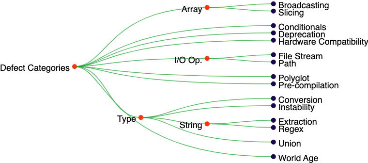

# Come for Syntax, Stay for Speed, and Understand Bugs in Julia Programs 

**Hero Image:**

 - 
 

#### Contributed by [Akond Rahman](https://github.com/akondrahman "Akond Rahman's GitHub Profile")

#### Publication date: November 27, 2023 

In this article, I describe some of our [research findings](https://link.springer.com/article/10.1007/s10664-023-10328-5) related to bugs that occur in Julia programs.
Julia is becoming increasing popular to implement scientific software. 

Since its inception in 2012, Julia has experienced a steady increase in popularity as practitioners are migrating from scripting languages, such as Python.
Practitioners typically use Julia for large-scale scientific data analysis.
For example, Julia was used in [Celeste](https://cs.lbl.gov/news-media/news/2016/celeste-enhancements-create-new-opportunities-in-sky-surveys/), a software used in astronomy research.
Julia yielded a 1000x performance improvement for [Celeste](https://arxiv.org/abs/1611.03404), compared to the prior implementation.   

But what about bugs in Julia programs? Unmitigated bugs in Julia programs can hinder scientific exploration by generating erroneous results and unexpected failures. Hence, we pursued a research study where we systematically investigated a set of bugs collected from the open source domain. 

### Our Approach 

We studied 742 bugs via qualitative analysis. Using our qualitative analysis, we derive bug categories and bug symptoms for Julia programs. We also surveyed 52 practitioners who have contributed to open source Julia programs for further insights. Datasets used in our paper are publicly available [online](https://figshare.com/s/35d775572bb840ebd392).  

### Major Findings 

- We identify nine types of bugs 
- Of these, three have not been reported in other types of software systems, namely, `polyglot`, `pre-compilation`, and `world age`. 
- Common symptoms of bugs in Julia programs are program and build failures, incorrect calculation, and reduction in program execution speed. 
- Survey respondents find bugs related to data types to be the most common and most severe for Julia programs 

### What Does it Mean for Practitioners Working in the Scientific Software Space? 

- Develop tools that can automatically detect and repair identified bug categories, such as security and world age bugs.  
- Gain a better understanding of the unique properties of Julia and follow Julia-related best practices.
- Facilitate seamless integration of quality assurance for the Julia software ecosystem. 

### Author bio

Akond Rahman is an assistant professor at Auburn University. His research interest is in software engineering focused on development and operations (DevOps) and secure software development. His motivation stems from the foundational challenge of integrating quality assurance into the development process without sacrificing developer productivity and software sustainability. His research is sponsored by the U.S. National Science Foundation (NSF) and the U.S. National Security Agency (NSA). He received his PhD from North Carolina State University. He won the Microsoft Open Source Challenge Award in 2016, the ACM SIGSOFT Doctoral Symposium Award at ICSE in 2018, and the ACM SIGSOFT Distinguished Paper Award at ICSE in 2019. He actively collaborates with practitioners from industry, such as practitioners from GitHub and WindRiver. To know more about his work visit https://akondrahman.github.io/.
