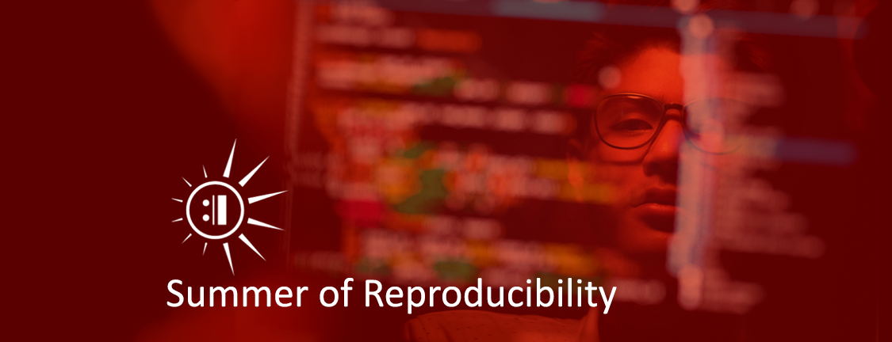

# Summer of Reproducibility: Exposing Students to Research Advancing Practical Reproducibility

**Hero Image:**

 - 
 
#### Contributed by [Stephanie Lieggi](https://github.com/slieggi) and [Carlos Maltzahn](https://github.com/carlosmalt)

#### Publication date: December 19, 2023

The NSF-funded [REPETO Project](https://repeto.cs.uchicago.edu/), a joint effort of the University of Chicago, University of  California, Santa Cruz (UCSC), and New York University, aims to promote practical reproducibility, creating incentives for researchers in computational sciences to produce, share, and use reproducibility artifacts in laboratories and classrooms. 

### The Summer of Reproducibility

As part of this effort, the REPETO team at UCSC established a mentorship program to promote the practical value of reproducibility, i.e., using it as a shortcut to new results, a stepping stone to a more intuitive understanding of scientific facts, or a valuable teaching aid. The [Summer of Reproducibility](https://ucsc-ospo.github.io/sor/) (SoR), which wrapped up its inaugural program in August 2023, supported 19 students from around the world working with 21 mentors. These student-mentor teams worked on projects aiming to make practical reproducibility a mainstream part of the scientific process.

The SoR is managed under the [UCSC Open Source Research Experience](https://ucsc-ospo.github.io/osre/) (OSRE) program, which follows the model set forth by successful mentorship, outreach, and sponsorship programs such as the [Google Summer of Code](https://summerofcode.withgoogle.com/) (GSoC).  Similar to how programs such as OSRE and GSoC bring more new contributors into open source, the SoR aims to expose more students – both undergraduate and graduate – to reproducibility best practices.

### How it works

The SoR program is open to any researcher or student interested in reproducibility. Mentors submit project ideas to the OSRE website. [Project ideas from 2023](https://ucsc-ospo.github.io/osre23/#projects) covered a wide range of topics, including machine learning, storage, genomics, networking, and education.  The [proposal process](https://ucsc-ospo.github.io/osredocs/forstudents/) begins with these project ideas; once posted, students from around the world review the project ideas, reach out to the project mentors, discuss the project requirements, and then formulate a proposal for a summer project. The chosen students become SoR Fellows and are provided a stipend to work with their mentors over the course of the summer.

### 2023 (Year 1) was very successful

The feedback from both mentors and fellows has been overwhelmingly positive. The fellows found the program to be particularly helpful in building new skills and getting hands-on experience working on cutting-edge research. Below are a few of the comments from our fellows at the end of their summer program:

> The mentorship that I got from the mentors has been invaluable. In addition to regular weekly meetings, their feedback helped me pick up several new concepts during the course of the project.

> I really appreciated my mentors. They open up space for the contributors to make mistakes, so we can explore and think more creatively in solving the problems.

> Thank you [to the mentor] for sharing your knowledge and also filling me with your enthusiasm about education. You also showed me some valuable lessons such as "Show, don't tell".

> [My mentors] are excellent in terms of knowledge and expertise, often guiding me through complex topics with ease. They have always been available when I needed guidance. I truly appreciate the constant support and encouragement I've received.

> [My mentor’s] support was invaluable, providing not only expert guidance but also unwavering encouragement. Her dedication to my growth was evident in every interaction, and I can confidently say that her mentorship significantly contributed to the successful completion of this project.

Likewise, the mentors were impressed with the extent to which the work of the SoR Fellows moved their research forward over the summer. Mentors expressed an appreciation of the enthusiasm of the fellows they worked with and felt their contributions made positive impacts on their overall work.  As noted by one mentor, the “OSRE/SoR funded student … helped us create detailed docs and scripts to easily reproduce our project evaluations. This not only eases our own future work but also helps us promote our work as other people can easily reproduce our results.”

Mentors also saw the SoR program as a unique opportunity for researchers to expand their project communities. “An interesting aspect of the program was the chance to collaborate with talented students from around the world,” noted one, with another stating that “OSRE/SoR provided us a great platform to connect with great students and have them join our projects and make progress.”  SoR mentors further noted how their participation provided needed support for their research work through funding “the exploration of new ideas” as well as seeing “what other people are working on in this direction.” Most notably, mentors appreciated how the SoR fostered new contributors, with one noting that the OSRE/SoR “can be very useful for the sustainability of academic open source projects. It can help identify potential contributors and kick-start the design and implementation of new features.” 

### Getting ready for 2024 (Year 2)

The OSRE team is getting ready to kick off the [2024 Summer of Reproducibility](https://ucsc-ospo.github.io/sor24/) program, including efforts to bring in new mentors and new students.  We hope to provide support to even more students and mentors in the coming year.  You can view the [recording](https://youtu.be/toIQD7CSfLg?si=u5j5Ps4poQlOoo3i) of the first mentor information session, held November 29, 2023, to learn more about the program and how to become a part of it. Student recruitment starts in early 2024 – all information can be found on the [OSRE’24 webpage](https://ucsc-ospo.github.io/osre24/). 

### Author bios

[Stephanie Lieggi](https://ucsc-ospo.github.io/author/stephanie-lieggi/) is the co-PI of the [Open Source Program Office (OSPO), UC Santa Cruz](https://ospo.ucsc.edu), and the executive director of the UC Santa Cruz [Center for Research in Open Source Software (CROSS)](https://cross.ucsc.edu). Prior to coming to UC Santa Cruz, she worked as a senior research associate at the Center for Nonproliferation Studies (CNS) at the Middlebury Institute of International Studies at Monterey. She has served as an editor of the CNS publications <i>Asian Export Control Observer</i> and [<i>International Export Control Observer</i>](https://nonproliferation.org/research/international_export_control_observer/). Previously, she worked at the [Organization for the Prohibition of Chemical Weapons](https://www.opcw.org/).

<!-- Does not exist: (https://cns.miis.edu/pubs/observer/asian/) and (https://cns.miis.edu/pubs/observer/) -->

[Carlos Maltzahn](https://people.ucsc.edu/carlosm) is the co-PI of the [Open Source Program Office (OSPO), UC Santa Cruz](https://ospo.ucsc.edu), and the founder and director of the UC Santa Cruz [Center for Research in Open Source Software (CROSS)](https://cross.ucsc.edu). He also co-founded the [Systems Research Lab](https://systems.soe.ucsc.edu), known for its cutting-edge work on programmable storage systems, big data storage and processing, scalable data management, distributed system performance management, and practical reproducible evaluation of computer systems. Carlos joined UC Santa Cruz in 2004, after five years at Netapp working on network intermediaries and storage systems. In 2005 he co-founded and became a key mentor on Sage Weil’s [Ceph project](https://ceph.io). In 2008 Carlos became a member of the computer science faculty at UC Santa Cruz and has graduated nine Ph.D. students since. Carlos graduated with a M.S. and Ph.D. in Computer Science from the University of Colorado at Boulder. His work is funded by nonprofits, government, and industry, including the National Science Foundation, U.S. Department of Energy, the Alfred P. Sloan Foundation, and CROSS.

<!---
Publish: yes
Topics: "projects and organizations", "funding sources and programs", "reproducibility"
Track: Community
--->
