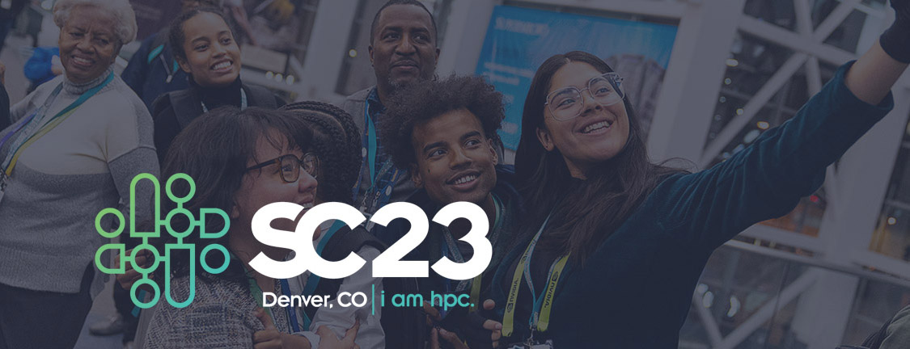

# Reflecting on Our Community: The SC23 BoF on Scientific Software and the People Who Make it Happen: Building Communities of Practice

**Hero Image:**

 - 

#### Contributed by: [David E. Bernholdt](https://github.com/bernhold), [Robert Speck](https://github.com/pancetta), [Alan O’Cais](https://github.com/ocaisa), [Miranda Mundt](https://github.com/mrmundt), [Nasir Eisty](https://github.com/neisty),[ Jeffrey Young](https://github.com/jyoung3131), [Radovan Bast](https://github.com/bast), [Jamie Quinn](https://github.com/JamieJQuinn/)

#### Publication date: February 26, 2024

Since 2015, members of the scientific software community have been organizing sessions in the “Birds of a Feather” (BoF) track at Supercomputing and also sometimes at the ISC High Performance conference.  The title of the BoFs has changed over the years, but the primary purpose has always been to provide an opportunity for people interested in scientific software, particularly in HPC environments, to get together and share their thoughts, network, and build community.  The BoFs have proven an interesting and enjoyable way to find out what’s on the minds of some folks in this community.

We’ve settled on a format for the BoF that includes 3-minute lightning talks, chosen by the organizing committee to highlight activities and ideas that seem important and timely, followed by a discussion with the audience, which is always vigorous, wide-ranging, and interesting (and pretty tiring for the people running around with the microphones).  Below, we summarize the talks and the breakout discussions from the session and sample what’s on the minds of our community as of November 2023.

### Lightning talks

We had seven lightning talks this year, covering a wide range of topics with speakers from Denmark, Norway, Switzerland, the UK, and the US.

* [Research Software Hour](https://betterscientificsoftware.github.io/swe-cse-bof/assets/2023-11-sc23-bof/01-bast-researchsoftwarehour.pdf) (RSH) by Radovan Bast (UiT The Arctic University of Norway).  Radovan described an informal online show about scientific computing and research software with a focus on skills that are normally picked up through informal networks. The episodes were recorded together with Richard K. Darst and Anne Fouilloux. As Radovan observed, “Remember how you learned about tab completion? Most people pick up [a tool or shortcut] from seeing someone else use it.”  Radovan provided a list of some of the topics discussed in their [first 25 episodes](https://researchsoftwarehour.github.io/) (recorded in 2020 and 2021) and indicated that there was no lack of additional ideas for the future.  They had hoped to build an extensive audience for their livestream broadcasts but didn’t do enough advertising to achieve this goal.  On the other hand, they found that the recordings of their RSH sessions were a useful resource in their “day job” efforts to help researchers with their computing.  Radovan hopes to resume producing the RSH in 2024 and is open to contributions and collaborations. The idea for the new “season” of RSH is to explore the question: “What do you know now that you wish somebody taught or shown you earlier?”.
* [ACM EIGREP: Emerging Interest Group on Reproducibility and Replicability](https://betterscientificsoftware.github.io/swe-cse-bof/assets/2023-11-sc23-bof/02-bonnet-acmeigrep.pdf) by Philippe Bonnet (ACM EIGREP Chair).  The Association for Computing Machinery (ACM) has launched an Emerging Interest Group (EIG) on Reproducibility and Replicability (EIGREP).  The group’s chair, Philippe Bonnet, discussed the group and its progress toward becoming a full-fledged Special Interest Group (SIG). The group was created to “Foster a broad and inclusive intellectual community around the issues of reproducibility of computational research.”  It currently comprises two working groups: Conference (led by Jay Lofstead, Carlos Maltzahn) and Practices (led by Limor Peer, Vicky Rampin).  The group has been publishing a newsletter twice a year. In the summer of 2023, EIGREP launched the ACM Conference on Reproducibility and Replicability, the next edition of which will take place in Rennes, France, in June 2024.
* [Focus Groups to Focus Efforts: Building the NERSC Community of Practice](https://betterscientificsoftware.github.io/swe-cse-bof/assets/2023-11-sc23-bof/03-gupta-nersccop.pdf) by Lipi Gupta (NERSC).  Lipi Gupta discussed plans and efforts by the National Energy Research Scientific Computing Center (NERSC) computing facility to create a community of practice for their user community.  The goal of the community is to facilitate the flow of information among NERSC users as well as from NERSC staff to users and increase engagement between NERSC staff and users.  Among the ideas they’re considering are user-led special interest groups, regular networking and/or social events, and virtual and in-person discussion spaces.  Through preliminary outreach, they’ve recognized several challenges to building such a community.  First, most communication (about using NERSC) happens within individual user’s research groups, which the NERSC team plans to address by actively working to expand users’ networks. Second, most users first seek help when they need it from a known colleague or through internal channels.  The team plans to address this by focusing on new users to give them a “better” approach from the start.  Third, some users are not confident enough to post in a public forum about troubles they may be having.  To address this, the team is thinking about how to set up safe spaces to facilitate such conversations.
* [Research Software Engineers: Creating a Career Path—and a Career](https://betterscientificsoftware.github.io/swe-cse-bof/assets/2023-11-sc23-bof/04-katz-rsecareerguide.pdf) by Daniel S. Katz (University of Illinois).  Dan highlighted a newly published guide entitled [Research Software Engineers: Creating a Career Path—and a Career](https://zenodo.org/doi/10.5281/zenodo.10073232), resulting from a collaboration between the US Research Software Engineer Association (US-RSE) and the IEEE Computer Society. The guide describes the research software engineer (RSE) career, the needed skills and how they can be learned and practiced, how to engage with other RSEs, and reasons why someone might choose to become an RSE.  They consulted with four subject matter experts to develop the guide, and it was also reviewed by the US-RSE Steering Committee.
* [European Environment for Scientific Software Installations (EESSI)](https://betterscientificsoftware.github.io/swe-cse-bof/assets/2023-11-sc23-bof/05-ocais-essi.pdf) by Alan O’Cais (CECAM).  EESSI is an *optimized* software stack that is capable of streaming scientific software to a wide range of HPC platforms.  Alan O’Cais spoke about his experiences as a member of the team about how they have created a community that encourages software developers to make their products part of EESSI.  First, the team needs to give developers a reason to contribute.  If people get their software into EESSI, it will get broader distribution and also extensive testing,  from the EESSI team.  Second, make it as easy as possible for them to *start* contributing.  For EESSI, it can be as easy as a pull request to add their software to a configuration file.  And finally, he notes that it is important to have the right attitude towards new contributors.  He says you need to be responsive, patient, kind, have a thick skin, and celebrate successes.
* [Years as a trustee of SocRSE UK: A retrospective](https://betterscientificsoftware.github.io/swe-cse-bof/assets/2023-11-sc23-bof/06-quinn-ukrse.pdf) by Jamie Quinn (University College of London, UCL).  Jamie Quinn was one of the trustees of the Society for Research Software Engineering (SocRSE) in the UK for two years, and he discussed his personal observations and takeaways from helping to build that community. Jamie felt that SocRSE UK did an excellent job in many areas, including formal programs (e.g., mentoring), conference organization, providing space and funding for new activities or groups, and hosting and nurturing an online Slack community. However, some of the mechanics have proven hard to scale as the organization has grown. He noted that every page on a website, every process, or document created by the organization needs to be maintained and kept up to date, and noted that it might be worth considering whether you *really* need it before creating it.  He also noted that tools need to be selected with care, including considerations of lock-in. Jamie talked about the value of being open from the start in creating groups (i.e., not limiting membership to the nominal leadership), being willing to delegate and trust volunteers, and sometimes paying people to get things done.
* [HPC Carpentry Community Building in Education](https://betterscientificsoftware.github.io/swe-cse-bof/assets/2023-11-sc23-bof/07-reid-hpccarpentry.pdf) by Andrew Reid (NIST).  Andrew presented the history and plans for the HPC Carpentry training effort.  HPC Carpentry began with some work by ComputeCanada and Peter Steinbach’s “HPC in a Day” tutorial, and since 2017, it has grown and evolved thanks to the contributions of numerous and varied people through multiple leadership changes.  The goal of the HPC Carpentry effort is to use the teaching approach of The Carpentries to build a bridge for new HPC users.  The team has one lesson in the Carpentries Incubator program (HPC Intro, which teaches queuing system basics), as well as an HPC Parallel Novice lesson (using Python), and two other lessons under development (HPC Workflow and HPC Chapel).  They previously developed an HPC Shell lesson but have deprecated that in favor of the “standard” Software Carpentries Shell lesson.  They plan to develop several two-day workshop tracks utilizing the lessons above as well as a planned HPC Development lesson.

### Discussion

We began the general discussion by considering the sustainability of communities focused on scientific software best practices and, in particular, how we can trigger that transformation from a small group of dedicated volunteers to a broadly based community-driven effort.  Awareness was considered to be one of the keys – sharing on social media or otherwise publicizing the work can help to improve awareness and recruit new contributors to the cause.  Similarly, those who are already contributing to the work can be powerful in helping to promote the work. Trusting people and recognizing their contributions by promoting them quickly into leadership roles is helpful for those who do get engaged.  There are generational considerations as well.  The initial leadership of the effort often sees it as a “passion project” – something they think is important, and they pursue it for that reason.  The next generation of leaders tends to get involved because they see it as something that is valued and rewarded.  The third generation of leaders gets involved because it “needs to be done” more than because it is valued and rewarded. At that point, it may be useful to consider how to pay people to do the work – it needs to become part of their job.  It is also useful to note that many in our community are introverts and may not be comfortable with visible roles where they need to engage extensively with others.  But in most cases, many useful forms of contribution don’t require much engagement – updating websites, running a job board, taking notes, etc.

We discussed some of the topics around which we might want to build larger communities.  An informal poll of the room found that many were engaged in efforts like (a) training activities on research software engineering topics, (b) organizing seminars or webinars around scientific software topics, and (c) collecting and disseminating information about research software engineering practices.  Many people are collecting such resources for their local groups/institutions.  Some are sharing more widely.  The UK [Software Sustainability Institute](https://www.software.ac.uk/) publishes across multiple platforms, including cross-posting blogs to other community sites as appropriate.  Their preference for CC-BY licensing for their content facilitates sharing.  The Better Scientific Software resource site ([BSSw.io](https://bssw.io/)) shares a variety of content, including “curated content” (pointers to useful materials found elsewhere), a blog series (which is open to cross-posting), and community events.  The Helmholtz Platform for Research Software Engineering ([Helmholtz-HiRSE](https://www.helmholtz-hirse.de/)) was also noted as a broadly based, funded effort to bring together resources for the community. A brief discussion followed as to how many attendees of this BoF actually make use of these resources. While there are lists of things to read and try readily available, it is not clear how useful they are and how people can find them.

Finally, someone asked whether there was a singular resource that would serve as a good introduction for new entrants to scientific computing.  The consensus was that there wasn’t at present, but what would be useful was a “resource of resources” to help community members navigate to useful resources. Suggestions included using BSSw.io as well as encouraging national RSE organizations to help create and curate such collections (some, like US-RSE, already do some of this, but it takes effort).  Similarly, for training materials, Carpentries.org provides a hierarchy of formal recognition of training content, and a new project, [HPC ED](https://www.cac.cornell.edu/about/pubs/HPC%20ED%20CyberTraining.pdf), aims to (automatically) gather and share metadata on available HPC training so that users can find, organize, and leverage HPC training content regardless of origin.  It is important to ensure that any such resources are available in places that newcomers to the community can easily find and access.

### Summary

Surprisingly, the discussions at this year’s BoF stayed centered on building communities (often they are much wider-ranging).  There appear to be numerous smaller-scale or more localized efforts at building communities and developing resources that seemingly might be parlayed into something larger, or at least shared more widely.  There are many open questions about where to share, how to incentivize/reward/pay people for contributing, and how to ensure that newcomers can find the communities and resources being built.  Perhaps we can focus on these topics at next year’s BoF.

### Resources mentioned

Links to the BoF website, and other resources mentioned in the presentations and discussions.

* BoF series website, including notes from past meetings: [http://bit.ly/swe-cse-bof](http://bit.ly/swe-cse-bof).
* A list of software-focused events at SC23: [https://bssw.io/events/sc23-software-related-events](https://bssw.io/events/sc23-software-related-events)
* [https://researchsoftwarehour.github.io/](https://researchsoftwarehour.github.io/)
* [Research Software Engineers: Creating a Career Path—and a Career](https://zenodo.org/doi/10.5281/zenodo.10073232)
    * US-RSE: [https://us-rse.org/](https://us-rse.org/) 
* [ACM Emerging Interest Group on Reproducibility and Replicability](https://reproducibility.acm.org)
    * Blog: [https://reproducibility.acm.org/blog/](https://reproducibility.acm.org/blog/)
    * Newsletter: [https://dl.acm.org/sig/eigrep](https://dl.acm.org/sig/eigrep)
    * Conference: [https://acm-rep.github.io/](https://acm-rep.github.io/)
* [European Environment for Scientific Software Installations](https://www.eessi-hpc.org) (EESSI)
    * Join the mailing list and Slack channel: [https://www.eessi-hpc.org/join](https://www.eessi-hpc.org/join)
    * Paper: [https://doi.org/10.1002/spe.3075](https://doi.org/10.1002/spe.3075)
    * Docs: [https://eessi.github.io/docs](https://eessi.github.io/docs)
    * GitHub: [https://github.com/eessi](https://github.com/eessi)
* [HPC Carpentry](https://hpc-carpentry.org)
    * GitHub: [https://github.com/hpc-carpentry](https://github.com/hpc-carpentry)
    * Slack:  #hpc-carpentry  on  carpentries.slack.com ([https://slack-invite.carpentries.org](https://slack-invite.carpentries.org))
    * Mailing list: [https://carpentries.topicbox.com/groups/discuss-hpc](https://carpentries.topicbox.com/groups/discuss-hpc)
* [Software Sustainability Institute](https://www.software.ac.uk/)
* [BSSw.io](https://bssw.io/)
* [Helmholtz-HiRSE](https://www.helmholtz-hirse.de/)
* [HPC ED: Building a Federated Repository and Increasing Access through Cybertraining](https://www.cac.cornell.edu/about/pubs/HPC%20ED%20CyberTraining.pdf)
* Awesome Lists:
    * [SocRSE’s list](https://github.com/dstdev/awesome-hpc)
    * [Hifis-net’s list](https://github.com/hifis-net/awesome-rse)
    * [dstdev’s HPC list](https://github.com/dstdev/awesome-hpc) (frequently updated)

### Author bios

David E. Bernholdt is a Distinguished R&D Staff Member at Oak Ridge National Laboratory.  His research interests are broadly in the development of scientific software for high-performance computers, including developer productivity, and software quality and sustainability.

Robert Speck is one of the deputy directors of the Jülich Supercomputing Centre at Forschungszentrum Jülich in Germany. He leads a research group of research software engineering for high-performance computing, where both technology and community play a major role.

Alan O'Cais is currently the technical manager of MultiXscale, a EuroHPC center of Excellence. He previously acted as the Software Manager of E-CAM, an EU Centre of Excellence in computing applications, while at Jülich Supercomputing Centre (JSC). He has previously managed the user software and application environment on the multi-PFlop JURECA hybrid cluster system at JSC. Between 2010 and 2015 he was primarily focused within the LinkSCEEM-2 project helping to develop a Virtual Research Community in Computational Science in the Eastern Mediterranean region.

Miranda Mundt is a Research Software Engineer (RSE) in the Software Engineering & Research Department at Sandia National Laboratories. She partners with scientific software teams to support their continuous development and improve their state of software development and quality practice. She is a member of the Steering Committee of the US Research Software Engineer Association (US-RSE) and is co-General Chair of US’RSE’s 2024 Conference.

Nasir Eisty holds the position of Assistant Professor within the Computer Science department at Boise State University. His academic focus encompasses Software Engineering, Software Quality Assurance, and Research Software Engineering. His research involves empirical investigations into scientific research software to comprehend and advance high-quality software development. Notably, Nasir Eisty was honored as a BSSw Fellow in 2020.

Jeffrey Young is a research scientist at the Georgia Institute of Technology. He is currently serving as the co-director of the Center for Scientific Software Engineering (SSE), a new effort funded by Schmidt Futures, and is the PI and co-director of Georgia Tech’s new Open Source Program Office (OSPO). His research interests lie at the intersection of software engineering for high-performance computing applications and the deployment of novel architectures for HPC.

Radovan Bast is a research software engineer with a background in theoretical chemistry. He is based in Norway and works at the border between science, software, and computational support, and he enjoys supporting multi-disciplinary research. Radovan now works as part of the Norwegian Research Infrastructure Services at the University of Tromsø (UiT), Norway, and leads the CodeRefinery project. At UiT he leads the high-performance computing group and the research software engineering group. His goal is to make HPC more accessible and usable through training.

Jamie Quinn is a Senior RSE in the Aeronautics department at Imperial College London and has served as trustee of the UK’s Society of Research Software Engineering, supporting the growth of technical communities and the larger RSE community within the UK.

<!---
Publish: yes
Track: community
Topics: conferences and workshops, software engineering, research software engineers
--->
