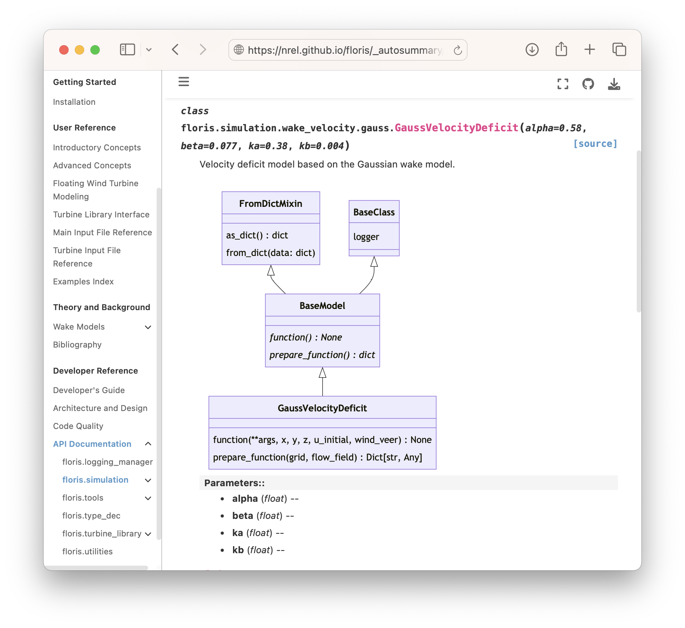

# 2023 BSSw Fellowship: Visually communicating elements of software design

<!-- **Hero Image:**

 -  -->

#### Contributed by: [Rafael Mudafort](https://github.com/rafmudaf)

#### Publication date: Not yet...

I've been a researcher at the National Renewable Energy Laboratory for seven years, and my role squarely fits into the description of a [research software engineer (RSE)](https://society-rse.org/about/).
In my time at the lab, I've noticed a pattern in funding and staffing cycles where both can be discontinuous or unpredictable resulting in lost momentum and institutional knowledge on software projects.
While this pattern is likely inherent to research itself, RSE's can mitigate these impacts and improve the overall quality of their software by **communicating elements of software design within the development workflow.**
As a [2023 Better Scientific Software Fellow](https://bssw.io/fellows/rafael-mudafort), I've aggregated resources and developed training material to empower RSE's to visually communicate ideas and themes within their software projects, and the results are described here.

Documenting ideas, decisions, and institutional knowledge is a powerful way to mitigate discontinuous momentum during software development efforts.
Early in the development of a software, requirements are identified, and some of them are adopted while others are intentionally rejected.
The form and function of the software starts to take shape.
Capturing these decisions is beneficial to future development efforts considering that the collective knowledge that the development team has in the moment will be different from it's knowledge at a future time.
Given time constraints for software development in the research environment, the process of communicating design decisions can be easily relegated to that elusive "when there's time" moment.
To manage this tendency, I suggest that project teams adopt graphical communication methods to describe conceptual ideas and their implementations using Unified Modeling Language (UML) diagrams and automated tooling.
Narrative content around these diagrams is helpful and encouraged, but the diagrams often speak for themselves.
Once the initial diagrams are in place, future development efforts can build on them to scope and design work while inherently communicating the impact to the entire system.
This article describes UML, and it's role in the development workflow for research software engineers.

## UML, Class Diagrams, and Sequence Diagrams
The [Unified Modeling Language (UML)](https://en.wikipedia.org/wiki/Unified_Modeling_Language) was created in the 1995 and adopted by the Object Management Group, a standards consortium, in 1997.
In essence, UML is a set of graphical notations described by metamodels that enable describing and designing software systems.
UML is particularly relevant to software developed in the object-oriented paradigm, but the methods and notations are broadly relevant to software engineering and systems engineering (see [SysML](https://sysml.org)).
The notations defined in UML can be considered syntax for creating a specific set of diagrams useful in software design and analysis.
While UML defines 14 types of diagrams, the following eight are particularly useful and the first two are described further:
- [Class diagram](https://en.wikipedia.org/wiki/Class_diagram)
- [Sequence diagram](https://en.wikipedia.org/wiki/Sequence_diagram)
- [Package diagram](https://en.wikipedia.org/wiki/Package_diagram)
- [Deployment diagram](https://en.wikipedia.org/wiki/Deployment_diagram)
- [Use case diagram](https://en.wikipedia.org/wiki/Use_case_diagram)
- [State diagram](https://en.wikipedia.org/wiki/State_diagram)
- [Activity diagram](https://en.wikipedia.org/wiki/Activity_diagram)
- [Interaction overview diagram](https://en.wikipedia.org/wiki/Interaction_overview_diagram)

Class diagrams are directly correlated to object-oriented programming.
Attributes and methods on a class can be described with their visibility, argument types, and return type.
Abstract classes and abstract methods are denoted in italics.
Inheritance, aggregation, composition, and association are described with lines connecting classes and specific types of arrows.

[UML class diagram metalmodel]

Sequence diagrams are broadly applicable to systems when describing algorithms, processes, and procedures.
The metamodel relates participants by passing messages (commands) and data between them.
A rectangle on a participant's line indicated whether a portion is "on" or "off", and boxes encompassing events denote if-statements, loops, and parallel processes.

[UML sequence diagram metalmodel]

## Perspective and Documentation-Driven Development

The UML metamodels provide the syntax to describe a software system with varying levels of fidelity, and it can be tempting to include as much detail as possible.
However, for any relatively complex software, this can be too much information to digest and understand patterns.
I suggest to instead focus on the audience and the specific message to communicate by considering the following questions:
- Who is the intended audience, and what is their level of experience with your software?
- In a few sentences, what specifically are you communicating?
- At what level of fidelity does the content of the message exist in the software - conceptual, specification, or implementation?

The three diagrams below are taken from one of my software projects, FLORIS, a wind farm wake modeling framework that provides specific interfaces where developers can plug in new wake models.
Consider the three perspectives:
- *Conceptual* describes the relationships between the main components of the software and notes where to connect a new wake model.
- *Specification* describes the connections between a portion of the wake model and the software objects that interface with it.
- *Implementation* describes the specific attributes on a particular class and it's inherited properties.

While each are valuable, maintaining separation allows for focusing a diagram on specific themes for a given audience.

[Diagram perspectives]

Similar to test-driven development, [documentation-driven development](https://www.writethedocs.org/videos/portland/2019/lessons-learned-in-a-year-of-docs-driven-development-jessica-parsons/) is the practice of stating what you're going to do in the documentation prior to doing it.
If there isn't a logical place to put disorganized thoughts, they can be aggregated into a design document that can take the form of a GitHub Discussion or Issue.
Suggested content to include in a design document are:
- Scope and suggested design of the work
- Relationship to existing elements of the software including existing implementations and overarching themes
- New themes and design decisions included and excluded

A strict policy of "docs or it didn't happen" can increase the quality and quantity of documentation, but it comes with the added burden for developers, reviewers, and maintainers.
A more approachable but less rigorous requirement is to require an extended pull request description that includes a narrative of the changes and an overview of design decisions.

## In practice: documentation tooling

There are a variety of web-based tools for creating diagrams including many diagrams in the UML metamodel.
In my experience, separating the design documentation from the code is impractical at any stage of a software development effort past the initial conceptual design.
I've had the most success including documentation source files and software diagrams alongside the code and managed with version control.
For this to work best, text-based formats are preferred over binary formats, and an ecosystem of tools and processes exist to support this workflow.

<!-- Inaccurate documentation can be worse than no documentation, and manual methods can be inaccurate or missing altogether.
For testing, this conundrum has been solved with continuous integration systems, and I suggest integrating documentation as part of the same workflow. -->

### mermaid

[Mermaid.js](https://mermaid.js.org/intro/) is a JavaScript library for describing diagrams in text and rendering them in web browsers and other formats.
In fact, all diagrams in this article are created with this software.
Mermaid contains syntax for the eight UML diagrams listed above, as well as additional diagrams not included in UML.
It is well integrated into much of the software development infrastructure including:
- [GitHub](https://github.blog/2022-02-14-include-diagrams-markdown-files-mermaid/) / [GitLab](https://docs.gitlab.com/ee/user/markdown.html#mermaid)
- [VS Code through extensions](https://marketplace.visualstudio.com/search?term=mermaid&target=VSCode&category=All%20categories&sortBy=Relevance)
- Atlassian products
- [Slack](https://mermaid-preview.com)
- [Many more](https://mermaid.js.org/ecosystem/integrations-community.html)

Since it's text-based, it is easily managed with version control.
Sphinx-based documentation websites render mermaid diagrams directly in documentation source files ([sphinxcontrib-mermaid](https://github.com/mgaitan/sphinxcontrib-mermaid)) and in API documentation through docstrings ([sphinx.ext.autodoc](https://www.sphinx-doc.org/en/master/usage/extensions/autodoc.html)).

[API docs with Mermaid diagrams]

### Pyreverse

For Python projects, [pyreverse](https://pylint.readthedocs.io/en/latest/pyreverse.html), part of [pylint](https://pylint.readthedocs.io/en/latest/index.html), is a Python library that analyzes class definitions to create class and package diagrams.
It can output results in PlantUML (`.puml`), Mermaid (`.mmd`), HTML, and various image formats, as well as any format supported by [Graphviz](https://graphviz.org/docs/outputs/).
This tools creates diagrams that directly match the code, so it is only able to consider the "implementation" perspective.
However, integrating pyreverse with Sphinx-based documentation as part of an automated continuous integration system is an easy way to create the building blocks for manually creating specification and conceptual documentation during design.

### Doxygen / graphviz with dot

For C, C++, and Fortran (to some degree) projects, [Doxygen](https://www.doxygen.nl/index.html) is a static code analyzer to create API documentation as well as the following diagrams:
- Class hierarchies
- Include-dependency graphs
- Caller/callee diagrams
- Directory graph (similar to package diagram)

It exports all products into a HTML viewer that can be included as part of any web-based documentation.
Doxygen itself generates the HTML files and API docs from function and class signatures as well as docstrings.
It [integrates with Graphviz](https://www.doxygen.nl/manual/diagrams.html) to create the graphs and embeds images into the HTML.
There is a set of [extensions](https://www.doxygen.nl/helpers.html) to Doxygen as well as [indirect support](https://github.com/tttapa/doxygen-mermaid) for rendering Mermaid diagrams

## In summary

Through the BSSw Fellowship, I've had the opportunity to interact with the community to gather ideas on documentation and communication on software design.
In particular, I presented at the NLIT S3C conference in April 2024 ([slides]()) and held an IDEAS HPC Best Practices Webinar in April 2024 ([video]()).
I've also put together an [online dashboard](https://rafmudaf.github.io/communicating-design/intro.html) to collect notes, ideas, and examples of good software diagrams.

Stepping back to consider the big picture, I see visual communicate as one step toward a pattern language for software design.
We already have common design patterns and syntactic conventions, but the scientific software community doesn't currently have a common language to talk about our systems at a high level and relate them to each other.
I hope to build on this work to continue seeking the pattern language that will unlock shared understanding of the systems we create so that we can use it both to create new, more elegant software systems and bring meaningful recognition to the research software engineers who create them.

Please get in touch at rafael.mudafort@nrel.gov, [GitHub](https://github.com/rafmudaf), or [LinkedIn](https://www.linkedin.com/in/rafmudaf/).

## Resources mentioned

Aggregation of resources and links mentioned in the article:
- Coming
- Soon

## Acknowledgement
This work was supported by the Better Scientific Software Fellowship Program, funded by the Exascale Computing Project (17-SC-20-SC), a collaborative effort of the U.S. Department of Energy (DOE) Office of Science and the National Nuclear Security Administration; and by the National Science Foundation (NSF) under Grant No. 2154495.

## Author bio

Rafael Mudafort is a senior researcher at the National Wind Technology Center in the National Renewable Energy Laboratory.
He has been a research software engineer for seven years and has a background in aerospace engineering and computer science.
His research interests include wind turbine and wind farm aerodynamics, wind farm flow control, software design, and high-performance computing.

