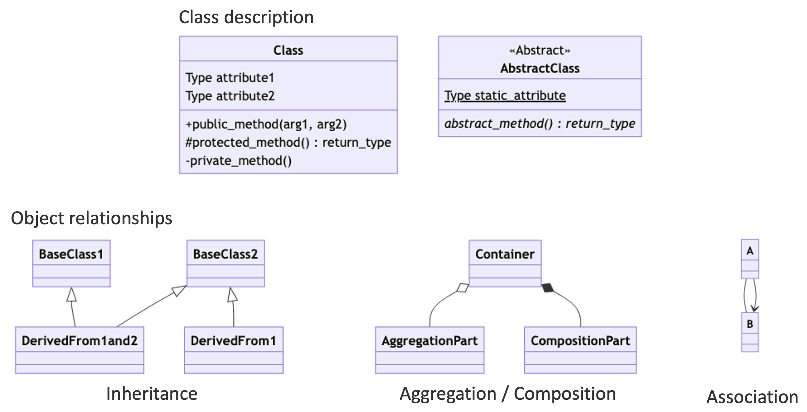
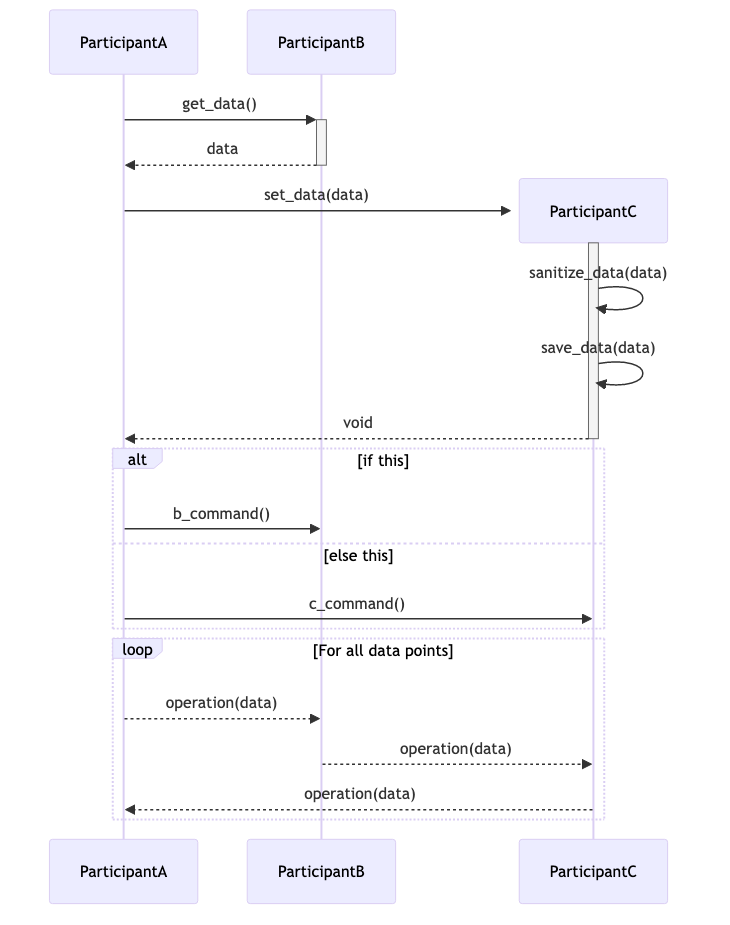
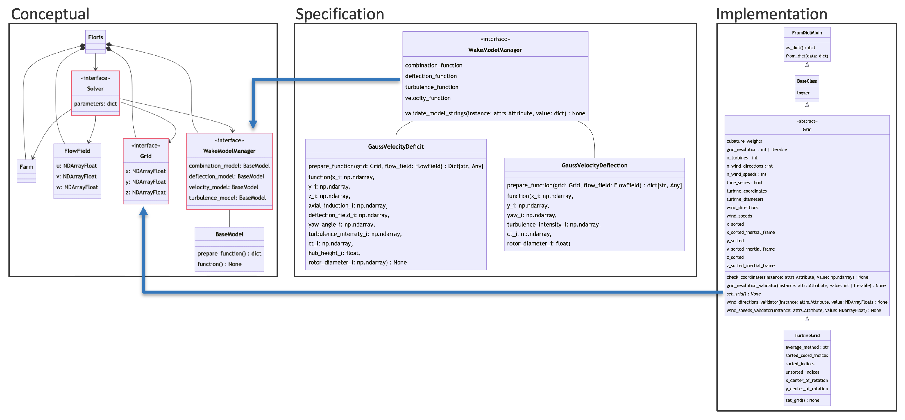

# Visually Communicating Elements of Software Design

**Hero Image:**

 - 

#### Contributed by: [Rafael Mudafort](https://github.com/rafmudaf)

#### Publication date: April 14, 2024

I've been a researcher at the National Renewable Energy Laboratory (NREL) for seven years, and my role firmly fits into the description of a [research software engineer (RSE)](https://society-rse.org/about/).
In my time at NREL, I've noticed a pattern in funding and staffing cycles where both can be discontinuous or unpredictable resulting in lost momentum and institutional knowledge on software projects.
While this pattern is likely inherent to research itself, RSEs can mitigate these impacts and improve the overall quality of their software by **communicating elements of software design within the development workflow.**
As a [2023 Better Scientific Software Fellow](https://bssw.io/fellows/rafael-mudafort), I've aggregated resources and developed training material to empower RSEs to visually communicate ideas and themes within their software projects, and the results are described here.

Documenting ideas, decisions, and institutional knowledge is a powerful way to mitigate discontinuous momentum during software development efforts.
Early in the development of a software package, requirements are identified, and some of them are adopted while others are intentionally rejected.
The form and function of the software starts to take shape.
Capturing these decisions is beneficial to future development efforts considering that the collective knowledge that the development team has in the moment will be different from its knowledge at a future time.
Given time constraints for software development in the research environment, the process of communicating design decisions can be easily relegated to that elusive "when there's time" moment.
To manage this tendency, I suggest that project teams adopt graphical communication methods to describe conceptual ideas and their implementations using Unified Modeling Language (UML) diagrams and automated tooling.
Narrative content around these diagrams is helpful and encouraged, but the diagrams often speak for themselves.
Once the initial diagrams are in place, future development efforts can build on them to scope and plan work while inherently communicating the impact to the entire system.
This article describes UML and its role in the development workflow for research software engineers.

One product of my BSSw Fellowship is an [online dashboard](https://rafmudaf.github.io/communicating-design/intro.html)
with training material on software diagramming including resources for tooling and automated
processes as part of the software development workflow.
This site will be updated periodically with new examples of good software diagrams.
And it's open for contribution, so please [send along](https://github.com/rafmudaf/communicating-design/pulls)
outstanding diagrams that you've created or found.

### UML, class diagrams, and sequence diagrams

The [Unified Modeling Language (UML)](https://en.wikipedia.org/wiki/Unified_Modeling_Language) was created in 1995 and adopted by the Object Management Group, a standards consortium, in 1997.
In essence, UML is a set of graphical notations described by metamodels that enable describing and designing software systems.
UML is particularly relevant to software developed in the object-oriented paradigm, but the methods and notations are broadly relevant to software engineering and systems engineering (see [SysML](https://sysml.org)).
The notations defined in UML can be considered syntax for creating a specific set of diagrams useful in software design and analysis.
While UML defines 14 types of diagrams, the following eight are particularly useful and the first two are described further:
- [Class diagram](https://en.wikipedia.org/wiki/Class_diagram)
- [Sequence diagram](https://en.wikipedia.org/wiki/Sequence_diagram)
- [Package diagram](https://en.wikipedia.org/wiki/Package_diagram)
- [Deployment diagram](https://en.wikipedia.org/wiki/Deployment_diagram)
- [Use case diagram](https://en.wikipedia.org/wiki/Use_case_diagram)
- [State diagram](https://en.wikipedia.org/wiki/State_diagram)
- [Activity diagram](https://en.wikipedia.org/wiki/Activity_diagram)
- [Interaction overview diagram](https://en.wikipedia.org/wiki/Interaction_overview_diagram)

Class diagrams are directly correlated to object-oriented programming, and the class diagram metamodel is shown in Figure 1.
Attributes and methods on a class can be described with their visibility, argument types, and return type.
Abstract classes and abstract methods are denoted in italics.
Inheritance, aggregation, composition, and association are described with lines connecting classes and specific types of arrows.

[Figure 1: The UML class diagram metamodel.]

Sequence diagrams are broadly applicable to systems when describing algorithms, processes, and procedures, and the sequence diagram metamodel is shown in Figure 2.
The metamodel relates participants by passing messages (commands) and data between them.
A rectangle on a participant's line indicates whether a portion is "on" or "off", and boxes encompassing events denote if-statements, loops, and parallel processes.

[Figure 2: The UML sequence diagram metamodel.]

### Perspective and documentation-driven development

The UML metamodels provide the visual syntax to describe a software system with varying levels of fidelity, and it can be tempting to include as much detail as possible.
However, for any relatively complex software, this can be too much information to digest and understand patterns.
I suggest instead to focus on the audience and the specific message to communicate by considering the following questions:

- Who is the intended audience, and what is their level of experience with your software?
- In a few sentences, what specifically are you communicating?
- At what level does the content of the message exist in the software: conceptual, specification, or implementation?

The three diagrams in Figure 3 are taken from one of my software projects, FLORIS, a wind farm wake modeling framework that provides specific interfaces where developers can plug in new wake models.
Consider the three perspectives:

- *Conceptual* describes the relationships between the main components of the software and notes where to connect a new wake model.
- *Specification* describes the connections between a portion of the wake model and the software objects that interface with it.
- *Implementation* describes the specific attributes on a particular class and its inherited properties.

While each is valuable, maintaining separation allows for focusing a diagram on specific themes for a given audience.

[Figure 3: A comparison of conceptual, specific, and implementation perspectives in diagrams from the FLORIS framework.]

Similar to test-driven development, [documentation-driven development](https://www.writethedocs.org/videos/portland/2019/lessons-learned-in-a-year-of-docs-driven-development-jessica-parsons/) is the practice of stating what you're going to do in the documentation prior to writing the code.
If there isn't a logical place to put disorganized thoughts, they can be aggregated into a design document that can take the form of a GitHub Discussion or Issue.
Suggested content to include in a design document are:

- Scope and suggested design of the work
- Relationship to existing elements of the software including existing implementations and overarching themes
- New themes and design decisions included and excluded

A strict policy of "docs or it didn't happen" can increase the quality and quantity of documentation, but it comes with the added burden for developers, reviewers, and maintainers.
A more approachable but less rigorous requirement is to require an extended pull request description that includes a narrative of the changes and an overview of design decisions.

### Summary

Through the BSSw Fellowship, I've had the opportunity to interact with the community to gather ideas on documentation and communication on software design.
I presented at the NLIT S3C conference in April 2024 ([slides](https://rafmudaf.github.io/communicating-design/_downloads/67486fd27e6ced8dd8672408a18de874/nlit_s3c.pdf))
and will present an [HPC Best Practices webinar](https://ideas-productivity.org/resources/series/hpc-best-practices-webinars/) in June 2024.
I've also put together an [online dashboard](https://rafmudaf.github.io/communicating-design/intro.html)
to share notes, ideas, and examples of good software diagrams and resources for including this in the software development workflow.

Stepping back to consider the big picture, I see visual communication as one step toward a pattern language for software design.
We already have common design patterns and syntactic conventions, but the scientific software community doesn't currently have a common language to talk about our systems at a high level and relate them to each other.
I hope to build on this work to continue seeking the pattern language that will unlock a shared understanding of the systems we create so that we can use it both to create new, more elegant software systems and bring meaningful recognition to the research software engineers who create them.

Please get in touch at rafael.mudafort@nrel.gov, [GitHub](https://github.com/rafmudaf), or [LinkedIn](https://www.linkedin.com/in/rafmudaf/).

### Resources mentioned

- Online dashboard: [Communicating Design](https://rafmudaf.github.io/communicating-design/intro.html)
- Slides: [2024 NLIT S3C](https://rafmudaf.github.io/communicating-design/_downloads/67486fd27e6ced8dd8672408a18de874/nlit_s3c.pdf)

### Acknowledgement

This work was supported by the Better Scientific Software Fellowship Program, funded by the Exascale Computing Project (17-SC-20-SC), a collaborative effort of the U.S. Department of Energy (DOE) Office of Science and the National Nuclear Security Administration; and by the National Science Foundation (NSF) under Grant No. 2154495.

### Author bio

Rafael Mudafort is a senior researcher at the National Wind Technology Center in the National Renewable Energy Laboratory.
He has been a research software engineer for seven years and has a background in aerospace engineering and computer science.
His research interests include wind turbine and wind farm aerodynamics, wind farm flow control, software design, and high-performance computing.
