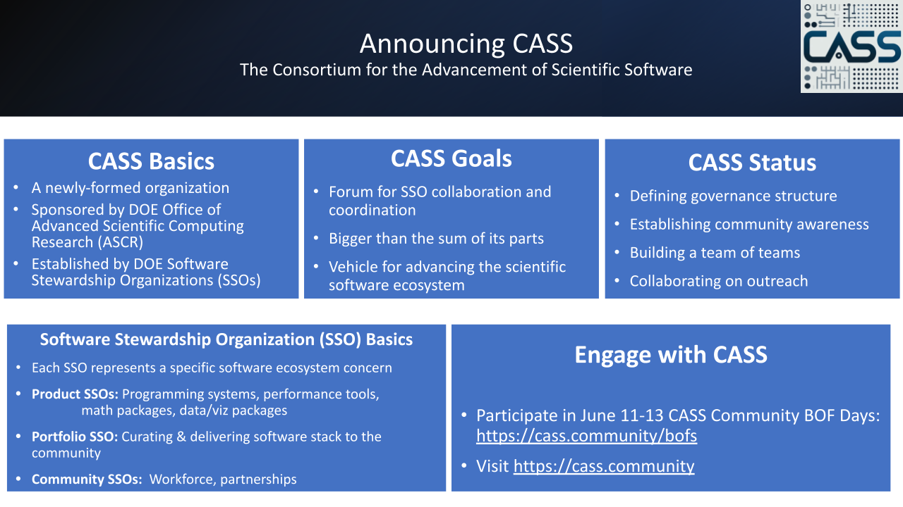

# Introducing the Consortium for the Advancement of Scientific Software (CASS)

#### Contributed by: [David E. Bernholdt](https://github.com/bernhold), [Phil Carns](https://github.com/carns), [Anshu Dubey](https://github.com/adubey64), [Rafael Ferreira da Silva](https://github.com/rafaelfsilva), [Todd Gamblin](https://github.com/tgamblin), [Mike Heroux](https://github.com/maherou), [Terry Jones](https://github.com/trjtrjtrj), [Lois Curfman McInnes](https://github.com/curfman), [Todd Munson](https://github.com/tmunson), [Esmond Ng](https://github.com/egng), [Lenny Oliker](https://github.com/oliker), Rob Ross, Lavanya Ramakrishnan, [Elaine M. Raybourn](https://github.com/elaineraybourn), [Damian Rouson](https://github.com/rouson), [Keita Teranishi](https://github.com/keitaTN), [Greg Watson](https://github.com/jarrah42) 

#### Publication date: June 10, 2024

<!-- begin deck -->
The Consortium for the Advancement of Scientific Software (CASS) is a new organization dedicated to stewarding and advancing the scientific software ecosystem.
<!-- end deck -->

## Brief history 

Reusable scientific software products, which encapsulate domain-specific expertise that is leverageable across multiple applications, provide critical capabilities that enable scientific discovery and sustained collaboration.  However, the thoughtful stewardship of scientific software has long been a challenge throughout much of the research software community. By and large, funders prefer to support _research_ that results in new scientific discovery of one form or another.  The software that enables this discovery is rarely treated as a first-class research product, with the consequence that long-term sustainment and stewardship of the software often are challenging.

As the U.S. Department of Energy (DOE) [Exascale Computing Project](https://www.exascaleproject.org/) (ECP) was winding down (with technical work concluding in December 2023), the DOE Office of Advanced Scientific Computing Research (ASCR) took the initial steps toward more intentional stewardship of its sizable portfolio of software developed and enhanced through ECP and other ASCR research programs by funding in the spring of 2023 six small “seedling” projects to conceptualize what directly funded stewardship efforts might look like.  About six months later, ASCR invited proposals to realize an initial stewardship program under the banner of Next-Generation Scientific Software Technologies (NGSST).

## What is CASS?

The approach of ASCR’s NGSST initiative has been to create a number of “software stewardship organizations” (SSOs) as funded projects, each of which is responsible for stewarding a specific portion of the target scientific software ecosystem, or for providing stewardship services across the ecosystem, either by working to curate and deliver a cohesive software stack, or supporting other needs of the software teams, for example, training, workforce development and retention, and assistance in working with software foundations to facilitate long-term stewardship.  The FASTMath and RAPIDS Institutes in the [Scientific Discovery through Advanced Computing](https://scidac.gov/) (SciDAC) program also received expanded scope and funding from NGSST for software stewardship activities.

The **Consortium for the Advancement of Scientific Software (CASS, [https://cass.community](https://cass.community))** is organized to facilitate collaboration and coordination among the member SSOs to ensure that collectively we can provide broad and consistent support for the stewardship of the scientific software ecosystem. The founding members of CASS include the following software stewardship organizations:

* **COLABS**: Collaboration for Better Software (for Science)
    * Training, workforce development, and building the research software engineering (RSE) community (Lead PI: Anshu Dubey, ANL)
* **[CORSA](https://corsa.center/)**: Center for Open-Source Research Software Stewardship and Advancement
    * Partnering with foundations to provide sustainable pathways for scientific software and coordinating the development of software sustainability metrics (Lead PI: Greg Watson, ORNL)
* **[FASTMath](https://scidac5-fastmath.lbl.gov/)**: Frameworks, Algorithms and Scalable Technologies for Mathematics
    * Stewardship, advancement, and integration for math and ML/AI packages (Lead PI: Esmond Ng, LBNL)
* **[PESO](https://pesoproject.org/)**: Partnering for Scientific Software Ecosystem Stewardship Opportunities
    * Stewarding, evolving and integrating a cohesive ecosystem for DOE software (Lead PI: Mike Heroux, SNL)
* **[RAPIDS](https://rapids.lbl.gov/)**: The SciDAC Institute for Computer Science, Data, and Artificial Intelligence
    * Stewardship, advancement, and integration for data, visualization, and AI/ML packages (Lead PI: Rob Ross, ANL)
* **S4PST**: Sustainability for Programming Systems and Tools
    * Stewardship, advancement and engagement for programming systems (Lead PI: Keita Teranishi, ORNL)
* **[STEP](https://ascr-step.org/)**: Software Tools Ecosystem Project
    * Stewardship, advancement of software tools for understanding performance and behavior (Lead PI: Terry Jones, ORNL)
* **[SWAS](https://swas.center/)**: Center for Sustaining Workflows and Application Services
    * Stewardship and project support for scientific workflow software and its community (Lead PI: Rafael Ferreira da Silva, ORNL)

In the spirit of full disclosure, two “seedling” projects (COLABS and SWAS) have not yet received the “phase-2” funding that would allow them to begin operations as SSOs, but they have been participating fully in the creation of CASS in the expectation that that funding will be forthcoming.

## The DOE/ASCR scientific software ecosystem

The initial members of CASS focus on (i.e., are funded to help steward) what might be called the “ASCR scientific software ecosystem.” Many of the software products in this ecosystem have been developed or enhanced as part of the Software Technologies (ST) component of the Exascale Computing Project, while others have historically been supported by other ASCR programs.  The software products include many well-known math libraries, data and visualization packages, programming environments, performance and correctness tools, and workflow building blocks.  Also included are the [Spack](https://spack.io/) package manager and the [E4S software distribution](https://e4s-project.github.io/) that includes many of the software packages in the ecosystem (as well as others).  

These high-impact software products (as well as additional software products that are not currently part of SSO portfolios) provide important foundational capabilities that support a wide range of scientific applications, including twenty-six application projects within ECP and hundreds more in the broader community. The ECP Software Technology Capability Assessment Report ([https://doi.org/10.2172/1888898](https://doi.org/10.2172/1888898)) provides information about many software products, and some exemplars will be discussed in forthcoming special issues of IEEE Computing in Science and Engineering (_Transforming Science through Software: Improving while delivering 100X, The Scientific Impact of ECP_) and the International Journal of High Performance Computing Applications (special issue on _ECP Reusable Libraries and Tools_).

## Planning for growth

Although CASS started with a specific set of member SSOs, which in turn partially support the stewardship of a specific set of software products, our mindset is one of growth.  Many leaders and members of the founding CASS SSOs have backgrounds in complementary projects, including the [IDEAS Productivity projects](https://ideas-productivity.org/), which have been working toward broad cultural change to raise awareness of the importance and value of software (including libraries, tools, applications, and more) as a first-class research product and increasing recognition and support for the people who produce and maintain it. And as we are “designing” the CASS consortium, including formal governance structures, we are incorporating mechanisms that will allow the consortium to expand with new members, covering a broader portion of the scientific software ecosystem. 

We envision additional funders (such as other parts of the Department of Energy, other government agencies, foundations, and so forth) might launch projects that function similarly to our SSOs and might want to participate in the CASS community.  We are also establishing an “affiliate” membership category for groups that are aligned with CASS’s mission and goals, but are not specifically doing the kinds of stewardship activities that our “SSO-like” core members do.

## Current status and future plans

The CASS consortium is in what might be called the “soft launch” stage at the moment.  While the member software stewardship organizations have been operating for a few months, at the consortium level we’re still working on finalizing the details of formal consortium governance at the same time we’re starting public activities, such as this blog article, the [CASS Community BoF Days](https://cass.community/bofs.html) (also happening this week), and spinning up some internal crosscutting technical working groups.  We are open to discussing other ways that the consortium might be able to further its interests, potential collaborations, or even new memberships. We are particularly interested in exploring what affiliate membership in CASS might mean to other organizations, projects, or even individuals.

Looking forward, the members of the CASS consortium have a lot on our plate.  We plan to develop an extensive portfolio of trainings and tutorials to support the community, help build the workforce of scientific software developers and users, help projects navigate the many software foundations that are available and decide what (if any) might be best for any given project to pursue, and many other activities to advance scientific software stewardship.  Of course at the same time, our member SSOs are working with software projects in the ecosystem to help them improve their sustainability, quality, capabilities, and level of interoperability and integration with the rest of the ecosystem, and we’ll be working to help others adopt and use the software our members produce.

## How you can get involved

First, please consider attending this week’s [CASS Community BoF Days](https://bssw.io/events/cass-community-bof-days-2024) (11-13 June, 2024).  The sessions include several that are directly related to CASS or the activities of SSOs: 

* Foundations Forum (open-source software foundations and software stewardship)
* Introducing CASS: The Consortium for the Advancement of Scientific Software
* Building an Inclusive and Productive Community from Many Organizations to Support Software Stewardship
* Better Scientific Software Fellowship Community

and additional topics from some of the software projects that comprise the SSOs: 

* Exploring the Landscape of AI and ML in Compiler Development: Pros and Cons
* SUNDIALS User Experiences
* Near-term Challenges and Opportunities for I/O
* MPICH: A High-Performance Open Source MPI Library for Leadership-class HPC Systems
* Differentiable and Portable Programming for Science
* ParaView and Catalyst
* Kokkos Ecosystem - State of the Union

Second, please consider telling us something about yourself and your interests in CASS by filling out this Google Form: [https://tinyurl.com/2024-CASS-BOFS](https://tinyurl.com/2024-CASS-BOFS).

In the longer term, please **[subscribe to our announcement list](http://eepurl.com/iRiSnY)** to learn about events we’re organizing and other news from the consortium and our members.  And if you’d like to start a conversation with us, please **email the [CASS Steering Committee](mailto:cass-steering-committee@email.ornl.gov)**. **Our website, [https://cass.community](https://cass.community)**, is currently mostly a placeholder, but we will also be building that out over time to provide a great deal of information about CASS, our work in the community, the software portfolio we’re helping to steward, and more. The slides from the [Introducing CASS BoF](https://cass.community/bofs2024/cass_slides.pdf) are now available on the website.

We look forward to hearing from you and working with you to advance the scientific software ecosystem!

## Author bios

**David E. Bernholdt** is a Distinguished R&D Staff Member at Oak Ridge National Laboratory. His research interests are broadly in the development of scientific software for high-performance computers, including developer productivity, and software quality and sustainability. David is a member of the COLABS and PESO projects in CASS.

**Phil Carns** is a Computer Scientist at Argonne National Laboratory and an adjunct Associate Professor of electrical and computer engineering at Clemson University.  His research interests include characterization, modeling, and development of storage systems for data-intensive scientific computing. He is deputy PI of the STEP project. 

**Anshu Dubey** is a Senior Computational Scientist at Argonne National Laboratory. She is interested in all aspects of high-performance scientific applications including design and development, robust software engineering process and concerns of scientific reproducibility. She is the PI of the COLABS project. 

**Rafael Ferreira da Silva** is a Senior Research Scientist at Oak Ridge National Laboratory. His research interests include all aspects of parallel and distributed computing systems, with a primary focus on modeling and simulation to enhance and innovate in scientific workflows. Rafael is the PI of the SWAS project in CASS.

**Todd Gamblin** is a Distinguished Member of Technical Staff at Lawrence Livermore National Laboratory. He created Spack ([spack.io](https://spack.io)), a widely used, open-source package manager for high performance computing, partially sustained by the PESO project. He is a co-founder of the High Performance Software Foundation ([hpsf.io](https://hpsf.io)). At LLNL, he works on software and future computing strategy in the Advanced Technology Office in LLNL's Livermore Computing division, and he leads a number of research and development projects focused on software integration.

**Mike Heroux** is a Senior Scientist at Sandia National Laboratories, PI of the PESO software stewardship organization and Scientist in Residence at St. John’s University, MN. His research interests include all aspects of scalable scientific and engineering software for new and emerging parallel computing architectures.  He is the founder of the Trilinos scientific libraries, Kokkos performance portability, Mantevo miniapps and HPCG Benchmark projects, and is presently leading the Extreme-scale Scientific Software Stack (E4S) project in DOE, a curated collection of HPC software targeting leadership platforms.

**Terry Jones** is a Senior Research Staff member at Oak Ridge National Laboratory in the Computer Science and Mathematics Division as a Computer Scientist. Terry serves as PI for the STEP project and chairperson for the International Symposium on Quantitative Codesign of Supercomputers. Terry is active in community engagement, including roles as a review editor for the journal _Frontiers in High Performance Computing_, as a senior member of the IEEE where he is active in establishing standards, and various review and advisory roles. 

**Lois Curfman McInnes** is a Senior Computational Scientist at Argonne National Laboratory.  Her work focuses on high-performance computational science, with emphasis on scalable numerical libraries and community collaboration toward productive and sustainable software ecosystems, as enabled by a diverse and inclusive workforce.  Lois is co-PI of the PESO project. 

**Todd Munson** is a Senior Computational Scientist at Argonne National Laboratory.  His work focuses on scalable numerical optimization methods, variational inequalities, and mathematical software.  Todd is the deputy director of the SciDAC FASTMath Institute.

**Esmond Ng** is a Senior Scientist at Lawrence Berkeley National Laboratory.  His work focuses on sparse matrix computation, numerical linear algebra, high performance computing, and mathematical software, as well collaborations with domain scientists.  Esmond is the lead PI of the SciDAC FASTMath Institute.

**Lenny Oliker** is a Senior Scientist at Lawrence Berkeley National Laboratory.  His work focuses on high performance computing performance, modeling, and evaluation, as well as computational biology and fusion applications. Lenny is the deputy director of the SciDAC RAPIDS Institute.

**Rob Ross** is a Senior Computer Scientist at Argonne National Laboratory, Deputy Director for Computer Science in the Mathematics and Computer Science Division at Argonne, and the Director of the DOE SciDAC RAPIDS Institute for Computer Science, Data, and Artificial Intelligence. Rob’s research interests are in system software for high performance computing systems, in particular distributed storage systems and libraries for I/O and message passing.

**Lavanya Ramakrishnan** is a Senior Scientist and Division Deputy in the Scientific Data Division at Lawrence Berkeley National Lab and Deputy Project Director for the High Performance Data Facility (HPDF). Her research interests are in building software tools for computational and data-intensive science with a focus on workflow, resource, and data management. Lavanya is a member of the SWAS project.  

**Elaine M. Raybourn** is a Principal R&D staff member and social scientist at Sandia National Laboratories. She focuses on applying team science and diffusion of innovations to complex sociotechnical systems, HPC and AI ethics, culture change, and software quality adoption. Elaine is co-PI of the CORSA project.

**Damian Rouson** is a Senior Scientist who leads the Computer Languages and Systems Software (CLaSS) Group at Berkeley Lab.  His work focuses on parallel programming models, including language-based parallel and GPU programming, compiler testing and parallel runtime libraries, and novel applications of parallel programming models to deep learning and to solving ordinary and partial differential equations.  He leads the Fortran efforts in the S4PST project.

**Keita Teranishi** leads the Programming Systems group in the Computer Science and Mathematics Division at Oak Ridge National Laboratory.  His research interests include fault-tolerance, numerical linear algebra, sparse matrix/tensor algorithms, programming and systems tools for usability.  Keita is PI of the S4PST project.

**Greg Watson** leads the Application Engineering group in the Computer Science and Mathematics Division at Oak Ridge National Laboratory. His research interests include programming tools and development environments for high-performance and scientific computing, scientific workflow and data management systems, software engineering practices, and education and training for scientists.  Greg is PI of the CORSA project.

<!---
Publish: yes
Track: community
Topics: ai for better development, projects and organizations
--->
