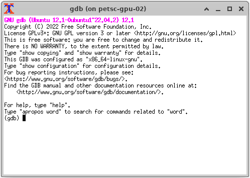
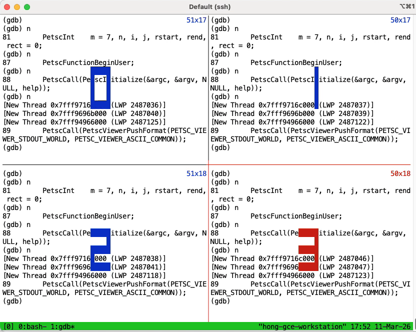

# Making Debugging MPI Applications a Little Easier

**Hero Image:**

- 

#### Contributed by [Junchao Zhang](https://github.com/jczhang07)

#### Publication date: April 27, 2026

<!-- begin deck -->
Debugging MPI applications is often challenging. A new resource site provides tips, resources, and a community discussion space aimed at making it a little easier, especially for beginners.
<!-- end deck -->

As a graduate student, I wrote codes on Linux systems and used the GNU debugger, `gdb`, extensively.
It was not especially powerful, but it was usually enough.

Years later, when I started learning and programming with the Message Passing Interface (MPI) at the University of Illinois, I found MPI debugging frustrating.
I was told I had to use `xterm` to start multiple windows.
At the time, I was developing on a campus cluster, which meant I also needed an X11 server, bringing its own setup challenges.
Even after getting all of that working, I still had to jump between `xterm` windows and tolerate their tiny, awkward fonts.

Later, after moving to Argonne National Laboratory and becoming a PETSc developer, I gained access to remote desktop systems and commercial parallel debuggers such as `DDT`.
That made the situation much better.
With its graphical user interface (GUI), `DDT` is a powerful tool for debugging multiple processes and has helped me many times.

Even so, I did not feel it was the right answer to the MPI debugging problem for the broader high performance computing (HPC) community.

First, not everyone has the privilege of using expensive commercial MPI debuggers.
This is especially true for students, who often lack access to such tools.
The last thing the community should want is to discourage new talent with a miserable MPI debugging experience.

Second, although many developers ultimately run their code on remote clusters, they often develop first on laptops or local workstations without commercial debuggers.
It is inconvenient to switch back and forth between a development environment and a separate debugging environment.

Finally, I found that MPI debugging information online was scattered across places such as Open MPI documentation pages, Stack Overflow comments, and blog posts that were sometimes out-of-date.

All of this made me think the HPC community needs a hub dedicated to MPI debugging.

## Launching a new resource to make MPI debugging a little easier

Supported by the 2025 Better Scientific Software (BSSw) Fellowship Program, I have launched <https://mpi-debug.org> to share debugging strategies and tools, with a focus on freely available options for beginners.
The website includes a discussion system so visitors can leave comments and ask questions.
It also contains a [survey](https://forms.gle/cUbXUfu2Z2dK5d9V7) to help us better understand the current MPI debugging landscape in the community.

In this article, I would like to share some of my experience and perspectives on MPI debugging as examples of the kind of content you can find on the site.

## Defensive debugging

Debugging is an essential part of software development, whether for fixing bugs or understanding code.
MPI remains the de facto standard programming model in HPC and is used by nearly all HPC software packages.
In that sense, every HPC programmer should become comfortable with MPI debugging.

But even if you develop strong debugging skills, the first priority should be to write code that is easier to debug and less likely to require debugging in the first place.

First, *write clearly.*
Use descriptive variable and function names, and add appropriate comments.
Comments should explain intent, not merely restate implementation details.
For complex or obscure code, comments are especially important.
Clear code helps both your future self and anyone else who may need to debug it.
With a better understanding of the code, you are more likely to spot problems quickly.

Second, *write defensively.*
Always check error codes returned by functions, and add assertions to validate assumptions.
For example, check whether function arguments are valid or whether a block of code produces the expected result, and provide clear error messages when something goes wrong.
These assertions can be disabled in optimized builds, or simply left in place if their performance impact is minimal.

In MPI programs, you also need to consider whether an assertion is collective, meaning it must occur in the same way across all processes in an MPI communicator.
If it is collective, you may want only one process to print the error message to avoid flooding the screen.
In PETSc, we use a macro, `PetscCheck(condition, comm, ierr, ...)`, which takes an MPI communicator (`comm`) for exactly this purpose.
If the check is local, you can pass `MPI_COMM_SELF`.

Better still, programmers should build in stack-tracing support so that, when something goes wrong, the program can print a call stack with function names, file names, and line numbers.
With that information, developers can often identify the problem directly from the error message without opening a debugger.

Clear error messages also improve communication between developers and users, and save developers' time.
For the PETSc team, they enable what we sometimes call *debugging through email*: developers can often diagnose bugs in PETSc or in a user’s code simply by reading the error messages pasted into an email.

In addition to assertions, you should use memory-checking tools to validate your code.
For example, `Valgrind` can help detect memory leaks, uninitialized memory reads, and dangling-pointer use.
Often, it is more useful to use such tools to make sure your program is generally free of such problems than to debug a problem at a time as they arise.

## Debugging with `printf`

Our survey suggests that developers still rely heavily on `printf` debugging.
Although basic, it remains useful when you only need to inspect variable values or confirm that a particular code path was taken.

`printf` debugging requires no special tool support, does not depend on compiler flags, works in both local and remote environments, and can be used with any MPI job scheduler.
When it is sufficient for your needs, it can be an ideal solution.

In this [post](https://mpi-debug.org/2025-07-17-debug-with-printf/), I describe how to tag standard output with MPI ranks and how to direct output into separate files or directories using the two most popular MPI implementations, MPICH and Open MPI.

## Debugging with a single process

It may seem counterintuitive to debug an MPI program with only one process, yet this is often the first approach you should try.

In many cases, bugs in parallel codes are not caused by MPI itself, so you should first see whether the problem can be reproduced with a single process.
Even when it cannot, you may still be able to diagnose the issue by examining just one process out of many.

In both situations, it makes sense to take advantage of the simpler setup and debug with one process first. This [post](https://mpi-debug.org/2026-01-27-one-process/) discusses techniques for debugging with a single process.

## Debugging with `xterm`

If you are able to successfully run `xterm` and do not see the error message `xterm: Xt error: Can't open display`, you may want to use it to display `gdb` sessions for your MPI processes.

The default fonts in `xterm` are not exactly pleasant, as the screen capture below suggests. Still, this [post](https://mpi-debug.org/2026-01-28-xterm/) provides instructions for debugging with `xterm`.

## Debugging with `tmux`

Arno Mayrhofer came up with a brilliant idea for MPI debugging based on `tmux`, a terminal multiplexer. Because `tmux` does not require an X11 server and is widely available on Unix-like systems, it is much easier to set up than `xterm`.

Arno’s tool—specifically, the bash script [`tmpi`](https://github.com/Azrael3000/tmpi.git)—runs MPI processes in a grid of panes within a `tmux` window and multiplexes keyboard input to all of them.
This is another major improvement over `xterm`.

The following screen capture shows `tmpi` in action, and this [article](https://mpi-debug.org/2026-02-20-tmux/) explains its usage in detail.

## Debugging with commercial debuggers

Two prominent commercial parallel debuggers, `DDT` and `TotalView`, can be used to debug MPI programs. Supercomputing centers often have one of them installed.

However, many HPC programmers do not have regular access to supercomputers or to these tools, so I will not go into detailed usage instructions here.
Instead, I want to briefly share what I like and dislike about them.

I use `DDT` fairly often.
I like its GUI because it uses screen space effectively, allowing me to stay focused on the source code while still monitoring other debugging panels.
With `DDT`, I can also move easily between processes and advance them either as a group or individually.

One feature I particularly like is its *pin to address* option for watchpoints.
It lets me set a watchpoint on a variable name and then convert it into a watchpoint on the corresponding memory address.
That means the watchpoint can remain useful even after execution moves beyond the variable’s lexical scope.

That said, `DDT` is too heavy for my everyday workflow.
To use it, I have to leave my integrated development environment (IDE), find a system with `DDT`, set up remote desktop access, and then launch the GUI.
These commercial tools are powerful for large-scale debugging, but our survey suggests that most HPC developers debug with only a handful of MPI processes.
For that situation, such tools can be overkill.

## Looking ahead: debugging in the age of AI

In the past few years, artificial intelligence (AI) has made rapid inroads into the software industry.
In software development, AI is now used for design, code generation, documentation, code review, error diagnosis, and more.

There are many legal and ethical debates around AI, including concerns about copyright violations and the trustworthiness of AI-generated code.
But debugging strikes me as an area with fewer such controversies.

Leaving aside automatic bug fixing, which some developers already use, I see at least two promising ways AI can help.

First, AI can suggest what is *possibly* wrong based on an error message.
Even if the suggestion is not exactly right, it may point a developer toward the real issue.

Second, AI can explain code snippets.
Developers can compare that explanation with what they observe during execution in a debugger.
If the two do not match, that discrepancy is a useful signal that something deserves closer inspection.

We can imagine a future AI-enabled MPI debugger that connects source code and runtime information to an AI system in the backend, dramatically improving developer productivity during the debugging process.

We all make mistakes; that is part of being human.
And as AI-assisted code generation becomes more widespread—and as more subtle bugs make their way into code—debugging may become even more important in software development than it already is.

For the HPC community, MPI debugging will remain an enduring topic.
Let’s keep building this community together—and [mpi-debug.org](https://www.mpi-debug.org) welcomes your contributions.

## Acknowledgement

This work was supported by the Better Scientific Software (BSSw) Fellowship Program, a collaborative effort of the U.S. Department of Energy (DOE), Office of Advanced Scientific Computing Research via ANL under Contract DE-AC02-06CH11357 and the National Nuclear Security Administration Advanced Simulation and Computing Program via LLNL under Contract DE-AC52-07NA27344; and by the National Science Foundation (NSF) via SHI under Grant No. 2435328.

## Author bio

Junchao Zhang is a research software developer at Argonne National Laboratory, where he contributes to the Portable, Extensible Toolkit for Scientific Computation (PETSc). His work focuses on improving communication and computational efficiency for large-scale scientific applications on GPU-equipped supercomputers. Prior to joining the PETSc team, he was a developer of MPICH at Argonne, where he contributed to the MPI-3.0 standard by implementing the MPI Fortran 2008 bindings and the MPI tools interface. He is particularly interested in helping PETSc users diagnose and resolve MPI-related issues. Zhang received his Ph.D. in computer science from the Institute of Computing Technology, Chinese Academy of Sciences (CAS), China. He was named a [2025 Better Scientific Software Fellow](https://bssw.io/blog_posts/introducing-the-2025-bssw-fellows).

<!---
Publish: Yes
Track: bssw fellowship, experience
Topics: debugging, high-performance computing (hpc)
--->
