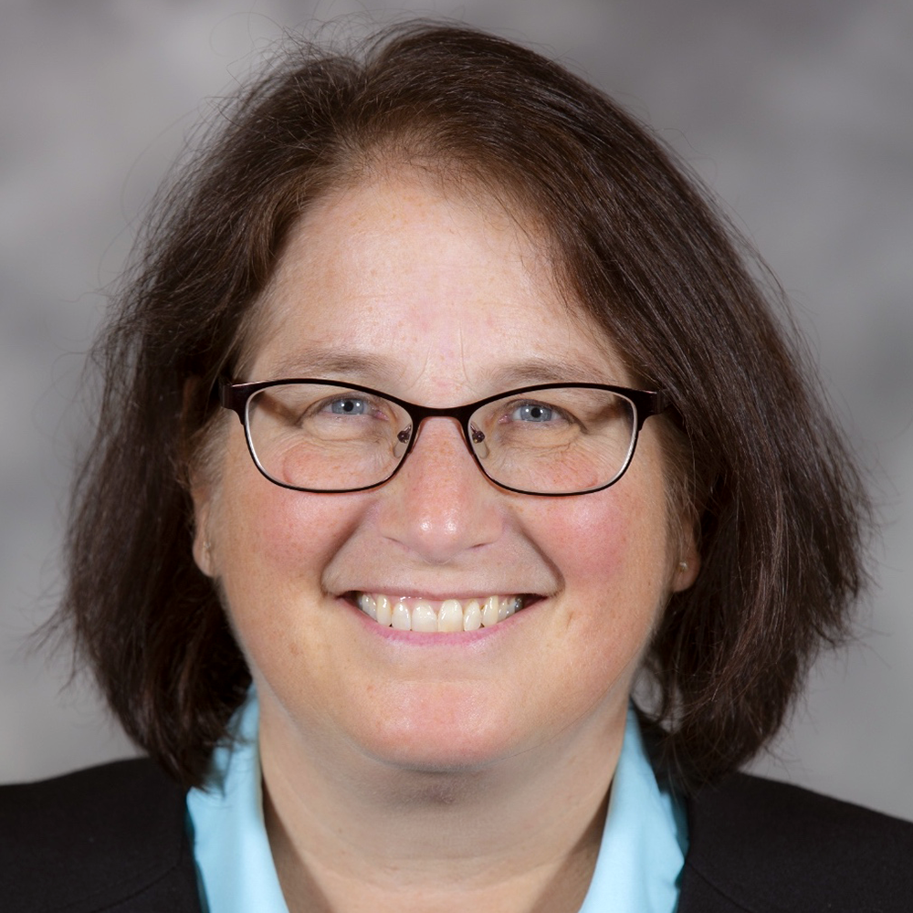
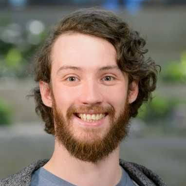
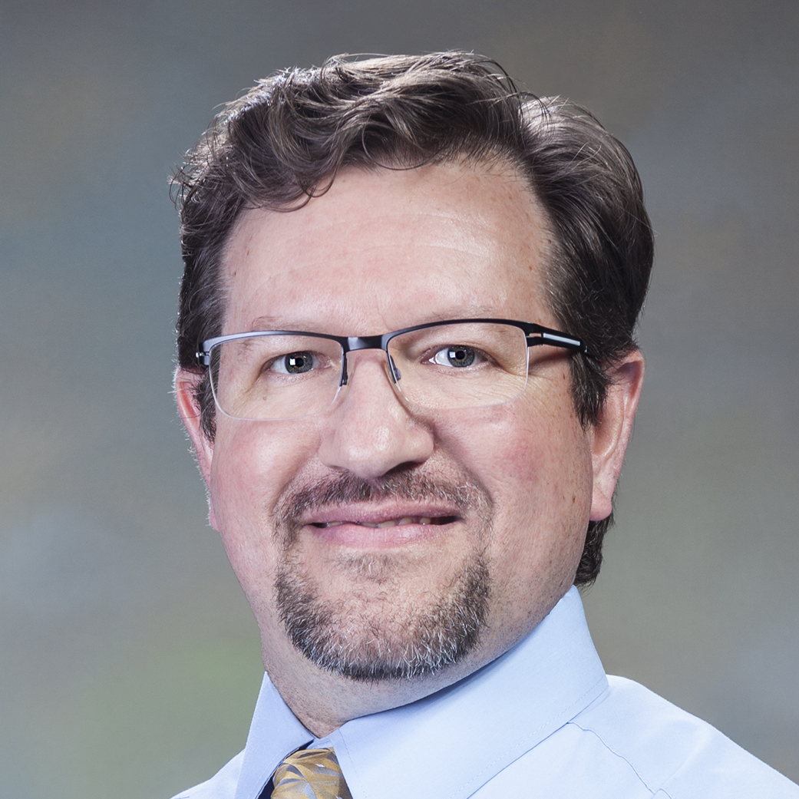

# 2023 BSSw Fellows: Projects and Perspectives

Read about the 2023 BSSw Fellows and their contributions to the BSSw community!

<!-- TODO: Get new image -->

#### Contributed by: [Elsa Gonsiorowski](https://github.com/gonsie "Elsa Gonsiorowski's GitHub Profile"), [Nicole Brewer](https://github.com/nicole-brewer "Nicole Brewer's GitHub Profile"), [Myra Cohen](https://github.com/myracohen "Myra Cohen's GitHub Profile"), [Johannes Doerfert](https://github.com/jdoerfert "Johannes Doerfert's GitHub Profile"), [Bill Hart](https://github.com/whart222 "Bill Hart's GitHub Profile"), [Helen Kershaw](https://github.com/hkershaw-brown "Helen Kershaw's GitHub Profile"), [Rafael Mudafort](https://github.com/rafmudaf "Rafael Mudafort's GitHub Profile")

#### Publication date: July 15, 2024

[Better Scientific Software (BSSw) Fellowships](https://bssw.io/fellowship) provide resources and community support to those who foster and promote practices, processes, and tools to improve developer productivity and software sustainability of scientific codes.

The 2023 BSSw Fellows have used their skills to create tutorials, webinars, and tools to guide developers through various stages of the scientific software lifecycle and impact the culture of scientific software development.

Here's more about what they have been up to and their perspectives on the BSSw Fellowship Program.

### Improving accessibility of research data and software with scientific web applications in Jupyter notebooks

BSSw Fellow Nicole Brewer works to make scientific software accessible and reproducible with scientific web applications, which provide accessible ways to disseminate research, teach, engage stakeholders, and even update policy makers. Jupyter Notebooks can be used to easily adapt existing researcher code into web interfaces that hide underlying code from users. Jupyter makes an excellent platform for development because it can be easily understood, inherited, and maintained by researchers. Her fellowship work included a tutorial for developing web applications in Jupyter Notebooks, which she presented at [SciPy 2023](https://github.com/Jupyter4Science/scipy23-jupyter-web-app-tutorial), and will be participating in again at [SciPy 2024](https://cfp.scipy.org/2024/talk/KAESWL/). She then compiled these and various other resources to a new website, [Jupyter4Science](https://jupyter4.science/), which is a knowledge base about developing and sharing Jupyter Notebooks as they are used in the context of scientific applications. The site contains both external resources and [original blog content](https://jupyter4.science/posts/) by her and her students.

<a href="https://bssw.io/items/jupyter4science-better-practices-for-using-jupyter-notebooks-for-science" class="link-row">BSSw.io Resource - Jupyter4Science: Better Practices for Using Jupyter Notebooks for Science</a>
<a href="https://jupyter4.science" class="link-row">Jupyter4Science knowledge base</a>
<a href="https://cfp.scipy.org/2023/talk/NFWZXD/" class="link-row">How the Little Jupyter Notebook Became a Web App, tutorial at SciPy 2023</a>
<a href="https://cfp.scipy.org/2024/talk/KAESWL/" class="link-row">Building Complex Web Apps with Jupyter Widgets, tutorial at SciPy 2024</a>

 

  

<a href="https://www.nicole-brewer.com">Nicole</a> is a graduate research assistant and Ph.D. student at Arizona State University, where she studies the uses and reproducibility of scientific Jupyter Notebooks. She holds a B.S. in Mathematics with Computer Science from Purdue University. Previously, she was a research software engineer at Purdue where she developed Jupyter-based web applications to help domain scientists make their work accessible and reproducible. She previously served on the steering committee of the <a href="https://us-rse.org/">United States Research Software Engineering Association</a> (US-RSE), and she is currently serving as a technical subcommittee co-chair for the <a href="https://us-rse.org/usrse24/participate/">notebook submission</a> track at the US-RSE'24 conference.

*Perspectives on the BSSw Fellowship Program:* Before returning to grad school, I worked as a research software engineer at Purdue, developing Jupyter-based web applications to enhance the accessibility and reproducibility of research code and data. The BSSw fellowship provided me with rare and valuable time to reflect on and disseminate lessons learned from my experiences. More unexpectedly, it gave me the space to reflect and pivot my dissertation topic to align closely with my passion for scientific notebooks. Jupyter notebooks are incredibly flexible tools, which makes them amenable to innovative uses but also challenging to characterize. For my dissertation, I aim to explore the boundaries and scope of Jupyter Notebooks in scientific contexts, with a particular focus on their findability and reproducibility. These research goals will in turn serve Jupyter4Science site, which I envision as a hub for a well-scoped community of practice. To further the goal of community-building, I have published a page to the site about the various ways others can [contribute](https://jupyter4.science/contribute/) to the project.

*Advice for new (prospective) BSSw Fellows:* For my proposal, I decided to use my funding in part to hire students to assist me with the production of my fellowship deliverables. I had mentored undergraduate students before, but only from within the confines of a structured program with predefined goals. This time, I was stepping outside the boundaries of traditional internships with two full time undergraduates. Hiring and onboarding students during the summer required a massive upfront effort as I developed the internship program on the fly. It took a few weeks for us to hit our stride, but over the summer, I watched them grow in their capacity for project management and intellectual independence at an astounding rate. They stayed on with me well past the initial time frame and evolved into integral team members, making valuable contributions to the Jupyter4Science site and winning a Best Student Poster award for their submission to the inaugural US-RSE conference in October 2023. I would recommend involving students, and especially undergraduates, to anyone willing to prioritize their students' growth over immediate project outcomes. In my experience, involving students "save me time," however, their fresh perspectives drastically enriched the project.

- - -

### Improving the quality of scientific software through rigorous software testing

BSSw Fellow Myra Cohen embeds cutting-edge software testing techniques into the scientific software development workflow. Rather than expecting the scientific community to become experts on volumes of software testing principles and techniques, she brings intuitive and non-intrusive approaches to them with short videos, code examples, and tools.Myra's work focuses on system testing techniques for scientific software: ensuring coverage of tests to represent a broad set of behaviors, sampling configurable systems to find faults that appear only under specific combinations of configuration options, and utilizing a representative range of input data. She also studies ways to test software that lacks a known oracle (or expected result) and techniques to test software that is stochastic or probabilistic. Myra aims to provide an end-user view of scientific software, creating methods for developers to provide explainability and interpretability of configuration choices and their impact on the scientific results.

<a href="https://youtube.com/playlist?list=PL09-QGkSFEKk5agMHJp-InaMQZnRmMHAH&si=OFpcN2qkC__c6XSk" class="link-row">Video Series: Introduction to Software Testing for the Scientific Community</a>
<a href="https://github.com/LavaOps/BSSw-Testing" class="link-row">Introduction to Software Testing for the Scientific Community (slides)</a>
<a href="https://ideas-productivity.org/events/hpcbp-083-gettingitright" class="link-row">HPC Best Practices Webinar - Getting it Right: System Testing of Scientific Software</a>

 

  

<a href="https://cs.iastate.edu/~mcohen">Myra</a>is a professor in computer science and holds the Lahn and Oahn Chair of Software Engineering at Iowa State University, where she manages the Laboratory for Variability-Aware Assurance and Testing of Organic Programs (LavaOps). Her research career has been spent developing novel testing and sampling techniques for complex software, including systems that are highly-configurable, scientific, cyber-physical, self-healing and event-driven. She spends some of her time exploring synergies between living organisms and software.

*Perspectives on the BSSw Fellowship Program:*
The BSSw program is unique. It is unlike other academic type projects I have worked on in the past. The projects are focused with clear cut milestones and (use-inspired) deliverables---thanks to the great work of the BSSw team and their organization. This program opened the door for me to meet and interact with many research software engineers (or RSEs), an experience that was extremely valuable. Over the past year, I have had the opportunity to talk to a variety of RSEs and learn about their work and some of their challenges in testing software. I started my year by attending the annual ECP meeting and joined some additional meetups after that. The program ended up being an intensive learning experience for me which is not what I expected. Fortunately, I was able to get informal feedback from some of my existing collaborators in the scientific domain and my new contacts were open to sharing. I learned that each scientific domain (and there are many) is unique with respect to software development, and the commonalities are hard to model. Given the variety of the software being written (and the team structures and backgrounds or those writing it) it created a meta-challenge for me that I hadn't anticipated. I had originally planned to create a set of videos, which I thought would be conglomerates of material I had developed over the years. But it quickly became clear that I needed to scrap that idea and start from scratch. I realized there is no one (or best) way to present material on testing scientific software to the RSE community while keeping it relevant, and that the audience would all have different backgrounds and perspectives. And it became apparent to me that system testing should be my focus. Unit testing is always important, but it is well practiced in the scientific domain. What I began thinking was a straightforward task, turned out to be anything but. Thanks to a lot of feedback from the community through short walkthroughs and informal talks, and the BSSw team I was able to find a medium ground which I hope is useful to the community. I realized that while my year in the BSSw Fellowship program is over, I have a lot more to learn and do on this front. Not only do I plan to keep evolving this material, but I have found many new opportunities for research and collaboration that I expect to pursue in the coming years.

*Advice for new (prospective) BSSw Fellows:*
Propose something that you are passionate about and create realistic deliverables. But also be ready to adapt and learn. That is a great part about this program.

- - -

### Improving developer productivity by demystifying the compiler black box

Compilers are an integral component in software development that ensure our software performs on modern systems. However, compilers may sometimes be seen as complex, black-box interpreters in the build system that fail to understand the programmer's intent. Through a series of short videos, BSSw Fellow Johannes Doerfert explains the compiler, its inner workings, and best practices to work with it. His work opens the compiler black-box to foster an interactive development experience that reduces programmer effort and increases performance and software quality. Videos provide an introduction to basic compiler-based tools and functionality---information that should be understood by all (scientific) programmers. These videos also expose how to actively work on a large production application, and how working with the compiler, as opposed to against it, results in time savings and better code/performance.

 

  

<a href="https://people.llnl.gov/doerfert1">Johannes</a> is a computer scientist in the Center for Applied Scientific Computing at Lawrence Livermore National Laboratory. He is interested in new and exciting uses for compiler technologies. His research goal is to help people exploit hardware to the fullest without requiring them to become experts in the hardware or the software stack, including programming languages. Code is a means, not the final goal. As such, Johannes believes that manual efforts to rewrite, tune, or adapt code are often signs for missing tools, compiler shortcomings, misinformation, or a combination thereof. Johannes has been involved in the LLVM compiler framework since 2014 and the OpenMP language standard since 2018. He received his Ph.D. in Computer Science from Saarland University in Germany in 2018.

*Perspectives on the BSSw Fellowship Program:* I believe (scientific) programming is hard and many people have to learn it in addition to their regular workload. Through the BSSw fellowship, I hope to start a lasting effort that can help people in parts of their programming struggles, namely the interaction with compilers. Making the videos was much harder than I anticipated. Providing the information in a way that is self contained and limited in length is a real challenge. It taught me that understanding a topic and describing it concisely are different things, with the latter being much harder. I hope people benefit from the videos but also use them as a reason to work on educational material and documentation.

*Advice for new (prospective) BSSw Fellows:* Making educational content is harder than one might think. Set yourself early deadlines and make sure someone holds you to them.

- - -

### Sustainable strategies for managing supply chain security in research software

BSSw Fellow William Hart explores how to effectively integrate security practices within open source computational science projects to enhance the security of these projects and their artifacts without disrupting the collaborative interactions that are needed to support open source development with contributors from multiple institutions. Organizations are increasingly challenged to address supply chain security issues in open source software. There are ongoing discussions regarding potential government-wide policies, but it remains unclear how different policies will impact collaborative multi-institutional interactions. William's fellowship work supports the application of supply chain security practices to Department of Energy (DOE) computational science projects. Specifically, he explored the complexity of generating software bill of materials (SBOMs), which are a key element of software supply chain security.

<a href="https://bssw.io/blog_posts/generating-software-bill-of-materials-sboms-in-scientific-software" class="link-row">BSSw.io blog article - Generating Software Bill of Materials (SBOMs) in Scientific Software</a>

 

  

<a href="https://www.linkedin.com/in/william-e-hart-3691134">William</a>is a Research Scientist at Sandia National Laboratories. His research focuses on computational operations research, and he has led projects and programs at Sandia on national security challenges, including cybersecurity, critical infrastructure protection, engineering design, and sensor data analysis. A key element of this research is the development of scientific software, and William has been a key developer of many open source software projects, including<a href="https://dakota.sandia.gov">Dakota</a>, <a href="https://gcovr.com">gcovr</a>,<a href="https://github.com/PyUtilib/pyutilib">PyUtilib</a>,<a href="http://pyomo.org">Pyomo</a>,<a href="https://github.com/or-fusion/pao">PAO</a> and<a href="https://github.com/sandialabs/coek">Coek</a>. These projects range from simple Python scripts to large C++ applications with complex build systems. Additionally, the technology readiness levels of these projects range from demonstrations suitable for basic research to mature capabilities suitable for end-user deployment.

*Perspectives on the BSSw Fellowship Program:*
Although a BSSw fellowship does involve some funding, I view these fellowships as an opportunity for professional service. The BSSw Fellowship Program is a vehicle to catalyze the development and socialization of best practices for scientific software. The work of BSSw fellows is highlighted within the community (e.g. in annual conferences), and the program supports a forum for online dissemination of best practices for scientific software. My BSSw fellowship idea grew out of internal discussions at Sandia National Laboratory regarding software security and management practices. These internal discussions have continued, but my engagement with BSSw has highlighted software security challenges to the broader scientific community who may not normally think about these concerns.

For example, one of the case studies I considered in the fellowship was the generation of SBOMs in a complex monorepo, <a href="https://github.com/sandialabs/coek">Coek</a>, which embeds several related software projects in the same git repository. Software security was not a factor that I considered when deciding to manage Coek development in a monorepo, and my BSSw fellowship activity highlights that it probably should have been a consideration because the tools that generate SBOMs cannot be easily applied to monorepos. The effort I took to document my experience generating SBOMs reflects my personal commitment to helping others improve their scientific computing software practices.

*Advice for new (prospective) BSSw Fellows:*
I recommend that prospective BSSw fellows should focus on topics that they are intrinsically motivated to work on that also have potential for broad impact. For example, my BSSw project idea reflects a core concern for trustworthy software for United States national laboratories. The fellowship gave me an opportunity to step back and assess how evolving government regulations will impact software development at national laboratories and how it can be trusted. Thus, the fellowship both addressed a personal concern as well as a community need. I think that such projects are well aligned with the BSSw mission, and they naturally engage other stakeholders.

- - -

### Increasing the confidence of first time open-source contributors and humanizing the process of code review

Code review is a skill. Currently there is literature available to read about code review, but not many hands-on tutorials, particularly for people outside of computer science. In contrast, there are a host of excellent "learn-by-doing" online resources for learning programming languages. Moreover, code review circumstances can be challenging due to the nature of scientific coding. Researchers are often working on a new scientific problem while trying to learn git, GitHub, and a programming language, and during a code review session, their code may be "criticized". Also challenging is the circumstance when scientific software developers start work in a new domain where they have little knowledge. During a code review session, it can be very difficult to separate criticism of the code from criticism of the person. This is a skill for both the reviewer and the reviewee always to be working on.

BSSw Fellow Helen Kershaw created a code review tutorial that can be done in pairs or individually; it can be used as a tool to onboard new contributors and as a refresher course for seasoned professionals. The tutorial was built from a text-based (no code) example to separate coding from the skill of reviewing and will include a soft skills section with examples of good, bad, and ugly review comments. Code review examples focus on Python and Fortran---languages widely used in the geosciences. The tutorial is extensible, so that people can provide feedback and add examples from their own domains and experience. The "learn-by-doing" tutorial uses GitHub actions to create example code reviews, where people can make mistakes in a no-consequence environment.

<a href="https://code-review.org/" class="link-row">Code Review tutorial website</a>
<a href="https://github.com/scientific-software-reviewers" class="link-row">Scientific Software Reviewers GitHub Organization</a>
<a href="https://bssw.io/blog_posts/code-review-org-an-online-tutorial-to-improve-your-code-review-skills" class="link-row">BSSw.io blog article - Code-Review.org: An Online Tutorial to Improve Your Code Review Skills</a>

 

  

<a href="https://github.com/hkershaw-brown">Helen</a> is a Software Engineer at the National Center for Atmospheric Research. She works on the Data Assimilation Research Testbed (DART), an open-source community facility for ensemble data assimilation. Helen previously worked at Brown University at the Center for Computation and Visualization, where she led a team of research software engineers. She was a 2019-2020 XSEDE Campus Champion Fellow and is active in the US-RSE community.

*Perspectives on the BSSw Fellowship Program:*
The BSSw fellowship gave me a great opportunity to dive into a topic that I've thought about a lot in my career working on open source code. I proposed the idea of a code review tutorial mostly because I'd like to get better at reviewing and being reviewed, and also with the goal of encouraging other people to take a look inside the code they use. The topic of code review generated a lot of engagement within my institution (NSF NCAR) and the wider BSSw community. It was great to connect with people with various experiences and perspectives. Of course, there are many people who work on established software in mature teams, but in research software there's also many people at the inflection point where they have code, and they want to move toward robust, collaboratively built, reliable software. I believe this process is a large part of what Better Scientific Software is about. Code review is a piece of that, and I hope the blog, webinar, and tutorial foster engagement and get people thinking about code review.

*Advice for new (prospective) BSSw Fellows:*
I think something that is concretely helpful to you and resonates with the community makes for a good project. BSSw allows you to connect with people, and it is a good way to get conversations started at your own institution or community. So I recommend getting your ideas into a proposal, sharing with your colleagues and mentors, and seeing where it leads.

- - -

### Increasing developer impact through effective communication of software design

BSSw Fellow Rafael Mudafort's work empowers research software engineers to effectively communicate elements of software design to technical and non-technical audiences, including scientists and program managers. Many aspects of software design are typically considered but rarely communicated during the software development process, leading to the adverse consequence of implicit knowledge being lost over time or when developers move to other projects. Rafael aggregated resources and developed training materials to teach developers to communicate design principles and overarching themes (i.e., the concept of 'parti'), architecture, data structures, workflows, and scope of new work---using graphical formats in order to reach broad audiences. The long-term vision of these efforts is to provide research software engineers the tools to communicate how their software has been created and why particular design decisions are meaningful to ensure developer productivity and software sustainability.

<a href="https://rafmudaf.github.io/communicating-design/intro.html" class="link-row">Communicating elements of software architecture and design</a>
<a href="https://bssw.io/blog_posts/visually-communicating-elements-of-software-design" class="link-row">BSSw.io Blog Post - Visually Communicating Elements of Software Design</a>
<a href="https://ideas-productivity.org/events/hpcbp-084-communicatingdesign" class="link-row">HPC Best Practices Webinar - Strengthening Development Workflows by Graphically Communicating Elements of Software Design</a>

 

  

<a href="https://www.nrel.gov/research/staff/rafael-mudafort.html">Rafael</a> is a researcher at the National Renewable Energy Lab's (NREL) National Wind Technology Center. His work focuses on the design and development of software for wind turbine and wind farm modeling and wind farm flow control. His mission is to elevate the quality and impact of NREL's wind energy software and define a sustainable and rewarding career path for research software engineers at the lab.

*Perspectives on the BSSw Fellowship Program:*
Building a career as a software engineer working within groups of scientists has presented some interesting challenges whose root causes have typically related to communication. In particular, communicating the importance of good software development practices and software design intent have been especially critical and difficult. After working on this problem on my own for a number of years, I saw the BSSw Fellowship as an opportunity to get external help and direct support for addressing at least a portion of the problem. Further, the opportunity to engage with a community of people with a shared experience was appealing. After receiving an Honorable Mention in 2022, I narrowed the scope of my proposal and reapplied with success in 2023.

The opportunity to focus on developing the idea of visually communicating elements of software design has been very rewarding. I've had the chance to break out of my comfort zone from writing code to writing words, and I've had to communicate abstract ideas to stimulate interest rather than prove a point through numbers and plots. Overall, the BSSw Fellowship has been a positive experience and has brought good attention to a topic area that I believe is critically important for the long term sustainability of research software and viability of careers in research software engineering.

*Advice for new (prospective) BSSw Fellows:*
A personal challenge throughout my fellowship term was blocking out the time to break away from NREL work and focus on the BSSw project. It was easy to let other responsibilities creep into and take priority over the blocks of time I had set aside for this. For me, building momentum required asking the BSSw team to hold me accountable to a set schedule, and then I was able to give it adequate attention. For upcoming Fellows, especially those at research labs with quarterly milestones, I suggest creating gates around your time early within your fellowship term, and establish incentive and accountability mechanisms so that you can prioritize this work equally with other responsibilities.

Also, I suggest talking about your fellowship topic regularly to your colleagues. The concept of better scientific software is as much a technical topic as a social one. I enjoyed describing my fellowship to various groups of people, and I often got very helpful questions or feedback in doing so.

- - -

### Learn more about the BSSw Fellowship Program

BSSw Fellows are selected annually based on an application process that includes the proposal of a funded activity that promotes better scientific software. See more about the [BSSw Fellowship Program](https://bssw.io/fellowship), including ongoing work of the 2024 BSSw Fellows. We will begin accepting applications for 2025 BSSw Fellowships during mid-August 2024. Register for the [BSSw mailing list](https://bssw.io/pages/receive-our-email-digest) to receive information.

### Author bio

Elsa Gonsiorowski is coordinator of the BSSw Fellowship Program, a member of the [PESO](https://pesoproject.org) team, and HPC I/O support specialist at [Livermore Computing, LLNL](https://hpc.llnl.gov/about-us).

<!---
Publish: yes
Track: bssw fellowship
Pinned: no
Topics: Projects and organizations
--->
