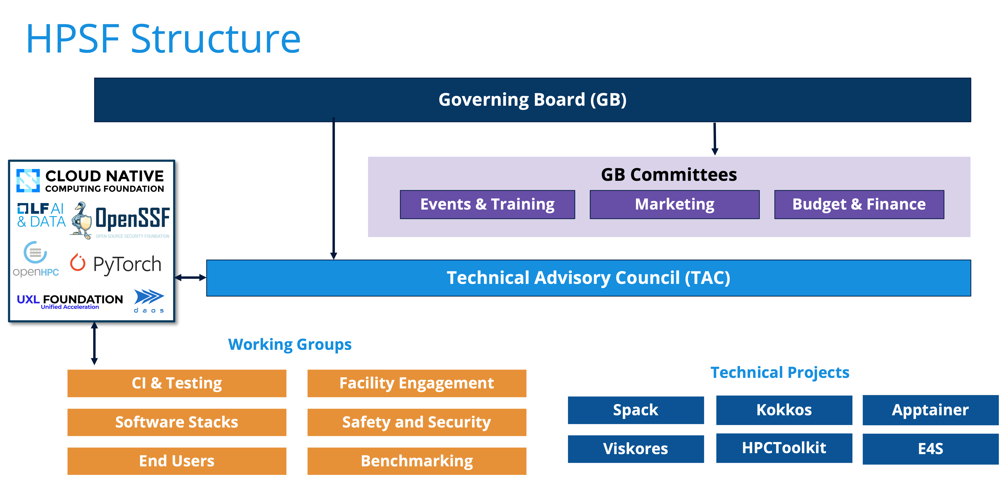

# Launch of the High Performance Software Foundation

 
#### Contributed by [Christian Trott](https://github.com/crtrott)

#### Publication date: July 25, 2024

<!-- begin deck -->
At ISC 2024 in Hamburg the High Performance Software Foundation (HPSF) was launched with the goal of supporting key HPC software projects.
<!-- end deck -->

[HPSF](https://hpsf.io) is set up as an umbrella organization within the [Linux Foundation](https://linuxfoundation.org) to foster collaboration around the development and support of its associated technical projects.
Conceived through an initial collaboration between the Spack and the Kokkos team, this effort has brought together institutions that want to foster a more cooperative effort of developing and maintaining key open-source projects in the space of high-performance computing and related compute-intensive areas.

Historically, the HPC community has been characterized by a large amount of fragmentation, with many similar or even identical capabilities developed at different institutions.
Many projects were reluctant to rely on third-party libraries due to the lack of reliable software support funding mechanisms in the scientific community.
Furthermore, the lack of community governance models hindered the establishment of joint multi-institutional development efforts.

The US Department of Energy's (DOE) Exascale Computing Project laid the groundwork to change that for a number of its associated software projects.
By providing a framework that included all DOE's national laboratories it was possible to grow the project teams beyond a single institution and establish multi-laboratory efforts.

HPSF intends to be the common ground for establishing these collaborations on a global scale. 
 
### HPSF structure

HPSF is controlled by a Governing Board and a Technical Advisory Council.
The Governing Board consists of representatives from HPSF member organizations and some representation from technical projects such as Kokkos and Spack.
It decides how to allocate the budget of the foundation, and also controls marketing and HPSF events.
Furthermore, the Governing Board decides on general HPSF rules.

The Technical Advisory Council organizes technical working groups and develops criteria for the project lifecycle in HPSF. It consists mainly of representatives of the technical projects.
Technical governance of projects associated with HPSF is still up to each individual project.
The Advisory Council is also the primary body to organize day-to-day collaboration with other Linux Foundation efforts.

### Initial technical projects

HPSF has currently seven associated projects:

* [Kokkos](https://kokkos.org): a performance portability solution
* [Spack](https://spack.io): a package manager focused on from-source builds
* [Viskores](https://m.vtk.org): a Kokkos-based performance portable visualization library (formerly known as VTKm)
* [Trilinos](https://trilinos.org): a Kokkos-based scientific library collection including solvers, discretization and more
* [E4S](https://e4s.io): a Spack-based curated software stack for HPC-AI applications
* [HPC-Toolkit](https://hpctoolkit.org): an integrated suite of tools for measurement and analysis of HPC program performance
* [Apptainer](https://apptainer.org): A container solution (formerly known as Singularity)
* [AMReX](https://amrex-codes.github.io/amrex/): A software framework for massively parallel, block-structured adaptive mesh refinement (AMR) applications
* [WarpX](https://ecp-warpx.github.io/): An advanced, time-based 1D/2D/3D/RZ electromagnetic & electrostatic particle-in-cell code

### Open for global business

Key benefits of belonging to the High-Performance Software Foundation include open governance models, resources for improving software quality and building community, as well as collaborations with the larger Linux computing ecosystem.
Leveraging well-established open governance models from the Linux Foundation, HPSF provides a framework to organize multi-institutional collaborations.
Taking the step of donating rights to some of its most high-profile projects in the realm of HPC to the Linux Foundation demonstrates, that DOE is committed to evolving them into true community efforts.
Our hope is that in the long run, HPSF will be able to serve as a central hub for these HPC community efforts, to enable collaborations across the entire worldwide HPC community.

### Author bio

Christian Trott is a member of the technical staff at Sandia National Laboratories.
He is a co-lead of the Kokkos Performance Portability project ([https://kokkos.org](https://kokkos.org)), a member of the ISO C++ standard committee and serves on the governing board of HPSF.
Christian's leadership of the Kokkos programming model, was instrumental in establishing performance portability as a core concept of modern HPC software design.
On the ISO C++ committee, he led efforts to bring multi-dimensional arrays (C++23) and linear algebra (C++26) into the standard.

<!---
Publish: Yes
Track: community
Topics: projects and organizations
--->
