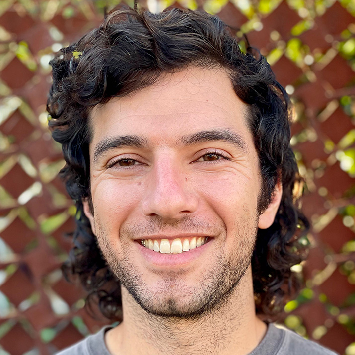

# Bettering Software (and Science) through Improved Communication

#### Contributed by Heather Bourbeau and Sustainable Horizons Institute

#### Publication date: August 29, 2024

Meet BSSw Fellow Rafael Mudafort.  This article highlights Rafael's experiences in the [BSSw Fellowship Program](https://bssw.io/fellowship), 
including his work on empowering research software engineers to effectively communicate 
elements of software design.  

 

This article is cross-posted at [Sustainable Horizons Institute](https://shinstitute.org).

 
[Rafael Mudafort]

 

Rafael Mudafort is a researcher at the National Renewable Energy Lab’s (NREL) National Wind Technology Center, an applied center that engages in research and collaboration with the U.S. Department of Energy and the wind energy industry. For this, Mudafort and his colleagues use research and scientific software to do wind energy analysis, and while software development is a key activity, a focus on the science often takes priority over the usability and accessibility of that software. Mudafort wants to change the culture around that. The Better Scientific Software (BSSw) Fellowship Program gave him the opportunity to elevate the quality and impact of NREL's wind energy software and to define a sustainable and rewarding career path for research software engineers at the lab.

“After working on this problem for a number of years with a small group of colleagues, I saw the BSSw Fellowship as an opportunity to get external help and direct support for addressing at least a portion of the problem. I applied four times, and [on my third try] was an Honorable Mention in 2022,” says Mudafort. 

As an Honorable Mention, Mudafort met and participated in events with other Honorable Mentions and Fellows, and was encouraged by those engagements. “It was really motivating to refine the idea and come back and try again so that I could participate more deeply,” he says. The next time, he was accepted as a Fellow.

As a BSSw Fellow, Mudafort’s work was focused on empowering research software engineers to effectively communicate elements of software design to technical and non-technical audiences, including scientists and program managers. He aggregated resources and developed training materials to teach developers to communicate things like specific design principles, overarching themes, software architecture, data structures, workflows, and scope of new work—using graphical formats in order to reach broad audiences. As a result, users executing code to get or analyze data benefit from having up-to-date, user-friendly documentation that allows them to use the code most efficiently and effectively, and developers benefit from knowing the architecture and context, which help them to extend and maintain software in a more sustainable manner. 

“Being able to say, ‘I'm dedicating time not to develop software for the sake of research, but to improve the craft for the sake of improving the craft’ is incredibly validating,” says Mudafort. “And the opportunity to engage with a community of people with a shared experience was wonderful.” 

His advice for those applying for the 2025 BSSw Fellowship: “Dream big. If there's something you want to do, put it together in a project or a proposal that is achievable and put it out there. This is an opportunity to do a thing that's not going to be funded elsewhere. If you have something, go for it!”

*The main goal of the BSSw Fellowship program is to foster and promote practices, processes, and tools to improve developer productivity and software sustainability of scientific codes. Submissions for the 2025 cohort are now open: 2025 BSSw Fellowship Application Form!*

### More info
Learn more about [Rafael Mudafort's work as a BSSw Fellow](https://bssw.io/fellows/rafael-mudafort).

See the new [blog post](https://bssw.io/blog_posts/applications-open-for-the-2025-bssw-fellowship-program) by Elsa Gonsiorowski, coordinator of the BSSw Fellowship Program.

Application deadline: Monday, September 30, 2024; this is a firm deadline that will not be extended.

### Q&A webinar

Those interested in applying are encouraged to participate in an informational fellowship webinar and Q&A session scheduled for Tuesday, September 10, 2024, 2:00-3:00 PM EDT.  Webinar details will be sent to the BSSw mailing list.

### Author bios
[Heather Bourbeau](https://www.linkedin.com/in/heatherbourbeau/) is a research analyst, communications strategist, and storyteller. 
[Sustainable Horizons Institute](https://shinstitute.org) is a partner in leading the BSSw Fellowship Program. 

 

<!---
Publish: yes
Track: bssw fellowship
Pinned: no
Topics: Funding sources and programs, projects and organizations
RSS update: 2024-08-29
OpenGraph image: OG_2408_BSSwFellowships.png
--->
