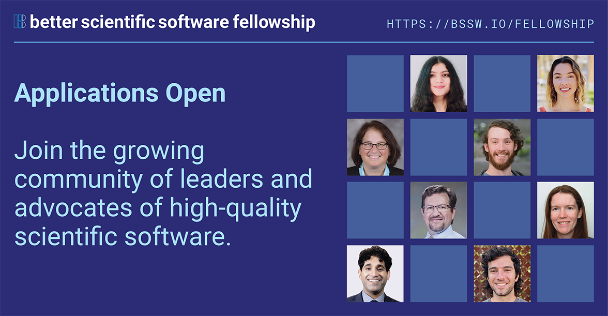

# Applications Open for the 2025 BSSw Fellowship Program

#### Contributed by [Elsa Gonsiorowski](https://github.com/gonsie "Elsa Gonsiorowski's GitHub Profile")

#### Publication date: August 15, 2024

Applications are now open for the 2025 BSSw Fellowship Program, which gives recognition and funding to leaders and advocates of high-quality scientific software.

Addressing scientific software challenges magnified by rapidly changing computing environments requires broad community collaboration to improve developer productivity and software sustainability—as key aspects of ensuring the integrity of computational results and increasing overall scientific productivity.

The [BSSw Fellowship Program](https://bssw.io/fellowship) provides recognition and funding for leaders and advocates of high-quality scientific software who foster practices, processes, and tools to improve scientific software productivity and sustainability.
BSSw Fellows are selected annually based on an application process that includes the proposal of a funded activity which promotes better scientific software through a publicly available artifact.
We select at least three Fellows per year and honorable mentions as appropriate.
Each 2025 BSSw Fellow will receive up to $25,000 for their proposed activity.
Activities can include organizing a workshop, preparing a tutorial, or creating content to engage the scientific software community, including broadening participation or promoting diversity, equity, and inclusion.
[Applications are now being accepted for the 2024 BSSw Fellowship](https://bssw.io/pages/apply-for-the-bssw-fellowship-program).

 

 

We encourage applicants at all career stages, ranging from students through early-career, mid-career, and senior professionals, especially those from underrepresented groups, including people who are Black or African American, Hispanic/Latinx, American Indian, Alaska Native, Native Hawaiian, Pacific Islanders, women, persons with disabilities, and first generation scholars.
We are looking for applications from people with the following characteristics:

* Passionate about scientific software.
* Interested in contributing powerful ideas, tools, methodologies, and more that improve the quality of scientific software.
* Able to use the fellowship to broadly benefit the scientific software community.

Applicants must be affiliated with a U.S.-based institution that is able to receive Federal funding.  Typically such institutions include U.S. government labs, U.S. universities, and U.S.-based corporations.

### Q&A Webinar about the BSSw Fellowship Program

Join us for a Q&A Webinar to hear more about the BSSw Fellowship Program and get your questions answered.
- Tuesday, September 10, 2024, 2:00-3:00 PM EDT
- Please [subscribe to our mailing list](https://bssw.io/pages/receive-our-email-digest) to receive further details, including telecon information for the Q&A session.

### More information, including on-line application and FAQ

Better Scientific Software is an organization dedicated to improving developer productivity and software sustainability for computational science and engineering through BETTER Planning, Development, Performance, Reliability, Collaboration, and Skills.

- [BSSw Fellowship Program](https://bssw.io/fellowship)
- [APPLY NOW!](https://bssw.io/pages/apply-for-the-bssw-fellowship-program)
- <mark>Application deadline: Monday, September 30, 2024</mark>; this is a firm deadline that will not be extended.

### Current and past BSSw Fellows are:

- [Providing information on projects and perspectives (2023 BSSw Fellows)](https://bssw.io/blog_posts/2023-bssw-fellows-projects-and-perspectives)
- [Advancing software productivity and sustainability via ongoing projects (2024 BSSw Fellows)](https://bssw.io/blog_posts/introducing-the-2024-bssw-fellows)
- [Providing information on projects and perspectives (2022 BSSw Fellows)](https://bssw.io/blog_posts/2022-bssw-fellows-projects-and-perspectives)
<!-- - [Advancing software productivity and sustainability via ongoing projects (2023 BSSw Fellows)](https://bssw.io/blog_posts/introducing-the-2023-bssw-fellows) -->
- [Providing information on projects and perspectives (2021 BSSw Fellows)](https://bssw.io/blog_posts/2021-bssw-fellows-projects-and-perspectives)
- [Providing information on projects and perspectives (2020 BSSw Fellows)](https://bssw.io/blog_posts/2020-bssw-fellows-projects-and-perspectives)
- [Guiding developers through each stage of the scientific software lifecycle (2019 BSSw Fellows)](https://bssw.io/blog_posts/2019-bssw-fellows-guide-developers-through-each-stage-of-the-scientific-software-lifecycle)
- [Tackling scientific productivity challenges (2018 BSSw Fellows)](https://bssw.io/blog_posts/2018-bssw-fellows-tackle-scientific-productivity-challenges)
- And more!  [Check out how each of our BSSw Fellows are improving developer productivity and software sustainability.](https://bssw.io/pages/meet-our-fellows)

### Author bio
Elsa Gonsiorowski is Coordinator of the BSSw Fellowship Program, a member of the [IDEAS-ECP](https://ideas-productivity.org/activities/ideas-ecp) team, and HPC I/O support specialist at [Livermore Computing, LLNL](https://hpc.llnl.gov/about-us).

 

**The BSSw Fellowship is sponsored by the U.S. Department of Energy and National Science Foundation.**

  

  

<!---
Publish: yes
Track: bssw fellowship
Pinned: no
Topics: Funding sources and programs, projects and organizations
RSS update: 2023-08-15
OpenGraph image: OG_2408_BSSwFellowships.png
--->
